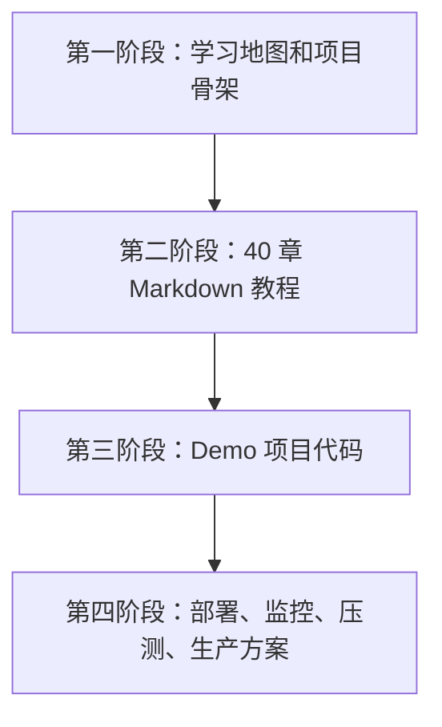
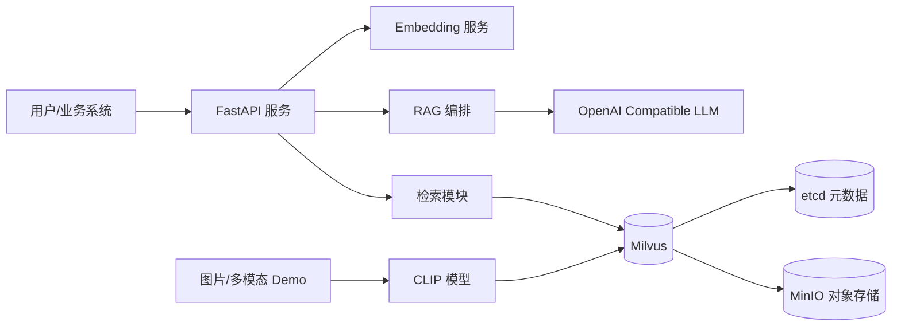

# 00 教程规划与学习路径

## 教程目标

完成本教程后，你应该能够从原理、工程、生产三个层面掌握 Milvus：能解释 ANN、HNSW、IVF、PQ 的工作方式；能使用 pymilvus 开发业务系统；能搭建 RAG、图片检索、多模态检索服务；也能在百万、千万、亿级向量场景下做容量规划、压测、调优和故障排查。

## 阶段规划

本仓库已经按四个阶段组织：`README.md` 给出全局规划，`docs/` 是逐章教程，`demos/` 是可运行工程，`scripts/` 是部署和压测入口，`configs/` 是 Milvus 配置样例。

## 章节学习路径

| 阶段 | 章节 | 学完后你能做什么 |
|---|---|---|
| 基础 | 01-05 | 解释向量检索，启动 Milvus，完成基本 CRUD/Search |
| 建模 | 06-09 | 设计 Collection、字段、Embedding 和索引 |
| 调优 | 10-17 | 根据业务选择 IVF/HNSW/PQ，调 nprobe/ef/batch |
| 生产 | 18-21 | 规划集群、高可用、监控、备份和容量 |
| RAG | 22-29 | 构建知识库问答、召回优化、Rerank、多路召回 |
| 多模态 | 30-34 | 构建图片检索、多模态检索和 AI 搜索 API |
| 深水区 | 35-40 | 做亿级架构、Benchmark、Debug、源码阅读和面试准备 |

## 每章统一结构

每一章都包含学习目标、核心概念、原理讲解、Mermaid 图解、完整代码入口、Demo、常见错误、面试题、练习题和小结。重点章节会额外给出参数表、生产经验和架构权衡。

## 项目整体架构

## 推荐实践节奏

1. 先跑通 `docker compose up -d` 和 `demos/basic-search`。
2. 每读完一个索引章节，就用 `demos/benchmark` 改参数验证。
3. 读 RAG 章节时，直接启动 `demos/rag-system` 并用 curl 走完整链路。
4. 读生产章节时，把自己的数据规模代入容量估算表。
