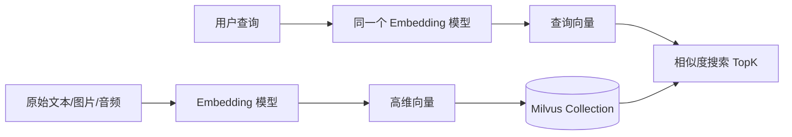
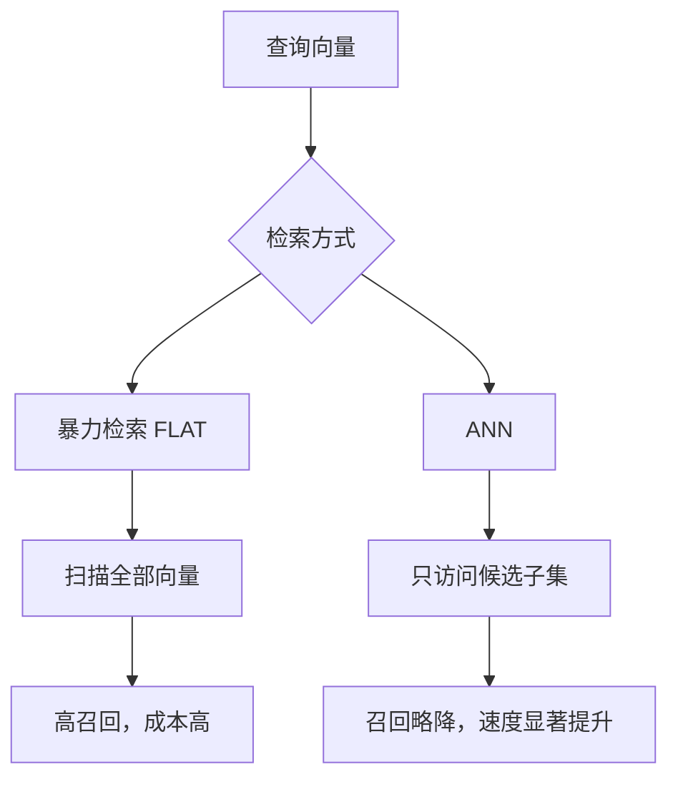
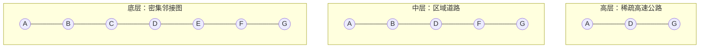
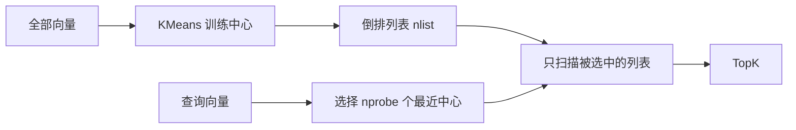

# 01 向量数据库基础

## 学习目标

学完本章后，你应该能够：

- 解释向量、Embedding、向量维度和向量空间。
- 区分余弦相似度、内积和 L2 距离。
- 理解为什么海量向量检索不能只靠暴力扫描。
- 说清 ANN、HNSW、IVF、PQ 的基本思想。
- 用 Recall、QPS、Latency、内存成本评价一个向量检索系统。

## 理论知识：形象化理解

可以把向量数据库想象成一座按照“语义气味”摆放物品的巨大仓库。传统数据库像货架编号系统，你必须知道商品编号、名称或分类才能找到它；向量数据库则像给每个物品都贴上一个高维坐标，意思相近的物品会自然靠在一起。用户问“怎么做知识库问答”时，系统不是逐字找“知识库”三个字，而是在语义空间里寻找气味最接近的一批内容。

Embedding 模型就是这座仓库的“坐标测量仪”。同一套测量仪必须同时用于入库和查询，否则坐标系会错位。余弦相似度像比较两个箭头的朝向，L2 距离像比较两个地点的直线距离，ANN 索引像在仓库里修快速通道：不逐个货架查看，而是先冲到最可能的区域，再精细挑选 TopK。

理解这一章时要记住一句话：向量检索不是魔法，而是“表示学习 + 距离计算 + 索引加速”的组合。召回、延迟和成本永远互相牵制，工程师的任务就是在业务能接受的范围内找到平衡点。

## 核心概念

向量数据库保存的不是“文本本身有多像”，而是模型把文本、图片、音频或视频映射到向量空间后的坐标。相似对象在向量空间里距离更近，检索就是在这个空间中寻找离查询向量最近的 TopK。



## 向量是什么

向量可以理解为一组浮点数，例如 `[0.12, -0.03, 0.88, ...]`。Embedding 模型负责让这些数字带有语义：语义相近的内容在向量空间中更接近。常见中文文本模型如 `BAAI/bge-small-zh-v1.5` 输出 512 维向量，CLIP 图片/文本模型常见输出 512 维向量。

维度不是越高越好。维度升高通常会带来更强表达能力，但也会增加存储、内存带宽、索引构建和搜索计算成本。粗略估算：`1,000,000` 条 `768` 维 `float32` 向量仅原始向量就需要 `1_000_000 * 768 * 4 ≈ 2.86GB`，还不包含索引和元数据。

## 相似度度量

| 度量 | 直觉 | 适用场景 | 注意事项 |
|---|---|---|---|
| COSINE | 看方向是否相近 | 文本语义检索常用 | 通常要求向量归一化或模型天然适配 |
| IP | 内积越大越相似 | 推荐、归一化向量检索 | 未归一化时会受向量长度影响 |
| L2 | 欧式距离越小越相似 | 图像特征、传统特征 | 与 COSINE 结果可能完全不同 |

```python
import numpy as np

def cosine(a: np.ndarray, b: np.ndarray) -> float:
    # 余弦相似度：越接近 1 越相似
    return float(np.dot(a, b) / (np.linalg.norm(a) * np.linalg.norm(b)))

def l2(a: np.ndarray, b: np.ndarray) -> float:
    # L2 距离：越接近 0 越相似
    return float(np.linalg.norm(a - b))
```

## 暴力检索 vs ANN

暴力检索会计算查询向量与全部向量的距离，准确但成本线性增长。ANN 是近似最近邻搜索，用可控的召回损失换取数量级的性能提升。



## HNSW 直觉

HNSW 是图索引。每个向量是一个节点，相似向量之间有边。搜索从高层稀疏图快速接近目标区域，再到底层密集图精细搜索。



HNSW 常用参数：

| 参数 | 作用 | 增大后的影响 |
|---|---|---|
| `M` | 每个节点的邻居数量上限 | 召回更好，内存更高，构建更慢 |
| `efConstruction` | 构建索引时的候选集 | 索引质量更好，构建更慢 |
| `ef` | 搜索时的候选集 | 召回更好，延迟更高 |

## IVF 直觉

IVF 先把向量空间聚成多个簇，搜索时只访问与查询最接近的若干簇。



`nlist` 决定分桶数量，`nprobe` 决定搜索多少个桶。`nprobe` 太小会漏召回，太大会接近暴力扫描。

## PQ 直觉

PQ 把高维向量切成多个子空间，每个子空间用码本近似表达。它的核心价值是压缩内存，但会引入量化误差。


## 指标体系

| 指标 | 含义 | 优化方向 |
|---|---|---|
| Recall@K | 真正相关结果被 TopK 找回的比例 | 增大 ef/nprobe，优化 Embedding，使用 Rerank |
| QPS | 每秒请求数 | 减小候选集、水平扩展、减少输出字段 |
| Latency | 单次请求耗时 | 关注 P50/P95/P99，不只看平均值 |
| Build Time | 索引构建耗时 | 调整索引类型、并行度、Segment 尺寸 |
| Memory | 内存占用 | 量化、mmap、冷热分层、减少副本 |

## 完整代码

本章配套代码见 `../demos/basic-search`。它会：

1. 使用 `sentence-transformers` 生成中文文本向量。
2. 创建 Milvus Collection。
3. 建立 HNSW 索引。
4. 写入示例文本。
5. 执行 TopK 语义检索。

```bash
cd milvus-master-course
./scripts/start.sh
cd demos/basic-search
cp .env.example .env
python main.py
```

## 常见错误

| 错误 | 原因 | 修复 |
|---|---|---|
| COSINE 结果不稳定 | 模型输出未归一化或 metric 选错 | 统一 Embedding 模型和 metric |
| 维度不匹配 | Collection dim 与模型 dim 不一致 | 删除重建 Collection 或固定模型版本 |
| 召回差 | Chunk 太大/太小、模型不适合中文、ef/nprobe 太低 | 做离线标注集评测 |
| 延迟高 | TopK 大、候选集大、输出字段多 | 控制参数并压测 P95/P99 |

## 面试题

1. 为什么向量数据库需要 ANN？
2. COSINE、IP、L2 的差异是什么？
3. HNSW 为什么通常内存占用较高？
4. IVF 的 `nlist` 和 `nprobe` 如何影响召回和延迟？
5. PQ 为什么能降成本，又为什么会损失精度？

## 练习题

1. 用 `demos/basic-search` 把 HNSW 的 `ef` 从 16、64、128 分别跑一次，记录结果变化。
2. 把模型换成另一个中文 Embedding 模型，观察维度变化和检索结果变化。
3. 自己构造 20 条容易混淆的文本，手工评估 Recall@3。

## 小结

向量数据库的本质是“在高维空间中快速找相似对象”。所有工程决策都围绕四个变量展开：召回、延迟、吞吐、成本。后续章节会把这些变量落到 Milvus 的 Schema、索引、查询参数和生产架构中。
