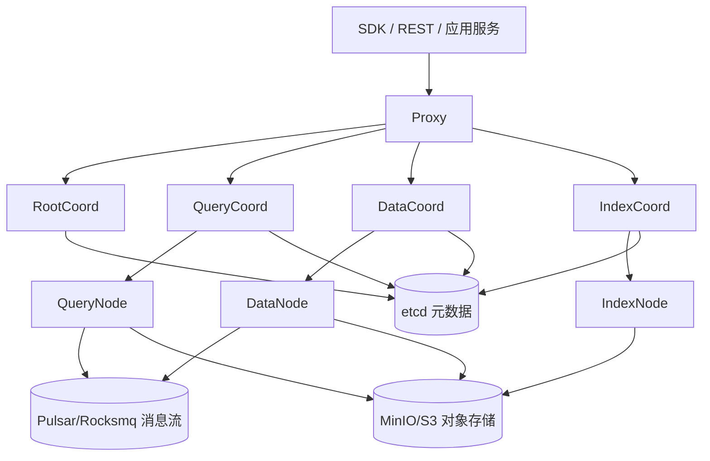
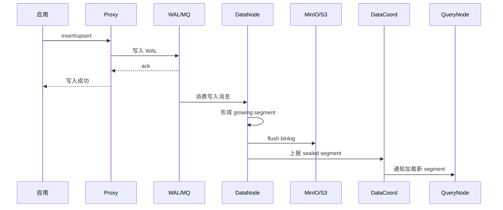
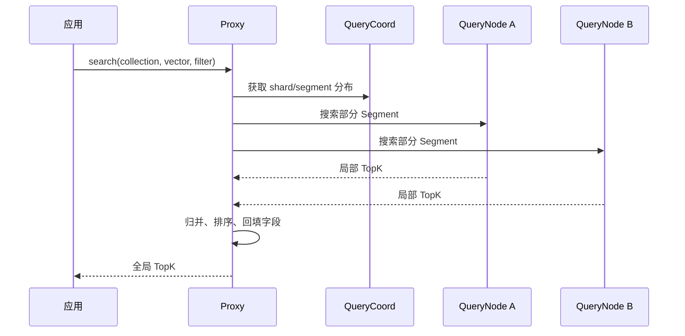
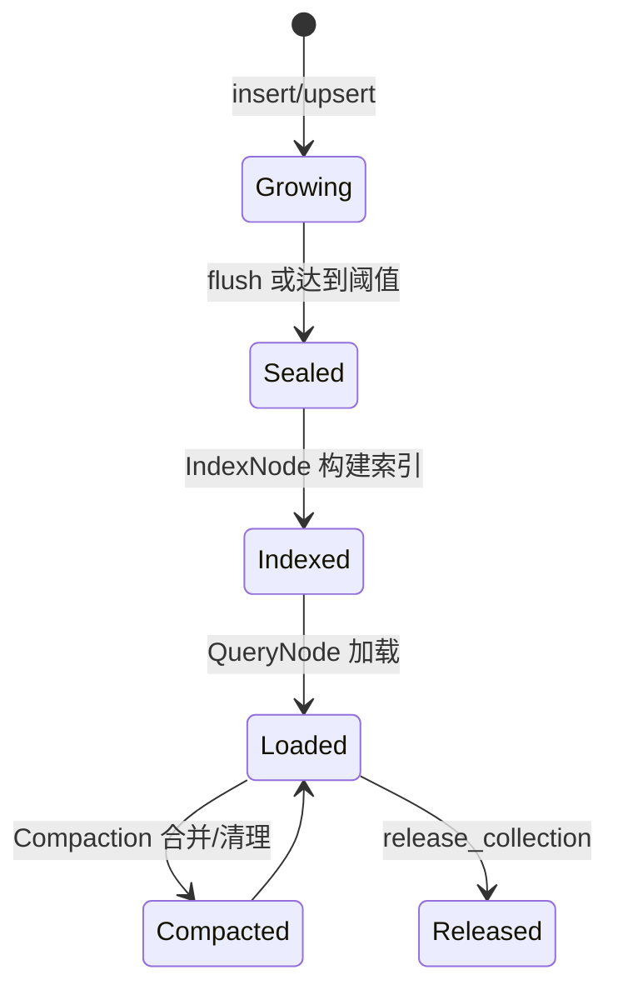

# 02 Milvus整体架构

## 学习目标

学完本章后，你应该能够：

- 说清 Proxy、Coord、Node、etcd、MinIO、Pulsar/Rocksmq 的职责。
- 画出 Milvus 写入流、查询流和索引构建流。
- 理解 Segment 生命周期、Flush、Compaction、WAL。
- 判断一个生产问题大概率发生在哪个组件。
- 区分单机 Standalone 和分布式 Cluster 的架构差异。

## 理论知识：形象化理解

Milvus 的架构可以想象成一个大型物流中心。Proxy 是前台接待，负责接收客户订单；Coord 系列像调度室，决定货物放在哪里、由谁搬运、什么时候合并；Node 系列像具体操作工位，真正执行写入、查询和建索引；etcd 是调度室墙上的总账本，MinIO/S3 是后方仓库，消息队列则是传送带和流水号系统。

写入一条向量，不是把数据直接塞进某个单独文件就结束。它会先进入 WAL，像订单先贴上可追溯的流水号；DataNode 再消费消息、形成 growing segment；Flush 后数据落到对象存储，Segment 被封存；IndexNode 再把它加工成适合快速搜索的索引。查询时，Proxy 会把请求拆给多个 QueryNode，拿到局部 TopK 后再归并成全局 TopK。

所以排查 Milvus 问题要像看物流链路一样定位：是前台接单慢、传送带堵了、仓库 IO 慢、调度表错了，还是搜索工位内存不够。架构图不是背组件名，而是建立“现象到组件”的映射。

## 总体架构

Milvus 采用计算存储分离和多组件协同架构。Proxy 接入请求，Coord 系列负责元数据和调度，Node 系列负责具体执行，etcd 保存元数据，对象存储保存 Binlog/Index 文件，消息队列承载写入日志和事件流。

## 组件职责

| 组件 | 职责 | 生产关注点 |
|---|---|---|
| Proxy | 接收客户端请求、鉴权、路由、参数校验 | QPS、连接数、请求错误率 |
| RootCoord | 管理数据库、Collection、字段、时间戳 | 元数据一致性、DDL 延迟 |
| DataCoord | 管理 Segment、Flush、Compaction | Segment 数量、Compaction 积压 |
| DataNode | 消费写入日志，生成 Binlog | 写入吞吐、Flush 延迟 |
| QueryCoord | 调度 QueryNode，管理 load/release | 加载耗时、副本分配 |
| QueryNode | 加载 Segment，执行搜索和查询 | 内存、搜索延迟、慢查询 |
| IndexCoord | 调度索引构建任务 | 索引任务积压 |
| IndexNode | 构建向量/标量索引 | CPU/GPU、构建耗时 |
| etcd | 元数据和服务发现 | 备份、延迟、磁盘空间 |
| MinIO/S3 | Binlog、DeltaLog、Index 文件 | 容量、吞吐、可靠性 |
| Pulsar/Rocksmq | WAL 和消息流 | 消费延迟、积压、持久化 |

## 写入流程

写入成功通常意味着数据进入 WAL，并不等于索引已经构建完成。新写入数据可能先在 growing segment 中被暴力搜索，Flush 后成为 sealed segment，再由 IndexNode 构建索引。

## 查询流程

查询性能由多个因素共同决定：Collection 是否已 load，Segment 是否过碎，索引是否构建完成，过滤条件能否减少搜索范围，输出字段是否过大。

## Segment 生命周期

- Growing Segment：新写入数据，通常未构建索引，查询时可能暴力搜索。
- Sealed Segment：已封存，数据文件落到对象存储。
- Indexed Segment：索引构建完成，适合高性能 ANN 搜索。
- Compacted Segment：合并小 Segment 或清理删除数据后的新 Segment。

## Flush、Compaction、WAL

| 机制 | 解决的问题 | 过度使用的代价 |
|---|---|---|
| WAL | 写入可靠性和异步消费 | 消息积压会影响数据可见性 |
| Flush | 将内存数据持久化为 sealed segment | 频繁 flush 会产生大量小 Segment |
| Compaction | 合并 Segment、清理删除数据 | 占用 IO/CPU，可能影响前台负载 |

## 完整代码

基础代码见 `../demos/basic-search`，生产观察建议配合 `docker compose logs -f standalone` 和第 20 章监控指标阅读。

## 常见错误

| 现象 | 可能组件 | 排查方向 |
|---|---|---|
| insert 返回慢 | Proxy/DataNode/MQ | 看写入吞吐、消息队列积压、批大小 |
| search 慢 | QueryNode/Proxy | 看 Collection load 状态、Segment 数量、索引参数 |
| create index 慢 | IndexCoord/IndexNode | 看索引任务队列、CPU/GPU、对象存储吞吐 |
| 元数据异常 | RootCoord/etcd | 检查 etcd 健康和磁盘空间 |

## 面试题

1. Milvus 为什么要把 Coord 和 Node 拆开？
2. 写入成功和可被索引搜索之间为什么可能有时间差？
3. Segment 过碎会带来什么问题？
4. etcd 和对象存储分别保存什么？
5. Standalone 与 Cluster 的主要差异是什么？

## 练习题

1. 启动 Milvus 后插入 10 万条随机向量，观察日志中的 Segment 和 Flush 信息。
2. 在搜索前后分别调用 `load_collection` 和 `release_collection`，比较延迟和错误信息。
3. 故意频繁 flush，观察搜索性能和 Segment 数量变化。

## 小结

理解 Milvus 架构的关键是抓住两条链路：写入链路把数据可靠地变成 Segment 和索引，查询链路把分散在多个 QueryNode 的局部结果归并成全局 TopK。后续所有调优都离不开这两条链路。
