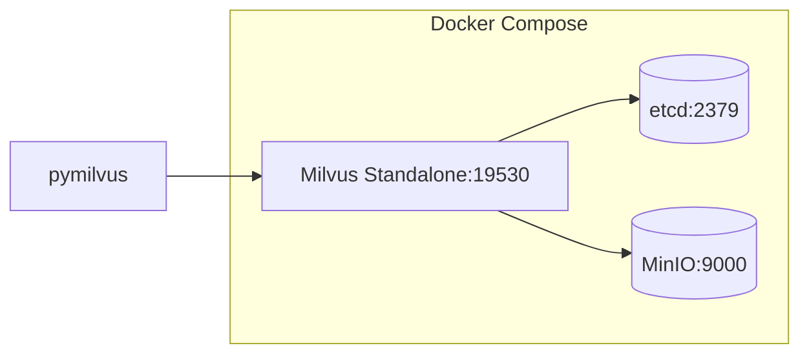
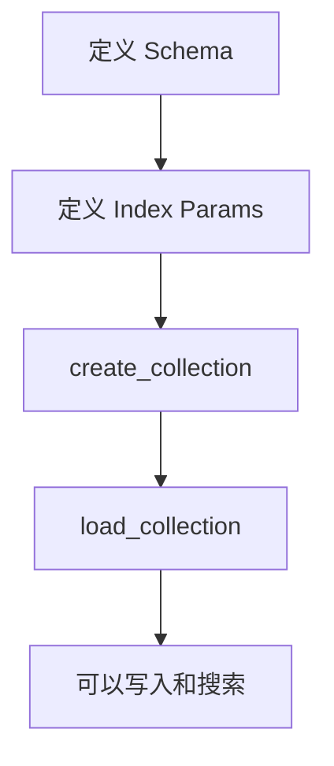
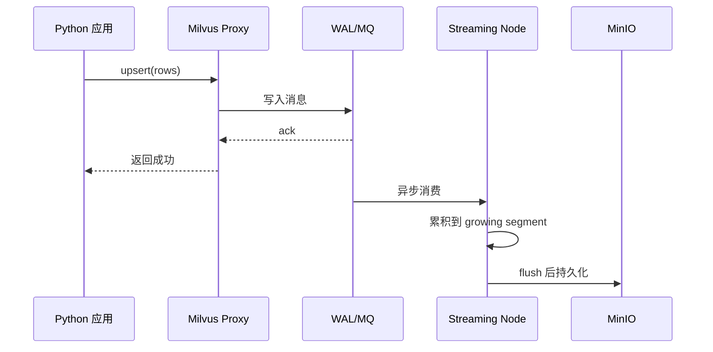
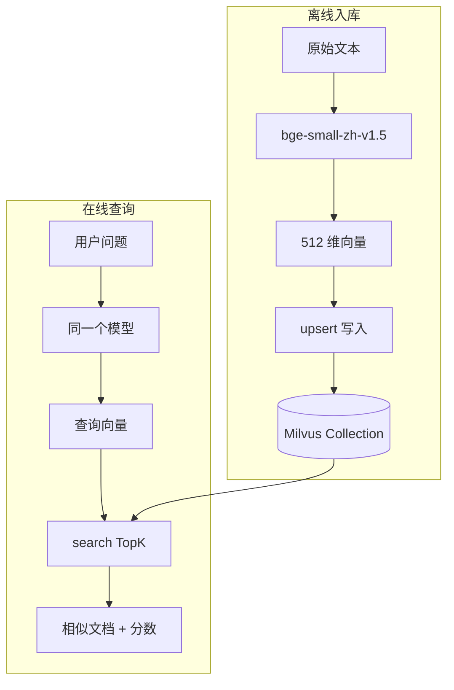

# 03 Milvus 快速开始

## 学习目标

学完本章后，你应该能够：

- 用 Docker Compose 在本地启动 Milvus Standalone。
- 安装 pymilvus 并验证连接。
- 创建 Collection、写入向量、构建索引、执行搜索。
- 理解从原始文本到搜索结果的完整数据流。
- 清理环境并能从零复现。

---

## 前置条件

| 工具 | 最低版本 | 验证命令 |
|---|---|---|
| Docker | 20.10+ | `docker --version` |
| Docker Compose | v2.0+ | `docker compose version` |
| Python | 3.11 | `python3 --version` |
| pip | 23+ | `pip --version` |

如果你还没有安装 Docker，参考第 04 章的详细部署指南。本章假设 Docker 已就绪。

---

## 第一步：启动 Milvus

项目根目录已提供 `docker-compose.yml`，包含 Milvus Standalone + etcd + MinIO：

```bash
cd milvus-master-course
docker compose up -d
```

等待约 30 秒，验证服务健康：

```bash
# 检查容器状态
docker compose ps

# 检查 Milvus 健康端点
curl http://localhost:9091/healthz
# 预期输出: OK
```



如果 `healthz` 返回失败，常见原因：
- 端口 19530/9091 被占用：`lsof -i :19530`
- Docker 内存不足：Milvus 建议至少 4GB
- etcd 启动慢：等待 60 秒后重试

---

## 第二步：安装 Python 依赖

```bash
cd demos/basic-search
pip install -r requirements.txt
```

`requirements.txt` 核心依赖：

```text
pymilvus==2.6.12
sentence-transformers==3.4.1
python-dotenv==1.1.0
numpy==2.2.6
```

验证安装：

```python
import pymilvus
print(pymilvus.__version__)  # 2.6.12
```

---

## 第三步：连接 Milvus

```python
from pymilvus import MilvusClient

# 本地 Standalone 默认无鉴权
client = MilvusClient(uri="http://localhost:19530")

# 验证连接：列出已有 Collection
print(client.list_collections())  # 首次启动应为 []
```

连接参数说明：

| 参数 | 说明 | 示例 |
|---|---|---|
| `uri` | Milvus 地址 | `http://localhost:19530` |
| `token` | 鉴权 Token（开启鉴权时） | `root:Milvus` |
| `db_name` | 数据库名（多租户时） | `default` |

---

## 第四步：创建 Collection

Collection 是 Milvus 中存储向量的基本单元，类似关系数据库的表。

```python
from pymilvus import DataType, MilvusClient

client = MilvusClient(uri="http://localhost:19530")

COLLECTION_NAME = "quick_start_docs"
VECTOR_DIM = 512  # 取决于 Embedding 模型

# 如果已存在则先删除（开发阶段）
if client.has_collection(COLLECTION_NAME):
    client.drop_collection(COLLECTION_NAME)

# 定义 Schema
schema = MilvusClient.create_schema(auto_id=False, enable_dynamic_field=False)
schema.add_field(field_name="id", datatype=DataType.VARCHAR, is_primary=True, max_length=64)
schema.add_field(field_name="text", datatype=DataType.VARCHAR, max_length=2048)
schema.add_field(field_name="source", datatype=DataType.VARCHAR, max_length=256)
schema.add_field(field_name="embedding", datatype=DataType.FLOAT_VECTOR, dim=VECTOR_DIM)

# 定义索引
index_params = MilvusClient.prepare_index_params()
index_params.add_index(
    field_name="embedding",
    index_name="embedding_hnsw",
    index_type="HNSW",
    metric_type="COSINE",
    params={"M": 16, "efConstruction": 128},
)

# 创建并加载
client.create_collection(
    collection_name=COLLECTION_NAME,
    schema=schema,
    index_params=index_params,
)
client.load_collection(COLLECTION_NAME)
print(f"Collection '{COLLECTION_NAME}' 创建成功")
```



Schema 设计要点：
- `auto_id=False`：由业务控制主键，方便幂等写入（upsert）
- `FLOAT_VECTOR`：标准 float32 向量，dim 必须与模型输出一致
- `HNSW + COSINE`：中小规模文本检索的默认选择

---

## 第五步：生成 Embedding 并写入

```python
from sentence_transformers import SentenceTransformer

# 加载中文 Embedding 模型（首次会下载约 90MB）
model = SentenceTransformer("BAAI/bge-small-zh-v1.5")

# 准备样例文档
docs = [
    {"id": "doc-001", "text": "Milvus 是面向 AI 应用的高性能向量数据库。", "source": "intro"},
    {"id": "doc-002", "text": "HNSW 是一种基于图的近似最近邻搜索索引。", "source": "index"},
    {"id": "doc-003", "text": "RAG 系统通常包含文档切块、向量召回和大模型生成。", "source": "rag"},
    {"id": "doc-004", "text": "CLIP 可以把图片和文本映射到同一个向量空间。", "source": "multimodal"},
    {"id": "doc-005", "text": "生产环境需要关注 Segment、Compaction 和容量规划。", "source": "ops"},
]

# 生成向量
texts = [doc["text"] for doc in docs]
vectors = model.encode(texts, normalize_embeddings=True).tolist()

# 组装写入数据
rows = [{**doc, "embedding": vec} for doc, vec in zip(docs, vectors)]

# 写入 Milvus
client.upsert(collection_name=COLLECTION_NAME, data=rows)
print(f"写入 {len(rows)} 条文档")
```

写入流程在 Milvus 内部的路径：



注意：`upsert` 返回成功意味着数据进入 WAL，不代表索引已构建。对于 growing segment 中的新数据，Milvus 会用暴力搜索保证可查询。

---

## 第六步：执行语义搜索

```python
# 查询
query = "如何构建知识库问答系统？"
query_vector = model.encode([query], normalize_embeddings=True).tolist()[0]

results = client.search(
    collection_name=COLLECTION_NAME,
    data=[query_vector],
    anns_field="embedding",
    search_params={"metric_type": "COSINE", "params": {"ef": 64}},
    limit=3,
    output_fields=["text", "source"],
)

# 打印结果
print(f"\n查询：{query}\n")
for rank, hit in enumerate(results[0], start=1):
    entity = hit["entity"]
    print(f"  {rank}. score={hit['distance']:.4f}  source={entity['source']}")
    print(f"     {entity['text']}\n")
```

预期输出（score 越接近 1 越相似）：

```
查询：如何构建知识库问答系统？

  1. score=0.7823  source=rag
     RAG 系统通常包含文档切块、向量召回和大模型生成。

  2. score=0.6145  source=intro
     Milvus 是面向 AI 应用的高性能向量数据库。

  3. score=0.5012  source=ops
     生产环境需要关注 Segment、Compaction 和容量规划。
```

搜索参数解释：

| 参数 | 作用 | 调优方向 |
|---|---|---|
| `ef` | HNSW 搜索时的候选集大小 | 增大提高召回，增加延迟 |
| `limit` | 返回 TopK 数量 | 业务需要多少就设多少 |
| `output_fields` | 需要返回的标量字段 | 字段越少，网络传输越快 |
| `metric_type` | 距离度量 | 必须与建索引时一致 |

---

## 完整可运行脚本

以上步骤已整合在 `demos/basic-search/main.py` 中。一键运行：

```bash
cd milvus-master-course
./scripts/start.sh          # 启动 Milvus
cd demos/basic-search
cp .env.example .env        # 配置环境变量
python main.py              # 运行完整流程
```

`.env.example` 内容：

```env
MILVUS_URI=http://localhost:19530
MILVUS_TOKEN=
COLLECTION_NAME=course_basic_docs
EMBEDDING_MODEL=BAAI/bge-small-zh-v1.5
RECREATE_COLLECTION=true
TOP_K=3
EF_SEARCH=64
LOG_LEVEL=INFO
```

---

## 数据流全景图



关键原则：**入库和查询必须使用同一个 Embedding 模型**。如果模型不同，向量空间不一致，搜索结果无意义。

---

## 清理环境

```bash
# 停止 Milvus
cd milvus-master-course
docker compose down

# 如果需要彻底清除数据（包括 etcd 和 MinIO 持久化卷）
docker compose down -v
```

从零复现：

```bash
docker compose up -d
# 等待 healthz 返回 OK
cd demos/basic-search
python main.py
```

---

## 常见错误

| 现象 | 原因 | 修复 |
|---|---|---|
| `Connection refused` | Milvus 未启动或端口不对 | `docker compose ps` 检查状态，确认 19530 端口 |
| `dimension mismatch` | 向量维度与 Collection schema 不一致 | 确认模型输出维度与 `dim` 参数匹配 |
| `collection not loaded` | 创建后未调用 `load_collection` | 搜索前必须 load |
| `search result empty` | Collection 为空或 metric_type 不匹配 | 先确认 upsert 成功，再检查 metric_type |
| 模型下载超时 | 网络问题 | 设置 `HF_ENDPOINT=https://hf-mirror.com` |
| `OOM killed` | Docker 内存不足 | Docker Desktop 设置中增加内存到 4GB+ |

---

## 面试题

1. **pymilvus 的 `MilvusClient` 和旧版 `connections.connect()` 有什么区别？**
   MilvusClient 是 pymilvus 2.4+ 推荐的高层 API，封装了连接管理、自动重试，接口更简洁。旧版需要手动管理连接和 Collection 对象。

2. **为什么 upsert 返回成功后立即搜索就能找到数据？**
   Milvus 对 growing segment 中未建索引的数据会使用暴力搜索，保证写入即可查。但性能不如索引搜索。

3. **HNSW 索引的 `efConstruction` 和搜索时的 `ef` 有什么关系？**
   `efConstruction` 影响索引构建质量（离线），`ef` 影响搜索精度（在线）。通常 `ef >= limit`，且 `ef <= efConstruction`。

4. **如果入库用模型 A，查询用模型 B，会怎样？**
   搜索结果无意义。不同模型的向量空间不同，余弦相似度不可比较。

5. **`normalize_embeddings=True` 的作用是什么？**
   将向量归一化为单位向量。归一化后 COSINE 和 IP 等价，且数值稳定性更好。

---

## 练习题

1. **修改 TopK 和 ef**：把 `limit` 从 3 改为 1 和 5，把 `ef` 从 64 改为 16 和 256，观察结果和耗时变化。记录一个表格。

2. **换一个 Embedding 模型**：把模型换成 `BAAI/bge-base-zh-v1.5`（768 维），修改 Collection 的 dim，重新跑一遍。对比两个模型的搜索结果排序差异。

3. **测试幂等写入**：连续运行两次 `main.py`（设置 `RECREATE_COLLECTION=false`），观察 upsert 是否会产生重复数据。解释为什么。

4. **构造对抗查询**：写一个与所有文档都不相关的查询（如"今天天气怎么样"），观察返回的 score。思考：业务中如何设置相似度阈值来过滤无关结果？

---

## 小结

本章完成了 Milvus 的最小闭环：启动服务 → 创建 Collection → 生成向量 → 写入数据 → 语义搜索。这五步是所有后续章节的基础——RAG、图片检索、多模态搜索本质上都是换了数据源和 Embedding 模型，核心流程不变。下一章将深入 Docker 部署的配置细节和生产注意事项。
