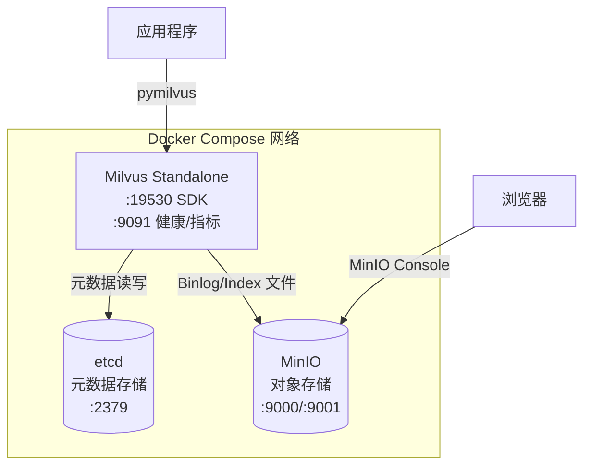
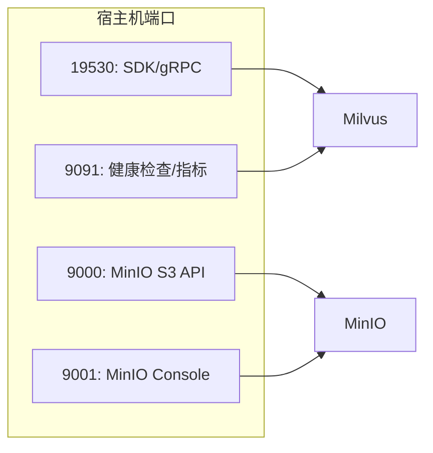
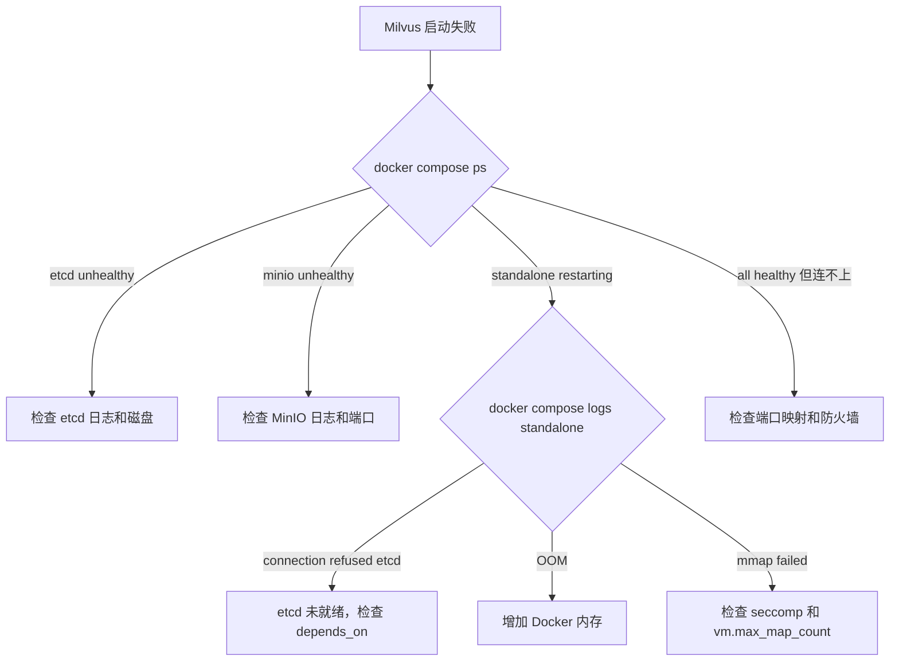

# 04 Docker 部署 Milvus

## 学习目标

学完本章后，你应该能够：

- 理解 Milvus Docker Compose 中每个服务的角色和依赖关系。
- 配置端口映射、数据卷和健康检查。
- 处理 Linux / macOS / Windows 三平台的启动差异。
- 通过 `milvus.yaml` 覆盖默认配置。
- 排查常见启动故障。

---

## 架构总览

Milvus Standalone 模式需要三个服务协同工作：



| 服务 | 镜像 | 职责 | 数据卷 |
|---|---|---|---|
| etcd | `quay.io/coreos/etcd:v3.5.18` | Collection Schema、Segment 元数据、服务发现 | `etcd-data:/etcd` |
| MinIO | `minio/minio:RELEASE.2024-12-18T13-15-44Z` | Binlog、DeltaLog、Index 文件持久化 | `minio-data:/minio_data` |
| Milvus | `milvusdb/milvus:v2.6.15` | 向量写入、索引构建、搜索计算 | `milvus-data:/var/lib/milvus` |

---

## docker-compose.yml 详解

项目根目录的 `docker-compose.yml`：

```yaml
name: milvus-master-course

services:
  etcd:
    container_name: milvus-etcd
    image: quay.io/coreos/etcd:v3.5.18
    environment:
      ETCD_AUTO_COMPACTION_MODE: revision
      ETCD_AUTO_COMPACTION_RETENTION: '1000'
      ETCD_QUOTA_BACKEND_BYTES: '4294967296'   # 4GB，防止 DB 空间不足
      ETCD_SNAPSHOT_COUNT: '50000'
    command: >
      etcd
      -advertise-client-urls=http://127.0.0.1:2379
      -listen-client-urls=http://0.0.0.0:2379
      --data-dir=/etcd
    volumes:
      - etcd-data:/etcd
    healthcheck:
      test: ['CMD', 'etcdctl', 'endpoint', 'health']
      interval: 30s
      timeout: 20s
      retries: 3

  minio:
    container_name: milvus-minio
    image: minio/minio:RELEASE.2024-12-18T13-15-44Z
    environment:
      MINIO_ACCESS_KEY: minioadmin
      MINIO_SECRET_KEY: minioadmin
    ports:
      - '9000:9000'    # S3 API
      - '9001:9001'    # Web Console
    command: minio server /minio_data --console-address ':9001'
    volumes:
      - minio-data:/minio_data
    healthcheck:
      test: ['CMD', 'curl', '-f', 'http://localhost:9000/minio/health/live']
      interval: 30s
      timeout: 20s
      retries: 3

  standalone:
    container_name: milvus-standalone
    image: milvusdb/milvus:v2.6.15
    command: ['milvus', 'run', 'standalone']
    security_opt:
      - seccomp:unconfined
    environment:
      ETCD_ENDPOINTS: etcd:2379
      MINIO_ADDRESS: minio:9000
      MINIO_ACCESS_KEY: minioadmin
      MINIO_SECRET_KEY: minioadmin
    volumes:
      - milvus-data:/var/lib/milvus
      - ./configs/milvus.yaml:/milvus/configs/milvus.yaml:ro
    healthcheck:
      test: ['CMD', 'curl', '-f', 'http://localhost:9091/healthz']
      interval: 30s
      start_period: 90s    # Milvus 启动较慢，给 90 秒缓冲
      timeout: 20s
      retries: 3
    ports:
      - '19530:19530'      # gRPC/SDK 端口
      - '9091:9091'        # 健康检查 + Prometheus 指标
    depends_on:
      etcd:
        condition: service_healthy
      minio:
        condition: service_healthy

volumes:
  etcd-data:
  minio-data:
  milvus-data:
```

### 关键配置解读

**depends_on + condition**：Milvus 必须等 etcd 和 MinIO 健康后才启动。没有这个约束，Milvus 可能因连不上 etcd 而反复重启。

**start_period: 90s**：Milvus 首次启动需要初始化内部状态，90 秒内健康检查失败不算 retry。

**security_opt: seccomp:unconfined**：Milvus 内部使用 mmap 和特定系统调用，某些 Linux 内核的默认 seccomp 策略会阻止。

**volumes 持久化**：三个 named volume 保证容器重建后数据不丢失。`docker compose down` 不删卷，`docker compose down -v` 会清除所有数据。

---

## 端口规划



| 端口 | 用途 | 谁需要访问 |
|---|---|---|
| 19530 | pymilvus / REST API 连接 | 应用代码 |
| 9091 | `/healthz` 健康检查、`/metrics` Prometheus 指标 | 运维、监控 |
| 9000 | MinIO S3 兼容 API | Milvus 内部（通常不需要外部访问） |
| 9001 | MinIO Web 管理界面 | 开发调试时查看存储文件 |

如果端口冲突，修改 `ports` 映射的左侧（宿主机端口）：

```yaml
ports:
  - '29530:19530'   # 宿主机用 29530 访问
```

---

## 配置文件覆盖

Milvus 通过 `/milvus/configs/milvus.yaml` 读取配置。Docker Compose 中用只读挂载覆盖：

```yaml
volumes:
  - ./configs/milvus.yaml:/milvus/configs/milvus.yaml:ro
```

本教程的 `configs/milvus.yaml`：

```yaml
log:
  level: info                    # debug/info/warn/error

common:
  security:
    authorizationEnabled: false  # 开发环境关闭鉴权

proxy:
  maxNameLength: 255             # Collection/字段名最大长度
  maxFieldNum: 64                # 单个 Collection 最大字段数

queryNode:
  mmap:
    enabled: false               # mmap 可降低内存但增加延迟
  lazyload:
    enabled: false               # 关闭懒加载，启动时立即 load

dataCoord:
  segment:
    maxSize: 512                 # Segment 最大 512MB
    sealProportion: 0.12         # growing segment 达到 12% maxSize 时 seal

indexNode:
  scheduler:
    buildParallel: 1             # 索引构建并行度（受 CPU 限制）
```

### 常用配置项速查

| 配置路径 | 作用 | 调优场景 |
|---|---|---|
| `log.level` | 日志级别 | 排查问题时临时改 debug |
| `common.security.authorizationEnabled` | 是否开启鉴权 | 生产必须开启 |
| `queryNode.mmap.enabled` | 是否用 mmap 加载索引 | 内存不足时开启，换延迟降内存 |
| `dataCoord.segment.maxSize` | Segment 上限（MB） | 数据量大时增大，减少 Segment 碎片 |
| `indexNode.scheduler.buildParallel` | 索引构建并行数 | CPU 充足时增大加速构建 |

配置修改后需要重启 Milvus：

```bash
docker compose restart standalone
```

---

## 启动与停止脚本

项目提供了封装脚本：

**scripts/start.sh**：

```bash
#!/bin/bash
set -e
cd "$(dirname "$0")/.."
echo "启动 Milvus..."
docker compose up -d
echo "等待服务就绪..."
until curl -sf http://localhost:9091/healthz > /dev/null 2>&1; do
    sleep 2
done
echo "Milvus 已就绪 (localhost:19530)"
```

**scripts/stop.sh**：

```bash
#!/bin/bash
set -e
cd "$(dirname "$0")/.."
docker compose down
echo "Milvus 已停止"
```

---

## 跨平台差异

### Linux

```bash
# 通常无额外配置
docker compose up -d
```

注意事项：
- 确保当前用户在 `docker` 组中，否则需要 `sudo`
- 如果使用 SELinux，volume 挂载可能需要 `:z` 后缀
- 内核参数 `vm.max_map_count` 建议 >= 262144

```bash
# 检查并设置（临时）
sysctl vm.max_map_count
sudo sysctl -w vm.max_map_count=262144
```

### macOS (Docker Desktop)

```bash
docker compose up -d
```

注意事项：
- Docker Desktop 默认内存 2GB，Milvus 建议 4GB+
- 设置路径：Docker Desktop → Settings → Resources → Memory
- Apple Silicon (M1/M2/M3) 完全兼容，镜像支持 arm64
- 文件系统性能比 Linux 差，大数据量时感知明显

### Windows (Docker Desktop + WSL2)

```powershell
docker compose up -d
```

注意事项：
- 必须启用 WSL2 后端（Hyper-V 模式性能差）
- 内存分配在 `%USERPROFILE%\.wslconfig` 中配置：

```ini
[wsl2]
memory=6GB
processors=4
```

- 路径问题：建议把项目放在 WSL2 文件系统内（`/home/user/`），而非 `/mnt/c/`
- 端口冲突：Windows 的 Hyper-V 会保留部分端口范围，如果 19530 被占用：

```powershell
netsh interface ipv4 show excludedportrange protocol=tcp
```

---

## 健康检查与日志

### 验证服务状态

```bash
# 查看所有容器状态
docker compose ps

# 预期输出：
# milvus-etcd        running (healthy)
# milvus-minio       running (healthy)
# milvus-standalone  running (healthy)
```

### 查看日志

```bash
# 查看 Milvus 日志（实时跟踪）
docker compose logs -f standalone

# 查看最近 100 行
docker compose logs --tail 100 standalone

# 查看所有服务日志
docker compose logs -f
```

### 常用健康检查命令

```bash
# Milvus 健康
curl http://localhost:9091/healthz

# Milvus Prometheus 指标
curl http://localhost:9091/metrics | head -20

# MinIO 健康
curl http://localhost:9000/minio/health/live

# etcd 健康（进入容器）
docker exec milvus-etcd etcdctl endpoint health
```

---

## 数据管理

### 数据卷位置

```bash
# 查看 Docker volume 详情
docker volume inspect milvus-master-course_milvus-data
```

### 备份与恢复

```bash
# 备份 etcd 数据（元数据）
docker exec milvus-etcd etcdctl snapshot save /etcd/backup.db
docker cp milvus-etcd:/etcd/backup.db ./backup/etcd-snapshot.db

# 备份 MinIO 数据（向量文件）
# 方式一：直接复制 volume
docker run --rm -v milvus-master-course_minio-data:/data -v $(pwd)/backup:/backup \
  alpine tar czf /backup/minio-backup.tar.gz /data

# 方式二：使用 mc 客户端
docker run --rm --network milvus-master-course_default \
  minio/mc alias set local http://minio:9000 minioadmin minioadmin && \
  mc mirror local/milvus-bucket ./backup/minio/
```

### 完全重置

```bash
# 停止并删除所有数据
docker compose down -v

# 重新启动（全新环境）
docker compose up -d
```

---

## 资源需求参考

| 数据规模 | 内存建议 | 磁盘建议 | 说明 |
|---|---|---|---|
| < 100 万向量 | 4GB | 20GB | 开发/学习 |
| 100-500 万向量 | 8GB | 50GB | 小型生产 |
| 500-2000 万向量 | 16GB+ | 100GB+ | 建议考虑集群模式 |

内存估算公式（HNSW 索引）：

```
内存 ≈ 向量数 × 维度 × 4B × 1.5（索引开销）
     + 向量数 × M × 2 × 8B（HNSW 图结构）

示例：100 万 × 768 维 × 4 × 1.5 + 100 万 × 16 × 2 × 8
     ≈ 4.6GB + 0.24GB ≈ 4.84GB
```

---

## 常见启动故障

| 现象 | 原因 | 修复 |
|---|---|---|
| Milvus 反复重启 | etcd 未就绪就启动了 | 确认 `depends_on` 使用 `service_healthy` |
| `port already in use` | 19530/9091 被占用 | `lsof -i :19530` 找到占用进程，或改端口映射 |
| etcd `mvcc: database space exceeded` | etcd 存储满 | 增大 `ETCD_QUOTA_BACKEND_BYTES`，执行 compaction |
| MinIO `disk full` | 对象存储空间不足 | 清理旧数据或扩容磁盘 |
| `OOM killed` | 容器内存不足 | Docker Desktop 增加内存，或在 compose 中设置 `mem_limit` |
| `seccomp` 相关错误 | Linux 内核限制系统调用 | 添加 `security_opt: seccomp:unconfined` |
| 启动后 `healthz` 一直失败 | `start_period` 太短 | 增大到 120s，检查磁盘 IO |
| Windows 下文件权限错误 | NTFS 不支持 Unix 权限 | 把项目移到 WSL2 文件系统 |

### 排查流程



---

## 面试题

1. **为什么 Milvus 需要 etcd 和 MinIO，不能把元数据和文件都存本地？**
   计算存储分离架构。etcd 保证元数据一致性和服务发现，MinIO 提供可靠的对象存储。这样 Milvus 节点可以无状态扩缩容，数据不绑定在单机磁盘上。

2. **`docker compose down` 和 `docker compose down -v` 的区别是什么？**
   前者只停止并删除容器和网络，数据卷保留；后者同时删除 named volumes，所有持久化数据丢失。生产环境误操作 `-v` 是灾难性的。

3. **健康检查的 `start_period` 有什么作用？**
   在 start_period 内，健康检查失败不计入 retries。Milvus 启动需要加载元数据和恢复状态，可能需要 60-90 秒，没有 start_period 会导致容器被误判为不健康而重启。

4. **为什么建议把 milvus.yaml 以只读方式挂载（`:ro`）？**
   防止容器内进程意外修改配置文件。配置变更应该通过修改宿主机文件 + 重启容器来完成，保证可追溯。

5. **Standalone 模式的瓶颈在哪里？什么时候该切换到集群？**
   单机的 CPU、内存和磁盘 IO 是硬上限。当数据量超过单机内存容量、写入吞吐需要水平扩展、或需要高可用时，应切换到分布式集群。

---

## 练习题

1. **端口冲突模拟**：把 Milvus 端口改为 `29530:19530`，修改 Demo 的 `.env` 文件中的 `MILVUS_URI`，验证连接正常。

2. **配置热更新测试**：修改 `configs/milvus.yaml` 中的 `log.level` 为 `debug`，重启 Milvus，观察日志量变化。再改回 `info`。

3. **数据持久化验证**：写入数据后执行 `docker compose down`（不加 `-v`），再 `docker compose up -d`，验证数据还在。然后执行 `docker compose down -v`，再启动，确认数据已清除。

4. **资源观察**：运行 `docker stats` 观察三个容器的 CPU 和内存使用。写入 1 万条向量后再观察，对比变化。

---

## 小结

Docker Compose 部署是学习和开发 Milvus 的标准方式。核心要记住三件事：etcd 管元数据、MinIO 管文件、Milvus 管计算；数据卷决定持久化；健康检查和启动顺序决定稳定性。生产环境需要在此基础上增加监控、备份、资源限制和安全配置，这些将在第 18-21 章展开。
