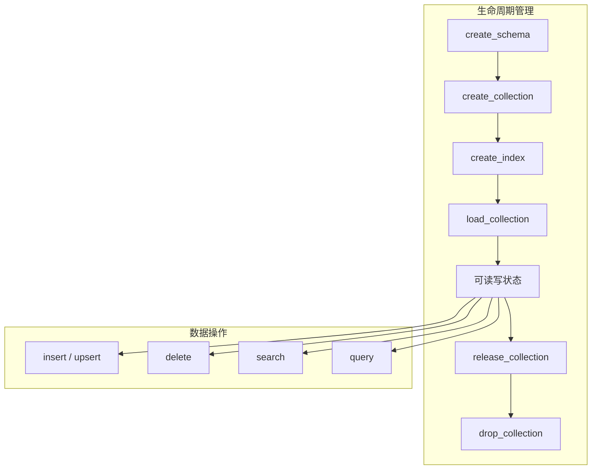
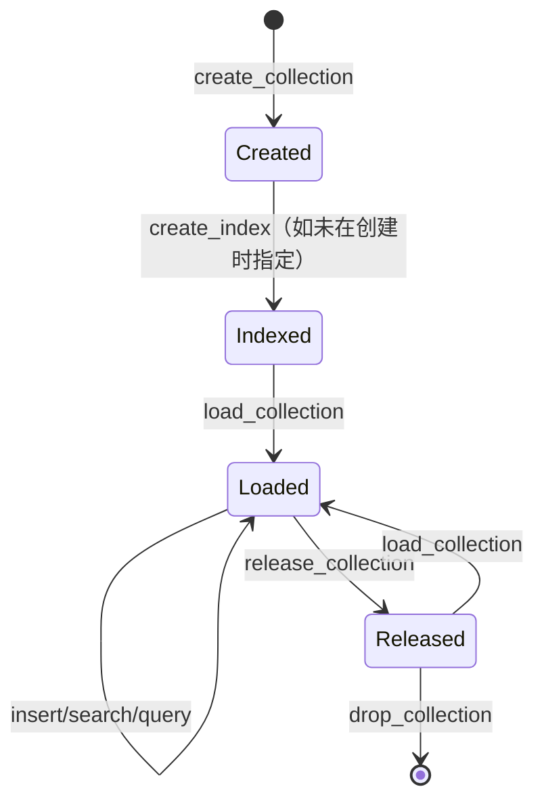
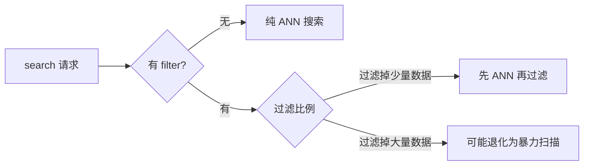

# 05 pymilvus 完全指南

## 学习目标

学完本章后，你应该能够：

- 使用 `MilvusClient` 连接本地和远程 Milvus。
- 完成 Schema 定义、索引创建、Collection 加载的完整生命周期。
- 熟练使用 insert / upsert / delete / search / query 五大操作。
- 编写过滤表达式进行标量筛选。
- 实现批量写入和异常重试的生产级模式。

---

## API 全景图



pymilvus 2.4+ 推荐使用 `MilvusClient` 高层 API。它封装了连接池、自动重连和简洁的方法签名。旧版 `connections.connect()` + `Collection()` 仍可用，但新项目不建议使用。

---

## 连接 Milvus

### 基本连接

```python
from pymilvus import MilvusClient

# 本地 Standalone（无鉴权）
client = MilvusClient(uri="http://localhost:19530")

# 带鉴权
client = MilvusClient(
    uri="http://localhost:19530",
    token="root:Milvus",
)

# Zilliz Cloud（托管服务）
client = MilvusClient(
    uri="https://your-instance.zillizcloud.com",
    token="your-api-key",
)
```

### 连接参数

| 参数 | 类型 | 说明 |
|---|---|---|
| `uri` | str | Milvus 地址，支持 http/https |
| `token` | str | 鉴权凭证，格式 `user:password` 或 API Key |
| `db_name` | str | 数据库名，默认 `default` |
| `timeout` | float | 连接超时秒数 |

### 连接验证

```python
# 列出所有 Collection，验证连接正常
collections = client.list_collections()
print(f"连接成功，当前有 {len(collections)} 个 Collection")
```

---

## Schema 定义

Schema 定义了 Collection 的字段结构，类似关系数据库的表结构。

```python
from pymilvus import DataType, MilvusClient

schema = MilvusClient.create_schema(
    auto_id=False,              # 不自动生成主键
    enable_dynamic_field=True,  # 允许写入 Schema 外的字段
)

# 主键字段
schema.add_field(
    field_name="id",
    datatype=DataType.VARCHAR,
    is_primary=True,
    max_length=128,
)

# 标量字段
schema.add_field(field_name="title", datatype=DataType.VARCHAR, max_length=512)
schema.add_field(field_name="category", datatype=DataType.VARCHAR, max_length=64)
schema.add_field(field_name="score", datatype=DataType.FLOAT)
schema.add_field(field_name="tags", datatype=DataType.JSON)
schema.add_field(field_name="created_at", datatype=DataType.INT64)

# 向量字段
schema.add_field(
    field_name="embedding",
    datatype=DataType.FLOAT_VECTOR,
    dim=768,
)
```

### 支持的数据类型

| DataType | Python 对应 | 说明 |
|---|---|---|
| `BOOL` | bool | 布尔值 |
| `INT8/16/32/64` | int | 整数 |
| `FLOAT` | float | 32 位浮点 |
| `DOUBLE` | float | 64 位浮点 |
| `VARCHAR` | str | 变长字符串，需指定 `max_length` |
| `JSON` | dict | JSON 对象，支持嵌套过滤 |
| `ARRAY` | list | 数组类型 |
| `FLOAT_VECTOR` | list[float] | float32 向量 |
| `FLOAT16_VECTOR` | bytes | float16 向量（省内存） |
| `BFLOAT16_VECTOR` | bytes | bfloat16 向量 |
| `BINARY_VECTOR` | bytes | 二值向量 |
| `SPARSE_FLOAT_VECTOR` | dict | 稀疏向量（用于 BM25 等） |

### auto_id vs 业务主键

| 模式 | 优点 | 缺点 | 适用场景 |
|---|---|---|---|
| `auto_id=True` | 无需管理主键 | 无法 upsert，无法按 ID 更新 | 日志、事件流 |
| `auto_id=False` | 支持 upsert，幂等写入 | 需要业务保证唯一性 | 文档库、商品库 |

### enable_dynamic_field

开启后可以写入 Schema 中未定义的字段，存储为 JSON。适合字段不固定的场景（如不同来源的文档有不同元数据），但动态字段的过滤性能不如 Schema 定义的字段。

---

## 索引创建

索引决定了搜索的速度和精度。必须在 `load_collection` 之前创建。

```python
index_params = MilvusClient.prepare_index_params()

# 向量索引
index_params.add_index(
    field_name="embedding",
    index_name="embedding_idx",
    index_type="HNSW",
    metric_type="COSINE",
    params={"M": 16, "efConstruction": 200},
)

# 标量索引（加速过滤）
index_params.add_index(
    field_name="category",
    index_name="category_idx",
    index_type="INVERTED",
)
```

### 向量索引类型速查

| 索引类型 | 适用规模 | 内存占用 | 搜索速度 | 召回率 |
|---|---|---|---|---|
| `FLAT` | < 10 万 | 低（仅原始向量） | 慢（暴力扫描） | 100% |
| `IVF_FLAT` | 10 万 - 1000 万 | 中 | 快 | 取决于 nprobe |
| `IVF_SQ8` | 同上 | 较低（量化） | 快 | 略低于 IVF_FLAT |
| `HNSW` | 10 万 - 5000 万 | 高（图结构） | 很快 | 高 |
| `IVF_PQ` | > 1000 万 | 低（强压缩） | 快 | 较低 |
| `DISKANN` | > 1 亿 | 极低（磁盘） | 中 | 中高 |

### 标量索引类型

| 索引类型 | 适用字段 | 说明 |
|---|---|---|
| `INVERTED` | VARCHAR, INT, FLOAT | 通用倒排索引，推荐默认使用 |
| `STL_SORT` | 数值类型 | 排序索引，适合范围查询 |

---

## Collection 创建与加载

```python
# 创建 Collection（同时应用 Schema 和索引）
client.create_collection(
    collection_name="articles",
    schema=schema,
    index_params=index_params,
)

# 加载到内存（搜索前必须 load）
client.load_collection("articles")

# 检查状态
info = client.describe_collection("articles")
print(f"字段数: {len(info['fields'])}, 已加载: {info['loaded']}")
```



---

## 数据写入

### insert vs upsert

| 方法 | 行为 | 主键冲突时 | 适用场景 |
|---|---|---|---|
| `insert` | 纯插入 | 报错或产生重复 | 确定数据不重复时 |
| `upsert` | 存在则更新，不存在则插入 | 覆盖旧数据 | 增量同步、幂等写入 |

### 单条 / 小批量写入

```python
# 写入数据（list of dict 格式）
data = [
    {
        "id": "article-001",
        "title": "Milvus 入门指南",
        "category": "tutorial",
        "score": 4.8,
        "tags": {"level": "beginner", "lang": "zh"},
        "created_at": 1700000000,
        "embedding": [0.1, 0.2, ...],  # 768 维
    },
    # ... 更多文档
]

result = client.upsert(collection_name="articles", data=data)
print(f"写入 {result['upsert_count']} 条")
```

### 批量写入（生产模式）

大量数据应分批写入，避免单次请求过大导致超时或 OOM：

```python
import time
import logging
from typing import Any

logger = logging.getLogger(__name__)

def batch_upsert(
    client: MilvusClient,
    collection_name: str,
    data: list[dict[str, Any]],
    batch_size: int = 1000,
    max_retries: int = 3,
) -> int:
    """分批写入，带重试和进度日志"""
    total = 0
    for i in range(0, len(data), batch_size):
        batch = data[i : i + batch_size]
        for attempt in range(max_retries):
            try:
                result = client.upsert(
                    collection_name=collection_name,
                    data=batch,
                )
                total += result["upsert_count"]
                break
            except Exception as e:
                if attempt < max_retries - 1:
                    wait = 2 ** attempt
                    logger.warning(
                        "批次 %d 写入失败 (attempt %d/%d): %s, %ds 后重试",
                        i // batch_size, attempt + 1, max_retries, e, wait,
                    )
                    time.sleep(wait)
                else:
                    logger.error("批次 %d 写入最终失败: %s", i // batch_size, e)
                    raise
        if (i // batch_size + 1) % 10 == 0:
            logger.info("已写入 %d / %d", total, len(data))
    return total
```

### 写入性能建议

| 参数 | 建议值 | 原因 |
|---|---|---|
| batch_size | 500 - 2000 | 太小网络开销大，太大可能超时 |
| 并发写入 | 2-4 线程 | 过高会导致 Milvus 内部排队 |
| flush 频率 | 不要手动 flush | Milvus 自动管理，手动 flush 产生碎片 Segment |

---

## 删除数据

```python
# 按主键删除
client.delete(
    collection_name="articles",
    ids=["article-001", "article-002"],
)

# 按过滤条件删除
client.delete(
    collection_name="articles",
    filter='category == "deprecated"',
)
```

删除在 Milvus 内部是标记删除（写入 DeltaLog），不会立即释放空间。Compaction 时才会物理清理。

---

## 向量搜索（search）

search 是 Milvus 的核心操作：给定查询向量，返回最相似的 TopK 结果。

```python
results = client.search(
    collection_name="articles",
    data=[query_vector],           # 支持批量查询：多个向量
    anns_field="embedding",        # 搜索哪个向量字段
    search_params={
        "metric_type": "COSINE",   # 必须与索引一致
        "params": {"ef": 128},     # HNSW 搜索参数
    },
    limit=10,                      # TopK
    output_fields=["title", "category", "score"],  # 需要返回的字段
    filter='category == "tutorial" and score > 4.0',  # 标量过滤
)

# 解析结果
for hits in results:  # 外层对应每个查询向量
    for hit in hits:
        print(f"id={hit['id']} distance={hit['distance']:.4f}")
        print(f"  title={hit['entity']['title']}")
```

### search 参数详解

| 参数 | 说明 | 性能影响 |
|---|---|---|
| `data` | 查询向量列表 | 批量查询比逐条高效 |
| `anns_field` | 向量字段名 | 一个 Collection 可有多个向量字段 |
| `limit` | 返回数量 | 越大延迟越高 |
| `output_fields` | 返回的标量字段 | 字段越多，网络传输越大 |
| `filter` | 标量过滤表达式 | 过滤比例高时可能退化为暴力扫描 |
| `search_params.params.ef` | HNSW 候选集 | 增大提高召回，增加延迟 |
| `search_params.params.nprobe` | IVF 探测桶数 | 同上 |

### 批量搜索

```python
# 一次搜索多个查询向量（比循环调用高效）
query_vectors = [vec1, vec2, vec3]
results = client.search(
    collection_name="articles",
    data=query_vectors,
    anns_field="embedding",
    search_params={"metric_type": "COSINE", "params": {"ef": 64}},
    limit=5,
)
# results[0] 对应 vec1 的结果，results[1] 对应 vec2...
```

---

## 标量查询（query）

query 不涉及向量搜索，纯粹按标量条件查询，类似 SQL 的 SELECT WHERE。

```python
# 按主键查询
docs = client.get(
    collection_name="articles",
    ids=["article-001", "article-003"],
    output_fields=["title", "category"],
)

# 按过滤条件查询
docs = client.query(
    collection_name="articles",
    filter='category == "tutorial" and created_at > 1700000000',
    output_fields=["id", "title", "score"],
    limit=20,
)
```

---

## 过滤表达式语法

过滤表达式用于 search 和 query 中的 `filter` 参数。

### 基本运算符

```python
# 等于
filter='category == "tutorial"'

# 不等于
filter='category != "deprecated"'

# 比较
filter='score > 4.0'
filter='created_at >= 1700000000'

# IN
filter='category in ["tutorial", "guide"]'

# LIKE（前缀匹配）
filter='title like "Milvus%"'
```

### 逻辑组合

```python
# AND
filter='category == "tutorial" and score > 4.0'

# OR
filter='category == "tutorial" or category == "guide"'

# NOT
filter='not (category == "deprecated")'

# 复合
filter='(category == "tutorial" or category == "guide") and score >= 4.5'
```

### JSON 字段过滤

```python
# 访问 JSON 字段的嵌套属性
filter='tags["level"] == "beginner"'
filter='tags["lang"] in ["zh", "en"]'
```

### ARRAY 字段过滤

```python
# 数组包含
filter='array_contains(tag_list, "milvus")'

# 数组长度
filter='array_length(tag_list) > 3'
```

### 过滤性能注意事项



- 过滤字段建议创建标量索引（INVERTED）
- 如果 filter 过滤掉 > 90% 的数据，考虑用 Partition 替代
- JSON 字段过滤性能低于 Schema 定义的字段

---

## 异常处理

pymilvus 的异常体系：

```python
from pymilvus.exceptions import (
    MilvusException,          # 基类
    MilvusUnavailableException,  # 服务不可用
    DataNotMatchException,    # 数据与 Schema 不匹配
)

try:
    client.search(...)
except MilvusUnavailableException:
    # Milvus 连接断开，需要重连或等待恢复
    logger.error("Milvus 不可用")
except DataNotMatchException as e:
    # 数据格式错误，不应重试
    logger.error("数据格式错误: %s", e)
except MilvusException as e:
    # 其他 Milvus 错误
    logger.error("Milvus 错误 code=%s: %s", e.code, e.message)
```

### 生产级重试封装

```python
import time
import functools
from pymilvus.exceptions import MilvusException, MilvusUnavailableException

def retry_on_unavailable(max_retries: int = 3, base_delay: float = 1.0):
    """对 Milvus 不可用错误自动重试（指数退避）"""
    def decorator(func):
        @functools.wraps(func)
        def wrapper(*args, **kwargs):
            for attempt in range(max_retries):
                try:
                    return func(*args, **kwargs)
                except MilvusUnavailableException as e:
                    if attempt == max_retries - 1:
                        raise
                    delay = base_delay * (2 ** attempt)
                    logger.warning(
                        "%s 失败 (attempt %d/%d): %s, %.1fs 后重试",
                        func.__name__, attempt + 1, max_retries, e, delay,
                    )
                    time.sleep(delay)
            return None
        return wrapper
    return decorator


@retry_on_unavailable(max_retries=3)
def safe_search(client: MilvusClient, collection: str, vector: list[float], top_k: int):
    return client.search(
        collection_name=collection,
        data=[vector],
        anns_field="embedding",
        search_params={"metric_type": "COSINE", "params": {"ef": 64}},
        limit=top_k,
        output_fields=["title", "source"],
    )
```

---

## Collection 管理操作

```python
# 列出所有 Collection
client.list_collections()

# 查看 Collection 详情
client.describe_collection("articles")

# 查看 Collection 统计（行数等）
client.get_collection_stats("articles")

# 释放内存（不删除数据）
client.release_collection("articles")

# 删除 Collection（不可恢复）
client.drop_collection("articles")

# 重命名
client.rename_collection("articles", "articles_v2")
```

### Collection 生命周期管理模式

```python
def ensure_collection(
    client: MilvusClient,
    name: str,
    schema,
    index_params,
    recreate: bool = False,
) -> None:
    """确保 Collection 存在且已加载。幂等操作。"""
    if recreate and client.has_collection(name):
        client.drop_collection(name)

    if not client.has_collection(name):
        client.create_collection(
            collection_name=name,
            schema=schema,
            index_params=index_params,
        )

    client.load_collection(name)
```

---

## 实用技巧

### 1. 获取向量维度验证

```python
info = client.describe_collection("articles")
for field in info["fields"]:
    if field["type"] == DataType.FLOAT_VECTOR:
        print(f"向量字段: {field['name']}, 维度: {field['params']['dim']}")
```

### 2. 统计数据量

```python
stats = client.get_collection_stats("articles")
print(f"总行数: {stats['row_count']}")
```

### 3. 迭代查询所有数据

```python
def iter_all(client: MilvusClient, collection: str, batch_size: int = 1000):
    """分页遍历 Collection 中所有数据"""
    offset = 0
    while True:
        results = client.query(
            collection_name=collection,
            filter="",  # 无过滤 = 全部
            output_fields=["id", "title"],
            limit=batch_size,
            offset=offset,
        )
        if not results:
            break
        yield from results
        offset += batch_size
```

### 4. 多向量字段搜索

Milvus 2.4+ 支持一个 Collection 中有多个向量字段：

```python
schema.add_field(field_name="title_embedding", datatype=DataType.FLOAT_VECTOR, dim=768)
schema.add_field(field_name="image_embedding", datatype=DataType.FLOAT_VECTOR, dim=512)

# 搜索时指定 anns_field
results = client.search(..., anns_field="title_embedding", ...)
```

---

## API 速查表

| 操作 | 方法 | 关键参数 |
|---|---|---|
| 创建 Collection | `create_collection` | schema, index_params |
| 加载 | `load_collection` | collection_name |
| 释放 | `release_collection` | collection_name |
| 删除 Collection | `drop_collection` | collection_name |
| 写入 | `insert` / `upsert` | collection_name, data |
| 删除数据 | `delete` | ids 或 filter |
| 向量搜索 | `search` | data, anns_field, limit, filter |
| 标量查询 | `query` | filter, output_fields, limit |
| 按 ID 查 | `get` | ids, output_fields |
| 统计 | `get_collection_stats` | collection_name |

---

## 常见错误

| 现象 | 原因 | 修复 |
|---|---|---|
| `collection not loaded` | 搜索前未 load | 调用 `load_collection` |
| `field not found` | output_fields 中字段名拼错 | 用 `describe_collection` 确认字段名 |
| `dimension mismatch` | 写入向量维度与 Schema 不一致 | 检查 Embedding 模型输出维度 |
| `max_length exceeded` | VARCHAR 内容超过 max_length | 截断文本或增大 max_length |
| `timeout` | 单批数据太大或 Milvus 负载高 | 减小 batch_size，检查服务状态 |
| `metric type mismatch` | search 的 metric_type 与索引不一致 | 保持一致，或不传（自动匹配） |
| `upsert on auto_id collection` | auto_id=True 不支持 upsert | 改用 auto_id=False |

---

## 面试题

1. **MilvusClient 和旧版 ORM 风格 API 的区别？**
   MilvusClient 是 2.4+ 推荐的高层 API，内置连接池和重试，方法签名更简洁。ORM 风格需要手动管理 `connections` 和 `Collection` 对象，适合需要细粒度控制的场景。

2. **insert 和 upsert 的性能差异？**
   upsert 需要先查主键是否存在，写入路径比 insert 多一步。纯新增场景用 insert 更快，增量同步场景用 upsert 保证幂等。

3. **为什么不建议手动调用 flush？**
   手动 flush 会强制 seal 当前 growing segment，产生大量小 Segment。Milvus 有自动 flush 机制（基于大小和时间），小 Segment 过多会降低搜索性能并增加 Compaction 压力。

4. **filter 过滤比例很高时为什么搜索变慢？**
   当大部分数据被过滤掉时，ANN 索引的候选集中有效结果太少，Milvus 可能需要扩大搜索范围甚至退化为暴力扫描。解决方案：用 Partition 按过滤维度分区，或增大 ef/nprobe。

5. **如何安全地做 Schema 变更？**
   Milvus 不支持 ALTER COLUMN。变更策略：创建新 Collection → 迁移数据 → 切换流量 → 删除旧 Collection。enable_dynamic_field 可以缓解部分场景。

---

## 练习题

1. **Schema 设计**：为一个电商商品搜索场景设计 Collection Schema，包含商品名、价格、类别、品牌、上架时间和商品描述向量。写出完整的 Schema 定义代码。

2. **过滤表达式**：基于上面的商品 Collection，写出以下查询的 filter 表达式：
   - 价格在 100-500 之间的电子产品
   - 品牌是 Apple 或 Samsung 且评分 > 4.5
   - 2024 年上架的非食品类商品

3. **批量写入压测**：生成 10000 条随机向量数据，分别用 batch_size=100、500、1000、2000 写入，记录每种的总耗时和平均每条耗时。

4. **异常模拟**：在写入过程中执行 `docker compose stop standalone`，观察 pymilvus 的异常类型。重启后验证已写入的数据是否完整。

---

## 小结

pymilvus 是与 Milvus 交互的唯一入口。核心操作链路是：定义 Schema → 创建索引 → 加载 Collection → 写入数据 → 搜索/查询。生产代码中要关注三件事：批量写入的分批和重试、过滤表达式的性能影响、以及 Collection 生命周期的幂等管理。下一章将深入 Collection 的 Schema 设计策略。
