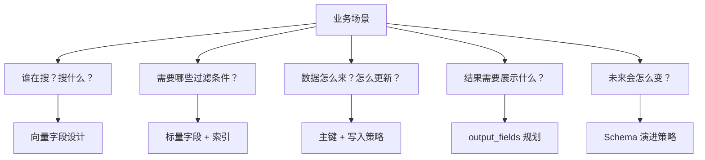
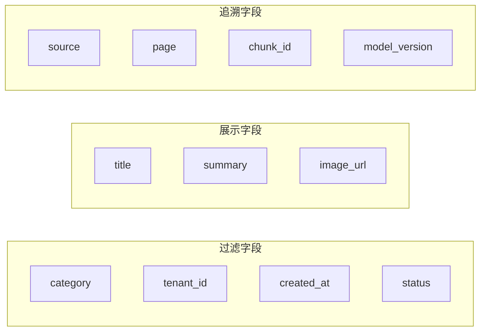
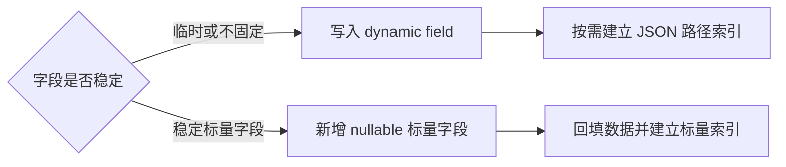
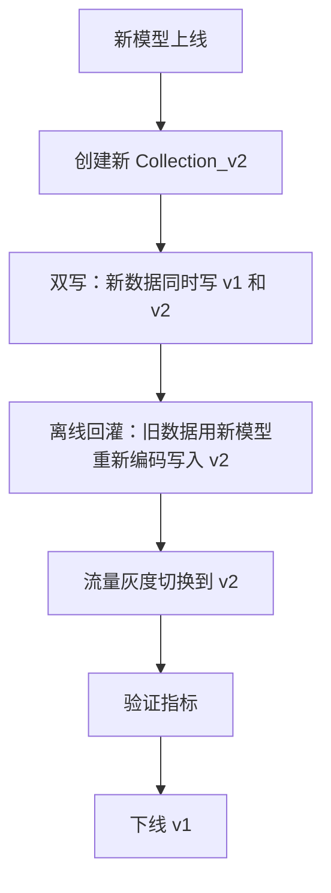

# 06 Collection 设计

## 学习目标

学完本章后，你应该能够：

- 根据业务场景选择合适的主键策略。
- 合理规划向量字段和标量字段。
- 判断何时使用动态字段、何时显式定义。
- 设计支持过滤、追溯和多租户的 Schema。
- 制定 Schema 演进和 Collection 迁移方案。

---

## 设计思维框架

Collection 设计不是"能跑就行"，而是要同时回答五个问题：



---

## 主键设计

主键是每条数据的唯一标识，决定了 upsert、delete、get 的行为。

### 主键类型选择

| 类型 | 优点 | 缺点 | 适用场景 |
|---|---|---|---|
| `VARCHAR` (业务 ID) | 可读、可追溯、支持 upsert | 需要业务保证唯一 | 文档库、商品库、知识库 |
| `INT64` (自增) | 紧凑、排序友好 | 需要外部生成、不可读 | 日志、事件流 |
| `auto_id=True` | 无需管理 | upsert 会生成新主键，不能按原业务实体覆盖 | 只追加、不依赖业务主键更新的场景 |

### 主键生成策略

```python
import hashlib
from datetime import datetime

# 策略一：内容 hash（天然去重）
def content_key(text: str, source: str) -> str:
    content = f"{source}:{text}"
    return hashlib.sha256(content.encode()).hexdigest()[:32]

# 策略二：来源 + 位置（可追溯）
def positional_key(source: str, page: int, chunk_idx: int) -> str:
    return f"{source}:p{page}:c{chunk_idx}"

# 策略三：时间 + 随机（有序且唯一）
import uuid
def time_ordered_key() -> str:
    return str(uuid.uuid7())  # Python 3.12+ 或 uuid6 库
```

### 主键设计原则

1. **幂等性**：相同内容写入多次，主键应相同（支持 upsert 去重）
2. **可追溯**：从主键能反推数据来源（方便排查和重建）
3. **稳定性**：内容不变时主键不变（避免无意义的 upsert）

---

## 向量字段设计

### 单向量 vs 多向量

Milvus 2.4+ 支持一个 Collection 中定义多个向量字段：

```python
from pymilvus import DataType, MilvusClient

schema = MilvusClient.create_schema(auto_id=False)
schema.add_field(field_name="id", datatype=DataType.VARCHAR, is_primary=True, max_length=64)

# 文本语义向量
schema.add_field(field_name="text_embedding", datatype=DataType.FLOAT_VECTOR, dim=768)

# 标题向量（短文本，可能用不同模型）
schema.add_field(field_name="title_embedding", datatype=DataType.FLOAT_VECTOR, dim=384)
```

| 方案 | 优点 | 缺点 | 适用场景 |
|---|---|---|---|
| 单向量 | 简单、内存低 | 只能一种语义搜索 | 大多数场景 |
| 多向量 | 支持不同粒度搜索 | 内存翻倍、索引分别构建 | 标题+正文、图文混合 |
| 稀疏+稠密 | 混合检索（语义+关键词） | 复杂度高 | 需要 BM25 + ANN 的场景 |

### 向量维度选择

维度由 Embedding 模型决定，不是自由选择的参数。但选模型时要考虑维度的影响：

```
内存估算 = 向量数 × 维度 × 4 字节（float32）

100 万条 × 384 维 = 1.43 GB（仅原始向量）
100 万条 × 768 维 = 2.87 GB
100 万条 × 1536 维 = 5.73 GB
```

| 维度范围 | 典型模型 | 适用场景 |
|---|---|---|
| 256-384 | MiniLM、部分轻量模型 | 资源受限、低延迟要求 |
| 512-768 | bge-small-zh、bge-base 等 | 通用文本检索 |
| 1024-1536 | OpenAI text-embedding-3, Cohere | 高精度要求 |

---

## 标量字段设计

标量字段服务于三个目的：**过滤**、**展示**、**追溯**。

### 按用途分类



### 字段设计模板

**RAG 知识库：**

```python
schema.add_field(field_name="id", datatype=DataType.VARCHAR, is_primary=True, max_length=64)
schema.add_field(field_name="text", datatype=DataType.VARCHAR, max_length=4096)
schema.add_field(field_name="source", datatype=DataType.VARCHAR, max_length=256)
schema.add_field(field_name="page", datatype=DataType.INT32)
schema.add_field(field_name="chunk_id", datatype=DataType.INT32)
schema.add_field(field_name="category", datatype=DataType.VARCHAR, max_length=64)
schema.add_field(field_name="created_at", datatype=DataType.INT64)
schema.add_field(field_name="embedding", datatype=DataType.FLOAT_VECTOR, dim=768)
```

**电商商品搜索：**

```python
schema.add_field(field_name="sku_id", datatype=DataType.VARCHAR, is_primary=True, max_length=32)
schema.add_field(field_name="title", datatype=DataType.VARCHAR, max_length=512)
schema.add_field(field_name="brand", datatype=DataType.VARCHAR, max_length=64)
schema.add_field(field_name="category_l1", datatype=DataType.VARCHAR, max_length=32)
schema.add_field(field_name="category_l2", datatype=DataType.VARCHAR, max_length=32)
schema.add_field(field_name="price", datatype=DataType.FLOAT)
schema.add_field(field_name="rating", datatype=DataType.FLOAT)
schema.add_field(field_name="on_sale", datatype=DataType.BOOL)
schema.add_field(field_name="embedding", datatype=DataType.FLOAT_VECTOR, dim=768)
```

**多租户 SaaS：**

```python
schema.add_field(field_name="id", datatype=DataType.VARCHAR, is_primary=True, max_length=64)
schema.add_field(field_name="tenant_id", datatype=DataType.VARCHAR, max_length=32)
schema.add_field(field_name="doc_id", datatype=DataType.VARCHAR, max_length=64)
schema.add_field(field_name="text", datatype=DataType.VARCHAR, max_length=4096)
schema.add_field(field_name="embedding", datatype=DataType.FLOAT_VECTOR, dim=768)
```

### 标量索引规划

不是所有标量字段都需要索引。只给**高频过滤字段**建索引：

```python
index_params = MilvusClient.prepare_index_params()

# 向量索引
index_params.add_index(field_name="embedding", index_type="HNSW", metric_type="COSINE",
                       params={"M": 16, "efConstruction": 200})

# 高频过滤字段建倒排索引
index_params.add_index(field_name="category", index_type="INVERTED")
index_params.add_index(field_name="tenant_id", index_type="INVERTED")
index_params.add_index(field_name="created_at", index_type="STL_SORT")
```

---

## 动态字段

`enable_dynamic_field=True` 允许写入 Schema 中未定义的字段：

```python
schema = MilvusClient.create_schema(auto_id=False, enable_dynamic_field=True)
# 只定义核心字段
schema.add_field(field_name="id", datatype=DataType.VARCHAR, is_primary=True, max_length=64)
schema.add_field(field_name="embedding", datatype=DataType.FLOAT_VECTOR, dim=768)

# 写入时可以带任意额外字段
data = [
    {"id": "1", "embedding": [...], "title": "xxx", "custom_field": "yyy"},
    {"id": "2", "embedding": [...], "title": "zzz", "another_field": 123},
]
```

### 动态字段 vs 显式定义

| 维度 | 动态字段 | 显式定义 |
|---|---|---|
| 灵活性 | 高，随时写入新的动态键 | 2.6 可新增 nullable 标量字段；向量字段或不兼容变更仍需迁移 |
| 过滤性能 | 未建 JSON 路径索引时较差；可为常用动态键建立 JSON 路径索引 | 可直接建立对应标量索引 |
| 类型安全 | 无（JSON 存储） | 有（类型校验） |
| 存储效率 | 较低（JSON 开销） | 高（列式存储） |
| 适用场景 | 元数据不固定、探索阶段 | 字段稳定、高频过滤 |

**建议**：核心过滤字段显式定义 + 建索引，辅助元数据用动态字段。

---

## VARCHAR max_length 设计

`max_length` 不是实际存储大小，而是上限校验。设置原则：

| 字段类型 | 建议 max_length | 说明 |
|---|---|---|
| 主键 ID | 32-128 | UUID=36, SHA256=64 |
| 短文本（标题、类别） | 64-256 | 留余量但不要过大 |
| 中文本（摘要） | 512-2048 | 中文一个字符算一个长度 |
| 长文本（Chunk 内容） | 2048-8192 | 注意 Milvus 单行大小限制 |
| URL / 路径 | 512-1024 | URL 可能很长 |

注意：Milvus 单行总大小有上限（默认约 64KB），大文本建议存外部存储，Collection 中只保存摘要或 ID。

---

## Collection 命名规范

好的命名让运维和代码都更清晰：

```
{业务}_{数据类型}_{版本}

示例：
- rag_chunks_v1
- product_search_v2
- image_gallery_clip_v1
- support_tickets_bge_v3
```

版本号的作用：模型升级时新建 Collection（向量空间不兼容），灰度切换后删除旧版本。

---

## Schema 演进策略

Milvus 2.6 支持向已有 Collection 增加 nullable 标量字段，但不能原地增加向量字段，也不能任意修改主键、向量维度或已有字段类型。应对策略：

### 场景一：新增标量字段



如果已开启 `enable_dynamic_field`，可以直接写入新动态键并按需建立 JSON 路径索引。对于稳定的标量字段，也可以使用 2.6 的新增字段能力，但新字段必须允许已有实体缺少该值。字段需要严格类型约束或长期作为核心过滤条件时，优先使用显式字段。

### 场景二：Embedding 模型升级



模型升级是最重的变更，因为所有向量都需要重新生成。

### 场景三：维度变化

维度变化 = 必须新建 Collection。不存在原地修改维度的方法。

### 迁移代码模板

```python
def migrate_collection(
    client: MilvusClient,
    old_name: str,
    new_name: str,
    new_schema,
    new_index_params,
    transform_fn,
    batch_size: int = 1000,
) -> int:
    """将旧 Collection 数据迁移到新 Collection"""
    client.create_collection(collection_name=new_name, schema=new_schema, index_params=new_index_params)
    client.load_collection(new_name)

    total = 0
    offset = 0
    while True:
        rows = client.query(
            collection_name=old_name,
            filter="",
            output_fields=["*"],
            limit=batch_size,
            offset=offset,
        )
        if not rows:
            break
        transformed = [transform_fn(row) for row in rows]
        client.upsert(collection_name=new_name, data=transformed)
        total += len(transformed)
        offset += batch_size

    return total
```

---

## 多租户设计

三种隔离方案对比：

| 方案 | 隔离级别 | 优点 | 缺点 | 适用规模 |
|---|---|---|---|---|
| 字段过滤 | 逻辑隔离 | 简单、一个 Collection | 过滤开销、无物理隔离 | < 100 租户 |
| Partition Key | 物理分区 | 自动路由、性能好 | 分区数有上限 | 100-10000 租户 |
| 独立 Collection | 完全隔离 | 互不影响 | 管理复杂、资源浪费 | 少量大租户 |

### Partition Key 方案（推荐）

```python
schema = MilvusClient.create_schema(auto_id=False)
schema.add_field(field_name="id", datatype=DataType.VARCHAR, is_primary=True, max_length=64)
schema.add_field(
    field_name="tenant_id",
    datatype=DataType.VARCHAR,
    max_length=32,
    is_partition_key=True,  # 设为分区键
)
schema.add_field(field_name="text", datatype=DataType.VARCHAR, max_length=4096)
schema.add_field(field_name="embedding", datatype=DataType.FLOAT_VECTOR, dim=768)

# 搜索时自动路由到对应分区
results = client.search(
    collection_name="multi_tenant_docs",
    data=[query_vector],
    anns_field="embedding",
    filter='tenant_id == "tenant_abc"',  # 只搜索该租户的数据
    ...
)
```

---

## 设计检查清单

在创建 Collection 前，过一遍这个清单：

| 检查项 | 问题 | 不合格的后果 |
|---|---|---|
| 主键 | 是否支持幂等写入？能否追溯来源？ | 数据重复、无法定位问题 |
| 向量维度 | 与模型输出一致？模型升级怎么办？ | 写入失败、迁移困难 |
| 过滤字段 | 高频过滤字段是否显式定义并建索引？ | 搜索慢、退化为暴力扫描 |
| 文本长度 | max_length 是否覆盖最长情况？ | 写入截断或报错 |
| 展示字段 | output_fields 需要哪些？大字段是否外置？ | 网络传输大、延迟高 |
| 多租户 | 是否需要隔离？用哪种方案？ | 数据泄露、性能互相影响 |
| 版本 | Collection 名是否带版本号？ | 模型升级时无法灰度 |

---

## 常见错误

| 现象 | 原因 | 修复 |
|---|---|---|
| 过滤搜索很慢 | 过滤字段没建标量索引 | 添加 INVERTED 索引 |
| 写入报 `max_length exceeded` | 文本超过 VARCHAR 上限 | 截断或增大 max_length |
| upsert 没有覆盖原实体 | 使用了 `auto_id=True`，服务端生成了新主键 | 改为稳定的业务主键 |
| 动态字段过滤慢 | 常用动态键没有 JSON 路径索引 | 增加 JSON 路径索引，或改为显式字段 |
| 模型升级后搜索乱 | 新旧向量混在同一 Collection | 新建 Collection，灰度迁移 |
| 单行写入报错 | 行总大小超过限制 | 大文本存外部，Collection 只存摘要 |

---

## 面试题

1. **为什么建议用内容 hash 做主键而不是自增 ID？**
   内容 hash 天然去重，相同内容多次写入不会产生重复数据。自增 ID 需要额外的去重逻辑，且在分布式环境下生成全局唯一 ID 有额外成本。

2. **enable_dynamic_field 的性能代价是什么？**
   动态字段以 JSON 格式存储，可以为常用键建立 JSON 路径索引；但显式字段拥有更清晰的类型校验和维护边界，因此核心过滤字段通常仍优先显式定义。

3. **多租户场景为什么推荐 Partition Key 而不是独立 Collection？**
   独立 Collection 每个都需要独立的索引和内存，100 个租户就是 100 份开销。Partition Key 共享索引结构，搜索时自动路由到对应分区，资源利用率高。

4. **Embedding 模型升级时为什么不能原地替换向量？**
   不同模型的向量空间不同，旧向量和新向量不在同一坐标系中。混合存储会导致搜索结果无意义。必须新建 Collection，全量重新编码。

5. **VARCHAR 的 max_length 设大了会浪费空间吗？**
   不会。Milvus 使用变长存储，max_length 只是写入时的校验上限，实际存储按真实长度计算。但设得过大可能掩盖数据异常。

---

## 练习题

1. **设计 RAG Schema**：为一个法律文档知识库设计 Collection Schema。要求支持：按文档类型过滤、按发布日期范围过滤、按来源追溯、支持增量更新。写出完整代码。

2. **多租户对比**：分别用"字段过滤"和"Partition Key"两种方案实现 3 个租户的数据隔离。各写入 1000 条数据，对比搜索延迟。

3. **动态字段实验**：创建一个开启 dynamic_field 的 Collection，写入带不同额外字段的数据。尝试对动态字段做过滤查询，记录与显式字段过滤的耗时差异。

4. **Schema 迁移演练**：创建 v1 Collection（dim=384），写入数据。然后模拟模型升级，创建 v2 Collection（dim=768），编写迁移脚本把数据重新编码后写入 v2。

---

## 小结

Collection 设计是 Milvus 工程化的第一步决策。核心原则：主键保证幂等和可追溯，向量字段跟随模型，标量字段服务于过滤和展示，命名带版本号为迁移留路。设计时多想一步"这个 Collection 半年后怎么升级"，能避免大量返工。
