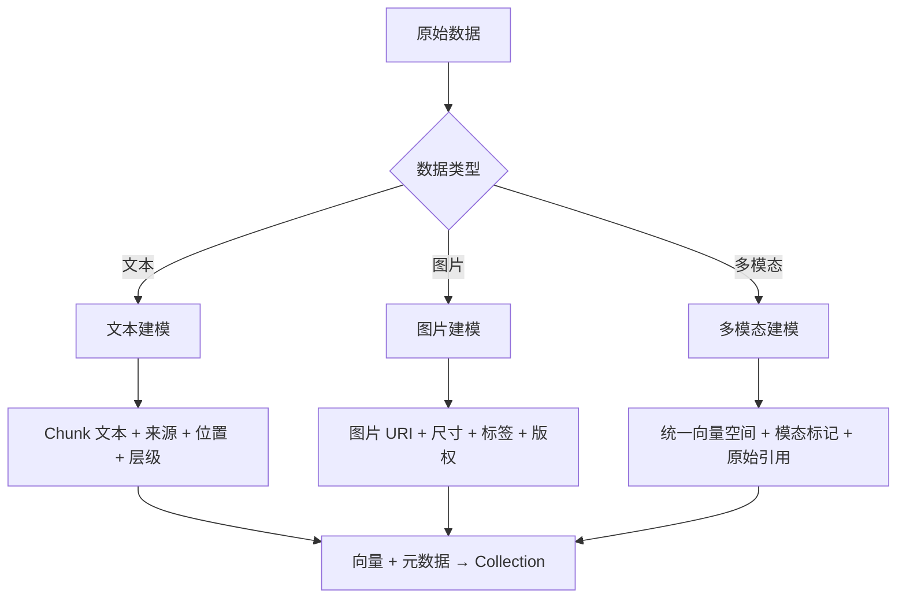
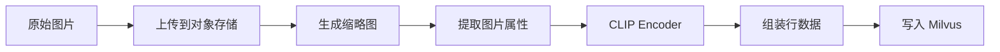
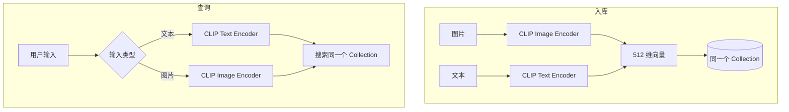
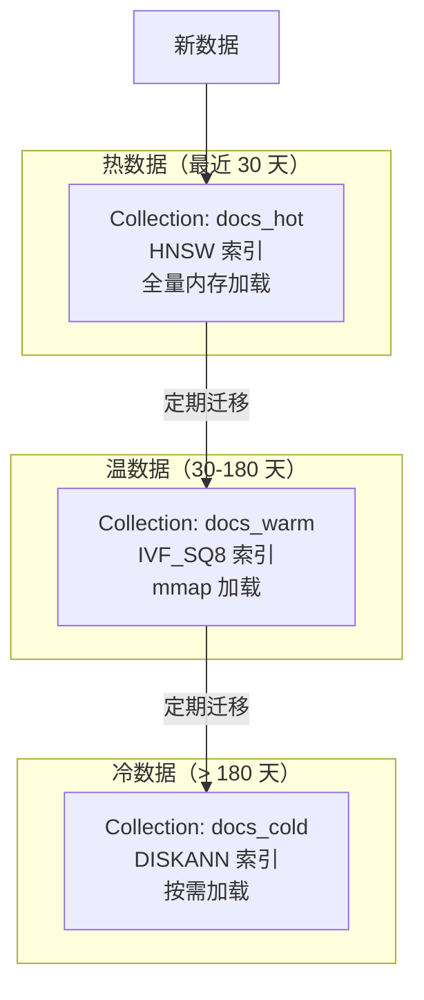

# 07 向量数据建模

## 学习目标

学完本章后，你应该能够：

- 针对文本、图片、多模态三种场景设计不同的数据模型。
- 合理规划元数据字段，支持过滤、追溯和展示。
- 设计时间字段支持数据新鲜度和 TTL 管理。
- 实现冷热数据分层策略。
- 处理数据入库前的清洗和标准化。

---

## 建模思路

向量数据建模的核心问题：**除了向量本身，还需要保存什么信息？**



建模的三层思考：
1. **检索层**：向量字段 + 过滤字段（决定搜什么、怎么缩小范围）
2. **展示层**：标题、摘要、URL（决定结果怎么呈现给用户）
3. **管理层**：时间戳、版本、租户、状态（决定数据怎么维护）

---

## 文本数据建模

文本是最常见的向量数据来源。建模重点是保留 Chunk 的上下文信息。

### Schema 设计

```python
from pymilvus import DataType, MilvusClient

schema = MilvusClient.create_schema(auto_id=False, enable_dynamic_field=False)

# 主键：来源+位置，保证幂等
schema.add_field(field_name="id", datatype=DataType.VARCHAR, is_primary=True, max_length=128)

# 检索层
schema.add_field(field_name="embedding", datatype=DataType.FLOAT_VECTOR, dim=768)

# 内容层
schema.add_field(field_name="text", datatype=DataType.VARCHAR, max_length=4096)
schema.add_field(field_name="title", datatype=DataType.VARCHAR, max_length=256)

# 追溯层
schema.add_field(field_name="source", datatype=DataType.VARCHAR, max_length=256)
schema.add_field(field_name="page", datatype=DataType.INT32)
schema.add_field(field_name="chunk_index", datatype=DataType.INT32)

# 过滤层
schema.add_field(field_name="category", datatype=DataType.VARCHAR, max_length=64)
schema.add_field(field_name="language", datatype=DataType.VARCHAR, max_length=8)

# 管理层
schema.add_field(field_name="created_at", datatype=DataType.INT64)
schema.add_field(field_name="model_version", datatype=DataType.VARCHAR, max_length=32)
```

### 文本入库流程


### 数据组装示例

```python
import hashlib
import time
from dataclasses import dataclass

@dataclass
class TextChunk:
    text: str
    source: str
    page: int
    chunk_index: int
    title: str = ""
    category: str = ""
    language: str = "zh"

def chunk_to_row(chunk: TextChunk, vector: list[float], model_version: str) -> dict:
    """将 Chunk 转换为 Milvus 行数据"""
    pk = hashlib.sha256(f"{chunk.source}:p{chunk.page}:c{chunk.chunk_index}".encode()).hexdigest()[:32]
    return {
        "id": pk,
        "text": chunk.text,
        "title": chunk.title,
        "source": chunk.source,
        "page": chunk.page,
        "chunk_index": chunk.chunk_index,
        "category": chunk.category,
        "language": chunk.language,
        "created_at": int(time.time()),
        "model_version": model_version,
        "embedding": vector,
    }
```

---

## 图片数据建模

图片建模的关键：**向量在 Milvus，原图在对象存储**。

### Schema 设计

```python
schema = MilvusClient.create_schema(auto_id=False, enable_dynamic_field=False)

schema.add_field(field_name="image_id", datatype=DataType.VARCHAR, is_primary=True, max_length=64)
schema.add_field(field_name="embedding", datatype=DataType.FLOAT_VECTOR, dim=512)

# 图片引用（不存原图）
schema.add_field(field_name="image_uri", datatype=DataType.VARCHAR, max_length=512)
schema.add_field(field_name="thumbnail_uri", datatype=DataType.VARCHAR, max_length=512)

# 图片属性
schema.add_field(field_name="width", datatype=DataType.INT32)
schema.add_field(field_name="height", datatype=DataType.INT32)
schema.add_field(field_name="format", datatype=DataType.VARCHAR, max_length=8)
schema.add_field(field_name="file_size_kb", datatype=DataType.INT32)

# 业务属性
schema.add_field(field_name="caption", datatype=DataType.VARCHAR, max_length=1024)
schema.add_field(field_name="category", datatype=DataType.VARCHAR, max_length=64)
schema.add_field(field_name="tags", datatype=DataType.JSON)

# 管理
schema.add_field(field_name="uploaded_at", datatype=DataType.INT64)
schema.add_field(field_name="uploader_id", datatype=DataType.VARCHAR, max_length=32)
```

### 图片入库流程



### 为什么不把图片存进 Milvus

| 方案 | 问题 |
|---|---|
| 图片 base64 存 VARCHAR | 单行过大、网络传输慢、搜索时不需要图片内容 |
| 图片存 Milvus | Milvus 不是文件存储，会拖慢所有操作 |
| **URI 引用（推荐）** | Milvus 只存向量和元数据，图片由 CDN/OSS 分发 |

---

## 多模态数据建模

多模态检索的前提：**不同模态的数据被映射到同一个向量空间**。

### 共享空间方案（CLIP 类模型）

```python
schema = MilvusClient.create_schema(auto_id=False, enable_dynamic_field=False)

schema.add_field(field_name="id", datatype=DataType.VARCHAR, is_primary=True, max_length=64)
schema.add_field(field_name="embedding", datatype=DataType.FLOAT_VECTOR, dim=512)

# 模态标记
schema.add_field(field_name="modality", datatype=DataType.VARCHAR, max_length=16)  # "image" / "text" / "video"

# 原始内容引用
schema.add_field(field_name="content_uri", datatype=DataType.VARCHAR, max_length=512)
schema.add_field(field_name="content_text", datatype=DataType.VARCHAR, max_length=2048)

# 通用元数据
schema.add_field(field_name="title", datatype=DataType.VARCHAR, max_length=256)
schema.add_field(field_name="source", datatype=DataType.VARCHAR, max_length=256)
schema.add_field(field_name="created_at", datatype=DataType.INT64)
```



### 独立空间方案（不同模型）

如果文本和图片使用不同的 Embedding 模型（向量空间不兼容），需要分开存储：

```python
# Collection 1: 文本向量
text_schema.add_field(field_name="text_embedding", datatype=DataType.FLOAT_VECTOR, dim=768)

# Collection 2: 图片向量
image_schema.add_field(field_name="image_embedding", datatype=DataType.FLOAT_VECTOR, dim=512)
```

查询时分别搜索，业务层合并结果。

---

## 元数据字段设计模式

### 必备元数据

无论什么场景，以下字段几乎总是需要的：

| 字段 | 类型 | 用途 |
|---|---|---|
| `source` | VARCHAR | 数据来源（文件名、URL、系统名） |
| `created_at` | INT64 | 入库时间戳（Unix 秒） |
| `model_version` | VARCHAR | 生成向量的模型标识 |

### 按场景扩展

**知识库 RAG：**
- `page`, `chunk_index`：定位原文位置
- `doc_id`：关联同一文档的所有 Chunk
- `heading`：所属章节标题

**电商搜索：**
- `brand`, `category_l1`, `category_l2`：分类过滤
- `price`, `rating`：范围过滤和排序
- `stock_status`：是否有货

**内容审核：**
- `risk_level`：风险等级
- `reviewer_id`：审核人
- `review_status`：审核状态

---

## 时间字段设计

时间字段支持数据新鲜度管理和 TTL 策略。

### 时间字段类型选择

```python
# 方案一：Unix 时间戳（推荐）
schema.add_field(field_name="created_at", datatype=DataType.INT64)
# 过滤：filter='created_at > 1700000000'

# 方案二：日期字符串
schema.add_field(field_name="date", datatype=DataType.VARCHAR, max_length=10)
# 过滤：filter='date >= "2024-01-01"'（字符串比较，需要固定格式）
```

推荐 INT64 时间戳：
- 范围查询高效（数值比较）
- 可建 STL_SORT 索引
- 无时区歧义

### 基于时间的数据管理

```python
import time

# 删除 30 天前的数据
threshold = int(time.time()) - 30 * 86400
client.delete(
    collection_name="articles",
    filter=f"created_at < {threshold}",
)

# 只搜索最近 7 天的数据
recent_threshold = int(time.time()) - 7 * 86400
results = client.search(
    ...,
    filter=f"created_at > {recent_threshold}",
)
```

---

## 冷热数据分层

当数据量增长，不是所有数据都需要同等的搜索性能。

### 分层策略



### 实现方式

**方式一：多 Collection + 应用层路由**

```python
def search_with_tiering(query_vector, time_range: str, top_k: int):
    if time_range == "recent":
        return client.search(collection_name="docs_hot", ...)
    elif time_range == "all":
        # 先搜热数据，不够再搜温数据
        hot_results = client.search(collection_name="docs_hot", ..., limit=top_k)
        if len(hot_results[0]) < top_k:
            warm_results = client.search(collection_name="docs_warm", ..., limit=top_k)
            return merge_results(hot_results, warm_results, top_k)
        return hot_results
```

**方式二：单 Collection + 时间过滤**

```python
# 简单场景：用时间过滤实现"优先搜索新数据"
recent = int(time.time()) - 7 * 86400
results = client.search(
    ...,
    filter=f"created_at > {recent}",
    limit=top_k,
)
```

### 冷热分层对比

| 方案 | 优点 | 缺点 | 适用场景 |
|---|---|---|---|
| 多 Collection | 索引类型可不同、资源隔离 | 管理复杂、迁移脚本 | 数据量大、性能要求高 |
| 单 Collection + 过滤 | 简单 | 冷数据仍占内存 | 数据量中等 |
| mmap | 降低内存占用 | 增加延迟 | 内存受限但不想分 Collection |

---

## 数据清洗与标准化

入库前的数据质量直接影响搜索质量。

### 文本清洗

```python
import re

def clean_text(text: str) -> str:
    """入库前文本标准化"""
    # 去除多余空白
    text = re.sub(r'\s+', ' ', text).strip()
    # 去除控制字符
    text = re.sub(r'[\x00-\x08\x0b\x0c\x0e-\x1f]', '', text)
    # 统一标点（可选）
    text = text.replace('　', ' ')
    return text

def validate_row(row: dict, dim: int) -> bool:
    """写入前校验"""
    if not row.get("text", "").strip():
        return False
    if len(row.get("embedding", [])) != dim:
        return False
    if len(row.get("id", "")) == 0:
        return False
    return True
```

### 去重策略

```python
def deduplicate_chunks(chunks: list[dict], threshold: float = 0.95) -> list[dict]:
    """基于内容 hash 去重（精确去重）"""
    seen = set()
    unique = []
    for chunk in chunks:
        content_hash = hashlib.md5(chunk["text"].encode()).hexdigest()
        if content_hash not in seen:
            seen.add(content_hash)
            unique.append(chunk)
    return unique
```

近似去重（语义去重）可以在入库后通过搜索自身来发现：如果一条数据搜索到的最近邻 score > 0.98 且不是自己，可能是重复数据。

---

## 完整建模案例：企业知识库

```python
from pymilvus import DataType, MilvusClient

def create_knowledge_base_collection(client: MilvusClient, name: str, dim: int):
    schema = MilvusClient.create_schema(auto_id=False, enable_dynamic_field=True)

    # 主键：source + page + chunk_index 的 hash
    schema.add_field(field_name="id", datatype=DataType.VARCHAR, is_primary=True, max_length=64)

    # 向量
    schema.add_field(field_name="embedding", datatype=DataType.FLOAT_VECTOR, dim=dim)

    # 内容
    schema.add_field(field_name="text", datatype=DataType.VARCHAR, max_length=4096)

    # 追溯
    schema.add_field(field_name="source", datatype=DataType.VARCHAR, max_length=256)
    schema.add_field(field_name="doc_id", datatype=DataType.VARCHAR, max_length=64)
    schema.add_field(field_name="page", datatype=DataType.INT32)
    schema.add_field(field_name="chunk_index", datatype=DataType.INT32)
    schema.add_field(field_name="heading", datatype=DataType.VARCHAR, max_length=256)

    # 过滤
    schema.add_field(field_name="department", datatype=DataType.VARCHAR, max_length=32, is_partition_key=True)
    schema.add_field(field_name="doc_type", datatype=DataType.VARCHAR, max_length=32)
    schema.add_field(field_name="created_at", datatype=DataType.INT64)

    # 管理
    schema.add_field(field_name="model_version", datatype=DataType.VARCHAR, max_length=32)

    # 索引
    index_params = MilvusClient.prepare_index_params()
    index_params.add_index(field_name="embedding", index_type="HNSW", metric_type="COSINE",
                           params={"M": 16, "efConstruction": 200})
    index_params.add_index(field_name="doc_type", index_type="INVERTED")
    index_params.add_index(field_name="created_at", index_type="STL_SORT")

    client.create_collection(collection_name=name, schema=schema, index_params=index_params)
    client.load_collection(name)
```

---

## 常见错误

| 现象 | 原因 | 修复 |
|---|---|---|
| 搜索结果无法追溯来源 | 缺少 source/page/chunk_index 字段 | 入库时保留完整位置信息 |
| 图片搜索返回后无法展示 | 没存 image_uri，或 URI 过期 | 使用持久化对象存储 URI |
| 多模态搜索结果混乱 | 不同模态用了不同模型，向量空间不兼容 | 确认使用同一多模态模型 |
| 数据更新后搜到旧结果 | 主键设计不支持 upsert | 用内容相关的确定性主键 |
| 冷数据占用大量内存 | 所有数据在同一个 Collection 且全量 load | 分层或开启 mmap |
| 入库后搜索质量差 | 文本未清洗，含大量噪声字符 | 入库前做文本标准化 |

---

## 面试题

1. **文本 Chunk 的主键应该怎么设计？为什么不用自增 ID？**
   用 source + page + chunk_index 的 hash。自增 ID 无法支持幂等 upsert，同一文档重新处理会产生重复数据。确定性主键保证相同内容多次写入结果一致。

2. **图片检索为什么不把原图存进 Milvus？**
   Milvus 是向量数据库，不是文件存储。原图存入会导致单行过大、网络传输慢、内存浪费。正确做法是图片存对象存储/CDN，Milvus 只存向量和 URI。

3. **多模态检索中，文本和图片必须用同一个模型吗？**
   如果要在同一个 Collection 中混合搜索（文搜图、图搜文），必须用同一个多模态模型（如 CLIP）保证向量空间一致。如果分开搜索再合并，可以用不同模型。

4. **model_version 字段有什么用？**
   模型升级时，可以通过 model_version 识别哪些数据需要重新编码。也可以用于灰度：新模型生成的向量写入新 Collection，通过版本标记控制流量切换。

5. **冷热分层的判断依据是什么？**
   通常按时间（最近 N 天为热数据）或访问频率。核心考量是：热数据需要低延迟（HNSW + 内存），冷数据可以接受较高延迟（DISKANN + mmap）换取更低成本。

---

## 练习题

1. **文本建模实战**：为一个技术博客搜索系统设计 Schema。要求支持：按作者过滤、按标签过滤、按发布时间排序、返回文章摘要和链接。写出完整的 Schema 定义和示例数据。

2. **图片建模实战**：为一个电商商品图片搜索设计 Schema。要求支持：按类别过滤、按价格范围过滤、返回商品标题和图片 URL。写入 10 张示例图片数据。

3. **去重实验**：向同一个 Collection 写入 100 条数据，其中故意包含 20 条重复内容。验证基于内容 hash 的主键是否能自动去重（upsert 后总数应为 80）。

4. **冷热分层模拟**：创建 hot 和 cold 两个 Collection，hot 用 HNSW，cold 用 IVF_FLAT。分别写入 1000 条数据，对比搜索延迟和内存占用。

---

## 小结

向量数据建模的核心是"向量负责找相似，元数据负责过滤和解释"。不同数据类型（文本、图片、多模态）的建模差异主要在元数据字段和入库流程上，向量搜索的逻辑是统一的。设计时要同时考虑检索、展示和管理三个维度，为未来的模型升级和数据增长留出演进空间。
