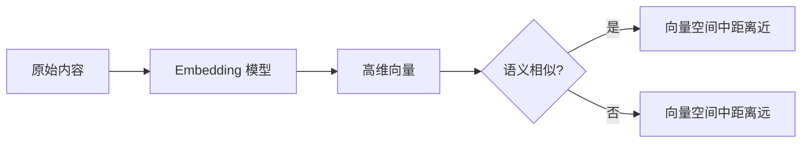
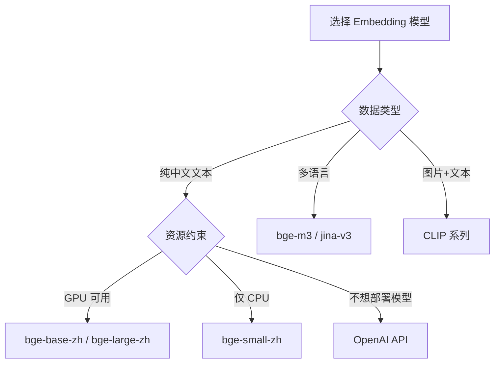
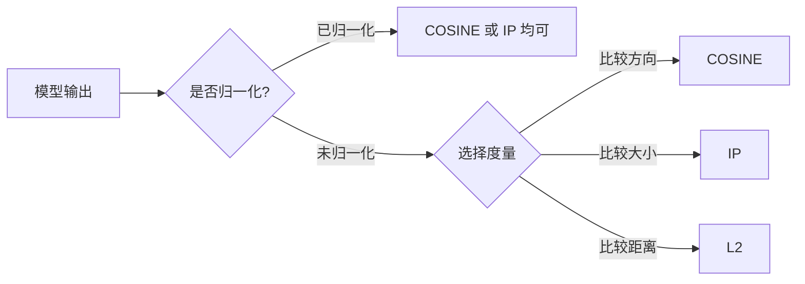
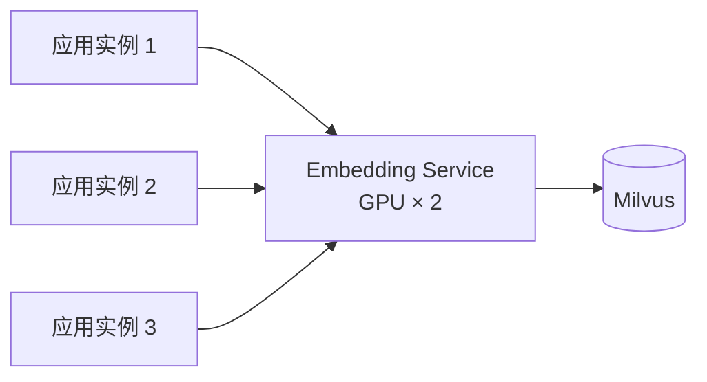
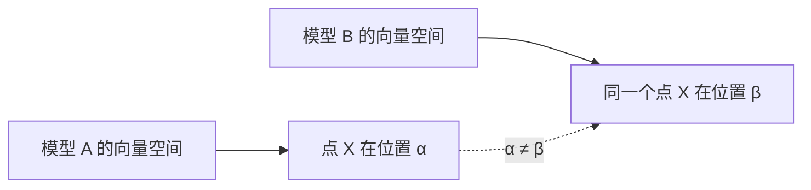
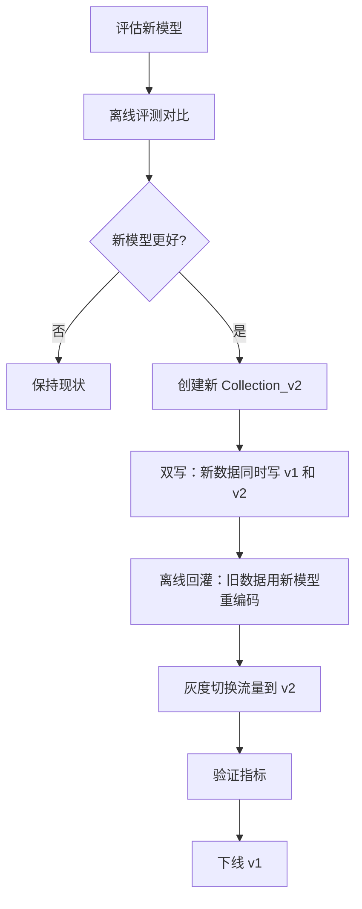

# 08 Embedding 模型详解

## 学习目标

学完本章后，你应该能够：

- 根据业务场景选择合适的 Embedding 模型。
- 理解归一化、度量类型与模型的匹配关系。
- 使用 sentence-transformers 和 OpenAI API 生成向量。
- 实现高效的批量编码流程。
- 制定模型升级和向量重建方案。

---

## Embedding 模型的作用

Embedding 模型是向量检索系统的"翻译器"——它决定了数据在向量空间中的位置关系。



关键认知：
- **模型决定搜索质量的上限**，索引和参数只能在这个上限内优化
- **同一系统必须用同一模型**，入库和查询用不同模型 = 搜索结果无意义
- **模型不是越大越好**，要在质量、速度、成本之间找平衡

---

## 模型选型指南

### 中文文本模型推荐

| 模型 | 维度 | 大小 | 中文质量 | 速度 | 适用场景 |
|---|---|---|---|---|---|
| `BAAI/bge-small-zh-v1.5` | 512 | ~90MB | 良好 | 快 | 资源受限、快速原型 |
| `BAAI/bge-base-zh-v1.5` | 768 | ~400MB | 优秀 | 中 | 通用中文检索 |
| `BAAI/bge-large-zh-v1.5` | 1024 | ~1.2GB | 很好 | 慢 | 高精度要求 |
| `BAAI/bge-m3` | 1024 | ~2GB | 优秀 | 慢 | 多语言、稀疏+稠密 |
| `jinaai/jina-embeddings-v3` | 1024 | ~2GB | 优秀 | 中 | 多语言、长文本 |

### API 模型

| 模型 | 维度 | 特点 | 价格参考 |
|---|---|---|---|
| OpenAI `text-embedding-3-small` | 1536 | 通用、多语言 | $0.02/1M tokens |
| OpenAI `text-embedding-3-large` | 3072 | 高精度 | $0.13/1M tokens |
| Cohere `embed-multilingual-v3.0` | 1024 | 多语言优秀 | $0.1/1M tokens |

### 多模态模型

| 模型 | 维度 | 支持模态 | 适用场景 |
|---|---|---|---|
| `openai/clip-vit-base-patch32` | 512 | 图片+文本 | 图文检索入门 |
| `openai/clip-vit-large-patch14` | 768 | 图片+文本 | 高质量图文检索 |
| `BAAI/bge-visualized` | 768 | 图片+文本 | 中文多模态 |

### 选型决策树



---

## 使用 sentence-transformers

sentence-transformers 是本地部署 Embedding 模型的首选库。

### 基本用法

```python
from sentence_transformers import SentenceTransformer

# 加载模型（首次会从 HuggingFace 下载）
model = SentenceTransformer("BAAI/bge-small-zh-v1.5")

# 获取模型维度
dim = model.get_sentence_embedding_dimension()
print(f"模型维度: {dim}")  # 512

# 单条编码
text = "Milvus 是高性能向量数据库"
vector = model.encode(text, normalize_embeddings=True)
print(f"向量形状: {vector.shape}")  # (512,)

# 批量编码
texts = ["文本一", "文本二", "文本三"]
vectors = model.encode(texts, normalize_embeddings=True)
print(f"批量形状: {vectors.shape}")  # (3, 512)
```

### 关键参数

```python
vectors = model.encode(
    texts,
    normalize_embeddings=True,  # 归一化为单位向量
    batch_size=64,              # 内部批大小（影响 GPU 利用率）
    show_progress_bar=True,     # 大量数据时显示进度
    convert_to_numpy=True,      # 返回 numpy 数组
    device="cuda",              # 指定设备（cuda/cpu/mps）
)
```

### BGE 模型的 query instruction

BGE 系列模型在查询时建议添加 instruction prefix：

```python
# 入库时：直接编码文档
doc_vectors = model.encode(documents, normalize_embeddings=True)

# 查询时：添加 instruction（提升检索质量）
query_with_instruction = "为这个句子生成表示以用于检索相关文章：" + query
query_vector = model.encode(query_with_instruction, normalize_embeddings=True)
```

注意：不是所有模型都需要 instruction，使用前查看模型文档。

---

## 使用 OpenAI API

适合不想本地部署模型的场景。

```python
from openai import OpenAI

client = OpenAI(
    api_key="your-api-key",
    base_url="https://api.openai.com/v1",  # 或兼容 API 地址
)

def embed_texts_openai(texts: list[str], model: str = "text-embedding-3-small") -> list[list[float]]:
    """使用 OpenAI API 生成向量"""
    response = client.embeddings.create(
        input=texts,
        model=model,
    )
    return [item.embedding for item in response.data]

# 使用
vectors = embed_texts_openai(["Milvus 向量数据库", "RAG 知识库"])
print(f"维度: {len(vectors[0])}")  # 1536
```

### OpenAI 兼容 API

很多模型服务提供 OpenAI 兼容接口（vLLM、Ollama、LocalAI）：

```python
client = OpenAI(
    api_key="not-needed",
    base_url="http://localhost:8080/v1",  # 本地服务
)
```

---

## 归一化与度量匹配

这是最容易出错的地方。模型、归一化和 metric_type 必须匹配。

### 三者关系



### 匹配规则

| 模型特性 | 推荐 metric_type | 说明 |
|---|---|---|
| 输出已归一化（如 BGE + `normalize_embeddings=True`） | `COSINE` 或 `IP` | 归一化后两者等价 |
| 输出未归一化 | `COSINE` | Milvus 内部会归一化后计算 |
| 模型训练用 L2 | `L2` | 少数模型，如部分图像特征 |

### 验证归一化

```python
import numpy as np

vector = model.encode("测试文本", normalize_embeddings=True)
norm = np.linalg.norm(vector)
print(f"向量范数: {norm:.6f}")  # 应该接近 1.0

# 如果不确定模型是否归一化，手动归一化
def normalize(v: np.ndarray) -> np.ndarray:
    norm = np.linalg.norm(v)
    return v / norm if norm > 0 else v
```

### 常见错误场景

| 错误 | 现象 | 修复 |
|---|---|---|
| 模型未归一化 + metric=IP | 长文本 score 偏高（向量范数大） | 改用 COSINE 或手动归一化 |
| 入库归一化 + 查询未归一化 | 结果不稳定 | 统一归一化策略 |
| 模型训练用 COSINE + metric=L2 | 排序与预期相反 | 改用 COSINE |

---

## 批量编码优化

大量数据入库时，Embedding 生成往往是瓶颈。

### CPU 批量编码

```python
import numpy as np
from sentence_transformers import SentenceTransformer

model = SentenceTransformer("BAAI/bge-small-zh-v1.5")

def batch_encode(
    model: SentenceTransformer,
    texts: list[str],
    batch_size: int = 128,
    normalize: bool = True,
) -> np.ndarray:
    """分批编码，控制内存峰值"""
    all_vectors = []
    for i in range(0, len(texts), batch_size):
        batch = texts[i : i + batch_size]
        vectors = model.encode(
            batch,
            normalize_embeddings=normalize,
            show_progress_bar=False,
        )
        all_vectors.append(vectors)
    return np.vstack(all_vectors)
```

### GPU 加速

```python
# 指定 GPU
model = SentenceTransformer("BAAI/bge-base-zh-v1.5", device="cuda")

# 多 GPU
from sentence_transformers import SentenceTransformer

model = SentenceTransformer("BAAI/bge-base-zh-v1.5")
pool = model.start_multi_process_pool(["cuda:0", "cuda:1"])
vectors = model.encode_multi_process(texts, pool, batch_size=256)
model.stop_multi_process_pool(pool)
```

### 编码性能参考

| 模型 | 设备 | batch_size | 吞吐量 (texts/s) |
|---|---|---|---|
| bge-small-zh | CPU (8 core) | 64 | ~200 |
| bge-small-zh | GPU (T4) | 256 | ~2000 |
| bge-base-zh | CPU (8 core) | 32 | ~80 |
| bge-base-zh | GPU (T4) | 128 | ~800 |
| bge-large-zh | GPU (T4) | 64 | ~300 |

### 编码服务化

生产环境建议把 Embedding 模型部署为独立服务，避免每个应用实例都加载模型：



可选方案：
- **TEI (Text Embeddings Inference)**：HuggingFace 官方，高性能
- **vLLM**：支持 embedding 模型
- **自建 FastAPI 服务**：灵活但需要自己处理并发和批处理

---

## 模型升级策略

模型升级是向量数据库最重的运维操作之一。

### 为什么不能原地替换



不同模型（甚至同一模型的不同版本）产生的向量空间不同。混合存储会导致搜索结果随机化。

### 升级流程



### 离线评测方法

```python
from sentence_transformers import SentenceTransformer
import numpy as np

def evaluate_model(model_name: str, queries: list[str], relevant_docs: dict[str, list[str]], corpus: list[str]):
    """评估模型的检索质量"""
    model = SentenceTransformer(model_name)

    corpus_vectors = model.encode(corpus, normalize_embeddings=True)
    query_vectors = model.encode(queries, normalize_embeddings=True)

    recall_at_5 = []
    for i, query in enumerate(queries):
        # 计算与所有文档的相似度
        scores = np.dot(corpus_vectors, query_vectors[i])
        top_indices = np.argsort(scores)[-5:][::-1]
        top_docs = [corpus[idx] for idx in top_indices]

        # 计算 Recall@5
        relevant = set(relevant_docs[query])
        hits = len(relevant & set(top_docs))
        recall_at_5.append(hits / len(relevant))

    return np.mean(recall_at_5)

# 对比两个模型
score_a = evaluate_model("BAAI/bge-small-zh-v1.5", queries, relevant_docs, corpus)
score_b = evaluate_model("BAAI/bge-base-zh-v1.5", queries, relevant_docs, corpus)
print(f"bge-small Recall@5: {score_a:.4f}")
print(f"bge-base  Recall@5: {score_b:.4f}")
```

---

## Embedding 服务封装

生产代码中建议封装统一的 Embedding 接口：

```python
from abc import ABC, abstractmethod
from typing import Protocol

class EmbeddingProvider(Protocol):
    @property
    def dim(self) -> int: ...
    def encode(self, texts: list[str]) -> list[list[float]]: ...


class LocalEmbedding:
    """本地 sentence-transformers 模型"""

    def __init__(self, model_name: str, device: str = "cpu"):
        from sentence_transformers import SentenceTransformer
        self._model = SentenceTransformer(model_name, device=device)
        self._dim = self._model.get_sentence_embedding_dimension()

    @property
    def dim(self) -> int:
        return self._dim

    def encode(self, texts: list[str]) -> list[list[float]]:
        vectors = self._model.encode(texts, normalize_embeddings=True)
        return vectors.astype("float32").tolist()


class OpenAIEmbedding:
    """OpenAI 兼容 API"""

    def __init__(self, api_key: str, base_url: str, model: str, dim: int):
        from openai import OpenAI
        self._client = OpenAI(api_key=api_key, base_url=base_url)
        self._model = model
        self._dim = dim

    @property
    def dim(self) -> int:
        return self._dim

    def encode(self, texts: list[str]) -> list[list[float]]:
        response = self._client.embeddings.create(input=texts, model=self._model)
        return [item.embedding for item in response.data]
```

---

## 常见错误

| 现象 | 原因 | 修复 |
|---|---|---|
| 中文搜索效果差 | 用了英文模型（如 all-MiniLM） | 换中文模型（bge-zh 系列） |
| score 全部接近 0.5 | 模型未归一化 + COSINE | 添加 `normalize_embeddings=True` |
| 查询和文档语义明显相关但 score 低 | 查询太短，信息量不足 | 添加 query instruction 或扩展查询 |
| 编码速度极慢 | CPU 编码大模型 | 用 GPU 或换小模型 |
| 内存不足 | 模型太大 + batch_size 太大 | 减小 batch_size 或用更小模型 |
| 模型下载失败 | HuggingFace 网络问题 | 设置 `HF_ENDPOINT=https://hf-mirror.com` |

---

## 面试题

1. **为什么 Embedding 模型比索引参数更影响搜索质量？**
   索引只是加速搜索过程，不改变向量空间的语义结构。如果模型把不相关的内容编码到相近位置，再好的索引也找不到正确结果。模型决定上限，索引决定效率。

2. **COSINE 和 IP 在什么条件下等价？**
   当所有向量都归一化为单位向量时，cos(a,b) = dot(a,b)。此时 COSINE 和 IP 的排序结果完全相同。

3. **为什么不建议用通用英文模型做中文检索？**
   通用英文模型的训练数据以英文为主，中文 token 覆盖不足，语义理解能力弱。专门的中文模型（如 BGE-zh）在中文语料上训练，对中文语义的捕捉更准确。

4. **批量编码时 batch_size 设多大合适？**
   取决于 GPU 显存和文本长度。经验值：GPU T4 (16GB) 上 bge-base 用 128-256，bge-large 用 32-64。太大会 OOM，太小浪费 GPU 并行能力。

5. **模型升级时为什么要双写而不是直接切换？**
   直接切换意味着新数据用新模型、旧数据用旧模型，向量空间不一致。双写保证新 Collection 中所有数据都用新模型编码，切换时数据完整。

---

## 练习题

1. **模型对比**：用 `bge-small-zh-v1.5` 和 `bge-base-zh-v1.5` 分别对 20 条中文文本编码，写入两个 Collection。用 5 个查询对比搜索结果排序差异。

2. **归一化实验**：对同一批文本，分别用 `normalize_embeddings=True` 和 `False` 编码，写入两个 Collection（一个用 COSINE，一个用 IP）。对比搜索结果是否一致。

3. **编码性能测试**：准备 1000 条中文文本，分别用 batch_size=16、64、128、256 编码，记录总耗时。画出 batch_size 与吞吐量的关系曲线。

4. **API vs 本地**：同一批文本分别用本地 bge-small 和 OpenAI text-embedding-3-small 编码，对比维度、编码速度和搜索结果质量。

---

## 小结

Embedding 模型是向量检索系统的基石。选型时权衡质量、速度和成本；使用时确保归一化和 metric_type 匹配；生产中封装统一接口，为模型升级留出灰度空间。记住：模型决定搜索质量的上限，后续所有优化都在这个上限内工作。
