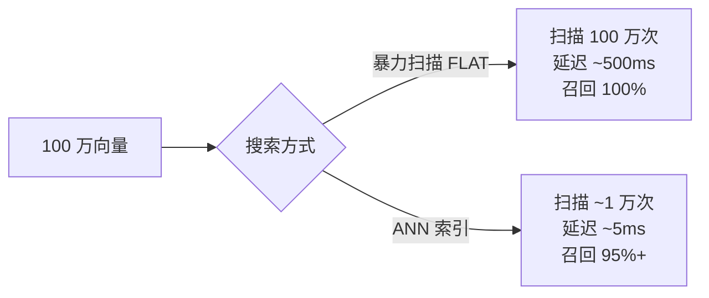
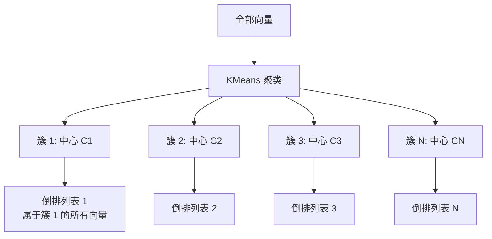
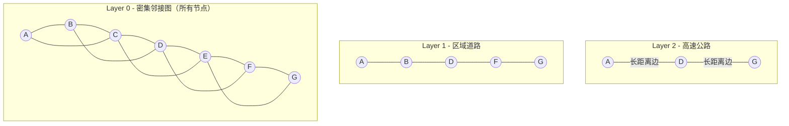
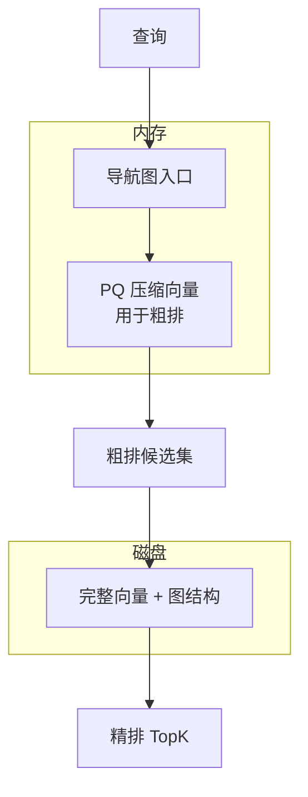
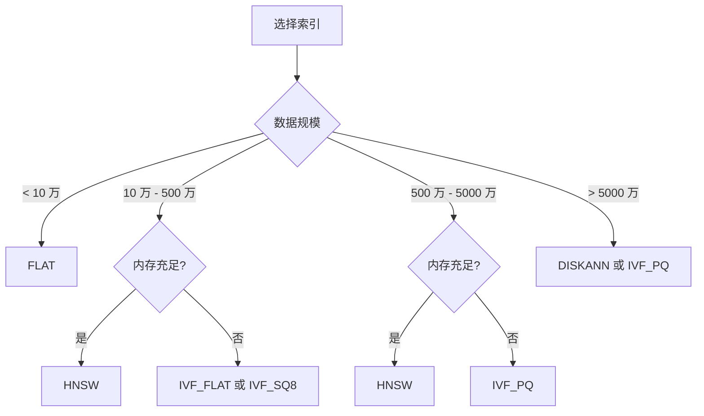

# 09 向量索引原理

## 学习目标

学完本章后，你应该能够：

- 解释 FLAT、IVF、HNSW、PQ、DISKANN 五大索引家族的核心思想。
- 画出每种索引的搜索路径和数据结构。
- 根据数据规模、内存预算和延迟要求选择索引。
- 理解索引参数如何影响召回率、QPS 和内存。
- 在 Milvus 中创建和切换不同索引。

---

## 索引的本质

向量索引的目标：**用可控的召回损失换取数量级的搜索加速**。



所有 ANN 索引都在回答同一个问题：**如何只看一小部分数据，就能大概率找到真正最近的 TopK？**

不同索引用不同策略回答这个问题：

| 索引 | 策略 | 类比 |
|---|---|---|
| IVF | 先分区，只搜最近的几个区 | 先确定城市区域，再找具体地址 |
| HNSW | 建多层图，从粗到细导航 | 先走高速公路，再走小路 |
| PQ | 压缩向量，用近似距离筛选 | 先看缩略图，再看原图 |
| DISKANN | 图索引放磁盘，按需加载 | 地图太大放硬盘，翻到哪页看哪页 |

---

## FLAT（暴力搜索）

FLAT 不是真正的索引，它保存原始向量，搜索时逐一计算距离。


### 特性

| 维度 | 表现 |
|---|---|
| 召回率 | 100%（精确搜索） |
| 搜索速度 | O(N)，随数据量线性增长 |
| 内存 | 仅原始向量，无额外开销 |
| 构建时间 | 无（不需要构建） |
| 适用规模 | < 10 万条 |

### 在 Milvus 中使用

```python
index_params.add_index(
    field_name="embedding",
    index_type="FLAT",
    metric_type="COSINE",
)
```

### 何时用 FLAT

- 数据量小（< 10 万），暴力扫描延迟可接受
- 需要 100% 召回率的评测基准
- 开发调试阶段，不想调索引参数

---

## IVF（倒排文件索引）

IVF 的核心思想：**先把向量空间聚成 nlist 个簇，搜索时只扫描最近的 nprobe 个簇**。

### 构建过程



### 搜索过程


### 参数详解

| 参数 | 阶段 | 作用 | 增大的影响 |
|---|---|---|---|
| `nlist` | 构建 | 聚类中心数量 | 每个列表更短，搜索更快，但边界效应增加 |
| `nprobe` | 搜索 | 探测的列表数量 | 召回更高，延迟更大 |

**nlist 经验值**：`nlist ≈ 4 × sqrt(N)`，N 为向量总数。100 万条 → nlist ≈ 4000。

**nprobe 与召回的关系**：

| nprobe / nlist | 典型召回率 | 说明 |
|---|---|---|
| 1% | 60-70% | 太低，不建议 |
| 5% | 85-90% | 可接受 |
| 10% | 92-96% | 推荐起点 |
| 20%+ | 97%+ | 接近暴力扫描 |

### IVF 变体

| 变体 | 区别 | 内存 | 精度 |
|---|---|---|---|
| `IVF_FLAT` | 列表中存原始向量 | 高 | 高 |
| `IVF_SQ8` | 列表中存 8bit 量化向量 | 低 ~25% | 略低 |
| `IVF_PQ` | 列表中存 PQ 编码 | 很低 | 较低 |

### 在 Milvus 中使用

```python
index_params.add_index(
    field_name="embedding",
    index_type="IVF_FLAT",
    metric_type="COSINE",
    params={"nlist": 1024},
)

# 搜索时
search_params = {
    "metric_type": "COSINE",
    "params": {"nprobe": 64},
}
```

---

## HNSW（分层可导航小世界图）

HNSW 是目前最流行的高性能索引。核心思想：**建一张多层图，高层稀疏用于快速接近目标，底层密集用于精细搜索**。

### 数据结构



### 搜索过程


### 参数详解

| 参数 | 阶段 | 作用 | 增大的影响 |
|---|---|---|---|
| `M` | 构建 | 每个节点的最大邻居数 | 图更密，召回更好，内存更高 |
| `efConstruction` | 构建 | 构建时的候选集大小 | 图质量更好，构建更慢 |
| `ef` | 搜索 | 搜索时的候选集大小 | 召回更高，延迟更大 |

**参数经验值**：

| 场景 | M | efConstruction | ef |
|---|---|---|---|
| 低延迟优先 | 8-12 | 100 | 32-64 |
| 平衡 | 16 | 200 | 64-128 |
| 高召回优先 | 32-48 | 400 | 128-256 |

**约束**：`ef >= limit`（TopK），否则候选集不够大。

### 内存估算

```
HNSW 内存 ≈ 原始向量 + 图结构
         = N × dim × 4B + N × M × 2 × 8B

示例（100 万条，768 维，M=16）：
= 1M × 768 × 4 + 1M × 16 × 2 × 8
= 2.87 GB + 0.24 GB
≈ 3.1 GB
```

### 在 Milvus 中使用

```python
index_params.add_index(
    field_name="embedding",
    index_type="HNSW",
    metric_type="COSINE",
    params={"M": 16, "efConstruction": 200},
)

# 搜索时
search_params = {
    "metric_type": "COSINE",
    "params": {"ef": 128},
}
```

---

## PQ（乘积量化）

PQ 的核心思想：**把高维向量切成多段，每段用码本近似表示，大幅压缩存储**。

### 编码过程


### 搜索过程

PQ 搜索不需要解码原始向量，而是用预计算的距离表快速估算近似距离：


### 参数详解

| 参数 | 作用 | 典型值 |
|---|---|---|
| `m` | 子空间数量 | dim 的因子，如 768 维用 96 或 192 |
| `nbits` | 每段编码位数 | 通常 8（256 个中心） |

### 压缩效果

| 原始大小 | PQ 编码 (m=96, nbits=8) | 压缩比 |
|---|---|---|
| 768 × 4B = 3072B | 96 × 1B = 96B | 32× |
| 1536 × 4B = 6144B | 192 × 1B = 192B | 32× |

### 代价

- 召回率下降（量化误差）
- 不适合小数据量（码本训练需要足够数据）
- 通常与 IVF 组合使用（IVF_PQ）

### 在 Milvus 中使用

```python
index_params.add_index(
    field_name="embedding",
    index_type="IVF_PQ",
    metric_type="L2",
    params={"nlist": 1024, "m": 96, "nbits": 8},
)
```

---

## DISKANN

DISKANN 把图索引存在磁盘上，只在内存中保留压缩的导航结构。适合超大规模、内存受限的场景。



### 特性

| 维度 | 表现 |
|---|---|
| 内存 | 极低（仅 PQ 编码 + 导航结构） |
| 延迟 | 中等（涉及磁盘 IO） |
| 召回率 | 中高（PQ 粗排 + 原始向量精排） |
| 适用规模 | > 1 亿条 |

### 在 Milvus 中使用

```python
index_params.add_index(
    field_name="embedding",
    index_type="DISKANN",
    metric_type="COSINE",
)

# 搜索时
search_params = {
    "metric_type": "COSINE",
    "params": {"search_list": 100},  # 候选集大小
}
```

---

## 索引选择决策



### 综合对比

| 索引 | 内存 | 构建速度 | 搜索速度 | 召回率 | 适用规模 |
|---|---|---|---|---|---|
| FLAT | 低 | 无需构建 | 慢 | 100% | < 10 万 |
| IVF_FLAT | 中 | 快 | 快 | 高 | 10 万 - 1000 万 |
| IVF_SQ8 | 较低 | 快 | 快 | 较高 | 10 万 - 1000 万 |
| HNSW | 高 | 中 | 很快 | 很高 | 10 万 - 5000 万 |
| IVF_PQ | 低 | 中 | 快 | 中 | > 1000 万 |
| DISKANN | 极低 | 慢 | 中 | 中高 | > 5000 万 |

### 选择原则

1. **默认选 HNSW**：大多数场景（< 2000 万条）HNSW 是最佳平衡
2. **内存不够选 IVF_SQ8 或 IVF_PQ**：用量化换内存
3. **超大规模选 DISKANN**：亿级数据的唯一选择
4. **需要精确结果选 FLAT**：评测基准或小数据量

---

## 索引构建与切换

### 查看当前索引

```python
info = client.describe_collection("articles")
for index in info.get("indexes", []):
    print(f"字段: {index['field_name']}, 类型: {index['index_type']}")
```

### 重建索引

Milvus 不支持原地修改索引参数。需要先删除再重建：

```python
# 释放 Collection
client.release_collection("articles")

# 删除旧索引
client.drop_index(collection_name="articles", index_name="embedding_idx")

# 创建新索引
index_params = MilvusClient.prepare_index_params()
index_params.add_index(
    field_name="embedding",
    index_name="embedding_idx",
    index_type="IVF_FLAT",
    metric_type="COSINE",
    params={"nlist": 2048},
)
client.create_index(collection_name="articles", index_params=index_params)

# 重新加载
client.load_collection("articles")
```

---

## 常见错误

| 现象 | 原因 | 修复 |
|---|---|---|
| HNSW 内存爆掉 | 数据量大 + M 值高 | 降低 M，或换 IVF/DISKANN |
| IVF 召回率低 | nprobe 太小 | 增大 nprobe，或增大 nlist |
| PQ 搜索结果差 | 数据量太少，码本训练不充分 | 数据 > 10 万条再用 PQ |
| 索引构建超时 | 数据量大 + efConstruction 高 | 降低 efConstruction，或增加 IndexNode 资源 |
| 搜索延迟不稳定 | ef/nprobe 设置过高 | 找到召回和延迟的平衡点 |
| DISKANN 延迟高 | 磁盘 IO 慢 | 使用 SSD，增大内存缓存 |

---

## 面试题

1. **HNSW 为什么比 IVF 搜索更快但内存更高？**
   HNSW 用多层图结构导航，实践中通常只访问远少于全量数据的节点，但不能把所有数据分布下的复杂度都简单保证为 O(log N)。它还需要为每个节点保存邻接关系；IVF 则通过聚类缩小候选列表，再扫描被选中的倒排列表。

2. **IVF 的 nlist 设太大或太小分别有什么问题？**
   太大：每个列表太短，边界效应严重（相近向量被分到不同簇），需要更大 nprobe 补偿。太小：每个列表太长，搜索退化为暴力扫描。

3. **PQ 为什么能压缩 32 倍但召回率只降几个点？**
   PQ 利用了向量各维度之间的统计独立性假设。子空间内用 256 个中心近似，误差在多个子空间累加后仍然可控。但对于维度间强相关的数据，PQ 效果会变差。

4. **为什么 ef 必须 >= limit（TopK）？**
   ef 是搜索时维护的候选集大小。如果 ef < limit，候选集装不下 TopK 个结果，返回数量会不足。

5. **什么场景下 FLAT 反而是最优选择？**
   数据量 < 10 万、需要 100% 召回率、或作为评测基准。此时 FLAT 的延迟可接受（< 50ms），且无需调参、无构建开销。

---

## 练习题

1. **索引对比实验**：准备 10 万条 768 维随机向量，分别用 FLAT、IVF_FLAT(nlist=256)、HNSW(M=16) 建索引。对比构建时间、内存占用和搜索延迟（固定 TopK=10）。

2. **nprobe 调优**：用 IVF_FLAT(nlist=1024) 索引 50 万条向量。nprobe 从 8、16、32、64、128、256 逐步增大，记录每个值的搜索延迟和召回率（以 FLAT 结果为基准）。画出 nprobe-recall 和 nprobe-latency 曲线。

3. **HNSW 参数实验**：固定 50 万条数据，分别用 M=8/16/32、efConstruction=100/200/400 的组合建索引。记录构建时间和内存。搜索时用 ef=64/128/256，记录延迟和召回率。

4. **PQ 压缩效果**：对比 IVF_FLAT 和 IVF_PQ 在 100 万条数据上的内存占用和召回率差异。

---

## 小结

向量索引是"用可控精度损失换取搜索加速"的工程工具。HNSW 是大多数场景的默认选择（高召回、低延迟、高内存），IVF 系列适合内存受限场景，PQ 和 DISKANN 面向超大规模。选择索引后，通过参数调优（ef、nprobe、M）在召回率和延迟之间找到业务可接受的平衡点。
