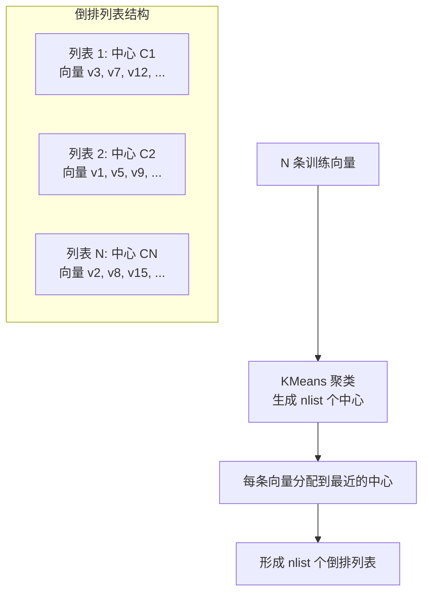
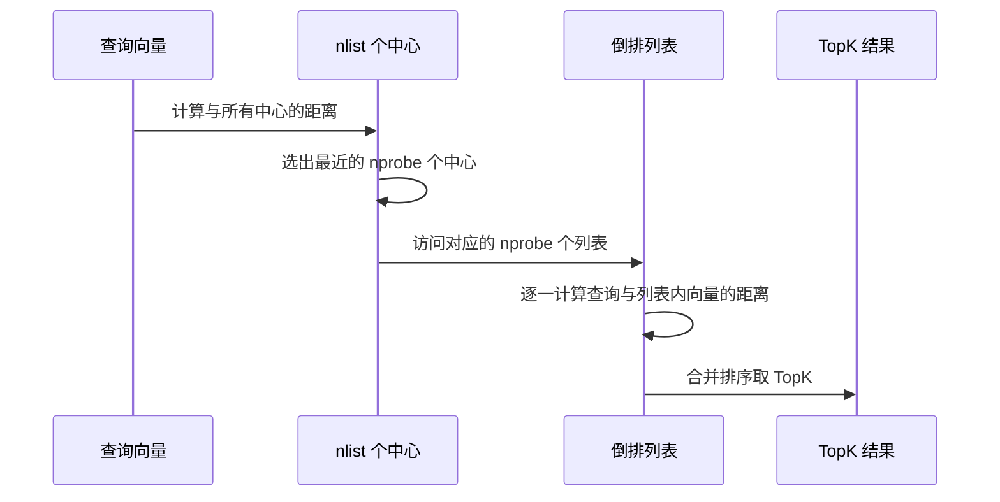

# 10 IVF 原理与实战

## 学习目标

学完本章后，你应该能够：

- 深入理解 IVF 的聚类训练、倒排列表和搜索流程。
- 掌握 nlist 和 nprobe 的调优方法论。
- 区分 IVF_FLAT、IVF_SQ8、IVF_PQ 的适用场景。
- 在 Milvus 中完成 IVF 索引的创建、搜索和参数调优。
- 评估 IVF 索引在不同数据规模下的表现。

---

## IVF 核心原理

IVF（Inverted File Index）借鉴了文本检索中倒排索引的思想：先对向量空间做聚类分区，搜索时只访问最相关的分区。

### 构建阶段



### 搜索阶段



### 时间复杂度分析

| 阶段 | 计算量 | 说明 |
|---|---|---|
| 找最近中心 | O(nlist × dim) | 与所有中心比较 |
| 扫描列表 | O(nprobe × N/nlist × dim) | 扫描 nprobe 个列表 |
| 总计 | O(nlist × dim + nprobe × N/nlist × dim) | 远小于暴力的 O(N × dim) |

当 nprobe << nlist 时，搜索量约为 `N × nprobe / nlist`，远小于全量 N。

---

## nlist 参数设计

nlist 决定了向量空间被切成多少个区域。

### nlist 与数据量的关系

| 数据量 N | 推荐 nlist | 每个列表平均大小 |
|---|---|---|
| 10 万 | 128-256 | 390-780 |
| 100 万 | 1024-4096 | 244-976 |
| 1000 万 | 4096-16384 | 610-2441 |
| 1 亿 | 16384-65536 | 1525-6103 |

**经验公式**：`nlist ≈ 4 × sqrt(N)`

### nlist 太大的问题


### nlist 太小的问题


---

## nprobe 参数调优

nprobe 是搜索时探测的列表数量，直接控制召回率和延迟的平衡。

### nprobe 调优实验框架

```python
import time
import numpy as np
from pymilvus import MilvusClient

def benchmark_nprobe(
    client: MilvusClient,
    collection_name: str,
    query_vectors: list[list[float]],
    nprobe_values: list[int],
    top_k: int = 10,
) -> list[dict]:
    """测试不同 nprobe 下的延迟"""
    results = []
    for nprobe in nprobe_values:
        latencies = []
        for qv in query_vectors:
            start = time.perf_counter()
            client.search(
                collection_name=collection_name,
                data=[qv],
                anns_field="embedding",
                search_params={"metric_type": "COSINE", "params": {"nprobe": nprobe}},
                limit=top_k,
            )
            latencies.append((time.perf_counter() - start) * 1000)

        results.append({
            "nprobe": nprobe,
            "p50_ms": np.percentile(latencies, 50),
            "p95_ms": np.percentile(latencies, 95),
            "p99_ms": np.percentile(latencies, 99),
        })
    return results
```

### 召回率评估

```python
def compute_recall(
    client: MilvusClient,
    collection_name: str,
    query_vectors: list[list[float]],
    ground_truth: list[list[str]],
    nprobe: int,
    top_k: int = 10,
) -> float:
    """计算 Recall@K（以 FLAT 结果为基准）"""
    hits = 0
    total = 0
    for qv, gt in zip(query_vectors, ground_truth):
        results = client.search(
            collection_name=collection_name,
            data=[qv],
            anns_field="embedding",
            search_params={"metric_type": "COSINE", "params": {"nprobe": nprobe}},
            limit=top_k,
        )
        retrieved_ids = {hit["id"] for hit in results[0]}
        gt_set = set(gt[:top_k])
        hits += len(retrieved_ids & gt_set)
        total += len(gt_set)
    return hits / total if total > 0 else 0.0
```

### 典型调优结果

以 100 万条 768 维向量、nlist=1024 为例：

| nprobe | Recall@10 | P50 延迟 | P95 延迟 |
|---|---|---|---|
| 8 | 72% | 2.1ms | 3.5ms |
| 16 | 83% | 3.2ms | 5.1ms |
| 32 | 91% | 5.4ms | 8.2ms |
| 64 | 95% | 9.8ms | 14.3ms |
| 128 | 98% | 18.5ms | 26.1ms |
| 256 | 99.2% | 35.2ms | 48.7ms |

---

## IVF 变体对比

### IVF_FLAT

倒排列表中存储原始 float32 向量。精度最高，内存最大。

```python
index_params.add_index(
    field_name="embedding",
    index_type="IVF_FLAT",
    metric_type="COSINE",
    params={"nlist": 1024},
)
```

### IVF_SQ8

倒排列表中存储 8bit 标量量化向量。每个 float32 压缩为 1 字节，内存降低约 75%。

```python
index_params.add_index(
    field_name="embedding",
    index_type="IVF_SQ8",
    metric_type="COSINE",
    params={"nlist": 1024},
)
```

### IVF_PQ

倒排列表中存储 PQ 编码。压缩比最高，但精度损失也最大。

```python
index_params.add_index(
    field_name="embedding",
    index_type="IVF_PQ",
    metric_type="L2",
    params={"nlist": 1024, "m": 96, "nbits": 8},
)
```

### 三者对比

| 变体 | 内存（100 万 × 768 维） | 召回率（nprobe=64） | 适用场景 |
|---|---|---|---|
| IVF_FLAT | ~2.9 GB | 95% | 精度优先 |
| IVF_SQ8 | ~0.75 GB | 93% | 内存受限，精度可接受 |
| IVF_PQ (m=96) | ~0.1 GB | 85% | 超大规模，成本优先 |

---

## 完整实战代码

```python
from pymilvus import DataType, MilvusClient
import numpy as np
import time

client = MilvusClient(uri="http://localhost:19530")
COLLECTION = "ivf_demo"
DIM = 768
N = 100_000

# 创建 Collection
if client.has_collection(COLLECTION):
    client.drop_collection(COLLECTION)

schema = MilvusClient.create_schema(auto_id=False)
schema.add_field(field_name="id", datatype=DataType.VARCHAR, is_primary=True, max_length=16)
schema.add_field(field_name="embedding", datatype=DataType.FLOAT_VECTOR, dim=DIM)

index_params = MilvusClient.prepare_index_params()
index_params.add_index(
    field_name="embedding",
    index_type="IVF_FLAT",
    metric_type="COSINE",
    params={"nlist": 512},
)

client.create_collection(collection_name=COLLECTION, schema=schema, index_params=index_params)

# 写入随机数据
batch_size = 5000
for i in range(0, N, batch_size):
    vectors = np.random.randn(batch_size, DIM).astype("float32")
    norms = np.linalg.norm(vectors, axis=1, keepdims=True)
    vectors = (vectors / norms).tolist()
    data = [{"id": str(i + j), "embedding": vectors[j]} for j in range(batch_size)]
    client.upsert(collection_name=COLLECTION, data=data)

client.load_collection(COLLECTION)
print(f"写入 {N} 条数据完成")

# 搜索测试
query = np.random.randn(DIM).astype("float32")
query = (query / np.linalg.norm(query)).tolist()

for nprobe in [8, 16, 32, 64, 128]:
    start = time.perf_counter()
    results = client.search(
        collection_name=COLLECTION,
        data=[query],
        anns_field="embedding",
        search_params={"metric_type": "COSINE", "params": {"nprobe": nprobe}},
        limit=10,
    )
    elapsed = (time.perf_counter() - start) * 1000
    top_score = results[0][0]["distance"] if results[0] else 0
    print(f"nprobe={nprobe:3d}  延迟={elapsed:.1f}ms  top1_score={top_score:.4f}")
```

---

## IVF 与 HNSW 的选择

| 维度 | IVF_FLAT | HNSW |
|---|---|---|
| 内存 | 低（仅原始向量 + 中心） | 高（原始向量 + 图结构） |
| 搜索延迟 | 中（取决于 nprobe） | 低（图导航高效） |
| 构建速度 | 快（KMeans 收敛快） | 中（逐条插入建图） |
| 召回率上限 | nprobe=nlist 时 100% | ef 足够大时接近 100% |
| 增量写入 | 新数据追加到最近列表 | 天然支持增量插入 |
| 适用场景 | 内存受限、数据量大 | 内存充足、低延迟要求 |

---

## 常见错误

| 现象 | 原因 | 修复 |
|---|---|---|
| 召回率很低 | nprobe 太小 | 逐步增大 nprobe 直到召回达标 |
| 构建索引很慢 | nlist 太大，KMeans 迭代多 | 减小 nlist 或增加训练数据采样 |
| 搜索延迟不稳定 | 列表大小不均匀 | 增大 nlist 使列表更均匀 |
| IVF_PQ 结果很差 | 数据量太少，码本训练不充分 | 数据 > 50 万再用 PQ |
| nprobe=nlist 仍然比 FLAT 慢 | 额外的中心距离计算开销 | 小数据量直接用 FLAT |

---

## 面试题

1. **IVF 的 nlist 设为 1 和设为 N 分别等价于什么？**
   nlist=1 等价于 FLAT（所有向量在一个列表）。nlist=N 等价于每个向量一个列表，搜索退化为只比较中心距离。

2. **为什么 IVF 的召回率有上限？**
   查询向量的真正最近邻可能不在最近的 nprobe 个簇中（边界效应）。只有 nprobe=nlist 时才能保证 100% 召回。

3. **IVF_SQ8 的量化误差如何影响搜索？**
   SQ8 把 float32 压缩为 uint8，距离计算有误差，可能导致排序微调，但对 TopK 影响通常 < 3% 召回损失。

4. **IVF 索引支持增量写入吗？**
   Milvus 中支持。新数据分配到最近的已有中心。但数据分布变化大时，旧聚类中心可能不再最优，需要重建索引。

5. **如何判断 nlist 是否合理？**
   观察各列表的大小分布。标准差很大说明 nlist 不匹配数据分布。

---

## 练习题

1. **nlist 实验**：固定 50 万条数据和 nprobe=32，分别用 nlist=128、512、1024、4096 建索引。记录构建时间、搜索延迟和召回率。

2. **变体对比**：同一批 100 万条数据，分别用 IVF_FLAT、IVF_SQ8、IVF_PQ 建索引。对比内存占用和搜索质量。

3. **nprobe 曲线**：画出 nprobe 从 1 到 nlist 的完整 recall-latency 曲线，找到拐点。

4. **与 HNSW 对比**：同一批数据分别用 IVF_FLAT(nlist=1024, nprobe=64) 和 HNSW(M=16, ef=128)，对比内存、延迟和召回率。

---

## 小结

IVF 是"分区搜索"思想的经典实现。nlist 控制分区粒度，nprobe 控制搜索范围。调优的核心是找到 nprobe 的"甜蜜点"——召回率达标且延迟可接受。IVF 的优势是内存效率高，劣势是需要调参且增量写入可能导致聚类退化。
