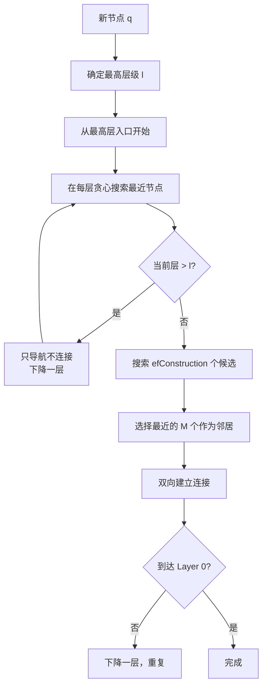
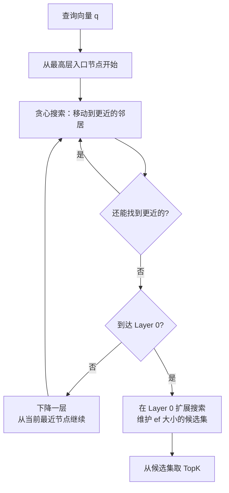

# 11 HNSW 原理与实战

## 学习目标

学完本章后，你应该能够：

- 理解 HNSW 的分层图结构和贪心搜索算法。
- 掌握 M、efConstruction、ef 三个参数的含义和调优。
- 分析 HNSW 的内存开销并做容量规划。
- 在 Milvus 中创建 HNSW 索引并进行性能调优。
- 判断 HNSW 适用和不适用的场景。

---

## HNSW 核心思想

HNSW（Hierarchical Navigable Small World）是一种基于图的 ANN 索引。核心思想：**构建多层图，高层稀疏用于快速跳跃，底层密集用于精细搜索**。

类比：从北京找到上海某条街道——先坐飞机到上海（高层），再坐地铁到区（中层），再步行到街道（底层）。

---

## 图结构详解

### 分层设计

```mermaid
flowchart TB
    subgraph SG_AUTO_1["Layer 3 - 最高层（极少节点）"]
        N1(("N1")) --- N5(("N5"))
    end

    subgraph SG_AUTO_2["Layer 2 - 高层（少量节点）"]
        N1a(("N1")) --- N3a(("N3")) --- N5a(("N5")) --- N8a(("N8"))
    end

    subgraph SG_AUTO_3["Layer 1 - 中层"]
        N1b(("N1")) --- N2b(("N2")) --- N3b(("N3")) --- N4b(("N4")) --- N5b(("N5")) --- N6b(("N6")) --- N7b(("N7")) --- N8b(("N8"))
    end

    subgraph SG_AUTO_4["Layer 0 - 底层（所有节点）"]
        direction LR
        N1c(("1")) --- N2c(("2")) --- N3c(("3")) --- N4c(("4")) --- N5c(("5")) --- N6c(("6")) --- N7c(("7")) --- N8c(("8")) --- N9c(("9")) --- N10c(("10"))
    end
```



**层级分配规则**：每个节点被分配到的最高层级由概率决定：

```
P(节点出现在第 l 层) = (1/mL)^l

其中 mL = 1/ln(M)
```

大多数节点只在 Layer 0，少数节点出现在高层，形成"跳表"式的层级结构。

### 每层的连接

- **Layer 0**：每个节点最多 `2×M` 个邻居（密集连接）
- **Layer > 0**：每个节点最多 `M` 个邻居（稀疏连接）

---

## 构建算法



### efConstruction 的作用

efConstruction 控制构建时搜索候选集的大小：
- 越大 → 找到的邻居质量越好 → 图结构越优 → 搜索时召回越高
- 越大 → 构建越慢

---

## 搜索算法



### ef 参数的作用

ef 是搜索时在 Layer 0 维护的候选集大小：
- `ef >= limit`（必须，否则结果不够）
- ef 越大 → 探索范围越广 → 召回越高 → 延迟越大

---

## 参数详解与调优

### 三大参数

| 参数 | 阶段 | 含义 | 范围 | 影响 |
|---|---|---|---|---|
| `M` | 构建 | 每个节点的邻居数上限 | 4-64 | 图密度、内存、召回 |
| `efConstruction` | 构建 | 构建时候选集大小 | 64-512 | 图质量、构建速度 |
| `ef` | 搜索 | 搜索时候选集大小 | limit ~ 512 | 召回率、搜索延迟 |

### M 的影响

```mermaid
flowchart LR
    subgraph M=8
        A1[内存低\n图稀疏\n搜索路径长\n召回较低]
    end
    subgraph M=16
        A2[内存中\n图适中\n平衡点]
    end
    subgraph M=32
        A3[内存高\n图密集\n搜索路径短\n召回高]
    end
```

| M | 内存开销（每节点） | 适用场景 |
|---|---|---|
| 8 | 128 字节 | 内存紧张，可接受较低召回 |
| 16 | 256 字节 | **默认推荐**，平衡点 |
| 32 | 512 字节 | 高召回要求 |
| 48-64 | 768-1024 字节 | 极高召回，内存充足 |

### efConstruction 的影响

| efConstruction | 构建速度 | 图质量 | 建议 |
|---|---|---|---|
| 64-100 | 快 | 一般 | 快速原型 |
| 128-200 | 中 | 好 | **生产默认** |
| 256-400 | 慢 | 很好 | 高精度要求 |
| 500+ | 很慢 | 边际收益递减 | 通常不必要 |

**经验**：`efConstruction >= 2 × M` 通常足够。

### ef 的影响

| ef | 召回率 | 延迟 | 说明 |
|---|---|---|---|
| = limit | 最低可接受 | 最快 | 候选集刚好够 |
| 2 × limit | 较好 | 快 | 常用起点 |
| 64-128 | 高 | 中 | **推荐范围** |
| 256+ | 很高 | 慢 | 高精度场景 |

**约束**：`ef >= limit`，否则返回结果数量不足。

---

## 内存估算

HNSW 的内存由两部分组成：原始向量 + 图结构。

### 计算公式

```
总内存 = 原始向量内存 + 图结构内存

原始向量 = N × dim × 4 字节（float32）
图结构 ≈ N × M × 2 × 2 × 4 字节
       = N × M × 16 字节
       （Layer 0 有 2M 个邻居，高层有 M 个，平均约 2M；每个邻居存 ID + offset）
```

### 实际估算表

| 数据量 | 维度 | M | 向量内存 | 图内存 | 总计 |
|---|---|---|---|---|---|
| 100 万 | 512 | 16 | 1.91 GB | 0.24 GB | ~2.15 GB |
| 100 万 | 768 | 16 | 2.87 GB | 0.24 GB | ~3.11 GB |
| 500 万 | 768 | 16 | 14.3 GB | 1.19 GB | ~15.5 GB |
| 1000 万 | 768 | 16 | 28.6 GB | 2.38 GB | ~31.0 GB |
| 1000 万 | 768 | 32 | 28.6 GB | 4.77 GB | ~33.4 GB |

### 容量规划建议

```python
def estimate_hnsw_memory_gb(n: int, dim: int, m: int) -> dict:
    """估算 HNSW 内存需求"""
    vector_bytes = n * dim * 4
    graph_bytes = n * m * 16
    total_bytes = vector_bytes + graph_bytes
    return {
        "vectors_gb": vector_bytes / (1024**3),
        "graph_gb": graph_bytes / (1024**3),
        "total_gb": total_bytes / (1024**3),
        "recommended_ram_gb": total_bytes / (1024**3) * 1.3,  # 留 30% 余量
    }

# 示例
print(estimate_hnsw_memory_gb(n=5_000_000, dim=768, m=16))
# {'vectors_gb': 14.3, 'graph_gb': 1.19, 'total_gb': 15.5, 'recommended_ram_gb': 20.1}
```

---

## 完整实战代码

```python
from pymilvus import DataType, MilvusClient
import numpy as np
import time

client = MilvusClient(uri="http://localhost:19530")
COLLECTION = "hnsw_demo"
DIM = 768
N = 100_000

# 创建 Collection + HNSW 索引
if client.has_collection(COLLECTION):
    client.drop_collection(COLLECTION)

schema = MilvusClient.create_schema(auto_id=False)
schema.add_field(field_name="id", datatype=DataType.VARCHAR, is_primary=True, max_length=16)
schema.add_field(field_name="embedding", datatype=DataType.FLOAT_VECTOR, dim=DIM)

index_params = MilvusClient.prepare_index_params()
index_params.add_index(
    field_name="embedding",
    index_type="HNSW",
    metric_type="COSINE",
    params={"M": 16, "efConstruction": 200},
)

client.create_collection(collection_name=COLLECTION, schema=schema, index_params=index_params)

# 写入数据
batch_size = 5000
for i in range(0, N, batch_size):
    vectors = np.random.randn(batch_size, DIM).astype("float32")
    norms = np.linalg.norm(vectors, axis=1, keepdims=True)
    vectors = (vectors / norms).tolist()
    data = [{"id": str(i + j), "embedding": vectors[j]} for j in range(batch_size)]
    client.upsert(collection_name=COLLECTION, data=data)

client.load_collection(COLLECTION)
print(f"写入 {N} 条，索引构建完成")

# ef 参数对比
query = np.random.randn(DIM).astype("float32")
query = (query / np.linalg.norm(query)).tolist()

print("\n--- ef 参数对比 ---")
for ef in [16, 32, 64, 128, 256]:
    latencies = []
    for _ in range(50):
        start = time.perf_counter()
        client.search(
            collection_name=COLLECTION,
            data=[query],
            anns_field="embedding",
            search_params={"metric_type": "COSINE", "params": {"ef": ef}},
            limit=10,
        )
        latencies.append((time.perf_counter() - start) * 1000)

    p50 = np.percentile(latencies, 50)
    p95 = np.percentile(latencies, 95)
    print(f"ef={ef:3d}  P50={p50:.2f}ms  P95={p95:.2f}ms")
```

---

## HNSW 的优势与局限

### 优势

1. **搜索速度快**：图导航复杂度 O(log N)，比 IVF 的线性扫描快
2. **召回率高**：ef 足够大时接近 100%
3. **天然支持增量**：新节点直接插入图中，无需重建
4. **无需训练**：不像 IVF 需要 KMeans 训练

### 局限

1. **内存高**：图结构额外占用 ~15-25% 内存
2. **构建慢**：逐条插入建图，比 IVF 的 KMeans 慢
3. **不支持 GPU 加速**：图遍历难以并行化
4. **删除效率低**：标记删除后图结构不会自动修复

### 何时不用 HNSW

- 数据量 > 5000 万且内存不足 → 用 IVF_PQ 或 DISKANN
- 需要极致压缩 → 用 PQ 系列
- 数据频繁大批量删除 → 定期重建索引

---

## HNSW vs IVF 性能对比

以 100 万条 768 维向量为例（同一硬件）：

| 指标 | HNSW (M=16, ef=128) | IVF_FLAT (nlist=1024, nprobe=64) |
|---|---|---|
| 内存 | ~3.1 GB | ~2.9 GB |
| 构建时间 | ~45s | ~15s |
| P50 延迟 | 2.5ms | 9.8ms |
| P95 延迟 | 4.2ms | 14.3ms |
| Recall@10 | 97% | 95% |

HNSW 在延迟上有明显优势，代价是更高的内存和构建时间。

---

## 生产调优建议

### 场景一：低延迟优先（在线搜索）

```python
# 构建参数
params={"M": 16, "efConstruction": 200}

# 搜索参数
search_params={"params": {"ef": 64}}  # ef 不要太大
```

### 场景二：高召回优先（离线评测）

```python
# 构建参数
params={"M": 32, "efConstruction": 400}

# 搜索参数
search_params={"params": {"ef": 256}}
```

### 场景三：内存受限

```python
# 降低 M 减少图结构内存
params={"M": 8, "efConstruction": 128}

# 或者考虑开启 mmap
# milvus.yaml: queryNode.mmap.enabled: true
```

---

## 常见错误

| 现象 | 原因 | 修复 |
|---|---|---|
| 搜索结果数量 < limit | ef < limit | 设置 ef >= limit |
| 召回率不够高 | ef 或 M 太小 | 增大 ef（优先）或重建索引增大 M |
| 构建索引超时 | efConstruction 太大 + 数据量大 | 降低 efConstruction 或增加资源 |
| 内存超出预期 | M 太大 | 降低 M 或用 mmap |
| 增量写入后召回下降 | 新数据的邻居连接质量不如批量构建 | 定期重建索引 |

---

## 面试题

1. **HNSW 为什么要分层？只用一层图行不行？**
   单层图搜索需要从随机入口开始，路径长。分层后高层稀疏图提供"快速跳跃"能力，大幅减少搜索步数。类似跳表对链表的加速。

2. **M 增大为什么能提高召回但增加内存？**
   M 越大，每个节点连接的邻居越多，图越密集，搜索时能探索到更多候选。但每个邻居指针都需要存储，内存线性增长。

3. **ef 和 efConstruction 的关系是什么？**
   efConstruction 决定图的质量上限（离线），ef 决定搜索的精度（在线）。ef 再大也无法弥补 efConstruction 太小导致的图质量差。通常 ef <= efConstruction。

4. **HNSW 支持删除吗？删除后会怎样？**
   Milvus 中支持标记删除。但删除后图中的边不会自动移除，可能导致搜索路径经过已删除节点。大量删除后建议重建索引。

5. **为什么 HNSW 不适合 GPU 加速？**
   HNSW 搜索是图遍历，每一步依赖上一步的结果（贪心导航），难以并行化。IVF 的列表扫描是独立的，更适合 GPU 的 SIMD 并行。

---

## 练习题

1. **M 参数实验**：固定 50 万条数据和 efConstruction=200，分别用 M=8、16、32、48 建索引。记录构建时间、内存占用。搜索时固定 ef=128，对比召回率。

2. **ef 调优曲线**：固定 M=16 的索引，ef 从 16 到 512 逐步增大，记录 P50/P95 延迟和 Recall@10。画出 ef-recall 和 ef-latency 双轴图。

3. **efConstruction 影响**：分别用 efConstruction=64、128、256、400 建索引（M=16），搜索时统一 ef=128。对比召回率差异，验证"efConstruction 决定图质量上限"。

4. **增量写入影响**：先用 50 万条数据建索引，再增量写入 50 万条。对比增量前后的搜索召回率，验证是否有退化。

---

## 小结

HNSW 是当前最流行的向量索引，适合大多数中等规模（< 2000 万条）且内存充足的场景。三个参数的调优优先级：先调 ef（在线，立即生效），再调 M 和 efConstruction（需要重建索引）。记住内存公式，做好容量规划，HNSW 就是最省心的选择。
