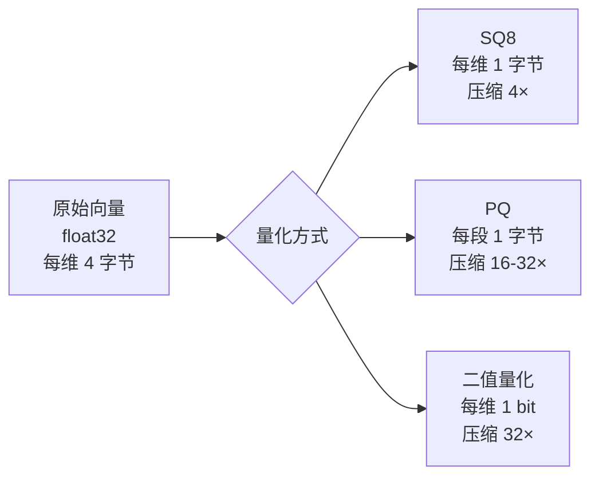
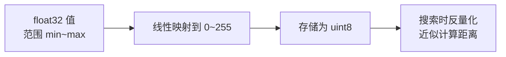
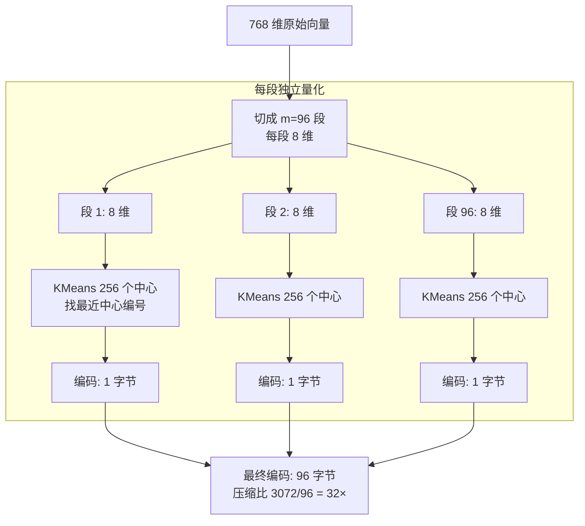
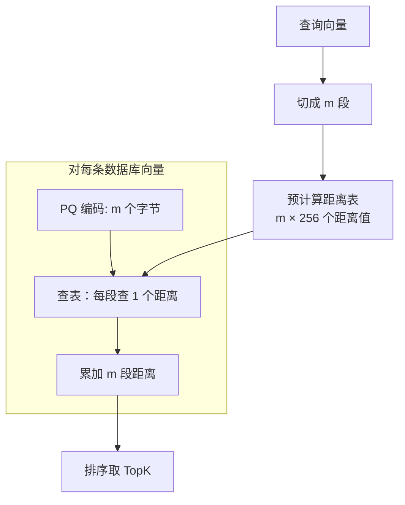
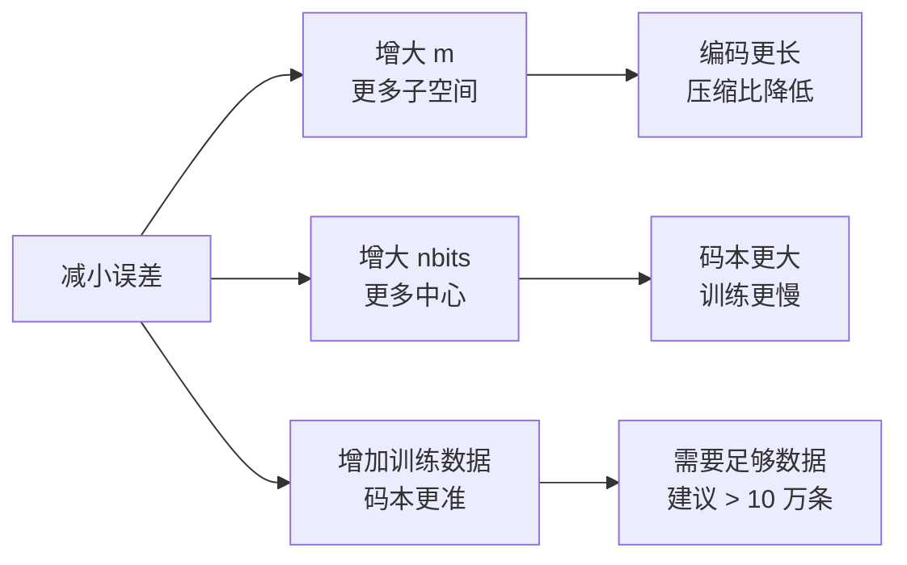
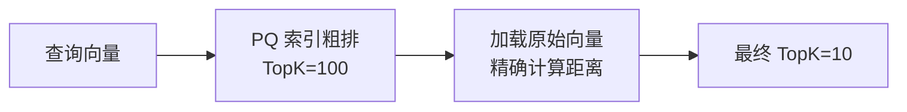

# 12 PQ 与量化压缩

## 学习目标

学完本章后，你应该能够：

- 理解 PQ（乘积量化）的编码原理和距离计算方式。
- 掌握 SQ（标量量化）的压缩机制。
- 计算不同量化方案的压缩比和内存节省。
- 在 Milvus 中使用 IVF_PQ、IVF_SQ8 和 SCANN 索引。
- 判断量化方案的适用场景和精度代价。

---

## 为什么需要量化

当数据量增长到千万甚至亿级，原始向量的内存开销变得不可承受：

```
1000 万条 × 768 维 × 4 字节 = 28.6 GB（仅原始向量）
1 亿条 × 768 维 × 4 字节 = 286 GB
```

量化的目标：**用更少的字节近似表示向量，大幅降低内存，代价是引入可控的精度损失**。



---

## SQ（标量量化）

SQ 是最简单的量化方式：把每个维度的 float32 值映射到更少的位数。

### SQ8 原理



对每个维度：
1. 统计该维度所有向量值的 min 和 max
2. 将 [min, max] 线性映射到 [0, 255]
3. 存储 1 字节整数

### SQ8 压缩效果

| 原始 | SQ8 | 压缩比 | 精度损失 |
|---|---|---|---|
| 768 × 4B = 3072B | 768 × 1B = 768B | 4× | 很小（< 2% 召回损失） |

### 在 Milvus 中使用

```python
index_params.add_index(
    field_name="embedding",
    index_type="IVF_SQ8",
    metric_type="COSINE",
    params={"nlist": 1024},
)
```

SQ8 的优势是实现简单、精度损失小，适合"想省内存但不想损失太多精度"的场景。

---

## PQ（乘积量化）

PQ 是更激进的压缩方案，压缩比可达 32× 甚至更高。

### 核心思想

将高维向量切成 m 个子向量，每个子向量独立用 K 个聚类中心近似表示。



### 训练阶段

1. 将所有向量切成 m 段
2. 对每段独立做 KMeans 聚类，生成 2^nbits 个中心（通常 256 个）
3. 得到 m 个码本（codebook），每个码本有 256 个中心向量

### 编码阶段

对每条向量：
1. 切成 m 段
2. 每段找到最近的中心编号（0-255）
3. 存储 m 个字节

### 搜索阶段（ADC - Asymmetric Distance Computation）



关键优化：查询向量不需要量化，只对数据库向量量化（非对称距离计算），精度更高。

### PQ 参数

| 参数 | 含义 | 约束 | 影响 |
|---|---|---|---|
| `m` | 子空间数量 | 必须整除 dim | m 越大，编码越长，精度越高 |
| `nbits` | 每段编码位数 | 通常 8 | 8 = 256 个中心，足够 |

### m 的选择

| dim | 推荐 m | 每段维度 | 编码大小 | 压缩比 |
|---|---|---|---|---|
| 128 | 16 或 32 | 8 或 4 | 16B 或 32B | 32× 或 16× |
| 512 | 64 | 8 | 64B | 32× |
| 768 | 96 或 192 | 8 或 4 | 96B 或 192B | 32× 或 16× |
| 1536 | 192 | 8 | 192B | 32× |

**经验**：每段 8 维（dim/m = 8）是精度和压缩的平衡点。每段 4 维压缩更强但精度更差。

---

## 量化误差分析

### 误差来源

PQ 的误差来自两个层面：
1. **子空间独立性假设**：PQ 假设各子空间独立，但实际向量维度间可能有相关性
2. **聚类近似**：每段只用 256 个中心表示，必然有量化残差

### 误差与参数的关系



### 精度损失参考

以 100 万条 768 维向量为例：

| 索引 | 内存 | Recall@10 (vs FLAT) | 说明 |
|---|---|---|---|
| FLAT | 2.87 GB | 100% | 基准 |
| IVF_FLAT (nprobe=64) | 2.87 GB | 95% | 无量化损失 |
| IVF_SQ8 (nprobe=64) | 0.72 GB | 93% | SQ8 损失小 |
| IVF_PQ (m=96, nprobe=64) | 0.09 GB | 82-87% | PQ 损失明显 |
| IVF_PQ (m=192, nprobe=128) | 0.18 GB | 88-92% | 增大 m 和 nprobe 补偿 |

---

## 在 Milvus 中使用量化索引

### IVF_PQ

```python
index_params.add_index(
    field_name="embedding",
    index_type="IVF_PQ",
    metric_type="L2",  # PQ 通常配合 L2
    params={
        "nlist": 1024,
        "m": 96,       # 子空间数
        "nbits": 8,    # 每段 8 bit
    },
)

# 搜索
search_params = {
    "metric_type": "L2",
    "params": {"nprobe": 64},
}
```

### SCANN（推荐替代 IVF_PQ）

Milvus 2.4+ 支持 SCANN 索引，它在 IVF_PQ 基础上增加了残差重排序，精度更高：

```python
index_params.add_index(
    field_name="embedding",
    index_type="SCANN",
    metric_type="COSINE",
    params={
        "nlist": 1024,
        "with_raw_data": True,  # 保留原始向量用于重排序
    },
)
```

---

## 量化方案对比

| 方案 | 压缩比 | 精度损失 | 内存（100 万 × 768 维） | 适用场景 |
|---|---|---|---|---|
| 无量化 (FLAT/HNSW) | 1× | 0 | 2.87 GB | 小规模、精度优先 |
| SQ8 | 4× | 很小 | 0.72 GB | 中等规模、平衡 |
| PQ (m=96) | 32× | 中等 | 0.09 GB | 大规模、成本优先 |
| PQ (m=192) | 16× | 较小 | 0.18 GB | 大规模、精度要求中等 |
| 二值量化 | 32× | 大 | 0.09 GB | 粗排、初筛 |

---

## 两阶段检索：PQ 粗排 + 精排

PQ 精度不够时，常用两阶段策略：



```python
# 第一阶段：PQ 粗排，召回更多候选
coarse_results = client.search(
    collection_name="large_collection",
    data=[query_vector],
    anns_field="embedding",
    search_params={"metric_type": "L2", "params": {"nprobe": 128}},
    limit=100,  # 多召回
    output_fields=["id"],
)

# 第二阶段：取回原始向量精排（如果 SCANN with_raw_data=True 则自动完成）
```

SCANN 索引内置了这个两阶段逻辑（`with_raw_data=True`），无需手动实现。

---

## 完整实战代码

```python
from pymilvus import DataType, MilvusClient
import numpy as np
import time

client = MilvusClient(uri="http://localhost:19530")
DIM = 768
N = 200_000

def create_and_test(index_type: str, index_params: dict, search_params: dict, name: str):
    """创建索引并测试"""
    collection = f"quantize_{name}"
    if client.has_collection(collection):
        client.drop_collection(collection)

    schema = MilvusClient.create_schema(auto_id=False)
    schema.add_field(field_name="id", datatype=DataType.VARCHAR, is_primary=True, max_length=16)
    schema.add_field(field_name="embedding", datatype=DataType.FLOAT_VECTOR, dim=DIM)

    idx_params = MilvusClient.prepare_index_params()
    idx_params.add_index(field_name="embedding", index_type=index_type, **index_params)

    client.create_collection(collection_name=collection, schema=schema, index_params=idx_params)

    # 写入数据
    batch_size = 5000
    for i in range(0, N, batch_size):
        vectors = np.random.randn(batch_size, DIM).astype("float32")
        norms = np.linalg.norm(vectors, axis=1, keepdims=True)
        vectors = (vectors / norms).tolist()
        data = [{"id": str(i + j), "embedding": vectors[j]} for j in range(batch_size)]
        client.upsert(collection_name=collection, data=data)

    client.load_collection(collection)

    # 搜索测试
    query = np.random.randn(DIM).astype("float32")
    query = (query / np.linalg.norm(query)).tolist()

    latencies = []
    for _ in range(100):
        start = time.perf_counter()
        client.search(
            collection_name=collection,
            data=[query],
            anns_field="embedding",
            search_params=search_params,
            limit=10,
        )
        latencies.append((time.perf_counter() - start) * 1000)

    print(f"{name:12s}  P50={np.percentile(latencies, 50):.2f}ms  P95={np.percentile(latencies, 95):.2f}ms")

# 对比测试
create_and_test("IVF_FLAT", {"metric_type": "COSINE", "params": {"nlist": 512}},
                {"metric_type": "COSINE", "params": {"nprobe": 32}}, "ivf_flat")

create_and_test("IVF_SQ8", {"metric_type": "COSINE", "params": {"nlist": 512}},
                {"metric_type": "COSINE", "params": {"nprobe": 32}}, "ivf_sq8")

create_and_test("IVF_PQ", {"metric_type": "L2", "params": {"nlist": 512, "m": 96, "nbits": 8}},
                {"metric_type": "L2", "params": {"nprobe": 32}}, "ivf_pq")
```

---

## 常见错误

| 现象 | 原因 | 修复 |
|---|---|---|
| IVF_PQ 召回率很低 | 数据量太少，码本训练不充分 | 数据 > 10 万条再用 PQ |
| `m` 参数报错 | m 不能整除 dim | 选择 dim 的因子（如 768 的因子：96, 192, 384） |
| PQ + COSINE 报错 | 部分版本 PQ 不支持 COSINE | 改用 L2 或 IP，或升级 Milvus |
| 量化后搜索结果完全错误 | metric_type 不匹配 | 确保索引和搜索的 metric_type 一致 |
| 内存没有明显下降 | 原始向量仍被加载（用于输出） | 减少 output_fields 中的大字段 |

---

## 面试题

1. **PQ 为什么能实现 32× 压缩？**
   768 维 float32 = 3072 字节。PQ 切成 96 段，每段用 1 字节编码 = 96 字节。3072/96 = 32×。本质是用 256 个聚类中心近似表示每段的连续空间。

2. **PQ 的"乘积"是什么意思？**
   "乘积"指子空间的笛卡尔积。m 个子空间各有 K 个中心，总共可以表示 K^m 种不同的向量（如 256^96 ≈ 10^231），远超实际数据量。

3. **SQ8 和 PQ 的本质区别是什么？**
   SQ8 是逐维度量化（每维独立压缩），保留了维度结构。PQ 是子空间量化（多维联合压缩），利用了维度间的局部相关性，压缩比更高但误差也更大。

4. **为什么 PQ 需要足够多的训练数据？**
   PQ 的码本通过 KMeans 训练。数据太少时聚类中心不具代表性，编码误差大。经验上需要 > 10 万条数据，且数据分布应与实际查询分布一致。

5. **SCANN 相比 IVF_PQ 的优势是什么？**
   SCANN 在 PQ 粗排后用原始向量做精排（rerank），显著提高召回率。相当于自动实现了两阶段检索，用户无需手动处理。

---

## 练习题

1. **压缩比计算**：计算 1000 万条 1536 维向量在 FLAT、SQ8、PQ(m=192) 下的内存占用。

2. **m 参数实验**：固定 100 万条 768 维数据，分别用 m=48、96、192、384 建 IVF_PQ 索引。对比内存和召回率。

3. **SQ8 vs PQ**：同一批数据分别用 IVF_SQ8 和 IVF_PQ(m=96)。对比内存节省和召回率损失，判断哪个更适合你的场景。

4. **SCANN 实验**：如果 Milvus 版本支持 SCANN，对比 SCANN(with_raw_data=True) 和 IVF_PQ 在相同数据上的召回率差异。

---

## 小结

量化是大规模向量检索的必备技术。SQ8 简单有效（4× 压缩，精度损失极小），PQ 压缩激进（32× 压缩，精度有损），SCANN 在 PQ 基础上加精排（兼顾压缩和精度）。选择量化方案时，先算内存预算，再评估可接受的召回损失，最后通过离线评测验证。
