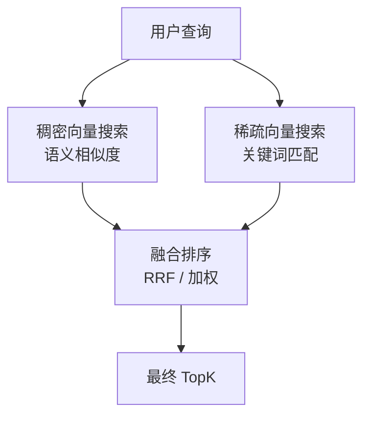
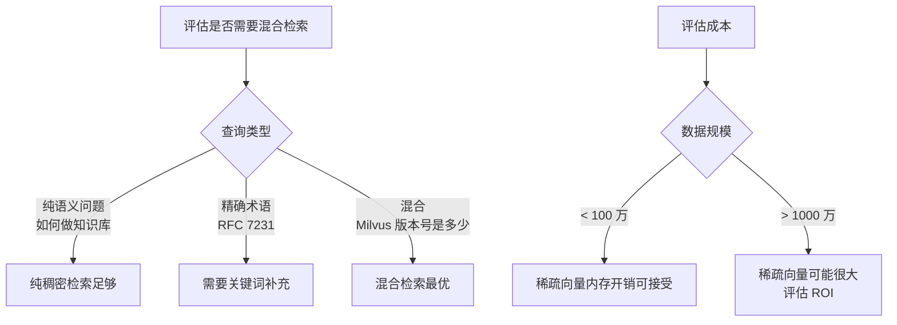

# 13 混合检索 HybridSearch

## 学习目标

学完本章后，你应该能够：

- 理解混合检索（语义 + 关键词）的动机和架构。
- 在 Milvus 中使用稀疏向量实现 BM25 风格的关键词检索。
- 使用 `hybrid_search` API 融合多路召回结果。
- 掌握 RRF 和加权融合两种排序策略。
- 判断何时需要混合检索、何时纯语义检索足够。

---

## 为什么需要混合检索

纯语义检索的局限：

| 场景 | 纯语义检索的问题 | 混合检索的优势 |
|---|---|---|
| 精确术语查询（"RFC 7231"） | 语义模型可能不认识专业编号 | 关键词精确匹配 |
| 新词/专有名词 | 模型训练数据中没有 | 关键词直接命中 |
| 短查询（"milvus 版本"） | 语义信息不足，召回不稳定 | 关键词补充召回 |
| 长尾查询 | 语义模型泛化能力有限 | 两路互补提高覆盖 |



---

## 稀疏向量与 BM25

### 什么是稀疏向量

稀疏向量的维度等于词表大小（通常几万到几十万），大部分维度为 0，只有文档中出现的词对应的维度有非零值（如 TF-IDF 或 BM25 权重）。

```python
# 稠密向量示例（768 维，所有维度有值）
dense = [0.12, -0.03, 0.88, 0.45, ...]  # 768 个 float

# 稀疏向量示例（词表 30000 维，只有几十个非零值）
sparse = {102: 2.3, 567: 1.8, 1024: 3.1, 8899: 0.9, ...}  # 词 ID: 权重
```

### 在 Milvus 中使用稀疏向量

Milvus 2.4+ 原生支持 `SPARSE_FLOAT_VECTOR` 类型：

```python
from pymilvus import DataType, MilvusClient

schema = MilvusClient.create_schema(auto_id=False)
schema.add_field(field_name="id", datatype=DataType.VARCHAR, is_primary=True, max_length=64)
schema.add_field(field_name="text", datatype=DataType.VARCHAR, max_length=4096)

# 稠密向量（语义）
schema.add_field(field_name="dense_embedding", datatype=DataType.FLOAT_VECTOR, dim=768)

# 稀疏向量（关键词）
schema.add_field(field_name="sparse_embedding", datatype=DataType.SPARSE_FLOAT_VECTOR)
```

### 生成稀疏向量

**方式一：使用 BM25 函数（Milvus 内置）**

Milvus 2.4+ 支持内置 BM25 函数，自动从文本生成稀疏向量：

```python
from pymilvus import Function, FunctionType

# 在 Schema 中添加 BM25 函数
bm25_function = Function(
    name="text_bm25",
    input_field_names=["text"],
    output_field_names=["sparse_embedding"],
    function_type=FunctionType.BM25,
)
schema.add_function(bm25_function)
```

**方式二：使用外部模型（如 BGE-M3）**

BGE-M3 同时输出稠密和稀疏向量：

```python
from FlagEmbedding import BGEM3FlagModel

model = BGEM3FlagModel("BAAI/bge-m3", use_fp16=True)

sentences = ["Milvus 是向量数据库", "支持混合检索"]
output = model.encode(sentences, return_dense=True, return_sparse=True)

dense_vectors = output["dense_vecs"]    # shape: (2, 1024)
sparse_vectors = output["lexical_weights"]  # list of dict
```

**方式三：手动 TF-IDF / BM25**

```python
from collections import Counter
import math
import jieba

def compute_sparse_vector(text: str, idf_dict: dict[str, float]) -> dict[int, float]:
    """简易 BM25 稀疏向量生成"""
    words = list(jieba.cut(text))
    tf = Counter(words)
    doc_len = len(words)
    avg_dl = 200  # 平均文档长度
    k1, b = 1.5, 0.75

    sparse = {}
    for word, count in tf.items():
        if word not in idf_dict:
            continue
        word_id = hash(word) % 100000  # 简化：hash 映射到固定维度
        tf_score = (count * (k1 + 1)) / (count + k1 * (1 - b + b * doc_len / avg_dl))
        sparse[word_id] = tf_score * idf_dict[word]
    return sparse
```

---

## 索引配置

稠密和稀疏向量需要分别建索引：

```python
index_params = MilvusClient.prepare_index_params()

# 稠密向量索引
index_params.add_index(
    field_name="dense_embedding",
    index_type="HNSW",
    metric_type="COSINE",
    params={"M": 16, "efConstruction": 200},
)

# 稀疏向量索引
index_params.add_index(
    field_name="sparse_embedding",
    index_type="SPARSE_INVERTED_INDEX",
    metric_type="IP",  # 稀疏向量用 IP
    params={"drop_ratio_build": 0.2},  # 构建时丢弃权重最低的 20% 词
)
```

### 稀疏索引参数

| 参数 | 含义 | 建议值 |
|---|---|---|
| `drop_ratio_build` | 构建时丢弃低权重词的比例 | 0.1-0.3 |
| `drop_ratio_search` | 搜索时丢弃低权重词的比例 | 0.0-0.2 |

---

## hybrid_search API

Milvus 提供 `hybrid_search` 方法，一次请求同时执行多路搜索并融合结果：

```python
from pymilvus import AnnSearchRequest, RRFRanker, WeightedRanker

# 定义稠密搜索请求
dense_req = AnnSearchRequest(
    data=[dense_query_vector],
    anns_field="dense_embedding",
    param={"metric_type": "COSINE", "params": {"ef": 128}},
    limit=20,
)

# 定义稀疏搜索请求
sparse_req = AnnSearchRequest(
    data=[sparse_query_vector],
    anns_field="sparse_embedding",
    param={"metric_type": "IP", "params": {"drop_ratio_search": 0.1}},
    limit=20,
)

# 执行混合搜索
results = client.hybrid_search(
    collection_name="hybrid_docs",
    reqs=[dense_req, sparse_req],
    ranker=RRFRanker(k=60),  # RRF 融合
    limit=10,
    output_fields=["text", "source"],
)
```

---

## 融合排序策略

### RRF（Reciprocal Rank Fusion）

RRF 不依赖分数的绝对值，只看排名：

```
RRF_score(doc) = Σ 1 / (k + rank_i(doc))
```

其中 `rank_i(doc)` 是文档在第 i 路搜索中的排名，k 是平滑参数（默认 60）。

```python
from pymilvus import RRFRanker

ranker = RRFRanker(k=60)  # k 越大，排名差异的影响越小
```

**优点**：不需要校准不同搜索路的分数，简单鲁棒。
**适用**：稠密和稀疏分数量纲不同时（推荐默认使用）。

### 加权融合（Weighted Ranker）

直接对分数加权求和：

```python
from pymilvus import WeightedRanker

# 稠密权重 0.7，稀疏权重 0.3
ranker = WeightedRanker(0.7, 0.3)
```

**注意**：要求各路分数在相同量纲。COSINE 分数在 [0,1]，IP 分数范围不固定，混用时需要归一化。

### 两种策略对比

| 策略 | 优点 | 缺点 | 适用场景 |
|---|---|---|---|
| RRF | 无需校准分数，鲁棒 | 无法精细控制权重 | 默认选择 |
| Weighted | 可精细调权重 | 需要分数归一化 | 分数量纲一致时 |

---

## 完整实战代码

```python
from pymilvus import (
    AnnSearchRequest, DataType, MilvusClient, RRFRanker,
)
import numpy as np

client = MilvusClient(uri="http://localhost:19530")
COLLECTION = "hybrid_demo"
DIM = 768

# 创建 Collection
if client.has_collection(COLLECTION):
    client.drop_collection(COLLECTION)

schema = MilvusClient.create_schema(auto_id=False, enable_dynamic_field=True)
schema.add_field(field_name="id", datatype=DataType.VARCHAR, is_primary=True, max_length=64)
schema.add_field(field_name="text", datatype=DataType.VARCHAR, max_length=2048)
schema.add_field(field_name="dense_embedding", datatype=DataType.FLOAT_VECTOR, dim=DIM)
schema.add_field(field_name="sparse_embedding", datatype=DataType.SPARSE_FLOAT_VECTOR)

index_params = MilvusClient.prepare_index_params()
index_params.add_index(field_name="dense_embedding", index_type="HNSW", metric_type="COSINE",
                       params={"M": 16, "efConstruction": 200})
index_params.add_index(field_name="sparse_embedding", index_type="SPARSE_INVERTED_INDEX",
                       metric_type="IP", params={"drop_ratio_build": 0.2})

client.create_collection(collection_name=COLLECTION, schema=schema, index_params=index_params)

# 写入示例数据
docs = [
    {"id": "1", "text": "Milvus 2.4 支持稀疏向量和混合检索"},
    {"id": "2", "text": "HNSW 是基于图的近似最近邻索引算法"},
    {"id": "3", "text": "BM25 是经典的关键词检索算法"},
    {"id": "4", "text": "RAG 系统结合向量检索和大语言模型"},
    {"id": "5", "text": "RFC 7231 定义了 HTTP 语义和内容协商"},
]

# 模拟生成向量（实际应用中用真实模型）
np.random.seed(42)
for doc in docs:
    doc["dense_embedding"] = np.random.randn(DIM).astype("float32").tolist()
    # 模拟稀疏向量：基于文本中的字符生成
    words = set(doc["text"])
    doc["sparse_embedding"] = {hash(w) % 50000: 1.0 + np.random.random() for w in words if w.strip()}

client.upsert(collection_name=COLLECTION, data=docs)
client.load_collection(COLLECTION)

# 混合搜索
query_dense = np.random.randn(DIM).astype("float32").tolist()
query_sparse = {hash("Milvus") % 50000: 2.0, hash("混合") % 50000: 1.5, hash("检索") % 50000: 1.8}

dense_req = AnnSearchRequest(
    data=[query_dense],
    anns_field="dense_embedding",
    param={"metric_type": "COSINE", "params": {"ef": 64}},
    limit=5,
)
sparse_req = AnnSearchRequest(
    data=[query_sparse],
    anns_field="sparse_embedding",
    param={"metric_type": "IP", "params": {}},
    limit=5,
)

results = client.hybrid_search(
    collection_name=COLLECTION,
    reqs=[dense_req, sparse_req],
    ranker=RRFRanker(k=60),
    limit=3,
    output_fields=["text"],
)

print("混合检索结果：")
for hit in results[0]:
    print(f"  id={hit['id']} score={hit['distance']:.4f} text={hit['entity']['text']}")
```

---

## 何时使用混合检索



### 不需要混合检索的场景

- 查询都是自然语言问题，无精确术语需求
- 数据量小，纯语义检索已经足够好
- 不想增加系统复杂度

### 需要混合检索的场景

- 用户会搜索编号、代码、专有名词
- 纯语义检索的 Recall 不达标
- 需要同时支持"模糊语义"和"精确匹配"

---

## 常见错误

| 现象 | 原因 | 修复 |
|---|---|---|
| 稀疏搜索无结果 | 查询词不在文档词表中 | 检查分词和词表覆盖 |
| 混合结果比纯稠密差 | 稀疏路引入噪声 | 调整 RRF 的 k 值或降低稀疏路权重 |
| 稀疏向量写入报错 | 格式不对（需要 dict 或 scipy sparse） | 确认格式为 `{dim_id: weight}` |
| 内存暴涨 | 稀疏向量词表太大 | 增大 `drop_ratio_build` 过滤低权重词 |
| WeightedRanker 结果异常 | 两路分数量纲不同 | 改用 RRFRanker 或先归一化分数 |

---

## 面试题

1. **混合检索为什么比纯语义检索效果好？**
   语义检索擅长理解意图但可能漏掉精确术语；关键词检索擅长精确匹配但不理解语义。两者互补，覆盖更多查询类型。

2. **RRF 为什么不需要校准分数？**
   RRF 只看排名不看分数绝对值。无论稠密分数是 0.9 还是稀疏分数是 15.3，只要排名靠前就贡献高。这避免了不同度量空间的分数不可比问题。

3. **稀疏向量的 `drop_ratio_build` 有什么作用？**
   过滤掉权重最低的词（通常是停用词或低频词），减少索引大小和搜索噪声。设为 0.2 表示丢弃权重最低的 20% 的词。

4. **BGE-M3 相比分别用两个模型有什么优势？**
   BGE-M3 一次推理同时输出稠密和稀疏向量，共享底层表示，语义一致性更好。分别用两个模型需要两次推理，且两个空间可能不协调。

5. **混合检索的额外成本是什么？**
   稀疏向量的存储和索引（可能很大）、额外的搜索计算、融合排序的延迟。需要评估这些成本是否值得召回率的提升。

---

## 练习题

1. **基础混合检索**：准备 100 条中文文档，分别用 bge-small-zh 生成稠密向量、jieba 分词 + TF-IDF 生成稀疏向量。对比纯稠密、纯稀疏和混合检索的结果。

2. **RRF 参数实验**：固定数据和查询，k 从 1、10、60、200 变化，观察融合结果排序的变化。

3. **权重调优**：使用 WeightedRanker，稠密权重从 0.3 到 0.9 变化（稀疏 = 1 - 稠密），找到最优权重比。

4. **精确术语测试**：构造 5 个包含精确编号/术语的查询，对比纯语义和混合检索的命中率。

---

## 小结

混合检索通过融合语义搜索和关键词搜索，解决了纯语义检索在精确术语和短查询上的不足。Milvus 原生支持稀疏向量和 `hybrid_search` API，RRF 是默认推荐的融合策略。是否使用混合检索取决于业务查询类型——如果用户经常搜索精确术语或编号，混合检索的收益明显。
