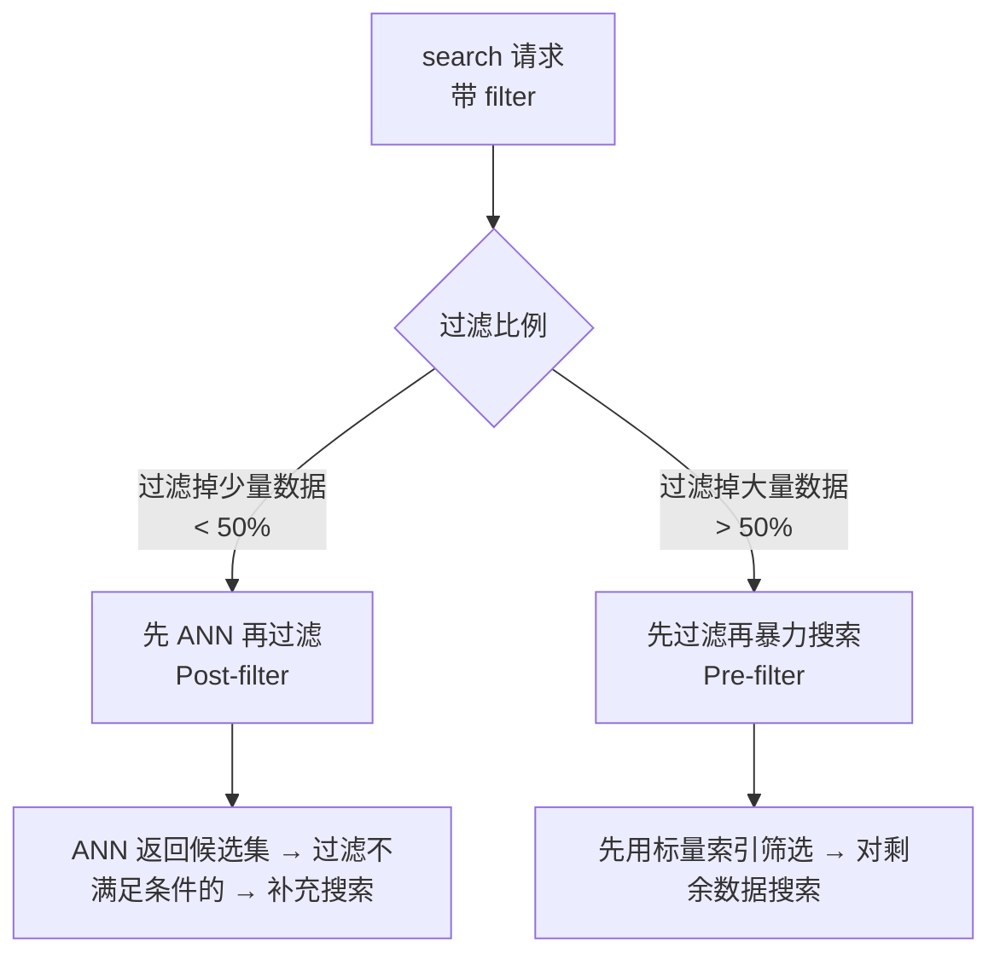

# 14 标量过滤 ScalarFilter

## 学习目标

学完本章后，你应该能够：

- 掌握 Milvus 过滤表达式的完整语法。
- 理解过滤在搜索流程中的执行位置和性能影响。
- 为高频过滤字段创建标量索引。
- 处理高过滤比例场景的性能问题。
- 结合 Partition Key 实现高效数据隔离。

---

## 过滤在搜索中的位置

标量过滤与向量搜索结合时，Milvus 内部有两种执行策略：



Milvus 会自动选择策略，但理解这个机制有助于优化：
- **过滤比例低**（大部分数据满足条件）：ANN 索引正常工作，过滤只是后置筛选
- **过滤比例高**（大部分数据被过滤掉）：ANN 索引效率下降，可能退化为暴力扫描

---

## 过滤表达式语法

### 比较运算符

```python
# 等于
filter='status == "active"'

# 不等于
filter='status != "deleted"'

# 大于 / 大于等于
filter='price > 100'
filter='price >= 100'

# 小于 / 小于等于
filter='created_at < 1700000000'
filter='rating <= 4.5'
```

### 逻辑运算符

```python
# AND
filter='category == "electronics" and price < 500'

# OR
filter='brand == "Apple" or brand == "Samsung"'

# NOT
filter='not (status == "deleted")'

# 复合条件（注意括号）
filter='(category == "phone" or category == "tablet") and price >= 200 and rating > 4.0'
```

### IN 运算符

```python
# 值在列表中
filter='category in ["electronics", "clothing", "food"]'

# 值不在列表中（用 not + in）
filter='not (status in ["deleted", "archived"])'
```

### LIKE 运算符（前缀匹配）

```python
# 前缀匹配
filter='title like "Milvus%"'

# 注意：Milvus 的 LIKE 只支持前缀匹配（%在末尾）
# 不支持：'title like "%milvus"'（后缀）
# 不支持：'title like "%mil%"'（中间匹配）
```

### JSON 字段过滤

```python
# 访问 JSON 字段的键
filter='metadata["author"] == "张三"'

# 嵌套访问
filter='metadata["tags"]["level"] == "advanced"'

# JSON 数组中的值
filter='json_contains(metadata["categories"], "AI")'
```

### ARRAY 字段过滤

```python
# 数组包含某个值
filter='array_contains(tags, "milvus")'

# 数组包含任意一个
filter='array_contains_any(tags, ["milvus", "vector"])'

# 数组包含所有
filter='array_contains_all(tags, ["milvus", "search"])'

# 数组长度
filter='array_length(tags) >= 2'
```

### 范围查询

```python
# 时间范围
filter='created_at >= 1700000000 and created_at < 1703000000'

# 价格区间
filter='price >= 100 and price <= 500'
```

---

## 标量索引

标量索引加速过滤操作，类似关系数据库的索引。

### 索引类型

| 索引类型 | 适用字段类型 | 适用操作 | 说明 |
|---|---|---|---|
| `INVERTED` | VARCHAR, INT, FLOAT, BOOL | ==, !=, in, 范围 | **通用推荐** |
| `STL_SORT` | INT, FLOAT | 范围查询 | 排序索引，范围查询更快 |

### 创建标量索引

```python
index_params = MilvusClient.prepare_index_params()

# 向量索引
index_params.add_index(field_name="embedding", index_type="HNSW", metric_type="COSINE",
                       params={"M": 16, "efConstruction": 200})

# 标量索引
index_params.add_index(field_name="category", index_type="INVERTED")
index_params.add_index(field_name="brand", index_type="INVERTED")
index_params.add_index(field_name="status", index_type="INVERTED")
index_params.add_index(field_name="price", index_type="STL_SORT")
index_params.add_index(field_name="created_at", index_type="STL_SORT")
```

### 哪些字段需要索引

| 应该建索引 | 不需要建索引 |
|---|---|
| 高频过滤字段（category, tenant_id） | 只用于展示的字段（title, description） |
| 范围查询字段（price, created_at） | 很少用于过滤的字段 |
| 高基数字段（user_id） | 低基数且数据量小的字段 |

---

## 过滤性能优化

### 问题：高过滤比例

当 filter 过滤掉 > 90% 的数据时，搜索性能可能急剧下降：


### 解决方案

**方案一：使用 Partition Key**

把高频过滤维度设为 Partition Key，物理隔离数据：

```python
schema.add_field(
    field_name="tenant_id",
    datatype=DataType.VARCHAR,
    max_length=32,
    is_partition_key=True,
)

# 搜索时自动路由到对应分区
results = client.search(
    ...,
    filter='tenant_id == "tenant_abc"',
)
```

**方案二：拆分 Collection**

极端情况下，按过滤维度拆成多个 Collection：

```python
# 每个类别一个 Collection
collections = {
    "electronics": "products_electronics",
    "clothing": "products_clothing",
    "food": "products_food",
}

# 搜索时直接搜对应 Collection
results = client.search(collection_name=collections[category], ...)
```

**方案三：增大搜索候选集**

```python
# 增大 ef/nprobe 补偿过滤损失
search_params = {"params": {"ef": 256}}  # 比正常大 2-4 倍
```

### 方案对比

| 方案 | 适用场景 | 优点 | 缺点 |
|---|---|---|---|
| Partition Key | 过滤维度固定、值有限 | 自动路由、性能好 | 分区数有上限 |
| 拆分 Collection | 类别少、数据量大 | 完全隔离 | 管理复杂 |
| 增大候选集 | 临时方案 | 简单 | 延迟增加 |
| 标量索引 | 通用 | 加速过滤 | 高过滤比例时仍有瓶颈 |

---

## 实战：电商商品搜索

```python
from pymilvus import DataType, MilvusClient
import numpy as np

client = MilvusClient(uri="http://localhost:19530")
COLLECTION = "product_search"
DIM = 768

if client.has_collection(COLLECTION):
    client.drop_collection(COLLECTION)

# Schema 设计
schema = MilvusClient.create_schema(auto_id=False)
schema.add_field(field_name="sku_id", datatype=DataType.VARCHAR, is_primary=True, max_length=32)
schema.add_field(field_name="title", datatype=DataType.VARCHAR, max_length=256)
schema.add_field(field_name="category", datatype=DataType.VARCHAR, max_length=32)
schema.add_field(field_name="brand", datatype=DataType.VARCHAR, max_length=64)
schema.add_field(field_name="price", datatype=DataType.FLOAT)
schema.add_field(field_name="rating", datatype=DataType.FLOAT)
schema.add_field(field_name="in_stock", datatype=DataType.BOOL)
schema.add_field(field_name="embedding", datatype=DataType.FLOAT_VECTOR, dim=DIM)

# 索引
index_params = MilvusClient.prepare_index_params()
index_params.add_index(field_name="embedding", index_type="HNSW", metric_type="COSINE",
                       params={"M": 16, "efConstruction": 200})
index_params.add_index(field_name="category", index_type="INVERTED")
index_params.add_index(field_name="brand", index_type="INVERTED")
index_params.add_index(field_name="price", index_type="STL_SORT")
index_params.add_index(field_name="in_stock", index_type="INVERTED")

client.create_collection(collection_name=COLLECTION, schema=schema, index_params=index_params)

# 写入示例数据
products = [
    {"sku_id": "SKU001", "title": "iPhone 15 Pro", "category": "phone", "brand": "Apple",
     "price": 7999.0, "rating": 4.8, "in_stock": True},
    {"sku_id": "SKU002", "title": "Galaxy S24", "category": "phone", "brand": "Samsung",
     "price": 5999.0, "rating": 4.6, "in_stock": True},
    {"sku_id": "SKU003", "title": "MacBook Air M3", "category": "laptop", "brand": "Apple",
     "price": 8999.0, "rating": 4.9, "in_stock": False},
    {"sku_id": "SKU004", "title": "ThinkPad X1", "category": "laptop", "brand": "Lenovo",
     "price": 9999.0, "rating": 4.5, "in_stock": True},
]

for p in products:
    p["embedding"] = np.random.randn(DIM).astype("float32").tolist()

client.upsert(collection_name=COLLECTION, data=products)
client.load_collection(COLLECTION)

# 搜索：有货的手机，价格 < 8000
query_vector = np.random.randn(DIM).astype("float32").tolist()
results = client.search(
    collection_name=COLLECTION,
    data=[query_vector],
    anns_field="embedding",
    search_params={"metric_type": "COSINE", "params": {"ef": 64}},
    limit=5,
    filter='category == "phone" and price < 8000 and in_stock == true',
    output_fields=["title", "brand", "price"],
)

for hit in results[0]:
    e = hit["entity"]
    print(f"{e['title']} - {e['brand']} - ¥{e['price']}")
```

---

## 过滤表达式调试

### 验证过滤条件（用 query）

```python
# 先用 query 验证 filter 能匹配到数据
matched = client.query(
    collection_name=COLLECTION,
    filter='category == "phone" and price < 8000',
    output_fields=["sku_id", "title", "price"],
    limit=100,
)
print(f"满足条件的数据: {len(matched)} 条")
```

### 常见语法错误

| 错误写法 | 正确写法 | 说明 |
|---|---|---|
| `category = "phone"` | `category == "phone"` | 用 == 不是 = |
| `price BETWEEN 100 AND 500` | `price >= 100 and price <= 500` | 不支持 BETWEEN |
| `title like "%phone%"` | `title like "phone%"` | 只支持前缀匹配 |
| `in_stock == True` | `in_stock == true` | 布尔值小写 |
| `tags contains "ai"` | `array_contains(tags, "ai")` | 用函数语法 |

---

## 常见错误

| 现象 | 原因 | 修复 |
|---|---|---|
| 过滤搜索很慢 | 过滤字段没建标量索引 | 添加 INVERTED 索引 |
| 过滤后结果为空 | 条件过严或数据不满足 | 先用 query 验证 filter |
| 高过滤比例延迟飙升 | ANN 索引效率下降 | 用 Partition Key 或增大 ef |
| JSON 字段过滤慢 | JSON 字段无法建标量索引 | 高频过滤字段改为显式定义 |
| filter 语法报错 | 运算符或格式错误 | 参考语法表，注意引号和大小写 |

---

## 面试题

1. **过滤在 ANN 搜索中是前置还是后置执行？**
   Milvus 自动选择。过滤比例低时后置（先 ANN 再过滤），过滤比例高时前置（先过滤再搜索）。用户无需手动指定。

2. **为什么高过滤比例会导致搜索变慢？**
   ANN 索引（如 HNSW）在全量数据上构建。当 95% 数据被过滤掉时，索引返回的候选大部分不满足条件，需要反复扩大搜索范围，效率接近暴力扫描。

3. **Partition Key 和普通 filter 的区别？**
   Partition Key 是物理分区，搜索时只访问对应分区的数据和索引。普通 filter 是逻辑过滤，仍然在全量索引上搜索后筛选。Partition Key 对高过滤比例场景性能好得多。

4. **INVERTED 和 STL_SORT 索引分别适合什么查询？**
   INVERTED 适合等值查询（==, in）和低基数字段。STL_SORT 适合范围查询（>, <, between）和数值字段排序。

5. **动态字段能建标量索引吗？**
   不能。动态字段以 JSON 存储，无法建独立的标量索引。高频过滤字段必须在 Schema 中显式定义。

---

## 练习题

1. **索引效果对比**：创建一个 10 万条数据的 Collection，对 category 字段分别测试有索引和无索引时的过滤搜索延迟。

2. **高过滤比例实验**：写入 10 万条数据，其中 category="rare" 只有 100 条。搜索 `filter='category == "rare"'`，对比有无 Partition Key 的延迟差异。

3. **复合过滤**：设计一个包含 5 个过滤条件的复杂查询（类别 + 价格范围 + 品牌 + 评分 + 库存状态），验证结果正确性和延迟。

4. **JSON 过滤性能**：对比同一个过滤条件分别用 JSON 字段和显式定义字段实现时的搜索延迟。

---

## 小结

标量过滤是向量搜索的重要补充——它把"找最相似的"变成"在满足业务条件的数据中找最相似的"。性能优化的关键：高频过滤字段建标量索引，高过滤比例场景用 Partition Key，过滤条件先用 query 验证。
