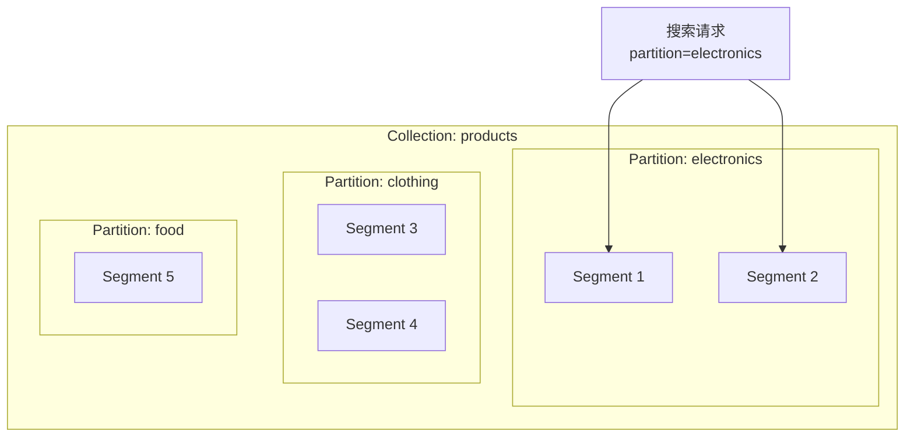
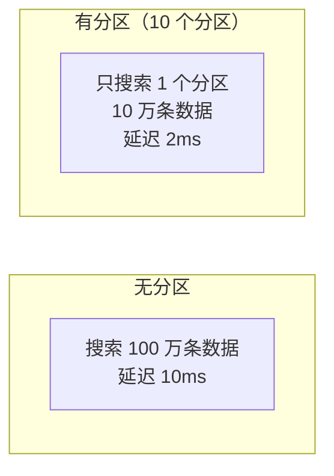
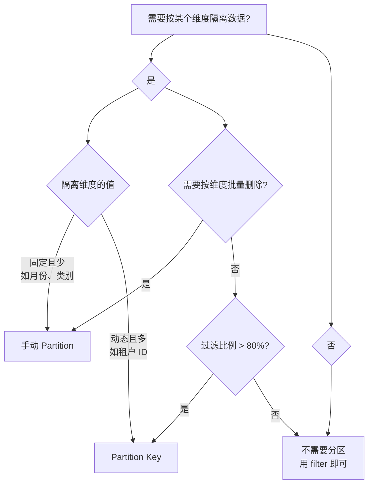

# 15 分区 Partition 设计

## 学习目标

学完本章后，你应该能够：

- 理解 Partition 和 Partition Key 的区别与适用场景。
- 设计基于时间、租户、类别的分区策略。
- 掌握分区对搜索性能和数据管理的影响。
- 在 Milvus 中创建和使用分区。
- 判断何时用分区、何时用过滤。

---

## 分区的本质

分区是 Collection 内部的物理隔离单元。每个 Partition 有独立的 Segment 和索引，搜索时可以只访问指定分区。



### 分区 vs 过滤

| 维度 | Partition | Filter |
|---|---|---|
| 隔离级别 | 物理隔离（独立 Segment） | 逻辑过滤（同一索引） |
| 搜索范围 | 只访问指定分区 | 全量索引 + 后置过滤 |
| 高过滤比例性能 | 好（只搜索子集） | 差（索引效率下降） |
| 灵活性 | 低（需要预定义分区） | 高（任意条件组合） |
| 数据管理 | 可按分区删除/释放 | 只能按条件删除 |

---

## 两种分区方式

### 方式一：手动 Partition

手动创建和管理分区，写入时指定分区名：

```python
from pymilvus import MilvusClient

client = MilvusClient(uri="http://localhost:19530")

# 创建 Collection 后手动创建分区
client.create_partition(collection_name="products", partition_name="electronics")
client.create_partition(collection_name="products", partition_name="clothing")
client.create_partition(collection_name="products", partition_name="food")

# 写入时指定分区
client.upsert(
    collection_name="products",
    data=electronics_data,
    partition_name="electronics",
)

# 搜索时指定分区
results = client.search(
    collection_name="products",
    data=[query_vector],
    anns_field="embedding",
    partition_names=["electronics"],  # 只搜索电子产品分区
    ...
)
```

### 方式二：Partition Key（推荐）

在 Schema 中指定某个字段为 Partition Key，Milvus 自动按该字段值路由数据：

```python
schema = MilvusClient.create_schema(auto_id=False)
schema.add_field(field_name="id", datatype=DataType.VARCHAR, is_primary=True, max_length=64)
schema.add_field(
    field_name="tenant_id",
    datatype=DataType.VARCHAR,
    max_length=32,
    is_partition_key=True,  # 设为分区键
)
schema.add_field(field_name="text", datatype=DataType.VARCHAR, max_length=4096)
schema.add_field(field_name="embedding", datatype=DataType.FLOAT_VECTOR, dim=768)

# 写入时无需指定分区，自动按 tenant_id 路由
client.upsert(collection_name="multi_tenant", data=data)

# 搜索时用 filter 指定分区键值，自动路由
results = client.search(
    collection_name="multi_tenant",
    data=[query_vector],
    filter='tenant_id == "tenant_abc"',  # 自动只搜索该分区
    ...
)
```

### 两种方式对比

| 维度 | 手动 Partition | Partition Key |
|---|---|---|
| 创建方式 | 手动 create_partition | Schema 中声明 |
| 路由方式 | 写入/搜索时指定 partition_name | 自动按字段值路由 |
| 分区数量 | 默认上限 1024 | 内部自动管理（hash 分桶） |
| 适用场景 | 分区少且固定（如按月份） | 分区多且动态（如多租户） |
| 代码侵入 | 业务代码需要管理分区名 | 透明，只需 filter |

---

## 分区策略设计

### 策略一：按租户分区（多租户 SaaS）

```python
# Partition Key 方案
schema.add_field(
    field_name="tenant_id",
    datatype=DataType.VARCHAR,
    max_length=32,
    is_partition_key=True,
)
```

适用：
- 租户数量 10-10000
- 每个租户数据量差异不大
- 需要严格的数据隔离

### 策略二：按时间分区（日志/事件）

```python
# 手动 Partition 方案（按月）
for month in ["2024-01", "2024-02", "2024-03"]:
    client.create_partition(collection_name="events", partition_name=month)

# 写入时按月份路由
client.upsert(
    collection_name="events",
    data=january_data,
    partition_name="2024-01",
)

# 搜索最近一个月
results = client.search(
    collection_name="events",
    partition_names=["2024-03"],
    ...
)

# 删除过期数据（整个分区）
client.drop_partition(collection_name="events", partition_name="2024-01")
```

适用：
- 数据有明确的时间维度
- 需要按时间范围搜索
- 需要按时间批量删除（TTL）

### 策略三：按类别分区

```python
# 手动 Partition 方案
categories = ["tech", "finance", "medical", "legal"]
for cat in categories:
    client.create_partition(collection_name="knowledge_base", partition_name=cat)
```

适用：
- 类别固定且数量少
- 搜索时几乎总是指定类别
- 不同类别的数据量差异大

---

## 分区对性能的影响

### 搜索性能



分区减少了搜索范围，延迟与分区内数据量成正比。

### 写入性能

分区对写入性能影响很小。Partition Key 方案下，Milvus 内部自动 hash 路由，无额外开销。

### 内存影响

每个分区的 Segment 独立加载。可以选择性 load/release 分区：

```python
# 只加载热数据分区
client.load_partitions(collection_name="events", partition_names=["2024-03"])

# 释放冷数据分区
client.release_partitions(collection_name="events", partition_names=["2024-01"])
```

---

## 分区数量限制

| 配置 | 默认值 | 说明 |
|---|---|---|
| 手动 Partition 上限 | 1024 | 可通过配置调整 |
| Partition Key 内部分桶数 | 64（默认） | 创建时可指定 `num_partitions` |

```python
# 指定 Partition Key 的分桶数
client.create_collection(
    collection_name="multi_tenant",
    schema=schema,
    index_params=index_params,
    num_partitions=128,  # 增加分桶数
)
```

分桶数建议：
- 租户数 < 100：默认 64 足够
- 租户数 100-1000：设为 128-256
- 租户数 > 1000：设为 256-1024

注意：分桶数不等于分区数。多个租户可能 hash 到同一个桶，但搜索时仍然通过 filter 精确过滤。

---

## 分区管理操作

```python
# 列出所有分区
partitions = client.list_partitions(collection_name="events")
print(partitions)  # ['_default', '2024-01', '2024-02', '2024-03']

# 查看分区统计
stats = client.get_partition_stats(collection_name="events", partition_name="2024-03")
print(f"行数: {stats['row_count']}")

# 删除分区（会删除分区内所有数据）
client.release_partitions(collection_name="events", partition_names=["2024-01"])
client.drop_partition(collection_name="events", partition_name="2024-01")
```

---

## 决策指南：何时用分区



### 不需要分区的场景

- 过滤条件多变，不固定在某个维度
- 数据量小（< 100 万），filter 性能足够
- 过滤比例低（大部分数据满足条件）

### 需要分区的场景

- 多租户隔离（Partition Key）
- 按时间管理数据生命周期（手动 Partition + drop）
- 搜索时几乎总是指定某个维度（减少搜索范围）
- 需要按分区独立 load/release（冷热分层）

---

## 常见错误

| 现象 | 原因 | 修复 |
|---|---|---|
| 分区数超限 | 手动创建超过 1024 个分区 | 改用 Partition Key |
| Partition Key 搜索没加速 | filter 中没有包含分区键条件 | 搜索时必须带分区键的 filter |
| drop_partition 报错 | 分区未 release | 先 release 再 drop |
| 数据写入错误分区 | 手动分区时 partition_name 拼错 | 检查分区名，或改用 Partition Key |
| 分区内数据不均匀 | hash 分桶碰撞 | 增大 num_partitions |

---

## 面试题

1. **Partition Key 和手动 Partition 的本质区别？**
   Partition Key 是声明式的——你告诉 Milvus 按哪个字段分区，路由自动完成。手动 Partition 是命令式的——你需要自己创建分区、指定写入分区、指定搜索分区。Partition Key 更适合动态场景。

2. **为什么 Partition Key 搜索时必须带 filter？**
   Partition Key 通过 filter 中的条件确定要搜索哪些分桶。如果不带 filter，Milvus 会搜索所有分桶，失去分区的性能优势。

3. **按时间分区有什么优势？**
   可以整个分区 drop（比逐条 delete 快得多），可以按分区 load/release（冷数据不占内存），搜索时只访问相关时间范围的分区。

4. **分区太多会有什么问题？**
   每个分区有独立的 Segment 和索引元数据。分区过多会增加 etcd 元数据压力、内存碎片和调度复杂度。建议手动分区 < 100，Partition Key 分桶 < 1024。

5. **Partition Key 的 num_partitions 设多大合适？**
   经验值：租户数的 1-2 倍，但不超过 1024。太小会导致多个租户共享分桶（仍需 filter 精确过滤），太大会增加管理开销。

---

## 练习题

1. **手动分区实验**：创建按月份分区的 Collection，写入 3 个月的数据。对比搜索全部分区和搜索单个分区的延迟。

2. **Partition Key 实验**：创建 Partition Key 为 tenant_id 的 Collection，写入 10 个租户的数据。搜索时带和不带 tenant_id filter，对比延迟。

3. **分区删除**：模拟 TTL 场景——创建按月分区，写入数据后 drop 最早的分区，验证数据确实被删除且其他分区不受影响。

4. **分区 vs 过滤**：同一批数据分别用 Partition Key 和纯 filter 实现租户隔离，写入 100 万条数据（10 个租户），对比搜索延迟。

---

## 小结

分区是 Milvus 中实现数据物理隔离的机制。Partition Key 适合多租户等动态场景（自动路由），手动 Partition 适合按时间管理数据生命周期（支持整分区删除和释放）。选择分区策略的核心判断：搜索时是否几乎总是按某个维度过滤，且该维度的过滤比例很高。
