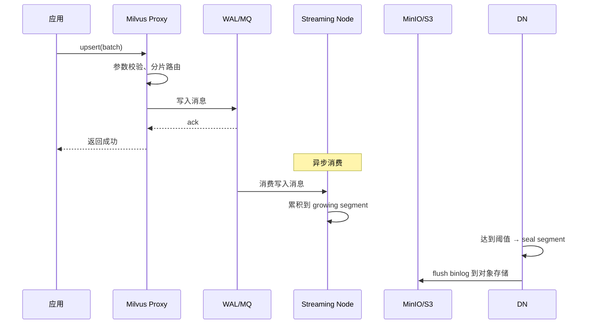

# 16 批量写入优化

## 学习目标

学完本章后，你应该能够：

- 理解 Milvus 写入链路和 Segment 生成机制。
- 选择合适的 batch_size 和并发度。
- 避免频繁 flush 导致的 Segment 碎片。
- 实现带重试、进度追踪和错误处理的生产级写入流程。
- 评估和优化写入吞吐量。

---

## 写入链路回顾



关键认知：
- **upsert 返回成功 = 数据进入 WAL**，不等于索引已构建
- Growing segment 中的数据可被搜索（暴力扫描），但性能不如索引
- Segment seal 后由 IndexNode 异步构建索引

---

## batch_size 选择

### 影响因素

| 因素 | batch_size 太小 | batch_size 太大 |
|---|---|---|
| 网络开销 | 每批都有 RPC 开销，总耗时长 | 单次传输数据量大 |
| 内存 | 无问题 | 客户端和 Proxy 内存峰值高 |
| 超时风险 | 无 | 单批处理时间可能超时 |
| Segment 效率 | 可能产生更多小 Segment | 更容易形成大 Segment |

### 推荐值

| 向量维度 | 推荐 batch_size | 单批数据量估算 |
|---|---|---|
| 128 维 | 2000-5000 | 1-2.5 MB |
| 512 维 | 1000-3000 | 2-6 MB |
| 768 维 | 500-2000 | 1.5-6 MB |
| 1536 维 | 500-1000 | 3-6 MB |

**经验法则**：单批数据量控制在 2-8 MB，对应的 batch_size 根据维度调整。

### 测试不同 batch_size

```python
import time
import numpy as np
from pymilvus import MilvusClient

client = MilvusClient(uri="http://localhost:19530")
DIM = 768
TOTAL = 50_000

def benchmark_batch_size(batch_size: int) -> float:
    """测试指定 batch_size 的写入吞吐"""
    start = time.perf_counter()
    for i in range(0, TOTAL, batch_size):
        size = min(batch_size, TOTAL - i)
        vectors = np.random.randn(size, DIM).astype("float32")
        norms = np.linalg.norm(vectors, axis=1, keepdims=True)
        vectors = (vectors / norms).tolist()
        data = [{"id": str(i + j), "embedding": vectors[j]} for j in range(size)]
        client.upsert(collection_name="bench_write", data=data)
    elapsed = time.perf_counter() - start
    throughput = TOTAL / elapsed
    print(f"batch_size={batch_size:5d}  耗时={elapsed:.1f}s  吞吐={throughput:.0f} rows/s")
    return throughput

# 对比
for bs in [100, 500, 1000, 2000, 5000]:
    benchmark_batch_size(bs)
```

---

## 并发写入

### 多线程写入

```python
import concurrent.futures
import threading
import time
import numpy as np
from pymilvus import MilvusClient

def parallel_upsert(
    uri: str,
    collection_name: str,
    data: list[dict],
    batch_size: int = 1000,
    max_workers: int = 4,
) -> int:
    """多线程并发写入"""
    # 每个线程使用独立的 client 实例
    local = threading.local()

    def get_client():
        if not hasattr(local, "client"):
            local.client = MilvusClient(uri=uri)
        return local.client

    def write_batch(batch: list[dict]) -> int:
        client = get_client()
        result = client.upsert(collection_name=collection_name, data=batch)
        return result["upsert_count"]

    # 分批
    batches = [data[i:i + batch_size] for i in range(0, len(data), batch_size)]

    total = 0
    with concurrent.futures.ThreadPoolExecutor(max_workers=max_workers) as executor:
        futures = {executor.submit(write_batch, batch): i for i, batch in enumerate(batches)}
        for future in concurrent.futures.as_completed(futures):
            total += future.result()

    return total
```

### 并发度建议

| 场景 | 推荐并发度 | 说明 |
|---|---|---|
| Standalone 本地 | 2-4 | 单节点资源有限 |
| Standalone 生产 | 4-8 | 取决于 CPU 和网络 |
| 集群模式 | 从小并发开始压测 | 多 Streaming Node 与 WAL 分片可并行处理 |

过高的并发度会导致 Proxy 排队、内存压力增大，反而降低吞吐。

---

## 避免 Segment 碎片

### 问题：频繁 flush


### 正确做法

```python
# 错误：每批都 flush
for batch in batches:
    client.upsert(collection_name="docs", data=batch)
    client.flush(collection_name="docs")  # 不要这样做！

# 正确：让 Milvus 自动管理 flush
for batch in batches:
    client.upsert(collection_name="docs", data=batch)
# 写入完成后，如果需要立即搜索到所有数据，可以 flush 一次
# client.flush(collection_name="docs")  # 仅在必要时
```

### Milvus 自动 flush 机制

Milvus 会在以下条件下自动 seal segment：
- Growing segment 达到 `dataCoord.segment.maxSize`（默认 512MB）
- Growing segment 达到 `sealProportion` 比例
- 超过一定时间未写入

配置参考（`milvus.yaml`）：

```yaml
dataCoord:
  segment:
    maxSize: 512          # Segment 最大 512MB
    sealProportion: 0.12  # 达到 12% 时 seal
```

---

## 生产级写入流程

```python
import logging
import time
from dataclasses import dataclass
from typing import Any

from pymilvus import MilvusClient
from pymilvus.exceptions import MilvusException, MilvusUnavailableException

logger = logging.getLogger(__name__)


@dataclass
class WriteResult:
    total_written: int
    total_failed: int
    elapsed_seconds: float
    throughput: float  # rows/s


def production_bulk_write(
    client: MilvusClient,
    collection_name: str,
    data: list[dict[str, Any]],
    batch_size: int = 1000,
    max_retries: int = 3,
    retry_delay: float = 2.0,
    progress_interval: int = 10,
) -> WriteResult:
    """生产级批量写入：分批、重试、进度、错误统计"""
    start_time = time.perf_counter()
    total_written = 0
    total_failed = 0
    total_batches = (len(data) + batch_size - 1) // batch_size

    for batch_idx in range(0, len(data), batch_size):
        batch = data[batch_idx : batch_idx + batch_size]
        batch_num = batch_idx // batch_size + 1
        success = False

        for attempt in range(max_retries):
            try:
                result = client.upsert(collection_name=collection_name, data=batch)
                total_written += result["upsert_count"]
                success = True
                break
            except MilvusUnavailableException as e:
                delay = retry_delay * (2 ** attempt)
                logger.warning(
                    "批次 %d/%d 写入失败 (attempt %d): %s, %.1fs 后重试",
                    batch_num, total_batches, attempt + 1, e, delay,
                )
                time.sleep(delay)
            except MilvusException as e:
                logger.error("批次 %d/%d 不可重试错误: %s", batch_num, total_batches, e)
                break

        if not success:
            total_failed += len(batch)
            logger.error("批次 %d/%d 最终失败，跳过 %d 条", batch_num, total_batches, len(batch))

        # 进度日志
        if batch_num % progress_interval == 0:
            elapsed = time.perf_counter() - start_time
            speed = total_written / elapsed if elapsed > 0 else 0
            logger.info(
                "进度: %d/%d 批次, 已写入 %d 条, 失败 %d 条, 速度 %.0f rows/s",
                batch_num, total_batches, total_written, total_failed, speed,
            )

    elapsed = time.perf_counter() - start_time
    throughput = total_written / elapsed if elapsed > 0 else 0

    logger.info(
        "写入完成: %d 条成功, %d 条失败, 耗时 %.1fs, 吞吐 %.0f rows/s",
        total_written, total_failed, elapsed, throughput,
    )

    return WriteResult(
        total_written=total_written,
        total_failed=total_failed,
        elapsed_seconds=elapsed,
        throughput=throughput,
    )
```

---

## insert vs upsert 性能

| 操作 | 行为 | 性能 | 适用场景 |
|---|---|---|---|
| `insert` | 纯插入，主键冲突报错 | 略快 | 确定数据不重复 |
| `upsert` | 存在则更新，不存在则插入 | 略慢（需查主键） | 增量同步、幂等写入 |

性能差异通常 < 10%。如果需要幂等性（重复运行不产生重复数据），优先用 upsert。

---

## 大规模数据导入

### 场景：百万级初始导入

```python
import numpy as np
from pathlib import Path

def generate_and_write(
    client: MilvusClient,
    collection_name: str,
    total: int,
    dim: int,
    batch_size: int = 2000,
):
    """大规模数据生成并写入"""
    written = 0
    for i in range(0, total, batch_size):
        size = min(batch_size, total - i)

        # 生成向量（实际场景中从文件或模型获取）
        vectors = np.random.randn(size, dim).astype("float32")
        norms = np.linalg.norm(vectors, axis=1, keepdims=True)
        vectors = vectors / norms

        data = [
            {"id": f"doc-{i+j:08d}", "embedding": vectors[j].tolist()}
            for j in range(size)
        ]

        client.upsert(collection_name=collection_name, data=data)
        written += size

        if written % 50000 == 0:
            print(f"已写入: {written:,} / {total:,}")

    print(f"导入完成: {written:,} 条")
```

### 导入后优化

大批量导入后建议：

```python
# 1. 等待索引构建完成
import time
while True:
    info = client.describe_collection(collection_name)
    # 检查索引状态...
    time.sleep(5)

# 2. 执行一次 compaction 合并小 Segment
# Milvus 会自动 compaction，但大量导入后可以手动触发
# （通过 REST API 或等待自动触发）

# 3. 验证数据量
stats = client.get_collection_stats(collection_name)
print(f"总行数: {stats['row_count']}")
```

---

## 写入性能调优清单

| 优化项 | 方法 | 预期效果 |
|---|---|---|
| batch_size | 调整到 1000-2000 | 减少 RPC 开销 |
| 并发度 | 2-4 线程 | 提高吞吐 30-100% |
| 避免 flush | 不手动 flush | 避免 Segment 碎片 |
| 减少字段 | 只写入必要字段 | 减少序列化开销 |
| 预生成向量 | 离线批量编码 | 避免写入时等待模型推理 |
| 网络 | 客户端与 Milvus 同机房 | 减少网络延迟 |

---

## 常见错误

| 现象 | 原因 | 修复 |
|---|---|---|
| 写入超时 | batch_size 太大 | 减小到 1000 以下 |
| 吞吐量低 | 单线程 + 小 batch | 增大 batch_size + 多线程 |
| Segment 过多 | 频繁手动 flush | 删除 flush 调用 |
| 写入后搜索不到 | 数据在 growing segment，索引未构建 | 等待自动 flush 或手动 flush 一次 |
| OOM | 一次性加载全部数据到内存 | 流式读取 + 分批写入 |
| 主键冲突 | insert 遇到重复主键 | 改用 upsert |

---

## 面试题

1. **为什么不建议每批都 flush？**
   每次 flush 会 seal 当前 growing segment，产生小 Segment。大量小 Segment 导致搜索时需要扫描更多文件，延迟增加。Milvus 的自动 flush 机制会在 Segment 达到合适大小时 seal。

2. **upsert 返回成功后数据一定能被搜索到吗？**
   能被搜索到，但可能是暴力扫描（growing segment 未建索引）。如果需要索引搜索的性能，需要等待 Segment seal 和索引构建完成。

3. **并发写入时为什么每个线程要用独立的 client？**
   MilvusClient 内部维护连接状态。多线程共享同一个 client 可能导致连接竞争。每个线程独立 client 保证连接隔离。

4. **大规模导入后为什么搜索可能变慢？**
   大量写入可能产生很多未合并的 Segment。等待 Compaction 完成后性能会恢复。也可以通过增大 `segment.maxSize` 减少 Segment 数量。

5. **如何估算写入吞吐量的理论上限？**
   受限于：网络带宽（batch 大小 × QPS）、Proxy CPU（序列化）、WAL 写入速度、Streaming Node 处理速度和对象存储吞吐。实际 rows/s 与维度、字段大小、硬件和一致性级别强相关，集群扩展也不保证线性。

---

## 练习题

1. **batch_size 调优**：准备 10 万条 768 维数据，分别用 batch_size=100、500、1000、2000、5000 写入，记录总耗时和吞吐量。画出 batch_size-throughput 曲线。

2. **并发度实验**：固定 batch_size=1000，分别用 1、2、4、8 线程写入 10 万条数据，对比吞吐量。找到你环境下的最优并发度。

3. **flush 影响**：写入 5 万条数据，一组每 1000 条 flush 一次，另一组不 flush。对比写入后的搜索延迟和 Segment 数量。

4. **断点续传**：模拟写入过程中 Milvus 重启的场景。设计一个基于主键的断点续传机制，确保重启后不重复写入。

---

## 小结

批量写入优化的核心：合适的 batch_size（1000-2000）、适度的并发（2-4 线程）、不手动 flush。生产代码必须有重试机制和进度追踪。写入吞吐量的瓶颈通常在网络和 Proxy，而不是存储。
