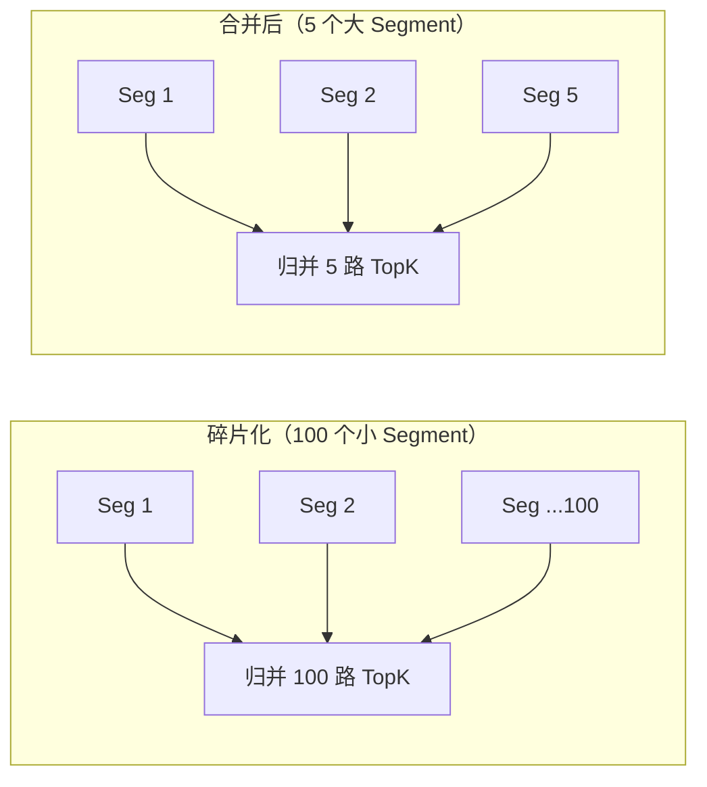
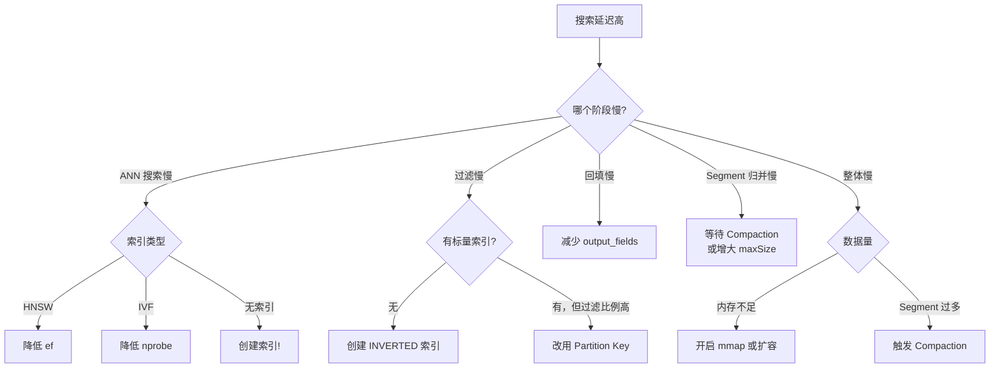

# 17 查询性能调优

## 学习目标

学完本章后，你应该能够：

- 识别搜索延迟的瓶颈来源（索引、过滤、网络、Segment）。
- 调优 HNSW 的 ef 和 IVF 的 nprobe 达到目标延迟。
- 控制 output_fields、TopK 和并发对延迟的影响。
- 使用 mmap、Segment 合并和缓存优化内存和延迟。
- 建立性能基线并持续监控。

---

## 搜索延迟分解

一次搜索请求的延迟由多个阶段组成：


### 各阶段典型耗时

| 阶段 | 典型耗时 | 主要影响因素 |
|---|---|---|
| 网络往返 | 0.5-5ms | 客户端与 Milvus 的距离 |
| ANN 搜索 | 1-20ms | 索引类型、ef/nprobe、数据量 |
| 标量过滤 | 0.1-10ms | 过滤比例、是否有标量索引 |
| 字段回填 | 0.5-5ms | output_fields 数量和大小 |
| Segment 归并 | 0.1-2ms | Segment 数量 |

---

## 索引参数调优

### HNSW: ef 调优

ef 是搜索时最直接的调优旋钮：

```python
# 低延迟配置（P95 < 5ms）
search_params = {"params": {"ef": 32}}

# 平衡配置（P95 < 10ms）
search_params = {"params": {"ef": 64}}

# 高召回配置（P95 < 20ms）
search_params = {"params": {"ef": 128}}

# 极高召回（P95 < 50ms）
search_params = {"params": {"ef": 256}}
```

**调优方法**：从小到大逐步增加 ef，找到"召回率达标且延迟可接受"的最小值。

```python
import time
import numpy as np

def find_optimal_ef(client, collection, query_vectors, target_recall=0.95, ground_truth=None):
    """二分查找最优 ef"""
    for ef in [16, 32, 48, 64, 96, 128, 192, 256]:
        latencies = []
        for qv in query_vectors[:50]:
            start = time.perf_counter()
            client.search(
                collection_name=collection,
                data=[qv],
                anns_field="embedding",
                search_params={"metric_type": "COSINE", "params": {"ef": ef}},
                limit=10,
            )
            latencies.append((time.perf_counter() - start) * 1000)

        p95 = np.percentile(latencies, 95)
        # 如果有 ground_truth，计算召回率
        print(f"ef={ef:3d}  P95={p95:.1f}ms")
```

### IVF: nprobe 调优

```python
# 同样的思路：逐步增大 nprobe
for nprobe in [8, 16, 32, 64, 128]:
    # 测试延迟和召回率...
    pass
```

---

## TopK 对延迟的影响

TopK 越大，搜索需要维护的候选集越大，延迟越高：

| TopK | 典型延迟增幅 | 说明 |
|---|---|---|
| 1-10 | 基准 | 大多数业务场景 |
| 10-50 | +20-50% | RAG 召回阶段 |
| 50-100 | +50-100% | 批量召回 |
| 100-1000 | +200-500% | 尽量避免 |

**优化策略**：业务只需要 5 条结果就设 limit=5，不要"以防万一"设 limit=100。

```python
# 错误：过大的 TopK
results = client.search(..., limit=100)  # 实际只用前 5 条
display = results[0][:5]

# 正确：按需设置
results = client.search(..., limit=5)
```

---

## output_fields 优化

output_fields 决定了搜索结果中返回哪些标量字段。字段越多、越大，网络传输和回填开销越高。

```python
# 慢：返回大文本字段
results = client.search(
    ...,
    output_fields=["title", "full_text", "metadata", "source", "embedding"],  # embedding 很大！
)

# 快：只返回必要字段
results = client.search(
    ...,
    output_fields=["title", "source"],  # 只要展示需要的
)

# 如果需要完整内容，先搜索拿 ID，再按 ID 查详情
results = client.search(..., output_fields=["id"])
ids = [hit["id"] for hit in results[0]]
details = client.get(collection_name="docs", ids=ids, output_fields=["title", "full_text"])
```

### 性能对比

| output_fields | 典型延迟增幅 | 说明 |
|---|---|---|
| 无（只返回 ID + score） | 基准 | 最快 |
| 2-3 个短字段 | +10-20% | 推荐 |
| 包含长文本（> 1KB） | +50-200% | 考虑分离查询 |
| 包含向量字段 | +200-500% | 几乎不应该返回向量 |

---

## Segment 数量优化

Segment 过多会增加搜索延迟（每个 Segment 独立搜索后归并）：



### 检查 Segment 状态

```python
# 通过 REST API 查看 Segment 信息
# curl http://localhost:9091/api/v1/persist/segment/info?collectionID=xxx

# 或通过日志观察
# docker compose logs standalone | grep -i segment
```

### 触发 Compaction

Milvus 自动执行 Compaction，但大量写入后可能需要等待：

```yaml
# milvus.yaml 中调整 Compaction 策略
dataCoord:
  compaction:
    enableAutoCompaction: true
```

### 减少 Segment 碎片的方法

1. 不手动 flush（让 Segment 自然增长到 maxSize）
2. 增大 `dataCoord.segment.maxSize`（如 1024MB）
3. 等待 Compaction 合并小 Segment
4. 大批量导入后等待索引构建完成再压测

---

## mmap 优化

mmap 让 Milvus 用磁盘映射代替全量内存加载，降低内存占用但增加延迟：

```yaml
# milvus.yaml
queryNode:
  mmap:
    enabled: true
```

### mmap 的影响

| 维度 | mmap 关闭 | mmap 开启 |
|---|---|---|
| 内存占用 | 高（全量加载） | 低（按需加载） |
| 搜索延迟 | 低（内存访问） | 中-高（可能触发磁盘 IO） |
| 适用场景 | 内存充足 | 内存不足但有 SSD |

### 何时开启 mmap

- 数据量超过可用内存的 70%
- 可以接受延迟增加 2-5×
- 有高速 SSD（NVMe 最佳）
- 查询 QPS 不高（mmap 在高并发下性能下降明显）

---

## 并发查询优化

### 连接池

```python
# MilvusClient 内部维护连接池，通常不需要手动管理
# 但高并发场景下建议：
# 1. 复用 client 实例（不要每次请求都创建）
# 2. 多个 worker 可以共享同一个 client（线程安全）

# FastAPI 中的推荐模式
from contextlib import asynccontextmanager
from pymilvus import MilvusClient

milvus_client: MilvusClient | None = None

@asynccontextmanager
async def lifespan(app):
    global milvus_client
    milvus_client = MilvusClient(uri="http://localhost:19530")
    yield
    # 清理

app = FastAPI(lifespan=lifespan)

@app.get("/search")
def search(q: str):
    # 复用全局 client
    results = milvus_client.search(...)
    return results
```

### 批量查询 vs 逐条查询

```python
# 慢：逐条查询
for query in queries:
    result = client.search(data=[query], ...)

# 快：批量查询（一次 RPC 多个查询向量）
results = client.search(data=queries, ...)  # queries 是多个向量的列表
```

批量查询减少 RPC 次数，Milvus 内部也能更好地利用 SIMD 并行。

---

## 性能基线建立

### 压测脚本框架

```python
import time
import numpy as np
from dataclasses import dataclass
from pymilvus import MilvusClient


@dataclass
class BenchmarkResult:
    qps: float
    p50_ms: float
    p95_ms: float
    p99_ms: float
    recall: float


def benchmark_search(
    client: MilvusClient,
    collection_name: str,
    dim: int,
    num_queries: int = 200,
    top_k: int = 10,
    ef: int = 64,
) -> BenchmarkResult:
    """搜索性能基线测试"""
    # 生成随机查询向量
    queries = np.random.randn(num_queries, dim).astype("float32")
    queries = queries / np.linalg.norm(queries, axis=1, keepdims=True)

    latencies = []
    for q in queries:
        start = time.perf_counter()
        client.search(
            collection_name=collection_name,
            data=[q.tolist()],
            anns_field="embedding",
            search_params={"metric_type": "COSINE", "params": {"ef": ef}},
            limit=top_k,
            output_fields=["id"],
        )
        latencies.append((time.perf_counter() - start) * 1000)

    total_time = sum(latencies) / 1000
    return BenchmarkResult(
        qps=num_queries / total_time,
        p50_ms=np.percentile(latencies, 50),
        p95_ms=np.percentile(latencies, 95),
        p99_ms=np.percentile(latencies, 99),
        recall=0.0,  # 需要 ground truth 计算
    )


# 使用
result = benchmark_search(client, "my_collection", dim=768)
print(f"QPS={result.qps:.0f}  P50={result.p50_ms:.1f}ms  P95={result.p95_ms:.1f}ms  P99={result.p99_ms:.1f}ms")
```

### 性能基线记录模板

| 指标 | 基线值 | 目标值 | 当前值 |
|---|---|---|---|
| P50 延迟 | 5ms | < 10ms | - |
| P95 延迟 | 12ms | < 20ms | - |
| P99 延迟 | 25ms | < 50ms | - |
| QPS（单线程） | 150 | > 100 | - |
| Recall@10 | 95% | > 93% | - |

---

## 调优决策树



---

## 常见错误

| 现象 | 原因 | 修复 |
|---|---|---|
| P99 延迟远高于 P50 | Segment 数量不均、GC 暂停 | Compaction + 观察 GC |
| 延迟随时间增长 | 数据持续写入，Segment 碎片化 | 定期 Compaction |
| 高并发下延迟飙升 | QueryNode CPU 饱和 | 降低 ef/nprobe 或扩容 |
| 返回向量字段很慢 | 向量字段很大 | 不要在 output_fields 中返回向量 |
| 第一次搜索很慢 | Collection 刚 load，缓存未预热 | 预热查询或接受冷启动 |

---

## 面试题

1. **ef 从 64 增加到 128，延迟和召回率分别怎么变？**
   延迟大约增加 50-100%（候选集翻倍），召回率可能从 93% 提升到 97%。边际收益递减——ef 从 128 到 256 的召回提升远小于 64 到 128。

2. **为什么 output_fields 包含大文本会显著增加延迟？**
   搜索完成后需要从 Segment 中读取这些字段的值（回填），大文本意味着更多的磁盘/内存读取和网络传输。

3. **Segment 过多为什么影响搜索性能？**
   每个 Segment 独立搜索产生局部 TopK，最后需要归并。Segment 越多，归并路数越多，且每个小 Segment 的索引效率可能不如大 Segment。

4. **mmap 为什么能降低内存但增加延迟？**
   mmap 把数据映射到虚拟地址空间，实际数据在磁盘上。访问时触发 page fault 从磁盘加载到内存。热数据会被 OS 缓存，冷数据每次访问都有磁盘 IO。

5. **如何判断搜索瓶颈在索引还是在网络？**
   对比本地客户端和远程客户端的延迟差异。如果差异 > 50%，瓶颈在网络。也可以看 Milvus 的 `/metrics` 中的内部搜索耗时。

---

## 练习题

1. **ef 调优曲线**：固定 100 万条数据，ef 从 16 到 512，记录 P50/P95/P99 延迟。画出延迟曲线，找到你业务可接受的最大 ef。

2. **output_fields 影响**：同一个搜索分别返回 0、2、5 个字段和包含长文本字段，对比延迟差异。

3. **并发压测**：用 1、4、8、16 个并发线程同时搜索，记录 QPS 和 P95 延迟。找到吞吐量饱和点。

4. **Segment 影响**：写入 10 万条数据，每 1000 条 flush 一次（产生碎片），对比不 flush 时的搜索延迟。等待 Compaction 后再测一次。

---

## 小结

查询性能调优的优先级：先确保有索引 → 调 ef/nprobe 到最小可接受值 → 减少 output_fields → 控制 TopK → 处理 Segment 碎片。90% 的性能问题可以通过调整 ef 和减少返回字段解决。建立性能基线并持续监控，才能在数据增长时及时发现退化。
