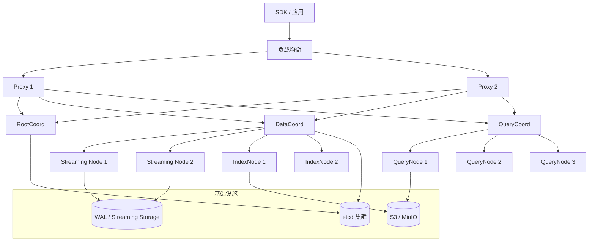

# 18 Milvus 集群部署

## 学习目标

学完本章后，你应该能够：

- 理解 Milvus 分布式集群的组件拓扑。
- 使用 Docker Compose 或 Helm 部署集群模式。
- 配置多 QueryNode、多 Streaming Node 实现水平扩展。
- 规划集群的资源分配和容量。
- 处理集群部署中的常见问题。

---

## Standalone vs Cluster

| 维度 | Standalone | Cluster |
|---|---|---|
| 组件 | 所有角色在一个进程 | Coord、Node 独立部署 |
| 扩展性 | 垂直扩展（加 CPU/内存） | 水平扩展（加节点） |
| 高可用 | 单点故障 | 组件级容错 |
| 适用规模 | 取决于单机资源和索引 | 超出单机资源或有高可用要求 |
| 运维复杂度 | 低 | 高 |
| 依赖 | etcd + MinIO/S3 + 内置流式存储 | etcd + MinIO/S3 + 可配置的流式存储 |

---

## 集群架构



### 组件角色

| 组件 | 可扩展 | 职责 | 扩展场景 |
|---|---|---|---|
| Proxy | 是 | 接入请求、路由 | QPS 高时加 Proxy |
| RootCoord | 否（单实例） | DDL、时间戳 | 无需扩展 |
| DataCoord | 否（单实例） | Segment 调度 | 无需扩展 |
| QueryCoord | 否（单实例） | 查询调度 | 无需扩展 |
| Streaming Node | 是 | WAL、流式写入、growing Segment | 写入吞吐不足时加 |
| QueryNode | 是 | 搜索执行 | 搜索延迟高/QPS 不足时加 |
| IndexNode | 是 | 索引构建 | 索引构建慢时加 |

---

## Docker Compose 集群部署

Docker Compose 适合学习和联调，但分布式组件名称会随 Milvus 版本演进。不要手写一份旧版组件清单长期复用，应下载与目标版本严格匹配的官方分布式 Compose 文件：

```bash
export MILVUS_VERSION=v2.6.15
curl -L \
  "https://github.com/milvus-io/milvus/releases/download/${MILVUS_VERSION}/milvus-distributed-docker-compose.yml" \
  -o docker-compose.yml
docker compose up -d
```

下载后先检查镜像 tag、WAL/流式存储、对象存储和 etcd 配置，再根据环境修改资源限制。生产环境更推荐使用官方 Helm Chart。

---

## Helm 部署（Kubernetes）

生产环境推荐使用 Helm Chart 部署到 Kubernetes：

```bash
# 添加 Milvus Helm 仓库
helm repo add milvus https://zilliztech.github.io/milvus-helm/
helm repo update

# 安装集群模式
helm install milvus milvus/milvus \
  --set cluster.enabled=true \
  --set queryNode.replicas=3 \
  --set dataNode.replicas=2 \
  --set indexNode.replicas=2 \
  --set proxy.replicas=2 \
  -n milvus --create-namespace
```

### 自定义 values.yaml

```yaml
cluster:
  enabled: true

queryNode:
  replicas: 3
  resources:
    requests:
      memory: "8Gi"
      cpu: "4"
    limits:
      memory: "16Gi"
      cpu: "8"

dataNode:
  replicas: 2
  resources:
    requests:
      memory: "4Gi"
      cpu: "2"

indexNode:
  replicas: 2
  resources:
    requests:
      memory: "8Gi"
      cpu: "4"

proxy:
  replicas: 2
  resources:
    requests:
      memory: "2Gi"
      cpu: "2"

etcd:
  replicaCount: 3
  persistence:
    size: 10Gi

minio:
  mode: distributed
  replicas: 4
  persistence:
    size: 100Gi

pulsar:
  enabled: true
  # 或使用 Kafka
  # kafka:
  #   enabled: true
```

---

## 资源规划

### QueryNode 内存规划

QueryNode 需要加载索引和向量到内存：

```
单个 QueryNode 内存 ≈ 总数据内存 / QueryNode 数量 × 副本数

示例：
- 1000 万条 × 768 维 × HNSW(M=16) ≈ 31 GB
- 3 个 QueryNode，1 副本：每个 ~10.3 GB
- 3 个 QueryNode，2 副本：每个 ~20.6 GB
```

### 各组件资源建议

| 组件 | CPU | 内存 | 磁盘 | 数量 |
|---|---|---|---|---|
| Proxy | 2-4 核 | 2-4 GB | 无 | 2+（按 QPS） |
| QueryNode | 4-8 核 | 8-32 GB | SSD（mmap 时） | 按数据量 |
| Streaming Node | 2-4 核 | 4-8 GB | 按 WAL 配置 | 按写入量 |
| IndexNode | 4-8 核 | 8-16 GB | SSD（临时） | 1-2 |
| Coord 系列 | 1-2 核 | 2-4 GB | 无 | 各 1 |
| etcd | 2 核 | 4 GB | SSD 10-50 GB | 3（高可用） |
| Pulsar/Kafka | 4 核 | 8 GB | SSD 50-200 GB | 3+ |
| MinIO/S3 | 2 核 | 4 GB | HDD/SSD | 4+（分布式） |

---

## 扩缩容

### 水平扩展 QueryNode

当搜索延迟增加或 QPS 不足时：

```bash
# Helm 扩容
helm upgrade milvus milvus/milvus --set queryNode.replicas=5 -n milvus

# Docker Compose 扩容（添加新的 querynode 服务）
docker compose up -d --scale querynode=4
```

QueryCoord 会自动将 Segment 重新分配到新的 QueryNode。

### 扩展 Streaming Node

当写入吞吐不足时：

```bash
helm upgrade milvus milvus/milvus --set streamingNode.replicas=4 -n milvus
```

### 扩展 IndexNode

当索引构建积压时：

```bash
helm upgrade milvus milvus/milvus --set indexNode.replicas=4 -n milvus
```

---

## 消息队列选择

| 消息队列 | 优点 | 缺点 | 适用场景 |
|---|---|---|---|
| Pulsar | Milvus 默认支持，功能完整 | 部署复杂，资源占用大 | 生产集群 |
| Kafka | 生态成熟，运维经验多 | 需要额外配置 | 已有 Kafka 集群 |
| 内置流式存储 | Standalone 部署简单 | 能力和配置随版本变化 | 本地与中小规模部署 |

---

## 集群健康检查

```bash
# 检查所有组件状态
kubectl get pods -n milvus

# 检查 Milvus 健康
curl http://<proxy-ip>:9091/healthz

# 查看组件日志
kubectl logs -f deployment/milvus-proxy -n milvus
kubectl logs -f deployment/milvus-querynode -n milvus

# 查看 QueryNode 负载分布
# 通过 Prometheus 指标观察各 QueryNode 的 Segment 数量和内存使用
```

---

## 常见错误

| 现象 | 原因 | 修复 |
|---|---|---|
| Proxy 启动失败 | Coord 组件未就绪 | 检查 Coord 日志，确认 etcd 连接 |
| QueryNode OOM | 数据量超过单节点内存 | 增加 QueryNode 数量或开启 mmap |
| 写入延迟高 | WAL 或 Streaming Node 成为瓶颈 | 检查流式存储和 Streaming Node 指标 |
| 索引构建慢 | IndexNode 资源不足 | 增加 IndexNode 或增大 CPU |
| etcd 空间不足 | 元数据过多 | 执行 etcd compaction，增大 quota |
| 搜索结果不一致 | Segment 正在迁移 | 等待 QueryCoord 完成 balance |

---

## 面试题

1. **Standalone 和 Cluster 的核心区别是什么？**
   Standalone 将多数角色合并在一个进程并使用内置流式存储；Cluster 将角色拆分部署，并可配置外部或分布式流式存储，从而独立扩缩容。

2. **为什么 Coord 组件不需要多副本？**
   Coord 是调度器，不处理数据面流量。它的负载很轻，单实例足够。高可用通过 etcd 选主实现——Coord 挂了会自动重新选主恢复。

3. **增加 QueryNode 后搜索性能一定会提升吗？**
   不一定。如果瓶颈在网络、Proxy 或索引参数，加 QueryNode 无效。只有当 QueryNode CPU/内存是瓶颈时，水平扩展才有效。

4. **集群模式为什么需要可靠的 WAL / 流式存储？**
   写入链路需要在多个组件之间可靠传递和重放事件。具体使用哪种实现取决于 Milvus 版本及部署配置，不能把 Pulsar/Kafka 写成所有版本的唯一选择。

5. **如何判断需要从 Standalone 升级到 Cluster？**
   当出现以下情况：单机内存不够加载所有数据、需要高可用（不能单点故障）、写入吞吐需要水平扩展、搜索 QPS 超过单机上限。

---

## 练习题

1. **Docker Compose 集群**：使用本章的 docker-compose 文件启动集群模式，验证写入和搜索正常工作。

2. **QueryNode 扩容**：启动 2 个 QueryNode 的集群，写入 10 万条数据。然后增加到 4 个 QueryNode，观察 Segment 重新分配过程。

3. **故障模拟**：停止一个 QueryNode（`docker stop`），观察搜索是否仍然正常（QueryCoord 应该将 Segment 迁移到其他节点）。

4. **资源监控**：使用 `docker stats` 观察集群各组件的 CPU 和内存使用，写入和搜索时分别观察哪个组件负载最高。

---

## 小结

Milvus 集群部署的核心是理解哪些组件可以水平扩展（Proxy、QueryNode、Streaming Node、IndexNode）以及何时需要扩展。QueryNode 决定搜索能力，Streaming Node 与 WAL 影响流式写入能力，IndexNode 决定索引构建速度。生产环境推荐 Helm + Kubernetes 部署，配合监控和自动扩缩容。
