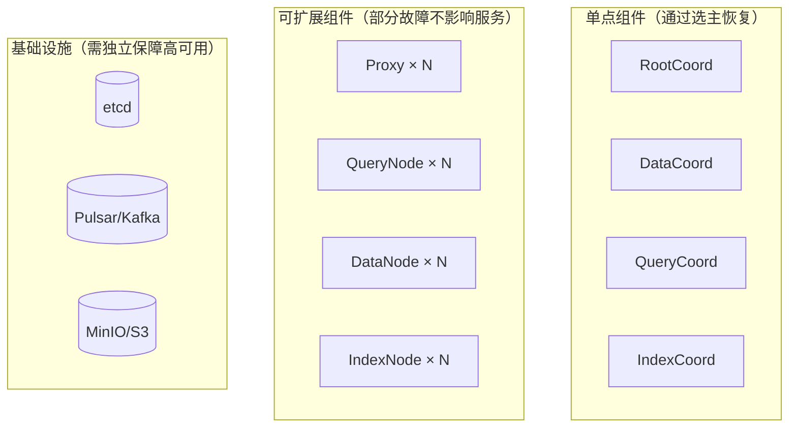
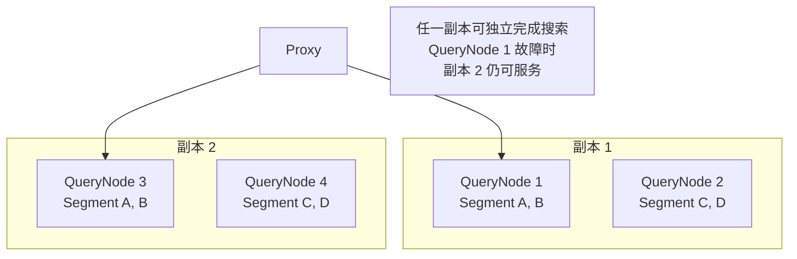
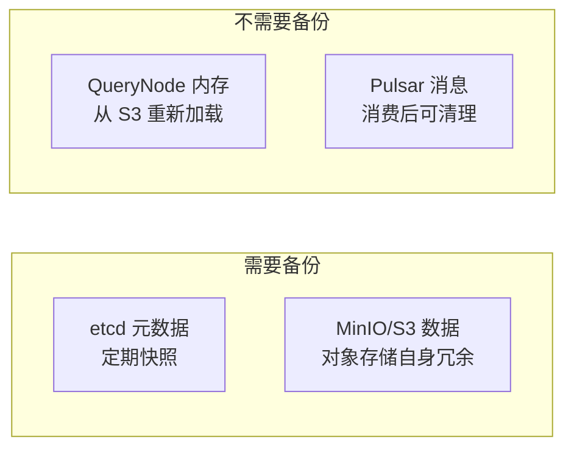
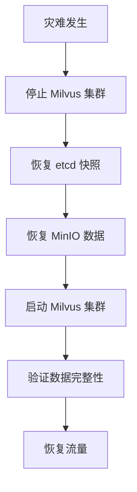
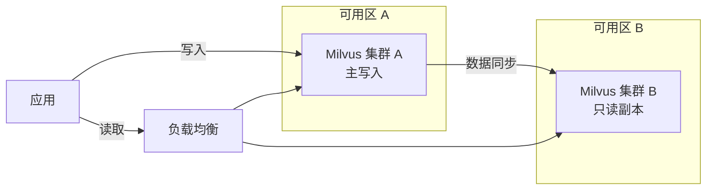

# 19 Milvus 高可用设计

## 学习目标

学完本章后，你应该能够：

- 理解 Milvus 各组件的故障影响范围和恢复机制。
- 配置 QueryNode 多副本实现搜索高可用。
- 设计 etcd、MinIO/S3、消息队列的高可用方案。
- 制定备份恢复和容灾策略。
- 评估不同高可用级别的成本和复杂度。

---

## 故障影响分析



### 各组件故障影响

| 组件 | 故障影响 | 恢复方式 | 恢复时间 |
|---|---|---|---|
| Proxy | 部分请求失败 | 负载均衡切换到其他 Proxy | 秒级 |
| QueryNode | 部分 Segment 不可搜索 | QueryCoord 迁移 Segment 到其他节点 | 10-60s |
| DataNode | 写入暂停 | DataCoord 重新分配 channel | 10-30s |
| IndexNode | 索引构建暂停 | IndexCoord 重新调度任务 | 分钟级 |
| RootCoord | DDL 操作不可用 | etcd 选主恢复 | 10-30s |
| DataCoord | 新 Segment 分配暂停 | etcd 选主恢复 | 10-30s |
| QueryCoord | Segment 调度暂停 | etcd 选主恢复 | 10-30s |
| etcd | **全部不可用** | etcd 集群自愈 | 取决于集群配置 |
| MinIO/S3 | 新数据无法持久化 | 对象存储集群自愈 | 取决于存储方案 |
| Pulsar/Kafka | 写入不可用 | 消息队列集群自愈 | 取决于集群配置 |

---

## QueryNode 多副本

多副本是搜索高可用的核心机制：同一份数据加载到多个 QueryNode，任一节点故障不影响搜索。

### 配置副本数

```python
from pymilvus import MilvusClient

client = MilvusClient(uri="http://localhost:19530")

# 加载 Collection 时指定副本数
client.load_collection(
    collection_name="production_docs",
    replica_number=2,  # 2 副本
)
```

### 副本分布



### 副本数选择

| 副本数 | 内存开销 | 可用性 | 适用场景 |
|---|---|---|---|
| 1 | 基准 | 单节点故障影响搜索 | 开发、非关键业务 |
| 2 | 2× | 容忍 1 个节点故障 | 生产标准配置 |
| 3 | 3× | 容忍 2 个节点故障 | 高可用要求 |

**约束**：`replica_number <= QueryNode 数量`

---

## etcd 高可用

etcd 是 Milvus 的元数据存储，etcd 不可用 = Milvus 完全不可用。

### 三节点 etcd 集群

```yaml
# docker-compose 示例（生产建议 Kubernetes StatefulSet）
services:
  etcd1:
    image: quay.io/coreos/etcd:v3.5.18
    command: >
      etcd --name etcd1
      --initial-advertise-peer-urls http://etcd1:2380
      --listen-peer-urls http://0.0.0.0:2380
      --advertise-client-urls http://etcd1:2379
      --listen-client-urls http://0.0.0.0:2379
      --initial-cluster etcd1=http://etcd1:2380,etcd2=http://etcd2:2380,etcd3=http://etcd3:2380
      --initial-cluster-state new

  etcd2:
    image: quay.io/coreos/etcd:v3.5.18
    command: >
      etcd --name etcd2
      --initial-advertise-peer-urls http://etcd2:2380
      --listen-peer-urls http://0.0.0.0:2380
      --advertise-client-urls http://etcd2:2379
      --listen-client-urls http://0.0.0.0:2379
      --initial-cluster etcd1=http://etcd1:2380,etcd2=http://etcd2:2380,etcd3=http://etcd3:2380
      --initial-cluster-state new

  etcd3:
    image: quay.io/coreos/etcd:v3.5.18
    command: >
      etcd --name etcd3
      --initial-advertise-peer-urls http://etcd3:2380
      --listen-peer-urls http://0.0.0.0:2380
      --advertise-client-urls http://etcd3:2379
      --listen-client-urls http://0.0.0.0:2379
      --initial-cluster etcd1=http://etcd1:2380,etcd2=http://etcd2:2380,etcd3=http://etcd3:2380
      --initial-cluster-state new
```

Milvus 配置连接多个 etcd 节点：

```yaml
# milvus.yaml
etcd:
  endpoints:
    - etcd1:2379
    - etcd2:2379
    - etcd3:2379
```

### etcd 运维要点

| 操作 | 命令 | 频率 |
|---|---|---|
| 健康检查 | `etcdctl endpoint health` | 持续监控 |
| 备份 | `etcdctl snapshot save backup.db` | 每日 |
| 压缩 | `etcdctl compaction <revision>` | 自动（配置 auto-compaction） |
| 碎片整理 | `etcdctl defrag` | 每周 |

---

## 对象存储高可用

MinIO/S3 存储所有 Binlog 和索引文件，丢失 = 数据丢失。

### 方案对比

| 方案 | 可用性 | 成本 | 适用场景 |
|---|---|---|---|
| 单节点 MinIO | 低 | 低 | 开发测试 |
| MinIO 分布式（4+ 节点） | 高 | 中 | 自建生产 |
| AWS S3 / 阿里云 OSS | 极高（99.99%） | 按量付费 | 云上生产 |
| 跨区域复制 | 极高 + 容灾 | 高 | 关键业务 |

### 使用云对象存储

```yaml
# milvus.yaml - 使用 AWS S3
minio:
  address: s3.amazonaws.com
  port: 443
  accessKeyID: your-access-key
  secretAccessKey: your-secret-key
  bucketName: milvus-data
  useSSL: true
  useIAM: false  # 或 true（使用 IAM Role）
```

---

## 消息队列高可用

### Pulsar 集群

```yaml
# Helm values for Pulsar
pulsar:
  enabled: true
  broker:
    replicas: 3
  bookkeeper:
    replicas: 3
  zookeeper:
    replicas: 3
```

### Kafka 替代方案

Milvus 2.4+ 支持 Kafka 作为消息队列：

```yaml
# milvus.yaml
mq:
  type: kafka

kafka:
  brokerList: kafka1:9092,kafka2:9092,kafka3:9092
```

---

## 备份与恢复

### 备份策略



### Milvus Backup 工具

Milvus 官方提供 `milvus-backup` 工具：

```bash
# 安装
go install github.com/zilliztech/milvus-backup/cmd/milvus-backup@latest

# 创建备份
milvus-backup create -n my_backup

# 列出备份
milvus-backup list

# 恢复
milvus-backup restore -n my_backup
```

### 手动备份流程

```bash
# 1. 备份 etcd
docker exec milvus-etcd etcdctl snapshot save /etcd/backup.db
docker cp milvus-etcd:/etcd/backup.db ./backups/etcd-$(date +%Y%m%d).db

# 2. MinIO 数据由对象存储自身保障
# 如果使用本地 MinIO，需要额外备份：
docker run --rm \
  -v milvus-master-course_minio-data:/data \
  -v $(pwd)/backups:/backup \
  alpine tar czf /backup/minio-$(date +%Y%m%d).tar.gz /data
```

### 恢复流程



---

## 容灾设计

### 同城双活



### 跨区域容灾

对于极高可用要求的场景：

1. **对象存储跨区域复制**：S3 Cross-Region Replication
2. **etcd 定期快照传输到异地**
3. **异地集群定期从备份恢复验证**

---

## 高可用检查清单

| 检查项 | 最低要求 | 推荐配置 |
|---|---|---|
| QueryNode 副本 | 1 | 2+ |
| Proxy 实例 | 1 | 2+（负载均衡） |
| etcd 节点 | 1 | 3（奇数） |
| 对象存储 | 单节点 MinIO | 分布式 MinIO 或云 S3 |
| 消息队列 | 单节点 | 3 节点集群 |
| 备份频率 | 无 | etcd 每日快照 |
| 监控告警 | 无 | Prometheus + Grafana |
| 故障演练 | 无 | 每季度一次 |

---

## 常见错误

| 现象 | 原因 | 修复 |
|---|---|---|
| 单 QueryNode 故障后搜索报错 | 副本数为 1 | 设置 replica_number >= 2 |
| etcd 故障后 Milvus 完全不可用 | 单节点 etcd | 部署 3 节点 etcd 集群 |
| 数据丢失 | MinIO 单节点磁盘损坏 | 使用分布式 MinIO 或云 S3 |
| 恢复后数据不一致 | etcd 和 MinIO 备份时间点不同 | 统一备份时间点，先停写再备份 |
| 副本数设置后内存不足 | 副本数 × 数据量 > 总内存 | 增加 QueryNode 或降低副本数 |

---

## 面试题

1. **Milvus 的 Coord 组件是单点吗？会不会成为瓶颈？**
   Coord 是逻辑单点，但通过 etcd 选主实现高可用。故障时自动选新主，恢复时间 10-30s。Coord 只做调度不处理数据，负载很轻，不会成为性能瓶颈。

2. **QueryNode 多副本如何保证数据一致性？**
   所有副本从同一个对象存储加载相同的 Segment 文件，数据天然一致。新写入数据通过消息队列广播到所有副本的 growing segment。

3. **etcd 为什么要求奇数节点？**
   etcd 使用 Raft 共识算法，需要多数派（N/2 + 1）存活才能工作。3 节点容忍 1 故障，5 节点容忍 2 故障。偶数节点（如 4 节点）容忍故障数与少一个节点相同（仍是 1），浪费资源。

4. **备份 Milvus 需要停服吗？**
   不需要。etcd snapshot 和对象存储备份都可以在线进行。但为了保证一致性，建议在低峰期备份，或使用 milvus-backup 工具（它会处理一致性）。

5. **如何验证高可用配置是否真的有效？**
   故障演练：手动 kill 一个 QueryNode，观察搜索是否在预期时间内恢复。手动 kill 一个 etcd 节点，观察集群是否正常。定期演练是唯一可靠的验证方式。

---

## 练习题

1. **副本实验**：部署 3 个 QueryNode 的集群，设置 replica_number=2。停止 1 个 QueryNode，验证搜索仍然正常。

2. **etcd 故障模拟**：部署 3 节点 etcd，停止 1 个节点，验证 Milvus 正常工作。停止 2 个节点，观察 Milvus 行为。

3. **备份恢复演练**：写入数据 → 创建备份 → 删除 Collection → 从备份恢复 → 验证数据完整。

4. **RTO 测量**：记录 QueryNode 故障后搜索恢复的实际时间（从故障到搜索正常返回）。

---

## 小结

Milvus 高可用的三个层次：QueryNode 多副本保障搜索可用、基础设施集群化保障数据安全、备份恢复保障灾难恢复。生产环境最低要求：2 副本 + 3 节点 etcd + 可靠对象存储 + 每日备份。高可用不是配置完就结束，定期故障演练才能确保真正有效。
