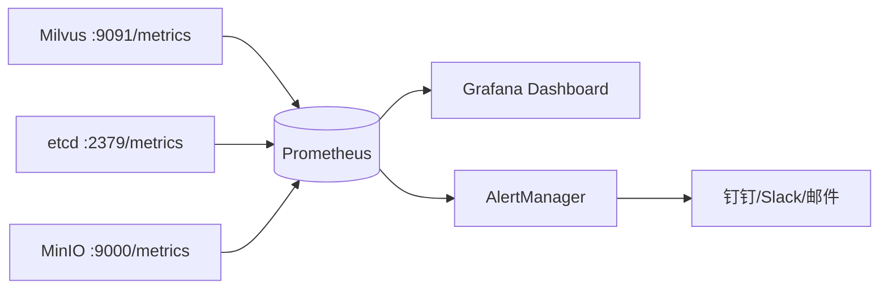
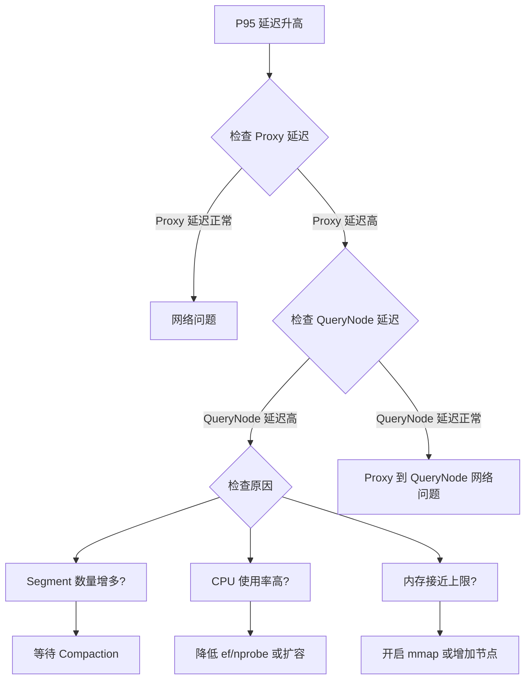

# 20 Milvus 监控体系

## 学习目标

学完本章后，你应该能够：

- 使用 Prometheus 采集 Milvus 指标。
- 配置 Grafana Dashboard 可视化关键指标。
- 识别需要关注的核心监控指标。
- 设置告警规则及时发现问题。
- 通过指标定位性能瓶颈。

---

## 监控架构



Milvus 所有组件在 `:9091/metrics` 端点暴露 Prometheus 格式的指标。

---

## 部署监控栈

### docker-compose 添加监控服务

```yaml
services:
  prometheus:
    image: prom/prometheus:v2.51.0
    ports:
      - '9090:9090'
    volumes:
      - ./configs/prometheus.yml:/etc/prometheus/prometheus.yml:ro
      - prometheus-data:/prometheus
    command:
      - '--config.file=/etc/prometheus/prometheus.yml'
      - '--storage.tsdb.retention.time=15d'

  grafana:
    image: grafana/grafana:10.4.0
    ports:
      - '3000:3000'
    environment:
      GF_SECURITY_ADMIN_PASSWORD: admin
    volumes:
      - grafana-data:/var/lib/grafana
      - ./configs/grafana/dashboards:/etc/grafana/provisioning/dashboards:ro
      - ./configs/grafana/datasources:/etc/grafana/provisioning/datasources:ro

volumes:
  prometheus-data:
  grafana-data:
```

### Prometheus 配置

`configs/prometheus.yml`：

```yaml
global:
  scrape_interval: 15s
  evaluation_interval: 15s

scrape_configs:
  - job_name: 'milvus'
    static_configs:
      - targets: ['milvus-standalone:9091']
    metrics_path: /metrics

  - job_name: 'etcd'
    static_configs:
      - targets: ['milvus-etcd:2379']
    metrics_path: /metrics

  - job_name: 'minio'
    static_configs:
      - targets: ['milvus-minio:9000']
    metrics_path: /minio/v2/metrics/cluster
```

### Grafana 数据源配置

`configs/grafana/datasources/prometheus.yml`：

```yaml
apiVersion: 1
datasources:
  - name: Prometheus
    type: prometheus
    access: proxy
    url: http://prometheus:9090
    isDefault: true
```

---

## 核心监控指标

### 搜索性能指标

| 指标名 | 含义 | 告警阈值建议 |
|---|---|---|
| `milvus_proxy_search_vectors_count` | 搜索请求数 | 监控趋势 |
| `milvus_proxy_sq_latency_bucket` | 搜索延迟分布 | P95 > 100ms |
| `milvus_proxy_sq_latency_sum/count` | 搜索平均延迟 | 均值 > 50ms |
| `milvus_querynode_sq_latency_bucket` | QueryNode 内部搜索延迟 | P95 > 50ms |

### 写入性能指标

| 指标名 | 含义 | 告警阈值建议 |
|---|---|---|
| `milvus_proxy_mutation_latency_bucket` | 写入延迟分布 | P95 > 200ms |
| `milvus_proxy_receive_bytes_count` | 接收数据量 | 监控趋势 |
| `milvus_datanode_flush_segment_count` | flush Segment 数 | 突增告警 |

### 资源指标

| 指标名 | 含义 | 告警阈值建议 |
|---|---|---|
| `milvus_querynode_collection_loaded_count` | 已加载 Collection 数 | 监控变化 |
| `milvus_querynode_entity_num` | QueryNode 加载的实体数 | 接近内存上限 |
| `milvus_datacoord_stored_binlog_size` | 存储的 Binlog 总大小 | 磁盘容量 |

### Segment 指标

| 指标名 | 含义 | 告警阈值建议 |
|---|---|---|
| `milvus_datacoord_segment_num` | Segment 总数 | > 1000 需关注 |
| `milvus_datacoord_segment_state` | 各状态 Segment 数 | growing 过多 |

---

## Grafana Dashboard

### 推荐 Dashboard

Milvus 官方提供 Grafana Dashboard JSON：

```bash
# 导入官方 Dashboard
# Grafana UI → Dashboards → Import → 输入 ID 或上传 JSON

# 官方 Dashboard ID（Grafana.com）：
# - Milvus Overview: 17535
# - Milvus Query: 17536
# - Milvus Data: 17537
```

### 自定义关键面板

**搜索延迟面板（PromQL）**：

```promql
# P50 搜索延迟
histogram_quantile(0.5, rate(milvus_proxy_sq_latency_bucket[5m]))

# P95 搜索延迟
histogram_quantile(0.95, rate(milvus_proxy_sq_latency_bucket[5m]))

# P99 搜索延迟
histogram_quantile(0.99, rate(milvus_proxy_sq_latency_bucket[5m]))
```

**QPS 面板**：

```promql
# 搜索 QPS
rate(milvus_proxy_search_vectors_count[5m])

# 写入 QPS
rate(milvus_proxy_mutation_send_latency_count[5m])
```

**内存使用面板**：

```promql
# QueryNode 内存（需要配合 node_exporter 或 cAdvisor）
container_memory_usage_bytes{container="milvus-querynode"}
```

---

## 告警规则

### Prometheus 告警规则配置

`configs/prometheus-alerts.yml`：

```yaml
groups:
  - name: milvus_alerts
    rules:
      # 搜索延迟告警
      - alert: MilvusSearchLatencyHigh
        expr: histogram_quantile(0.95, rate(milvus_proxy_sq_latency_bucket[5m])) > 0.1
        for: 5m
        labels:
          severity: warning
        annotations:
          summary: "Milvus 搜索 P95 延迟超过 100ms"
          description: "当前 P95 延迟: {{ $value }}s"

      # 搜索错误率告警
      - alert: MilvusSearchErrorRate
        expr: rate(milvus_proxy_sq_latency_count{status="fail"}[5m]) / rate(milvus_proxy_sq_latency_count[5m]) > 0.01
        for: 3m
        labels:
          severity: critical
        annotations:
          summary: "Milvus 搜索错误率超过 1%"

      # Segment 数量告警
      - alert: MilvusSegmentTooMany
        expr: milvus_datacoord_segment_num > 2000
        for: 10m
        labels:
          severity: warning
        annotations:
          summary: "Segment 数量过多，可能影响搜索性能"

      # etcd 空间告警
      - alert: EtcdSpaceHigh
        expr: etcd_mvcc_db_total_size_in_bytes / etcd_server_quota_backend_bytes > 0.8
        for: 5m
        labels:
          severity: warning
        annotations:
          summary: "etcd 存储空间使用超过 80%"
```

---

## 通过指标定位问题

### 场景一：搜索延迟突然升高



### 场景二：写入变慢

检查顺序：
1. `milvus_proxy_mutation_latency` → Proxy 层延迟
2. `milvus_datanode_flush_segment_count` → flush 是否频繁
3. Pulsar/Kafka 消费延迟 → 消息队列是否积压
4. MinIO 延迟 → 对象存储是否正常

### 场景三：内存持续增长

检查：
- `milvus_querynode_entity_num` → 加载的数据量是否在增长
- 是否有新 Collection 被 load
- 是否有 Segment 未被 release

---

## 日志监控

除了指标，日志也是重要的监控来源：

```bash
# 关键日志关键词
docker compose logs standalone | grep -i "error\|warn\|panic\|oom"

# 慢查询日志
docker compose logs standalone | grep "slow query"

# Segment 相关
docker compose logs standalone | grep -i "segment\|compaction\|flush"
```

### 日志级别调整

```yaml
# milvus.yaml
log:
  level: info  # debug/info/warn/error
  file:
    rootPath: /var/lib/milvus/logs
    maxSize: 300  # MB
    maxAge: 7     # 天
    maxBackups: 10
```

---

## 监控最佳实践

### 必须监控的 5 个指标

1. **搜索 P95 延迟** — 用户体验的直接反映
2. **搜索错误率** — 服务可用性
3. **Segment 数量** — 性能退化的先兆
4. **QueryNode 内存使用率** — OOM 预警
5. **etcd 存储使用率** — 元数据存储健康

### Dashboard 布局建议

```
┌─────────────────────────────────────────┐
│  概览：QPS / 延迟 / 错误率 / 数据量      │
├─────────────────────────────────────────┤
│  搜索：P50/P95/P99 延迟曲线             │
├─────────────────────────────────────────┤
│  写入：吞吐量 / 延迟 / flush 频率       │
├─────────────────────────────────────────┤
│  资源：CPU / 内存 / Segment 数量         │
├─────────────────────────────────────────┤
│  基础设施：etcd / MinIO / Pulsar 健康    │
└─────────────────────────────────────────┘
```

---

## 常见错误

| 现象 | 原因 | 修复 |
|---|---|---|
| Prometheus 采集不到指标 | 网络不通或端口错误 | 确认 9091 端口可访问 |
| Grafana 无数据 | 数据源配置错误 | 检查 Prometheus URL |
| 指标突然消失 | Milvus 重启或组件故障 | 检查组件状态 |
| 告警风暴 | 阈值设置过敏感 | 增加 `for` 持续时间 |
| 磁盘被 Prometheus 占满 | 保留时间太长 | 调整 `--storage.tsdb.retention.time` |

---

## 面试题

1. **为什么要同时监控 Proxy 和 QueryNode 的延迟？**
   Proxy 延迟 = 网络 + 路由 + QueryNode 延迟 + 归并。如果 Proxy 延迟高但 QueryNode 延迟正常，说明瓶颈在网络或归并层。分层监控才能精确定位。

2. **Segment 数量为什么是重要的监控指标？**
   Segment 过多意味着搜索时需要归并更多路 TopK，延迟增加。通常是频繁 flush 或写入量大但 Compaction 跟不上的信号。

3. **如何通过指标判断是否需要扩容 QueryNode？**
   观察 QueryNode 的 CPU 使用率和搜索延迟。如果 CPU > 70% 且延迟持续高于目标，说明计算资源不足，需要扩容。

4. **告警的 `for` 字段有什么作用？**
   `for: 5m` 表示条件持续满足 5 分钟才触发告警。避免瞬时波动导致的误报。关键告警（如错误率）可以设短一些，资源告警可以设长一些。

5. **监控数据本身需要高可用吗？**
   生产环境建议 Prometheus 双副本 + 远程存储（如 Thanos/VictoriaMetrics）。监控系统挂了不影响业务，但会导致故障时无法排查。

---

## 练习题

1. **部署监控栈**：在本教程的 docker-compose 中添加 Prometheus 和 Grafana，验证能采集到 Milvus 指标。

2. **自定义 Dashboard**：在 Grafana 中创建一个包含搜索延迟、QPS 和 Segment 数量的 Dashboard。

3. **告警测试**：配置一个"搜索延迟 > 50ms 持续 1 分钟"的告警规则，通过增大 ef 触发告警。

4. **问题定位演练**：故意创建大量小 Segment（频繁 flush），观察监控指标变化，通过指标定位问题。

---

## 小结

监控是生产运维的眼睛。Milvus 通过 Prometheus 指标暴露内部状态，配合 Grafana 可视化和 AlertManager 告警，形成完整的可观测性体系。核心关注五个指标：搜索延迟、错误率、Segment 数量、内存使用率、etcd 空间。监控不是部署完就结束，需要根据业务持续调整阈值和 Dashboard。
