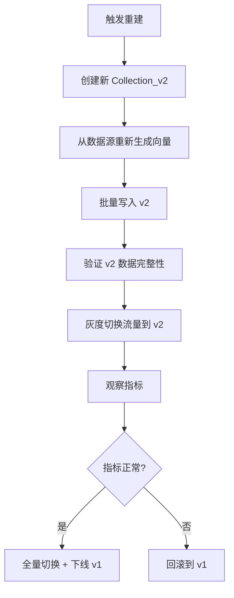

# 21 Milvus 生产最佳实践

## 学习目标

学完本章后，你应该能够：

- 制定生产环境的 Collection 设计和索引策略。
- 配置安全、鉴权和网络隔离。
- 建立数据生命周期管理流程。
- 处理版本升级和数据迁移。
- 形成完整的生产运维 Checklist。

---

## 生产环境 vs 开发环境

| 维度 | 开发环境 | 生产环境 |
|---|---|---|
| 部署模式 | Standalone + Docker Compose | Cluster + Kubernetes |
| 鉴权 | 关闭 | 开启 |
| 对象存储 | 本地 MinIO | 云 S3 / 分布式 MinIO |
| 备份 | 无 | 每日自动备份 |
| 监控 | 可选 | 必须（Prometheus + Grafana） |
| 副本数 | 1 | 2+ |
| 资源限制 | 无 | 明确 CPU/内存 limits |
| 网络 | 开放 | VPC 内网 + 安全组 |

---

## 安全配置

### 开启鉴权

```yaml
# milvus.yaml
common:
  security:
    authorizationEnabled: true
```

开启后需要使用用户名密码连接：

```python
from pymilvus import MilvusClient

client = MilvusClient(
    uri="http://milvus-host:19530",
    token="root:Milvus",  # 默认密码，必须修改
)

# 修改 root 密码
client.update_password(
    user_name="root",
    old_password="Milvus",
    new_password="your-strong-password",
)

# 创建业务用户
client.create_user(user_name="app_user", password="app-password")
```

### 网络安全


生产建议：
- Milvus 只在内网暴露 19530 端口
- 9091（指标）只对监控系统开放
- MinIO、etcd、Pulsar 不暴露到公网
- 使用安全组/NetworkPolicy 限制访问

### TLS 加密

```yaml
# milvus.yaml
tls:
  serverPemPath: /certs/server.pem
  serverKeyPath: /certs/server.key
  caPemPath: /certs/ca.pem
```

---

## Collection 生产规范

### 命名规范

```
{业务}_{数据类型}_{模型版本}

示例：
- rag_chunks_bge_v2
- product_search_clip_v1
- support_tickets_v3
```

### Schema 设计原则

1. **主键用业务 ID**（支持 upsert 幂等）
2. **高频过滤字段显式定义 + 建索引**
3. **大文本存外部**（Collection 只存摘要或 ID）
4. **记录 model_version**（方便模型升级追溯）
5. **带 created_at 时间戳**（支持 TTL 和时间过滤）

### 索引策略

| 数据规模 | 推荐索引 | 参数建议 |
|---|---|---|
| < 100 万 | HNSW | M=16, efConstruction=200 |
| 100-2000 万 | HNSW | M=16, efConstruction=200, 注意内存 |
| 2000 万 - 1 亿 | IVF_SQ8 或 HNSW+mmap | 根据内存预算选择 |
| > 1 亿 | DISKANN 或 IVF_PQ | 必须量化 |

---

## 数据生命周期管理

### 数据入库流程


### TTL 管理

```python
import time
from pymilvus import MilvusClient

def cleanup_expired_data(client: MilvusClient, collection: str, ttl_days: int):
    """清理过期数据"""
    threshold = int(time.time()) - ttl_days * 86400
    client.delete(
        collection_name=collection,
        filter=f"created_at < {threshold}",
    )
```

### 数据重建流程

模型升级或数据质量问题时需要重建：



---

## 版本升级

### 升级前检查

```bash
# 1. 备份 etcd
etcdctl snapshot save /backup/pre-upgrade.db

# 2. 记录当前状态
curl http://localhost:9091/healthz
# 记录 Collection 列表和数据量

# 3. 查看升级文档中的 breaking changes
# https://milvus.io/docs/release_notes.md
```

### 升级步骤（Docker Compose）

```bash
# 1. 停止服务
docker compose down

# 2. 修改镜像版本
# docker-compose.yml: image: milvusdb/milvus:v2.6.15 → v2.6.16

# 3. 启动新版本
docker compose up -d

# 4. 验证
curl http://localhost:9091/healthz
# 验证搜索正常
```

### 升级步骤（Kubernetes）

```bash
# 1. 备份
milvus-backup create -n pre-upgrade-backup

# 2. 升级
helm upgrade milvus milvus/milvus --set image.tag=v2.6.16 -n milvus

# 3. 观察 Pod 滚动更新
kubectl rollout status deployment/milvus-proxy -n milvus

# 4. 验证
kubectl exec -it deployment/milvus-proxy -n milvus -- curl localhost:9091/healthz
```

---

## 容量规划

### 估算公式

```python
def capacity_plan(
    num_vectors: int,
    dim: int,
    index_type: str = "HNSW",
    m: int = 16,
    num_scalar_bytes: int = 200,  # 标量字段平均大小
    replica: int = 2,
) -> dict:
    """容量规划估算"""
    # 向量内存
    vector_bytes = num_vectors * dim * 4

    # 索引开销
    if index_type == "HNSW":
        index_bytes = num_vectors * m * 16
    elif index_type == "IVF_FLAT":
        index_bytes = 0  # IVF 索引开销较小
    else:
        index_bytes = 0

    # 标量字段
    scalar_bytes = num_vectors * num_scalar_bytes

    # 总内存（单副本）
    total_single = vector_bytes + index_bytes + scalar_bytes

    # 考虑副本
    total_with_replica = total_single * replica

    # 对象存储（Binlog + Index 文件）
    storage = (vector_bytes + scalar_bytes) * 1.5  # 1.5× 冗余

    return {
        "querynode_memory_gb": total_with_replica / (1024**3),
        "object_storage_gb": storage / (1024**3),
        "recommended_querynode_count": max(2, int(total_with_replica / (1024**3) / 12) + 1),
    }

# 示例：1000 万条 768 维
plan = capacity_plan(10_000_000, 768)
print(f"QueryNode 总内存: {plan['querynode_memory_gb']:.1f} GB")
print(f"对象存储: {plan['object_storage_gb']:.1f} GB")
print(f"建议 QueryNode 数量: {plan['recommended_querynode_count']}")
```

### 增长规划

| 时间 | 数据量 | QueryNode 内存 | 对象存储 |
|---|---|---|---|
| 当前 | 500 万 | 16 GB | 30 GB |
| 6 个月后 | 1000 万 | 32 GB | 60 GB |
| 1 年后 | 2000 万 | 64 GB | 120 GB |

建议预留 50% 余量，避免紧急扩容。

---

## 运维 Checklist

### 日常检查（每日）

- [ ] Milvus healthz 正常
- [ ] 搜索 P95 延迟在目标范围内
- [ ] 无告警触发
- [ ] etcd 空间使用率 < 80%
- [ ] 对象存储空间充足

### 周度检查

- [ ] Segment 数量趋势正常
- [ ] Compaction 正常执行
- [ ] 备份成功且可恢复
- [ ] 资源使用率趋势

### 月度检查

- [ ] 容量规划更新
- [ ] 是否需要扩容
- [ ] Milvus 版本是否需要升级
- [ ] 安全补丁

### 变更前检查

- [ ] 已备份 etcd
- [ ] 已记录当前状态
- [ ] 已阅读变更影响
- [ ] 有回滚方案
- [ ] 在低峰期执行

---

## 生产问题处理模板

```markdown
## 问题描述
- 时间：
- 现象：
- 影响范围：

## 排查过程
1. 检查 healthz：
2. 检查监控指标：
3. 检查日志：
4. 定位根因：

## 处理措施
- 临时措施：
- 根本修复：

## 后续改进
- 告警补充：
- 预防措施：
```

---

## 常见错误

| 现象 | 原因 | 修复 |
|---|---|---|
| 生产环境无鉴权 | 忘记开启 | 立即开启 authorizationEnabled |
| 升级后数据丢失 | 未备份就升级 | 从备份恢复（如果有） |
| 容量不足紧急扩容 | 未做容量规划 | 建立增长预测和预留机制 |
| 模型升级导致搜索质量下降 | 直接替换未灰度 | 新建 Collection 灰度切换 |
| 大量删除后性能不恢复 | 删除是标记删除 | 等待 Compaction 或手动触发 |

---

## 面试题

1. **生产环境为什么必须开启鉴权？**
   防止未授权访问导致数据泄露或误操作。即使在内网，也可能有其他服务误连或恶意访问。鉴权是最基本的安全防线。

2. **模型升级为什么不能原地替换？**
   不同模型的向量空间不兼容，混合存储会导致搜索结果随机化。必须新建 Collection、全量重编码、灰度切换，确保数据一致性。

3. **为什么建议 Collection 名带版本号？**
   方便模型升级时创建新版本 Collection，灰度切换流量，验证后下线旧版本。没有版本号就无法并行运行新旧版本。

4. **Milvus 升级有哪些风险？**
   Schema 不兼容、API 变更、索引格式变化、配置项变更。升级前必须备份、阅读 release notes、在测试环境验证。

5. **如何判断是否需要从 Standalone 升级到 Cluster？**
   三个信号：内存不够（数据量超过单机）、需要高可用（不能单点故障）、性能不够（QPS 或写入吞吐超过单机上限）。

---

## 练习题

1. **安全加固**：开启鉴权，创建业务用户，验证无 token 无法访问。

2. **容量规划**：为你的业务场景（预估数据量和增长率）做一份 12 个月的容量规划表。

3. **升级演练**：在测试环境模拟 Milvus 小版本升级（如 v2.6.14 → v2.6.15），记录完整步骤和验证结果。

4. **故障演练**：模拟 QueryNode OOM（限制内存后写入大量数据），观察系统行为和恢复过程。

---

## 小结

生产最佳实践的核心：安全（鉴权 + 网络隔离）、可靠（备份 + 多副本 + 监控）、可演进（版本号 + 灰度 + 容量规划）。不要等出了问题再补，从第一天就按生产标准搭建。运维 Checklist 和变更流程是防止人为失误的最后防线。
