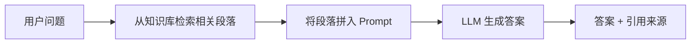
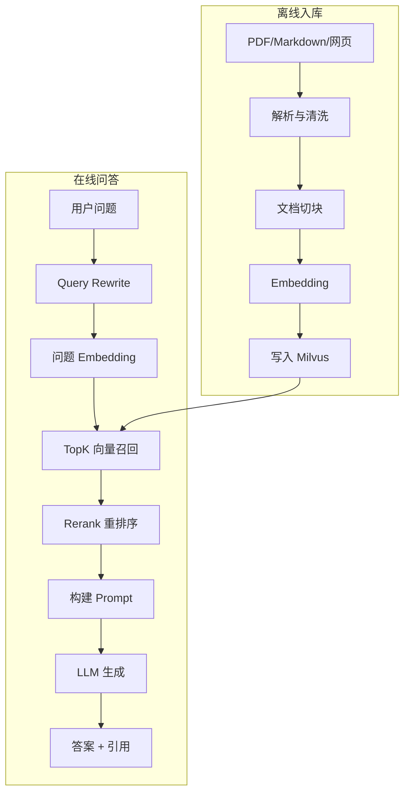
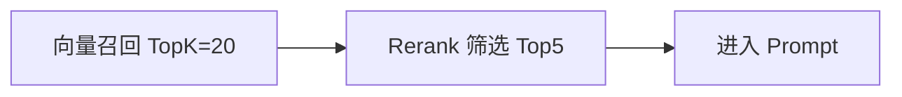
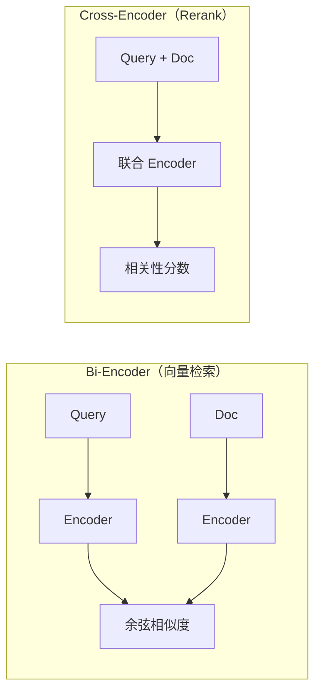

# 22 RAG 架构基础

## 学习目标

学完本章后，你应该能够：

- 解释 RAG 的完整链路和每个环节的作用。
- 设计文档解析、切块、Embedding、入库的离线流程。
- 设计 Query Rewrite、召回、Rerank、生成的在线流程。
- 判断 Chunk Size、TopK、Rerank 对召回和幻觉的影响。
- 使用 Milvus + LangChain + FastAPI 构建可运行的 RAG 服务。

---

## RAG 是什么

RAG（Retrieval-Augmented Generation）= 检索增强生成。核心思想：**让大模型基于检索到的相关资料回答问题，而不是纯靠记忆**。



### RAG vs 微调 vs 纯 LLM

| 方案 | 优点 | 缺点 | 适用场景 |
|---|---|---|---|
| 纯 LLM | 简单 | 知识过时、幻觉、无法引用 | 通用问答 |
| 微调 | 深度适配领域 | 成本高、数据需求大、更新慢 | 风格/格式适配 |
| RAG | 知识可更新、可追溯、成本低 | 依赖检索质量 | 知识库问答、文档助手 |

---

## RAG 完整链路



每个环节都可能引入误差，误差会逐级传递：

```
解析错误 → Chunk 质量差 → Embedding 不准 → 召回不相关 → Prompt 噪声大 → 答案幻觉
```

---

## 文档解析

### 常见文档格式处理

| 格式 | 推荐工具 | 注意事项 |
|---|---|---|
| PDF | PyMuPDF, pdfplumber | 表格和图片需要特殊处理 |
| Markdown | 直接解析 | 保留标题层级 |
| Word (.docx) | python-docx | 注意样式和嵌入对象 |
| HTML | BeautifulSoup | 去除导航、广告等噪声 |
| 纯文本 | 直接读取 | 注意编码 |

### PDF 解析示例

```python
import fitz  # PyMuPDF

def parse_pdf(file_path: str) -> list[dict]:
    """解析 PDF，按页提取文本"""
    doc = fitz.open(file_path)
    pages = []
    for page_num, page in enumerate(doc, start=1):
        text = page.get_text("text")
        if text.strip():
            pages.append({
                "page": page_num,
                "text": text.strip(),
                "source": file_path,
            })
    doc.close()
    return pages
```

---

## 文档切块（Chunking）

Chunk 是 RAG 的最小召回单位。切块策略直接影响检索质量。

### 为什么 Chunk 很重要

```mermaid
flowchart TB
    subgraph Chunk 太大
        A[一个 Chunk 包含多个主题]
        A --> B[Embedding 混合多个语义]
        B --> C[召回后噪声大]
        C --> D[LLM 上下文冗余]
    end

    subgraph Chunk 太小
        E[一个 Chunk 只有半句话]
        E --> F[语义不完整]
        F --> G[LLM 无法理解上下文]
        G --> H[需要召回更多 Chunk]
    end

    subgraph Chunk 合适
        I[一个 Chunk 包含完整段落]
        I --> J[Embedding 语义清晰]
        J --> K[召回精准]
        K --> L[LLM 有足够上下文]
    end
```



### 切块策略对比

| 策略 | 实现 | 优点 | 缺点 | 适用场景 |
|---|---|---|---|---|
| 固定长度 | 按字符数切割 | 简单稳定 | 可能切断语义 | 通用起点 |
| 递归分割 | 按分隔符层级切割 | 尊重段落结构 | 依赖文档格式 | 大多数场景 |
| 标题层级 | 按 H1/H2/H3 切割 | 结构完整 | 依赖标题标记 | 结构化文档 |
| 语义切块 | 用模型判断语义边界 | 质量最高 | 慢、成本高 | 高价值知识库 |

### 递归分割实现

```python
from langchain_text_splitters import RecursiveCharacterTextSplitter

splitter = RecursiveCharacterTextSplitter(
    chunk_size=600,        # 目标 Chunk 大小（字符数）
    chunk_overlap=100,     # 相邻 Chunk 重叠
    separators=["\n\n", "\n", "。", "！", "？", "；", " ", ""],
)

texts = splitter.split_text(long_document)
```

### Chunk Size 如何影响召回

| Chunk Size | 召回精度 | 上下文完整性 | 数据量 | 建议 |
|---|---|---|---|---|
| 200 字 | 高（精确匹配） | 低（信息碎片） | 大 | 短 FAQ |
| 400-600 字 | 中高 | 中 | 中 | **通用推荐起点** |
| 800-1200 字 | 中 | 高 | 小 | 长文档、法律条款 |
| > 1500 字 | 低（主题混合） | 很高 | 很小 | 不推荐 |

### Overlap 的作用

Overlap 保证相邻 Chunk 之间有上下文衔接：

```
Chunk 1: [......句子 A。句子 B。句子 C。]
Chunk 2:                    [句子 C。句子 D。句子 E。]
                             ↑ overlap 区域
```

如果答案跨越两个 Chunk 的边界，overlap 保证至少有一个 Chunk 包含完整信息。

---

## Query Rewrite（查询改写）

用户的原始问题可能不适合直接检索：

| 原始问题 | 问题 | 改写后 |
|---|---|---|
| "它支持什么？" | 代词不明确 | "Milvus 支持哪些索引类型？" |
| "上次说的那个" | 依赖对话历史 | "之前讨论的 HNSW 参数调优方法" |
| "怎么弄" | 太模糊 | "如何在 Milvus 中创建 Collection？" |

### 实现方式

```python
def rewrite_query(question: str, history: list[dict]) -> str:
    """基于对话历史改写查询"""
    if not history:
        return question

    # 方式一：简单拼接上下文（无需 LLM）
    recent_context = " ".join(
        msg.get("content", "") for msg in history[-4:]
    )
    return f"结合上下文：{recent_context}\n当前问题：{question}"

    # 方式二：用 LLM 改写（效果更好，成本更高）
    # prompt = f"请将以下问题改写为独立、明确的检索查询：\n历史：{history}\n问题：{question}"
    # return call_llm(prompt)
```

---

## 向量召回

```python
from pymilvus import MilvusClient

client = MilvusClient(uri="http://localhost:19530")

def recall(query_vector: list[float], top_k: int = 20, filter_expr: str = "") -> list[dict]:
    """向量召回"""
    results = client.search(
        collection_name="rag_chunks",
        data=[query_vector],
        anns_field="embedding",
        search_params={"metric_type": "COSINE", "params": {"ef": 128}},
        limit=top_k,
        filter=filter_expr,
        output_fields=["text", "source", "page", "chunk_id"],
    )
    return [
        {
            "text": hit["entity"]["text"],
            "source": hit["entity"]["source"],
            "page": hit["entity"]["page"],
            "chunk_id": hit["entity"]["chunk_id"],
            "score": hit["distance"],
        }
        for hit in results[0]
    ]
```

### TopK 如何选择



| 阶段 | TopK | 原因 |
|---|---|---|
| 向量召回 | 10-30 | 多召回保证覆盖，ANN 可能漏掉相关结果 |
| Rerank 后 | 3-5 | 控制 Prompt 长度和噪声 |

TopK 太大的问题：
- 上下文过长 → LLM 成本高
- 噪声增多 → 幻觉风险增加
- Rerank 计算量增大

---

## Rerank（重排序）

向量召回是粗排，Rerank 是精排。Rerank 模型直接计算 query-document 的相关性分数。

### 为什么需要 Rerank

向量检索用的是 bi-encoder（query 和 doc 独立编码），速度快但精度有限。Rerank 用 cross-encoder（query 和 doc 联合编码），精度高但速度慢。



### Rerank 实现

```python
from sentence_transformers import CrossEncoder

reranker = CrossEncoder("BAAI/bge-reranker-base")

def rerank(question: str, docs: list[dict], top_n: int = 5) -> list[dict]:
    """使用 Cross-Encoder 重排序"""
    pairs = [[question, doc["text"]] for doc in docs]
    scores = reranker.predict(pairs)

    for doc, score in zip(docs, scores):
        doc["rerank_score"] = float(score)

    ranked = sorted(docs, key=lambda x: x["rerank_score"], reverse=True)
    return ranked[:top_n]
```

### Rerank 模型推荐

| 模型 | 大小 | 中文支持 | 速度 |
|---|---|---|---|
| `BAAI/bge-reranker-base` | ~400MB | 好 | 中 |
| `BAAI/bge-reranker-large` | ~1.2GB | 很好 | 慢 |
| `BAAI/bge-reranker-v2-m3` | ~600MB | 多语言 | 中 |

---

## Prompt 构建

```python
def build_rag_prompt(question: str, docs: list[dict]) -> str:
    """构建 RAG Prompt"""
    context = "\n\n".join(
        f"[来源 {i}] {doc['source']} 第{doc['page']}页\n{doc['text']}"
        for i, doc in enumerate(docs, start=1)
    )

    return f"""你是严谨的知识库问答助手。请严格根据以下资料回答问题。

规则：
1. 只基于提供的资料回答，不要使用自己的知识
2. 如果资料不足以回答，明确说"根据现有资料无法判断"
3. 在关键结论后标注来源编号，如 [来源 1]
4. 用中文回答

资料：
{context}

问题：{question}

请回答："""
```

### 如何降低幻觉

1. **Prompt 约束**：明确要求"只基于资料回答"
2. **拒答机制**：资料不足时要求说"无法判断"
3. **引用标注**：强制标注来源，方便用户验证
4. **Rerank 过滤**：去掉低相关性的 Chunk
5. **温度控制**：`temperature=0.1-0.3`，减少随机性

---

## 完整代码

完整工程见 `../demos/rag-system`：

```bash
cd milvus-master-course
./scripts/start.sh
cd demos/rag-system
cp .env.example .env
# 编辑 .env 配置 OPENAI_API_KEY（可选）
uvicorn main:app --reload --port 8001
```

### API 示例

导入文本：

```bash
curl -X POST http://localhost:8001/ingest/text \
  -H 'Content-Type: application/json' \
  -d '{"source":"milvus-doc","text":"Milvus 是面向 AI 应用的高性能向量数据库，支持 HNSW、IVF 等多种索引类型，适用于 RAG、图片检索、推荐系统等场景。"}'
```

提问：

```bash
curl -X POST http://localhost:8001/ask \
  -H 'Content-Type: application/json' \
  -d '{"question":"Milvus 支持哪些索引？","top_k":5}'
```

---

## RAG 评测

### 评测指标

| 指标 | 含义 | 计算方式 |
|---|---|---|
| Recall@K | 相关文档被召回的比例 | 召回的相关文档数 / 总相关文档数 |
| MRR | 第一个相关结果的排名倒数 | 1 / 第一个相关结果的排名 |
| Answer Accuracy | 答案正确率 | 人工评估或 LLM 评估 |
| Faithfulness | 答案是否忠于检索内容 | 答案中的信息是否都能在资料中找到 |

### 简易评测框架

```python
def evaluate_rag(
    qa_pairs: list[dict],  # [{"question": ..., "expected_sources": [...], "expected_answer": ...}]
    recall_fn,
    answer_fn,
    top_k: int = 5,
) -> dict:
    """RAG 系统评测"""
    recall_hits = 0
    recall_total = 0

    for qa in qa_pairs:
        recalled = recall_fn(qa["question"], top_k)
        recalled_sources = {doc["source"] for doc in recalled}
        expected = set(qa["expected_sources"])

        recall_hits += len(recalled_sources & expected)
        recall_total += len(expected)

    return {
        "recall@k": recall_hits / recall_total if recall_total > 0 else 0,
        "num_questions": len(qa_pairs),
    }
```

---

## 常见错误

| 现象 | 原因 | 修复 |
|---|---|---|
| 答案看似流畅但不准确 | Prompt 没有限制依据来源 | 强制引用上下文，缺证据时拒答 |
| 找不到相关内容 | Chunk 策略差、模型不匹配 | 调整 Chunk Size、换中文模型 |
| 延迟高 | Recall 太多、Rerank 慢 | 减少 TopK、用更小的 Reranker |
| 多轮对话跑偏 | 没有 Query Rewrite | 用历史改写当前问题 |
| 答案引用错误来源 | Prompt 中来源编号混乱 | 检查 Prompt 模板格式 |

---

## 面试题

1. **RAG 和直接微调有什么差异？**
   RAG 不修改模型权重，通过检索提供上下文。优点：知识可实时更新、可追溯、成本低。缺点：依赖检索质量。微调改变模型行为，适合风格适配但知识更新慢。

2. **Chunk Size 如何影响召回率和幻觉？**
   Chunk 太小：语义碎片化，单个 Chunk 信息不足，需要更多 Chunk 才能回答。Chunk 太大：主题混合，Embedding 不精确，召回噪声大，LLM 可能从无关内容中"编造"答案。

3. **为什么需要 Rerank？向量检索不够吗？**
   向量检索是 bi-encoder，query 和 doc 独立编码，无法捕捉细粒度交互。Rerank 用 cross-encoder 联合编码，能更准确判断相关性，但速度慢只能用于少量候选。

4. **TopK 是越大越好吗？**
   不是。TopK 越大，上下文越长（LLM 成本高、注意力分散），噪声越多（弱相关内容可能误导 LLM）。通常向量召回 20，Rerank 后取 3-5 进入 Prompt。

5. **如何评估一个 RAG 系统是否真的变好？**
   建立标注评测集（问题 + 标准答案 + 相关文档），计算 Recall@K、Answer Accuracy、Faithfulness。不能只靠主观感觉，必须有量化指标。

---

## 练习题

1. **Chunk Size 实验**：准备 5 个 PDF，分别用 Chunk Size=300、600、1000 切块入库。用 10 个问题测试，记录每种 Chunk Size 的命中情况。

2. **Rerank 效果**：对比有 Rerank 和无 Rerank 时的答案质量。用 10 个问题，人工评估答案正确率。

3. **Prompt 约束实验**：在 Prompt 中去掉"必须基于资料回答"的约束，观察幻觉变化。

4. **评测集构建**：为你的知识库构建 20 个 QA 对（问题 + 标准答案 + 相关来源），计算 Recall@5。

---

## 小结

RAG 的核心不是"向量库 + LLM"这么简单，而是围绕知识切块、召回质量、排序质量、上下文压缩和生成约束建立一条可评测链路。每个环节都有优化空间，但最重要的是：建立评测集，用数据驱动优化，而不是凭感觉调参。下一章将进入完整的 RAG 知识库实战项目。
