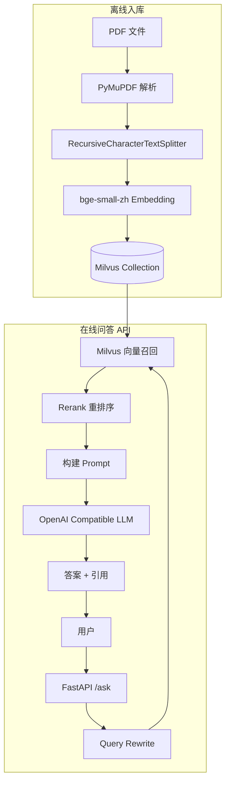

# 23 RAG 知识库实战

## 学习目标

学完本章后，你应该能够：

- 搭建完整的 PDF 知识库问答系统。
- 实现文档解析、切块、Embedding、入库的完整离线流程。
- 实现问答、引用来源、多轮对话的完整在线流程。
- 使用 FastAPI 暴露 RESTful API。
- 部署并验证端到端的 RAG 服务。

---

## 项目架构



---

## 项目结构

```
demos/rag-system/
├── main.py              # FastAPI 入口，问答 API
├── config.py            # 配置管理
├── embeddings.py        # Embedding 服务封装
├── vector_store.py      # Milvus 向量存储封装
├── ingest_pdf.py        # PDF 解析入库脚本
├── requirements.txt     # 依赖
├── .env.example         # 环境变量模板
├── docker-compose.yml   # Milvus 服务
└── README.md
```

---

## 配置管理

```python
# config.py
from pydantic_settings import BaseSettings

class Settings(BaseSettings):
    # Milvus
    milvus_uri: str = "http://localhost:19530"
    milvus_token: str = ""
    collection_name: str = "rag_knowledge_base"

    # Embedding
    embedding_model: str = "BAAI/bge-small-zh-v1.5"

    # Chunking
    chunk_size: int = 600
    chunk_overlap: int = 100

    # Rerank
    rerank_top_n: int = 5

    # LLM
    openai_api_key: str = ""
    openai_base_url: str = "https://api.openai.com/v1"
    openai_model: str = "gpt-4.1-mini"

    # Logging
    log_level: str = "INFO"

    class Config:
        env_file = ".env"
```

---

## Embedding 服务

```python
# embeddings.py
import numpy as np
from sentence_transformers import SentenceTransformer

class EmbeddingService:
    def __init__(self, model_name: str, device: str = "cpu"):
        self._model = SentenceTransformer(model_name, device=device)
        self._dim = self._model.get_sentence_embedding_dimension()

    @property
    def dim(self) -> int:
        return self._dim

    def encode(self, texts: list[str]) -> list[list[float]]:
        vectors = self._model.encode(
            texts,
            normalize_embeddings=True,
            show_progress_bar=False,
        )
        return vectors.astype("float32").tolist()
```

---

## 向量存储层

```python
# vector_store.py
from dataclasses import dataclass
from typing import Any

from pymilvus import DataType, MilvusClient


@dataclass
class Chunk:
    text: str
    source: str
    page: int = 0
    chunk_id: int = 0


class RagVectorStore:
    def __init__(self, uri: str, token: str, collection: str, dim: int):
        self._client = MilvusClient(uri=uri, token=token or None)
        self._collection = collection
        self._ensure_collection(dim)

    def _ensure_collection(self, dim: int) -> None:
        if self._client.has_collection(self._collection):
            self._client.load_collection(self._collection)
            return

        schema = MilvusClient.create_schema(auto_id=False, enable_dynamic_field=False)
        schema.add_field(field_name="id", datatype=DataType.VARCHAR, is_primary=True, max_length=64)
        schema.add_field(field_name="text", datatype=DataType.VARCHAR, max_length=8192)
        schema.add_field(field_name="source", datatype=DataType.VARCHAR, max_length=256)
        schema.add_field(field_name="page", datatype=DataType.INT32)
        schema.add_field(field_name="chunk_id", datatype=DataType.INT32)
        schema.add_field(field_name="embedding", datatype=DataType.FLOAT_VECTOR, dim=dim)

        index_params = MilvusClient.prepare_index_params()
        index_params.add_index(
            field_name="embedding",
            index_type="HNSW",
            metric_type="COSINE",
            params={"M": 16, "efConstruction": 200},
        )
        index_params.add_index(field_name="source", index_type="INVERTED")

        self._client.create_collection(
            collection_name=self._collection,
            schema=schema,
            index_params=index_params,
        )
        self._client.load_collection(self._collection)

    def upsert_chunks(self, chunks: list[Chunk], vectors: list[list[float]]) -> int:
        import hashlib
        rows = []
        for chunk, vector in zip(chunks, vectors):
            pk = hashlib.sha256(
                f"{chunk.source}:p{chunk.page}:c{chunk.chunk_id}".encode()
            ).hexdigest()[:32]
            rows.append({
                "id": pk,
                "text": chunk.text,
                "source": chunk.source,
                "page": chunk.page,
                "chunk_id": chunk.chunk_id,
                "embedding": vector,
            })
        result = self._client.upsert(collection_name=self._collection, data=rows)
        return result["upsert_count"]

    def search(self, query_vector: list[float], top_k: int = 20, filter_expr: str = "") -> list[dict[str, Any]]:
        results = self._client.search(
            collection_name=self._collection,
            data=[query_vector],
            anns_field="embedding",
            search_params={"metric_type": "COSINE", "params": {"ef": 128}},
            limit=top_k,
            filter=filter_expr or None,
            output_fields=["text", "source", "page", "chunk_id"],
        )
        return [
            {
                "text": hit["entity"]["text"],
                "source": hit["entity"]["source"],
                "page": hit["entity"]["page"],
                "chunk_id": hit["entity"]["chunk_id"],
                "score": hit["distance"],
            }
            for hit in results[0]
        ]
```

---

## PDF 入库脚本

```python
# ingest_pdf.py
import logging
import sys
from pathlib import Path

import fitz  # PyMuPDF
from langchain_text_splitters import RecursiveCharacterTextSplitter

from config import Settings
from embeddings import EmbeddingService
from vector_store import Chunk, RagVectorStore

logging.basicConfig(level="INFO", format="%(asctime)s %(levelname)s %(message)s")
logger = logging.getLogger(__name__)


def parse_pdf(file_path: str) -> list[dict]:
    """解析 PDF 提取文本"""
    doc = fitz.open(file_path)
    pages = []
    for page_num, page in enumerate(doc, start=1):
        text = page.get_text("text").strip()
        if text:
            pages.append({"page": page_num, "text": text})
    doc.close()
    logger.info("解析 %s: %d 页有效文本", file_path, len(pages))
    return pages


def chunk_pages(pages: list[dict], source: str, chunk_size: int, chunk_overlap: int) -> list[Chunk]:
    """将页面文本切块"""
    splitter = RecursiveCharacterTextSplitter(
        chunk_size=chunk_size,
        chunk_overlap=chunk_overlap,
        separators=["\n\n", "\n", "。", "！", "？", "；", " ", ""],
    )
    chunks = []
    chunk_idx = 0
    for page_info in pages:
        page_chunks = splitter.split_text(page_info["text"])
        for text in page_chunks:
            chunks.append(Chunk(
                text=text,
                source=source,
                page=page_info["page"],
                chunk_id=chunk_idx,
            ))
            chunk_idx += 1
    return chunks


def ingest_pdf(file_path: str, settings: Settings) -> int:
    """完整的 PDF 入库流程"""
    # 1. 解析
    pages = parse_pdf(file_path)
    if not pages:
        logger.warning("PDF 无有效文本: %s", file_path)
        return 0

    # 2. 切块
    source = Path(file_path).name
    chunks = chunk_pages(pages, source, settings.chunk_size, settings.chunk_overlap)
    logger.info("切块完成: %d 个 Chunk", len(chunks))

    # 3. Embedding
    embedding_service = EmbeddingService(settings.embedding_model)
    texts = [chunk.text for chunk in chunks]
    vectors = embedding_service.encode(texts)
    logger.info("Embedding 完成: %d 个向量", len(vectors))

    # 4. 写入 Milvus
    store = RagVectorStore(settings.milvus_uri, settings.milvus_token,
                           settings.collection_name, embedding_service.dim)
    count = store.upsert_chunks(chunks, vectors)
    logger.info("写入 Milvus: %d 条", count)
    return count


if __name__ == "__main__":
    if len(sys.argv) < 2:
        print("用法: python ingest_pdf.py <pdf_path> [pdf_path2 ...]")
        sys.exit(1)

    settings = Settings()
    total = 0
    for pdf_path in sys.argv[1:]:
        total += ingest_pdf(pdf_path, settings)
    print(f"总计入库: {total} 条")
```

---

## FastAPI 问答服务

```python
# main.py（核心逻辑）
from fastapi import FastAPI, HTTPException
from pydantic import BaseModel, Field
from openai import OpenAI

from config import Settings
from embeddings import EmbeddingService
from vector_store import RagVectorStore

settings = Settings()
embedding_service = EmbeddingService(settings.embedding_model)
store = RagVectorStore(settings.milvus_uri, settings.milvus_token,
                       settings.collection_name, embedding_service.dim)
app = FastAPI(title="Milvus RAG System", version="1.0.0")


class AskRequest(BaseModel):
    question: str
    top_k: int = 10
    history: list[dict] = Field(default_factory=list)


class AskResponse(BaseModel):
    answer: str
    rewritten_question: str
    citations: list[dict]


def rewrite_query(question: str, history: list[dict]) -> str:
    if not history:
        return question
    recent = " ".join(item.get("content", "") for item in history[-4:])
    return f"结合上下文：{recent}\n当前问题：{question}"


def rerank_simple(question: str, docs: list[dict], top_n: int) -> list[dict]:
    """轻量 Rerank：字符重叠度排序（生产环境替换为 CrossEncoder）"""
    q_chars = set(question.lower())
    for doc in docs:
        text_chars = set(doc["text"].lower())
        doc["rerank_score"] = len(q_chars & text_chars) / max(len(q_chars), 1)
    return sorted(docs, key=lambda x: (x["rerank_score"], x["score"]), reverse=True)[:top_n]


def build_prompt(question: str, docs: list[dict]) -> str:
    context = "\n\n".join(
        f"[来源 {i}] {doc['source']} 第{doc['page']}页\n{doc['text']}"
        for i, doc in enumerate(docs, start=1)
    )
    return f"""你是严谨的知识库问答助手。请只根据以下资料回答；如果资料不足，请说"根据现有资料无法判断"。

资料：
{context}

问题：{question}

请给出中文答案，并在关键结论后标注来源编号。"""


def call_llm(prompt: str) -> str:
    if not settings.openai_api_key:
        return "未配置 OPENAI_API_KEY，以下是检索到的资料摘要：\n" + prompt[:1200]
    client = OpenAI(api_key=settings.openai_api_key, base_url=settings.openai_base_url)
    response = client.chat.completions.create(
        model=settings.openai_model,
        messages=[{"role": "user", "content": prompt}],
        temperature=0.2,
    )
    return response.choices[0].message.content or ""


@app.post("/ask", response_model=AskResponse)
def ask(payload: AskRequest):
    if not payload.question.strip():
        raise HTTPException(status_code=400, detail="question 不能为空")

    # 1. Query Rewrite
    rewritten = rewrite_query(payload.question, payload.history)

    # 2. Embedding + 向量召回
    qv = embedding_service.encode([rewritten])[0]
    recalled = store.search(qv, top_k=payload.top_k)

    # 3. Rerank
    selected = rerank_simple(rewritten, recalled, top_n=settings.rerank_top_n)

    # 4. 构建 Prompt + LLM 生成
    prompt = build_prompt(payload.question, selected)
    answer = call_llm(prompt)

    # 5. 返回答案和引用
    citations = [
        {"source": doc["source"], "page": doc["page"],
         "chunk_id": doc["chunk_id"], "score": doc["score"]}
        for doc in selected
    ]
    return AskResponse(answer=answer, rewritten_question=rewritten, citations=citations)


@app.get("/health")
def health():
    return {"status": "ok"}
```

---

## 运行步骤

```bash
# 1. 启动 Milvus
cd milvus-master-course
./scripts/start.sh

# 2. 安装依赖
cd demos/rag-system
pip install -r requirements.txt

# 3. 配置环境变量
cp .env.example .env
# 编辑 .env，填入 OPENAI_API_KEY（可选）

# 4. 导入 PDF
python ingest_pdf.py /path/to/your/document.pdf

# 5. 启动问答服务
uvicorn main:app --reload --port 8001

# 6. 测试
curl -X POST http://localhost:8001/ask \
  -H 'Content-Type: application/json' \
  -d '{"question":"文档中提到了哪些关键概念？","top_k":10}'
```

---

## 多轮对话

```bash
# 第一轮
curl -X POST http://localhost:8001/ask \
  -H 'Content-Type: application/json' \
  -d '{"question":"Milvus 支持哪些索引？","top_k":5}'

# 第二轮（带历史）
curl -X POST http://localhost:8001/ask \
  -H 'Content-Type: application/json' \
  -d '{
    "question":"它们的性能差异是什么？",
    "top_k":5,
    "history":[
      {"role":"user","content":"Milvus 支持哪些索引？"},
      {"role":"assistant","content":"Milvus 支持 HNSW、IVF、PQ 等索引..."}
    ]
  }'
```

Query Rewrite 会将"它们"解析为上文提到的索引类型。

---

## 生产增强

### 替换为真实 Reranker

```python
from sentence_transformers import CrossEncoder

reranker = CrossEncoder("BAAI/bge-reranker-base")

def rerank_production(question: str, docs: list[dict], top_n: int) -> list[dict]:
    pairs = [[question, doc["text"]] for doc in docs]
    scores = reranker.predict(pairs)
    for doc, score in zip(docs, scores):
        doc["rerank_score"] = float(score)
    return sorted(docs, key=lambda x: x["rerank_score"], reverse=True)[:top_n]
```

### 添加文档来源过滤

```bash
# 只搜索特定文档
curl -X POST http://localhost:8001/ask \
  -H 'Content-Type: application/json' \
  -d '{"question":"...","top_k":5,"filter":"source == \"manual.pdf\""}'
```

### 流式输出

```python
from fastapi.responses import StreamingResponse

@app.post("/ask/stream")
async def ask_stream(payload: AskRequest):
    # ... 召回和 Rerank 同上 ...
    client = OpenAI(api_key=settings.openai_api_key, base_url=settings.openai_base_url)
    stream = client.chat.completions.create(
        model=settings.openai_model,
        messages=[{"role": "user", "content": prompt}],
        temperature=0.2,
        stream=True,
    )

    def generate():
        for chunk in stream:
            if chunk.choices[0].delta.content:
                yield chunk.choices[0].delta.content

    return StreamingResponse(generate(), media_type="text/plain")
```

---

## 常见错误

| 现象 | 原因 | 修复 |
|---|---|---|
| PDF 解析出乱码 | PDF 是扫描件或加密 | 用 OCR（pytesseract）或解密 |
| 入库后搜索不到 | Collection 未 load 或 Embedding 维度不匹配 | 检查 load 状态和 dim |
| 答案与问题无关 | 召回的 Chunk 不相关 | 检查 Chunk 策略和 Embedding 模型 |
| LLM 返回空 | API Key 无效或余额不足 | 检查 .env 配置 |
| 多轮对话越聊越偏 | Query Rewrite 不够好 | 用 LLM 做改写而非简单拼接 |

---

## 面试题

1. **这个 RAG 系统的瓶颈在哪里？**
   离线：Embedding 生成速度（CPU 慢）。在线：LLM 生成延迟（通常 1-5s）。向量召回本身很快（< 10ms）。优化重点是 Embedding 服务化 + LLM 流式输出。

2. **如何处理 PDF 中的表格和图片？**
   表格：用 pdfplumber 或 camelot 提取结构化数据，转为文本描述。图片：用多模态模型（如 GPT-4V）生成描述文本，再入库。

3. **如何保证答案的可追溯性？**
   每个 Chunk 保存 source + page + chunk_id，答案中标注来源编号，用户可以点击跳转到原文位置。

4. **如何处理知识库更新？**
   用 upsert（基于内容 hash 的主键）。文档更新时重新解析入库，相同位置的 Chunk 会被覆盖，新增的 Chunk 会被插入。

5. **没有 OpenAI API Key 时如何测试？**
   本项目在无 Key 时会返回检索到的资料摘要，验证召回质量。也可以用本地 LLM（Ollama + OpenAI 兼容 API）。

---

## 练习题

1. **端到端测试**：导入一份你熟悉的 PDF，提出 5 个问题，评估答案质量和引用准确性。

2. **Chunk Size 对比**：同一份 PDF 分别用 chunk_size=300、600、1000 入库（三个 Collection），对比同一问题的召回结果。

3. **Reranker 升级**：将简易 Rerank 替换为 `bge-reranker-base`，对比答案质量变化。

4. **多文档测试**：导入 3 份不同主题的 PDF，验证 source 过滤是否能正确隔离搜索范围。

---

## 小结

本章实现了一个完整的 RAG 知识库系统：PDF 解析 → 切块 → Embedding → Milvus 入库 → Query Rewrite → 向量召回 → Rerank → LLM 生成 → 引用返回。这是一个可运行的最小生产系统，后续章节将在此基础上优化召回质量（第 24 章）和 Rerank 策略（第 25 章）。
