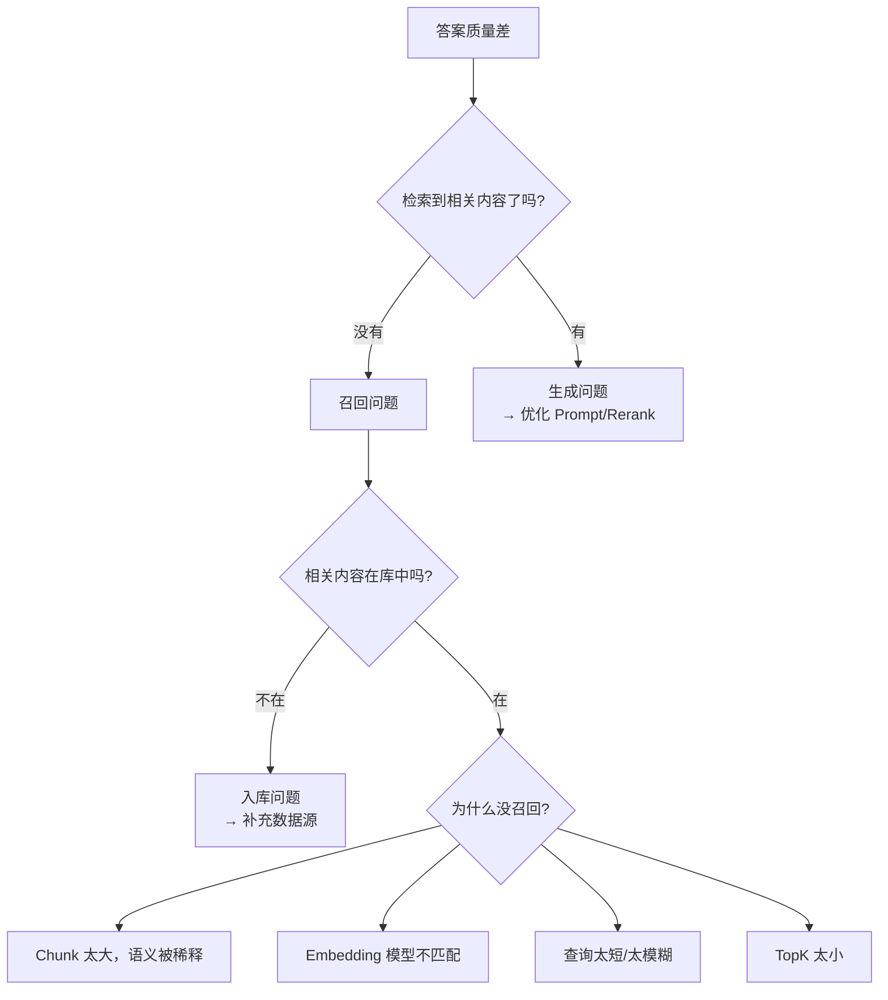
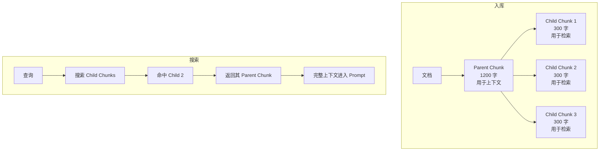
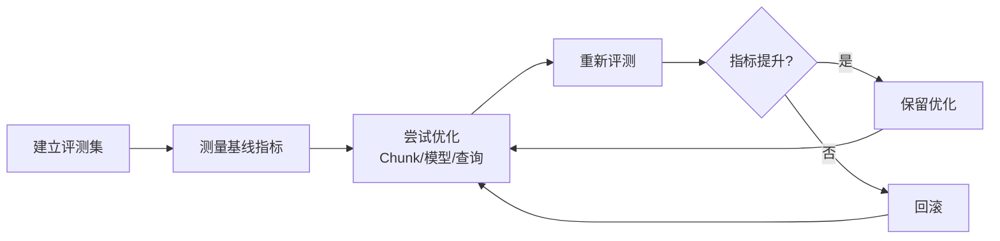

# 24 RAG 召回优化

## 学习目标

学完本章后，你应该能够：

- 诊断 RAG 系统召回质量不足的原因。
- 通过优化 Chunk 策略提升召回精度。
- 使用 Query Expansion 和 HyDE 增强查询。
- 实现 Parent-Child Chunk 策略。
- 建立召回评测体系持续优化。

---

## 召回质量诊断

RAG 答案不好时，召回阶段是最值得优先排查的环节之一，但生成模型、提示词和文档质量也可能是根因。诊断流程：



### 快速诊断方法

```python
def diagnose_recall(question: str, expected_text: str, store, embedding_service):
    """诊断为什么没有召回预期内容"""
    # 1. 检查预期内容是否在库中
    qv = embedding_service.encode([expected_text])[0]
    results = store.search(qv, top_k=1)
    if results and results[0]["score"] > 0.9:
        print(f"✓ 预期内容在库中，score={results[0]['score']:.4f}")
    else:
        print("✗ 预期内容不在库中或 Embedding 不匹配")
        return

    # 2. 用原始问题搜索
    qv2 = embedding_service.encode([question])[0]
    results2 = store.search(qv2, top_k=20)
    for i, r in enumerate(results2):
        if expected_text[:50] in r["text"]:
            print(f"✓ 在 Top{i+1} 找到预期内容，score={r['score']:.4f}")
            return
    print(f"✗ Top20 中未找到预期内容，问题可能在查询或 Chunk 策略")
```

---

## 优化一：Chunk 策略改进

### 问题：固定长度切块的缺陷

固定长度切块可能在语义中间断开：

```
原文：HNSW 是一种基于图的索引算法。它通过构建多层
---切割点---
导航图来加速搜索。每层图的节点密度不同。
```

### 解决方案：语义感知切块

```python
from langchain_text_splitters import RecursiveCharacterTextSplitter

# 改进：使用更多中文分隔符，优先在自然边界切割
splitter = RecursiveCharacterTextSplitter(
    chunk_size=500,
    chunk_overlap=80,
    separators=[
        "\n\n",      # 段落
        "\n",        # 换行
        "。",        # 句号
        "！",        # 感叹号
        "？",        # 问号
        "；",        # 分号
        "，",        # 逗号（最后手段）
        " ",
        "",
    ],
    keep_separator=True,
)
```

### 解决方案：标题感知切块

对结构化文档（Markdown、带标题的 PDF），按标题层级切块：

```python
def chunk_by_headings(text: str, source: str) -> list[dict]:
    """按标题层级切块"""
    import re
    sections = re.split(r'\n(#{1,3}\s+.+)\n', text)

    chunks = []
    current_heading = ""
    for i, section in enumerate(sections):
        if re.match(r'^#{1,3}\s+', section):
            current_heading = section.strip()
        elif section.strip():
            chunks.append({
                "text": f"{current_heading}\n{section.strip()}",
                "heading": current_heading,
                "source": source,
            })
    return chunks
```

---

## 优化二：Parent-Child Chunk

核心思想：**用小 Chunk 做检索（精确匹配），用大 Chunk 做上下文（信息完整）**。



### 实现

```python
import hashlib
from dataclasses import dataclass

@dataclass
class ParentChildChunk:
    child_text: str
    parent_text: str
    source: str
    page: int
    parent_id: str
    child_id: str


def create_parent_child_chunks(
    text: str,
    source: str,
    page: int,
    parent_size: int = 1200,
    child_size: int = 300,
    child_overlap: int = 50,
) -> list[ParentChildChunk]:
    """生成 Parent-Child Chunk 对"""
    from langchain_text_splitters import RecursiveCharacterTextSplitter

    # 先切 Parent
    parent_splitter = RecursiveCharacterTextSplitter(
        chunk_size=parent_size, chunk_overlap=0,
        separators=["\n\n", "\n", "。", " ", ""],
    )
    parents = parent_splitter.split_text(text)

    # 每个 Parent 再切 Child
    child_splitter = RecursiveCharacterTextSplitter(
        chunk_size=child_size, chunk_overlap=child_overlap,
        separators=["\n", "。", "！", "？", " ", ""],
    )

    results = []
    for p_idx, parent_text in enumerate(parents):
        parent_id = hashlib.md5(f"{source}:p{page}:parent{p_idx}".encode()).hexdigest()[:16]
        children = child_splitter.split_text(parent_text)

        for c_idx, child_text in enumerate(children):
            child_id = f"{parent_id}:c{c_idx}"
            results.append(ParentChildChunk(
                child_text=child_text,
                parent_text=parent_text,
                source=source,
                page=page,
                parent_id=parent_id,
                child_id=child_id,
            ))
    return results
```

### Schema 设计

```python
# Child Chunk 入库（用于搜索）
schema.add_field(field_name="id", datatype=DataType.VARCHAR, is_primary=True, max_length=64)
schema.add_field(field_name="child_text", datatype=DataType.VARCHAR, max_length=2048)
schema.add_field(field_name="parent_text", datatype=DataType.VARCHAR, max_length=8192)
schema.add_field(field_name="parent_id", datatype=DataType.VARCHAR, max_length=32)
schema.add_field(field_name="embedding", datatype=DataType.FLOAT_VECTOR, dim=768)

# 搜索时：用 child_text 的 embedding 搜索，返回 parent_text 给 LLM
```

---

## 优化三：Query Expansion

用户查询往往太短或太模糊，扩展查询可以提高召回覆盖。

### 方法一：多查询生成

```python
def expand_query(question: str, llm_client) -> list[str]:
    """用 LLM 生成多个搜索查询"""
    prompt = f"""请为以下问题生成 3 个不同角度的搜索查询，用于从知识库中检索相关信息。
每个查询一行，不要编号。

问题：{question}"""

    response = llm_client.chat.completions.create(
        model="gpt-4.1-mini",
        messages=[{"role": "user", "content": prompt}],
        temperature=0.7,
    )
    queries = response.choices[0].message.content.strip().split("\n")
    return [q.strip() for q in queries if q.strip()]


def multi_query_recall(queries: list[str], store, embedding_service, top_k: int = 10):
    """多查询召回并去重"""
    all_results = {}
    for query in queries:
        qv = embedding_service.encode([query])[0]
        results = store.search(qv, top_k=top_k)
        for r in results:
            key = r["source"] + str(r["chunk_id"])
            if key not in all_results or r["score"] > all_results[key]["score"]:
                all_results[key] = r
    return sorted(all_results.values(), key=lambda x: x["score"], reverse=True)
```

### 方法二：HyDE（Hypothetical Document Embeddings）

思路：让 LLM 先生成一个"假设性答案"，用这个答案的 Embedding 去搜索。

```python
def hyde_recall(question: str, llm_client, store, embedding_service, top_k: int = 10):
    """HyDE：用假设性答案做检索"""
    # 1. 生成假设性答案
    prompt = f"请简要回答以下问题（即使不确定也请尝试回答）：\n{question}"
    response = llm_client.chat.completions.create(
        model="gpt-4.1-mini",
        messages=[{"role": "user", "content": prompt}],
        temperature=0.3,
    )
    hypothetical_answer = response.choices[0].message.content

    # 2. 用假设性答案的 Embedding 搜索
    hyde_vector = embedding_service.encode([hypothetical_answer])[0]
    return store.search(hyde_vector, top_k=top_k)
```

HyDE 的优势：假设性答案的语义更接近知识库中的文档风格，比短查询的 Embedding 更容易命中。

---

## 优化四：混合召回

结合语义搜索和关键词搜索（参考第 13 章）：

```python
def hybrid_recall(question: str, store, embedding_service, top_k: int = 20):
    """语义 + 关键词混合召回"""
    # 语义召回
    qv = embedding_service.encode([question])[0]
    semantic_results = store.search(qv, top_k=top_k)

    # 关键词召回（如果 Collection 支持稀疏向量）
    # sparse_results = store.sparse_search(question, top_k=top_k)

    # 融合（RRF）
    # return rrf_merge(semantic_results, sparse_results, top_k)

    return semantic_results  # 简化版：仅语义
```

---

## 优化五：元数据过滤

利用元数据缩小搜索范围，提高精度：

```python
# 按文档来源过滤
results = store.search(qv, top_k=10, filter_expr='source == "user_manual.pdf"')

# 按时间过滤（只搜索最新版本）
results = store.search(qv, top_k=10, filter_expr='version == "v2"')

# 按类别过滤
results = store.search(qv, top_k=10, filter_expr='category == "技术文档"')
```

---

## 召回评测体系

### 构建评测集

```python
# 评测集格式
eval_set = [
    {
        "question": "Milvus 支持哪些索引类型？",
        "relevant_chunks": ["chunk_id_1", "chunk_id_2"],  # 人工标注的相关 Chunk
    },
    {
        "question": "如何配置 HNSW 的 M 参数？",
        "relevant_chunks": ["chunk_id_5"],
    },
    # ... 至少 20-50 个问题
]
```

### 评测指标计算

```python
def evaluate_recall(eval_set: list[dict], store, embedding_service, top_k: int = 10) -> dict:
    """计算召回指标"""
    recall_scores = []
    mrr_scores = []

    for item in eval_set:
        qv = embedding_service.encode([item["question"]])[0]
        results = store.search(qv, top_k=top_k)
        retrieved_ids = [r["chunk_id"] for r in results]
        relevant = set(item["relevant_chunks"])

        # Recall@K
        hits = len(set(retrieved_ids) & relevant)
        recall_scores.append(hits / len(relevant) if relevant else 0)

        # MRR
        for rank, rid in enumerate(retrieved_ids, start=1):
            if rid in relevant:
                mrr_scores.append(1.0 / rank)
                break
        else:
            mrr_scores.append(0.0)

    return {
        "recall@k": sum(recall_scores) / len(recall_scores),
        "mrr": sum(mrr_scores) / len(mrr_scores),
        "num_queries": len(eval_set),
    }
```

### 持续优化循环



---

## 优化效果参考

以某中文知识库（500 篇文档，2 万 Chunk）为例：

| 优化措施 | Recall@5 | MRR | 说明 |
|---|---|---|---|
| 基线（固定 600 字切块） | 68% | 0.52 | 起点 |
| + 递归分割优化分隔符 | 72% | 0.56 | +4% |
| + Parent-Child Chunk | 78% | 0.63 | +6% |
| + Query Expansion (3 查询) | 82% | 0.67 | +4% |
| + 混合检索（语义+BM25） | 85% | 0.71 | +3% |
| + Rerank (bge-reranker) | 85% | 0.78 | MRR 提升明显 |

---

## 常见错误

| 现象 | 原因 | 修复 |
|---|---|---|
| 召回率始终很低 | Embedding 模型不适合中文 | 换 bge-zh 系列 |
| 短查询召回差 | 查询信息量不足 | 用 Query Expansion 或 HyDE |
| 相关内容在库中但搜不到 | Chunk 太大，语义被稀释 | 减小 Chunk Size 或用 Parent-Child |
| 多个相关 Chunk 只召回一个 | TopK 太小 | 增大 TopK，Rerank 后再截断 |
| 优化后指标反而下降 | 没有控制变量 | 每次只改一个因素，用评测集验证 |

---

## 面试题

1. **Parent-Child Chunk 的核心思想是什么？**
   用小 Chunk（Child）做检索保证精确匹配，用大 Chunk（Parent）做上下文保证信息完整。搜索命中 Child 后，返回其 Parent 给 LLM。

2. **HyDE 为什么有效？**
   用户查询通常很短（"什么是 HNSW"），而知识库中的文档是长段落。LLM 生成的假设性答案在风格和长度上更接近文档，Embedding 更容易匹配。

3. **如何判断召回优化是否有效？**
   必须有评测集和量化指标（Recall@K、MRR）。主观感觉不可靠，因为人倾向于记住改善的案例而忽略退化的案例。

4. **Query Expansion 的风险是什么？**
   扩展的查询可能偏离原始意图，引入不相关的召回结果。需要配合 Rerank 过滤噪声。

5. **召回优化和生成优化哪个优先？**
   召回优先。如果相关内容没有被召回，再好的 Prompt 和 LLM 也无法生成正确答案。召回是 RAG 质量的上限。

---

## 练习题

1. **诊断实验**：选 5 个答案不好的问题，用诊断方法定位是召回问题还是生成问题。

2. **Parent-Child 实验**：对比普通 600 字切块和 Parent(1200)-Child(300) 策略的 Recall@5。

3. **HyDE 实验**：对比直接查询和 HyDE 查询的召回结果，记录哪些问题 HyDE 更好、哪些更差。

4. **评测集构建**：为你的知识库标注 30 个 QA 对，建立评测基线，然后尝试一种优化并量化效果。

---

## 小结

RAG 召回优化的核心方法论：建立评测集 → 测量基线 → 逐项优化 → 量化验证。常用优化手段按优先级：改进 Chunk 策略 > Parent-Child > Query Expansion > 混合检索 > HyDE。每种优化都有适用场景和代价，不要盲目叠加，用数据说话。
