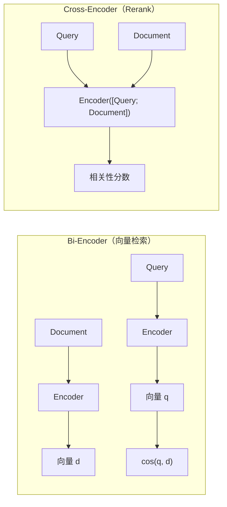
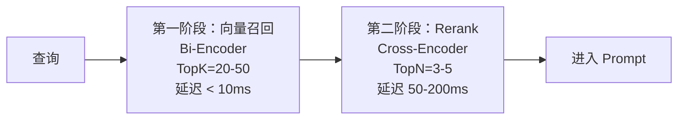

# 25 Rerank 重排序

## 学习目标

学完本章后，你应该能够：

- 理解 Bi-Encoder 和 Cross-Encoder 的区别。
- 使用 BGE-Reranker 对召回结果重排序。
- 设计两阶段检索架构（粗排 + 精排）。
- 评估 Rerank 对 RAG 质量的提升效果。
- 在延迟和精度之间找到平衡。

---

## 为什么需要 Rerank

向量检索（Bi-Encoder）的局限：



| 维度 | Bi-Encoder | Cross-Encoder |
|---|---|---|
| 输入 | Query 和 Doc 独立编码 | Query 和 Doc 联合编码 |
| 交互 | 无（只比较最终向量） | 深度交互（注意力机制） |
| 速度 | 快（可预计算 Doc 向量） | 慢（每对都要重新计算） |
| 精度 | 中 | 高 |
| 适用 | 从百万级数据中粗排 | 对几十个候选精排 |

**核心思想**：Bi-Encoder 负责从海量数据中快速筛选候选（粗排），Cross-Encoder 负责对少量候选精确排序（精排）。

---

## 两阶段检索架构



| 阶段 | 模型 | 候选数 | 延迟 | 作用 |
|---|---|---|---|---|
| 粗排 | Bi-Encoder (bge-small-zh) | 百万 → 20 | < 10ms | 快速缩小范围 |
| 精排 | Cross-Encoder (bge-reranker) | 20 → 5 | 50-200ms | 精确排序 |

---

## 使用 BGE-Reranker

### 安装

```bash
pip install sentence-transformers>=2.6.0
```

### 基本用法

```python
from sentence_transformers import CrossEncoder

# 加载 Reranker 模型
reranker = CrossEncoder("BAAI/bge-reranker-base", max_length=512)

# 计算 query-document 对的相关性分数
query = "Milvus 支持哪些索引类型？"
documents = [
    "Milvus 支持 HNSW、IVF_FLAT、IVF_SQ8、IVF_PQ、DISKANN 等多种索引。",
    "Milvus 是一个开源的向量数据库，由 Zilliz 公司开发。",
    "HNSW 索引通过构建多层图结构实现快速近似最近邻搜索。",
    "Docker 是一种容器化技术，用于打包和部署应用。",
]

# 构建 query-doc 对
pairs = [[query, doc] for doc in documents]

# 计算分数
scores = reranker.predict(pairs)
print("Rerank 分数：")
for doc, score in sorted(zip(documents, scores), key=lambda x: x[1], reverse=True):
    print(f"  {score:.4f} | {doc[:50]}")
```

输出示例：

```
Rerank 分数：
  0.9823 | Milvus 支持 HNSW、IVF_FLAT、IVF_SQ8、IVF_PQ、DISKANN 等多种索引。
  0.7156 | HNSW 索引通过构建多层图结构实现快速近似最近邻搜索。
  0.2341 | Milvus 是一个开源的向量数据库，由 Zilliz 公司开发。
  0.0012 | Docker 是一种容器化技术，用于打包和部署应用。
```

---

## Reranker 模型选择

| 模型 | 大小 | 中文 | 速度 | 精度 | 适用场景 |
|---|---|---|---|---|---|
| `BAAI/bge-reranker-base` | ~400MB | 好 | 中 | 好 | **通用推荐** |
| `BAAI/bge-reranker-large` | ~1.2GB | 很好 | 慢 | 很好 | 高精度要求 |
| `BAAI/bge-reranker-v2-m3` | ~600MB | 多语言 | 中 | 好 | 多语言场景 |
| `cross-encoder/ms-marco-MiniLM-L-6-v2` | ~80MB | 差 | 快 | 中 | 英文、低延迟 |

---

## 完整 Rerank 实现

```python
from sentence_transformers import CrossEncoder
from typing import Any

class RerankerService:
    def __init__(self, model_name: str = "BAAI/bge-reranker-base", device: str = "cpu"):
        self._model = CrossEncoder(model_name, max_length=512, device=device)

    def rerank(
        self,
        query: str,
        documents: list[dict[str, Any]],
        text_key: str = "text",
        top_n: int = 5,
        score_threshold: float = 0.0,
    ) -> list[dict[str, Any]]:
        """对召回结果重排序"""
        if not documents:
            return []

        # 构建 query-doc 对
        pairs = [[query, doc[text_key]] for doc in documents]

        # 计算分数
        scores = self._model.predict(pairs, show_progress_bar=False)

        # 添加分数并排序
        for doc, score in zip(documents, scores):
            doc["rerank_score"] = float(score)

        # 过滤低分 + 排序 + 截断
        ranked = [doc for doc in documents if doc["rerank_score"] >= score_threshold]
        ranked.sort(key=lambda x: x["rerank_score"], reverse=True)
        return ranked[:top_n]
```

### 集成到 RAG 流程

```python
# 在 RAG 问答中使用
reranker = RerankerService("BAAI/bge-reranker-base")

def ask_with_rerank(question: str, store, embedding_service, reranker, top_k=20, top_n=5):
    # 1. 向量召回（粗排）
    qv = embedding_service.encode([question])[0]
    recalled = store.search(qv, top_k=top_k)

    # 2. Rerank（精排）
    reranked = reranker.rerank(question, recalled, text_key="text", top_n=top_n)

    # 3. 构建 Prompt
    prompt = build_prompt(question, reranked)
    return call_llm(prompt), reranked
```

---

## Rerank 性能优化

### 批量处理

```python
def batch_rerank(
    queries: list[str],
    documents_per_query: list[list[dict]],
    reranker: CrossEncoder,
    top_n: int = 5,
) -> list[list[dict]]:
    """批量 Rerank（减少模型调用次数）"""
    all_pairs = []
    pair_indices = []  # 记录每对属于哪个 query

    for q_idx, (query, docs) in enumerate(zip(queries, documents_per_query)):
        for doc in docs:
            all_pairs.append([query, doc["text"]])
            pair_indices.append((q_idx, doc))

    # 一次性计算所有分数
    all_scores = reranker.predict(all_pairs, batch_size=32, show_progress_bar=False)

    # 分组排序
    results = [[] for _ in queries]
    for (q_idx, doc), score in zip(pair_indices, all_scores):
        doc["rerank_score"] = float(score)
        results[q_idx].append(doc)

    return [
        sorted(docs, key=lambda x: x["rerank_score"], reverse=True)[:top_n]
        for docs in results
    ]
```

### 延迟优化

| 优化方法 | 效果 | 说明 |
|---|---|---|
| 减少候选数 | 线性降低 | TopK 从 50 降到 20 |
| 用更小模型 | 2-3× 加速 | MiniLM 替代 bge-reranker-large |
| GPU 推理 | 3-5× 加速 | 需要 GPU 资源 |
| 截断文本长度 | 减少计算 | max_length=256 而非 512 |
| 缓存热门查询 | 避免重复计算 | 适合查询重复率高的场景 |

### 延迟参考

| 模型 | 设备 | 20 个候选 | 50 个候选 |
|---|---|---|---|
| bge-reranker-base | CPU (8 core) | ~150ms | ~350ms |
| bge-reranker-base | GPU (T4) | ~30ms | ~60ms |
| bge-reranker-large | CPU (8 core) | ~400ms | ~900ms |
| bge-reranker-large | GPU (T4) | ~80ms | ~180ms |

---

## Rerank 效果评估

### 对比实验

```python
def compare_with_without_rerank(eval_set, store, embedding_service, reranker, top_k=20, top_n=5):
    """对比有无 Rerank 的效果"""
    results_no_rerank = {"mrr": [], "precision": []}
    results_with_rerank = {"mrr": [], "precision": []}

    for item in eval_set:
        qv = embedding_service.encode([item["question"]])[0]
        recalled = store.search(qv, top_k=top_k)
        relevant = set(item["relevant_chunks"])

        # 无 Rerank：直接取 Top N
        top_n_ids = [r["chunk_id"] for r in recalled[:top_n]]
        hits_no = len(set(top_n_ids) & relevant)
        results_no_rerank["precision"].append(hits_no / top_n)

        # 有 Rerank
        reranked = reranker.rerank(item["question"], recalled, top_n=top_n)
        top_n_ids_reranked = [r["chunk_id"] for r in reranked]
        hits_yes = len(set(top_n_ids_reranked) & relevant)
        results_with_rerank["precision"].append(hits_yes / top_n)

    print(f"无 Rerank Precision@{top_n}: {sum(results_no_rerank['precision'])/len(eval_set):.3f}")
    print(f"有 Rerank Precision@{top_n}: {sum(results_with_rerank['precision'])/len(eval_set):.3f}")
```

### 典型提升效果

| 指标 | 无 Rerank | 有 Rerank | 提升 |
|---|---|---|---|
| Precision@5 | 0.62 | 0.78 | +26% |
| MRR | 0.55 | 0.72 | +31% |
| 答案正确率 | 71% | 83% | +12% |

Rerank 对 MRR（第一个相关结果的排名）提升尤其明显。

---

## 何时不需要 Rerank

- 向量召回已经足够精确（Recall@5 > 90%）
- 延迟预算极紧（< 20ms 总延迟）
- 候选数很少（TopK < 5，Rerank 意义不大）
- 查询和文档都很短（Cross-Encoder 优势不明显）

---

## 常见错误

| 现象 | 原因 | 修复 |
|---|---|---|
| Rerank 后结果反而变差 | 模型不适合当前语言/领域 | 换中文 Reranker 或微调 |
| Rerank 延迟太高 | 候选数太多或模型太大 | 减少 TopK 或用更小模型 |
| 所有分数都很低 | 召回的内容本身就不相关 | 先优化召回，Rerank 无法创造相关性 |
| GPU OOM | batch_size 太大 | 减小 batch_size |
| 长文本被截断 | max_length 限制 | 增大 max_length 或截取关键段落 |

---

## 面试题

1. **Cross-Encoder 为什么比 Bi-Encoder 精度高？**
   Cross-Encoder 将 query 和 document 拼接后联合编码，注意力机制可以捕捉 query 和 document 之间的细粒度交互。Bi-Encoder 独立编码，只能通过最终向量的相似度间接比较。

2. **为什么不直接用 Cross-Encoder 做检索？**
   Cross-Encoder 需要对每个 query-doc 对独立计算，无法预计算文档向量。100 万文档 × 1 个查询 = 100 万次推理，延迟不可接受。只能用于少量候选的精排。

3. **Rerank 的 score_threshold 怎么设？**
   通过评测集确定。观察相关文档和不相关文档的分数分布，找到分界点。通常 0.1-0.3 是合理范围，但因模型和数据而异。

4. **Rerank 能提升 Recall 吗？**
   不能。Rerank 只能重新排序已召回的候选，不能找到未被召回的文档。Recall 取决于第一阶段的向量检索。Rerank 提升的是 Precision 和 MRR。

5. **如何选择 Rerank 的候选数（TopK）？**
   TopK 越大，Rerank 越有可能找到被粗排排低的相关文档，但延迟也越高。经验值：TopK=20-30 是精度和延迟的平衡点。

---

## 练习题

1. **基础 Rerank**：用 bge-reranker-base 对 20 个召回结果重排序，对比重排前后的 Top5 差异。

2. **阈值实验**：设置不同的 score_threshold（0、0.1、0.3、0.5），观察过滤后的结果数量和质量。

3. **延迟测试**：分别用 CPU 和 GPU 测试 Rerank 20 个候选的延迟，评估是否需要 GPU。

4. **端到端对比**：在 RAG 系统中分别开启和关闭 Rerank，用 10 个问题人工评估答案质量差异。

---

## 小结

Rerank 是 RAG 系统中投入产出比最高的优化之一。它不改变召回范围，但显著提升排序质量，让最相关的内容排在最前面进入 Prompt。生产配置：向量召回 TopK=20 → bge-reranker-base 精排 → TopN=5 进入 LLM。延迟预算约 100-200ms（CPU），对大多数应用可接受。
