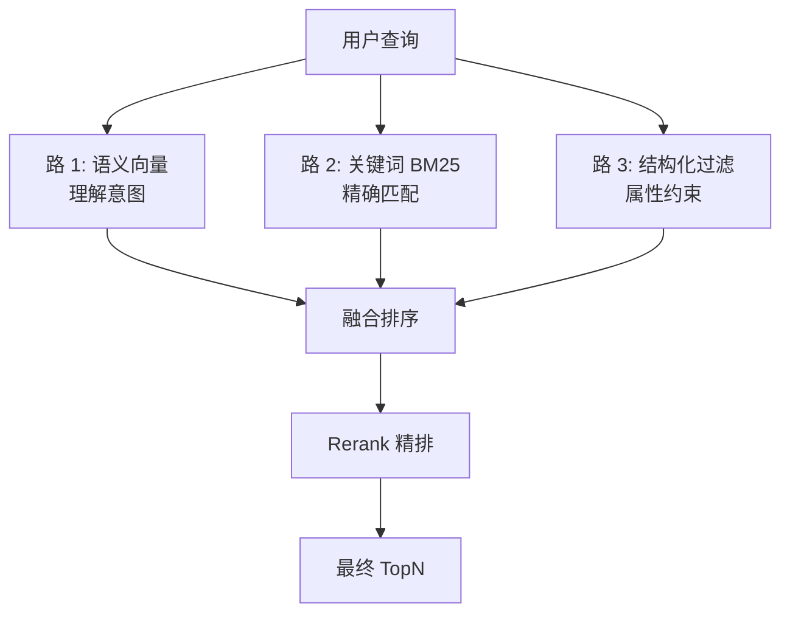
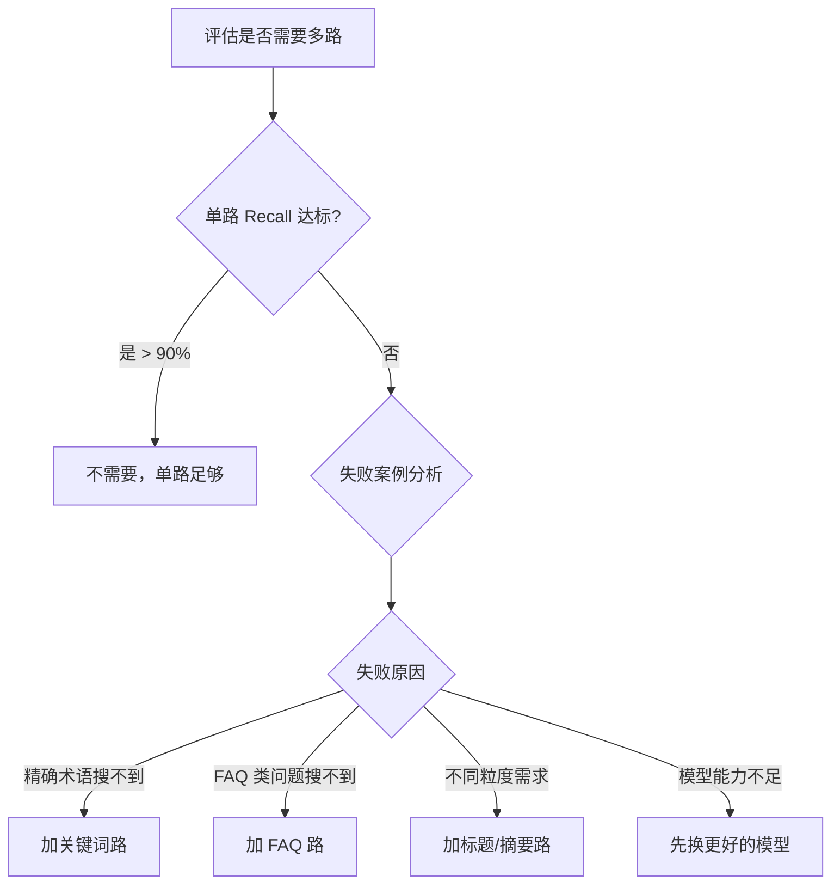

# 26 多路召回架构

## 学习目标

学完本章后，你应该能够：

- 设计多路召回架构（语义 + 关键词 + 结构化）。
- 实现多路结果的融合排序策略。
- 评估各路召回的贡献和互补性。
- 在 Milvus 中实现稠密 + 稀疏的混合召回。
- 判断何时需要多路召回、何时单路足够。

---

## 为什么需要多路召回

单一召回路的局限：

| 召回路 | 擅长 | 不擅长 |
|---|---|---|
| 语义向量 | 理解意图、同义词、模糊查询 | 精确术语、编号、新词 |
| 关键词 BM25 | 精确匹配、专有名词 | 同义词、意图理解 |
| 结构化查询 | 精确属性过滤 | 语义相关性 |

多路召回的价值：**不同路互补，覆盖更多查询类型**。



---

## 多路召回架构设计

### 架构一：Milvus 内置混合搜索

利用 Milvus 的 `hybrid_search` API（稠密 + 稀疏向量在同一 Collection）：

```python
from pymilvus import AnnSearchRequest, RRFRanker

# 稠密向量搜索
dense_req = AnnSearchRequest(
    data=[dense_vector],
    anns_field="dense_embedding",
    param={"metric_type": "COSINE", "params": {"ef": 128}},
    limit=20,
)

# 稀疏向量搜索
sparse_req = AnnSearchRequest(
    data=[sparse_vector],
    anns_field="sparse_embedding",
    param={"metric_type": "IP", "params": {}},
    limit=20,
)

# 融合
results = client.hybrid_search(
    collection_name="docs",
    reqs=[dense_req, sparse_req],
    ranker=RRFRanker(k=60),
    limit=10,
)
```

### 架构二：应用层多路召回

各路独立搜索，应用层融合：

```python
from concurrent.futures import ThreadPoolExecutor

def multi_route_recall(
    query: str,
    dense_vector: list[float],
    sparse_vector: dict,
    store,
    top_k: int = 20,
) -> list[dict]:
    """应用层多路召回"""

    def semantic_recall():
        return store.search(dense_vector, top_k=top_k)

    def keyword_recall():
        return store.sparse_search(sparse_vector, top_k=top_k)

    # 并行执行
    with ThreadPoolExecutor(max_workers=2) as executor:
        future_semantic = executor.submit(semantic_recall)
        future_keyword = executor.submit(keyword_recall)

        semantic_results = future_semantic.result()
        keyword_results = future_keyword.result()

    # 融合
    return rrf_merge(semantic_results, keyword_results, top_k=top_k)
```

### 架构三：多 Collection 多路

不同数据源或不同粒度的 Collection 分别搜索：

```python
def multi_collection_recall(query_vector, top_k=10):
    """从多个 Collection 召回"""
    # 路 1: 文档 Chunk
    chunks = client.search(collection_name="doc_chunks", data=[query_vector], limit=top_k, ...)

    # 路 2: FAQ 问答对
    faqs = client.search(collection_name="faq_pairs", data=[query_vector], limit=top_k, ...)

    # 路 3: 标题索引
    titles = client.search(collection_name="doc_titles", data=[query_vector], limit=top_k, ...)

    return merge_results(chunks, faqs, titles)
```

---

## 融合排序策略

### RRF（Reciprocal Rank Fusion）

```python
def rrf_merge(
    *result_lists: list[dict],
    id_key: str = "chunk_id",
    k: int = 60,
    top_k: int = 20,
) -> list[dict]:
    """RRF 融合多路召回结果"""
    scores = {}  # id -> (rrf_score, doc)

    for results in result_lists:
        for rank, doc in enumerate(results, start=1):
            doc_id = doc[id_key]
            rrf_score = 1.0 / (k + rank)
            if doc_id in scores:
                scores[doc_id] = (scores[doc_id][0] + rrf_score, doc)
            else:
                scores[doc_id] = (rrf_score, doc)

    # 按 RRF 分数排序
    merged = sorted(scores.values(), key=lambda x: x[0], reverse=True)
    return [doc for _, doc in merged[:top_k]]
```

### 加权融合

```python
def weighted_merge(
    results_with_weights: list[tuple[list[dict], float]],
    id_key: str = "chunk_id",
    score_key: str = "score",
    top_k: int = 20,
) -> list[dict]:
    """加权分数融合"""
    scores = {}

    for results, weight in results_with_weights:
        for doc in results:
            doc_id = doc[id_key]
            weighted_score = doc[score_key] * weight
            if doc_id in scores:
                scores[doc_id] = (scores[doc_id][0] + weighted_score, doc)
            else:
                scores[doc_id] = (weighted_score, doc)

    merged = sorted(scores.values(), key=lambda x: x[0], reverse=True)
    return [doc for _, doc in merged[:top_k]]

# 使用：语义权重 0.7，关键词权重 0.3
results = weighted_merge([
    (semantic_results, 0.7),
    (keyword_results, 0.3),
])
```

### 策略对比

| 策略 | 优点 | 缺点 | 适用场景 |
|---|---|---|---|
| RRF | 无需校准分数，鲁棒 | 无法精细控制 | **默认推荐** |
| 加权融合 | 可调权重 | 需要分数归一化 | 各路分数可比时 |
| 取并集 + Rerank | 最灵活 | Rerank 延迟 | 有 Reranker 时 |

---

## 评估各路贡献

### 消融实验

```python
def ablation_study(eval_set, routes: dict, reranker, top_n=5):
    """消融实验：评估每路的贡献"""
    results = {}

    # 单路效果
    for name, recall_fn in routes.items():
        scores = evaluate_single_route(eval_set, recall_fn, top_n)
        results[f"only_{name}"] = scores
        print(f"仅 {name}: Recall@{top_n}={scores['recall']:.3f}")

    # 全部路融合
    all_scores = evaluate_all_routes(eval_set, routes, reranker, top_n)
    results["all_routes"] = all_scores
    print(f"全部融合: Recall@{top_n}={all_scores['recall']:.3f}")

    # 去掉每路的效果
    for name in routes:
        remaining = {k: v for k, v in routes.items() if k != name}
        scores = evaluate_all_routes(eval_set, remaining, reranker, top_n)
        results[f"without_{name}"] = scores
        print(f"去掉 {name}: Recall@{top_n}={scores['recall']:.3f}")

    return results
```

### 典型消融结果

| 配置 | Recall@5 | 说明 |
|---|---|---|
| 仅语义 | 72% | 基线 |
| 仅关键词 | 58% | 单独效果较弱 |
| 语义 + 关键词 | 81% | 互补提升 +9% |
| 语义 + 关键词 + FAQ | 84% | 再提升 +3% |
| 去掉关键词 | 78% | 关键词贡献 6% |
| 去掉 FAQ | 81% | FAQ 贡献 3% |

---

## 何时需要多路召回



### 不需要多路的场景

- 单路 Recall 已经 > 90%
- 查询类型单一（都是自然语言问题）
- 系统复杂度预算有限
- 数据量小，单路已经足够覆盖

### 需要多路的场景

- 用户会搜索精确编号/术语（需要关键词路）
- 有 FAQ 库需要精确匹配（需要 FAQ 路）
- 文档有层级结构（需要标题/摘要路）
- 单路 Recall 始终 < 80%

---

## 完整实现示例

```python
from dataclasses import dataclass
from typing import Any, Callable

@dataclass
class RecallRoute:
    name: str
    recall_fn: Callable[[str], list[dict]]
    weight: float = 1.0


class MultiRouteRecaller:
    def __init__(self, routes: list[RecallRoute]):
        self._routes = routes

    def recall(self, query: str, top_k: int = 20) -> list[dict]:
        """执行多路召回并融合"""
        from concurrent.futures import ThreadPoolExecutor

        all_results = []
        with ThreadPoolExecutor(max_workers=len(self._routes)) as executor:
            futures = {
                executor.submit(route.recall_fn, query): route
                for route in self._routes
            }
            for future in futures:
                route = futures[future]
                try:
                    results = future.result(timeout=5.0)
                    all_results.append((results, route.weight))
                except Exception as e:
                    print(f"路 {route.name} 失败: {e}")

        return rrf_merge(*[r for r, _ in all_results], top_k=top_k)


# 使用
recaller = MultiRouteRecaller([
    RecallRoute("semantic", lambda q: semantic_search(q, top_k=20)),
    RecallRoute("keyword", lambda q: keyword_search(q, top_k=20)),
    RecallRoute("faq", lambda q: faq_search(q, top_k=10)),
])

results = recaller.recall("Milvus 的 HNSW 参数怎么配置？")
```

---

## 常见错误

| 现象 | 原因 | 修复 |
|---|---|---|
| 多路融合后效果反而变差 | 某路引入大量噪声 | 降低该路权重或移除 |
| 延迟翻倍 | 各路串行执行 | 改为并行执行 |
| 结果重复 | 同一文档被多路召回 | 融合时按 ID 去重 |
| RRF 效果不如预期 | k 值不合适 | 调整 k（默认 60，可尝试 10-100） |
| 关键词路召回太多无关结果 | 分词不准或停用词未过滤 | 优化分词和稀疏向量生成 |

---

## 面试题

1. **多路召回的核心价值是什么？**
   不同召回路擅长不同类型的查询。语义路理解意图但可能漏掉精确术语，关键词路精确匹配但不理解语义。多路互补提高整体覆盖率。

2. **RRF 的 k 参数有什么作用？**
   k 控制排名差异的影响程度。k 越大，不同排名之间的分数差异越小（更平滑）。k=60 是常用默认值，k 小时高排名的优势更明显。

3. **如何判断某路召回是否有贡献？**
   消融实验：去掉该路后 Recall 是否下降。如果去掉后指标不变或反而提升，说明该路没有贡献或引入了噪声。

4. **多路召回会增加多少延迟？**
   如果并行执行，延迟 = max(各路延迟)，而非总和。通常语义路 < 10ms，关键词路 < 5ms，并行后总延迟 < 15ms。主要延迟增加在融合和 Rerank。

5. **Milvus 的 hybrid_search 和应用层多路有什么区别？**
   hybrid_search 在 Milvus 内部完成融合，减少网络往返，适合稠密+稀疏在同一 Collection 的场景。应用层多路更灵活，可以跨 Collection、跨服务召回。

---

## 练习题

1. **双路对比**：实现语义 + 关键词双路召回，对比单路和双路的 Recall@10。

2. **RRF 参数实验**：k 从 1、10、60、200 变化，观察融合结果排序的变化。

3. **消融实验**：如果有 3 路召回，分别去掉每路，量化各路的贡献。

4. **延迟对比**：对比串行执行和并行执行多路召回的总延迟。

---

## 小结

多路召回通过组合不同检索策略提高覆盖率。核心决策：先评估单路是否足够 → 分析失败案例确定需要哪些路 → 并行执行 + RRF 融合 → 消融实验验证贡献。不要盲目加路，每路都应该有明确的互补价值。
