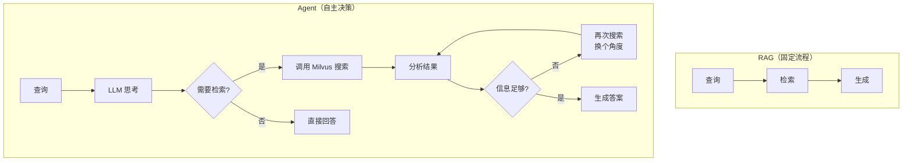

# 27 Agent 结合 Milvus

## 学习目标

学完本章后，你应该能够：

- 理解 AI Agent 中向量检索的角色。
- 将 Milvus 搜索封装为 Agent Tool。
- 实现 Agent 自主决定何时调用向量检索。
- 结合 LangChain Agent 和 OpenAI Function Calling。
- 设计 Agent + RAG 的多步推理流程。

---

## Agent 与 RAG 的关系

RAG 是固定流程：查询 → 检索 → 生成。Agent 更灵活：LLM 自主决定是否需要检索、检索什么、是否需要多次检索。



### 何时用 Agent 而非固定 RAG

| 场景 | 固定 RAG | Agent |
|---|---|---|
| 简单知识问答 | ✓ 足够 | 过度设计 |
| 需要多步推理 | 不够 | ✓ 适合 |
| 需要结合多个工具 | 不够 | ✓ 适合 |
| 查询可能不需要检索 | 浪费资源 | ✓ 按需调用 |
| 需要追问/澄清 | 不够 | ✓ 适合 |

---

## 将 Milvus 封装为 Tool

### OpenAI Function Calling 方式

```python
from openai import OpenAI

# 定义 Milvus 搜索工具
tools = [
    {
        "type": "function",
        "function": {
            "name": "search_knowledge_base",
            "description": "从知识库中搜索与查询相关的文档片段。当用户问题涉及特定知识、技术细节或需要引用来源时使用。",
            "parameters": {
                "type": "object",
                "properties": {
                    "query": {
                        "type": "string",
                        "description": "搜索查询，应该是一个清晰的问题或关键词组合",
                    },
                    "top_k": {
                        "type": "integer",
                        "description": "返回结果数量，默认 5",
                        "default": 5,
                    },
                    "filter": {
                        "type": "string",
                        "description": "可选的过滤条件，如 source == 'manual.pdf'",
                        "default": "",
                    },
                },
                "required": ["query"],
            },
        },
    }
]


def execute_search(query: str, top_k: int = 5, filter: str = "") -> str:
    """执行 Milvus 搜索并格式化结果"""
    qv = embedding_service.encode([query])[0]
    results = store.search(qv, top_k=top_k, filter_expr=filter)

    if not results:
        return "未找到相关内容。"

    formatted = []
    for i, r in enumerate(results, 1):
        formatted.append(f"[{i}] 来源: {r['source']} | 相关度: {r['score']:.3f}\n{r['text']}")
    return "\n\n".join(formatted)
```

### Agent 对话循环

```python
def agent_chat(user_message: str, history: list[dict]) -> str:
    """Agent 对话：自主决定是否调用工具"""
    client = OpenAI(api_key=settings.openai_api_key, base_url=settings.openai_base_url)

    messages = [
        {"role": "system", "content": "你是一个知识库助手。当需要查找具体信息时，使用 search_knowledge_base 工具。如果问题是闲聊或你已经知道答案，可以直接回答。"},
        *history,
        {"role": "user", "content": user_message},
    ]

    # 第一次调用：LLM 决定是否使用工具
    response = client.chat.completions.create(
        model=settings.openai_model,
        messages=messages,
        tools=tools,
        tool_choice="auto",
    )

    message = response.choices[0].message

    # 如果 LLM 决定调用工具
    if message.tool_calls:
        tool_call = message.tool_calls[0]
        import json
        args = json.loads(tool_call.function.arguments)

        # 执行搜索
        search_result = execute_search(**args)

        # 将工具结果返回给 LLM
        messages.append(message.model_dump())
        messages.append({
            "role": "tool",
            "tool_call_id": tool_call.id,
            "content": search_result,
        })

        # 第二次调用：LLM 基于搜索结果生成答案
        final_response = client.chat.completions.create(
            model=settings.openai_model,
            messages=messages,
        )
        return final_response.choices[0].message.content

    # LLM 决定直接回答
    return message.content
```

---

## LangChain Agent 实现

```python
from langchain.agents import AgentExecutor, create_openai_tools_agent
from langchain.tools import tool
from langchain_openai import ChatOpenAI
from langchain_core.prompts import ChatPromptTemplate, MessagesPlaceholder

# 定义 Milvus 搜索工具
@tool
def search_knowledge_base(query: str, top_k: int = 5) -> str:
    """从 Milvus 知识库中搜索相关文档。当需要查找技术细节、具体配置或引用来源时使用。"""
    qv = embedding_service.encode([query])[0]
    results = store.search(qv, top_k=top_k)
    if not results:
        return "未找到相关内容。"
    return "\n\n".join(
        f"[{i}] {r['source']}:\n{r['text']}" for i, r in enumerate(results, 1)
    )

# 创建 Agent
llm = ChatOpenAI(model="gpt-4.1-mini", temperature=0.2)
prompt = ChatPromptTemplate.from_messages([
    ("system", "你是知识库助手。需要查找信息时使用工具，能直接回答时不要调用工具。回答时引用来源。"),
    MessagesPlaceholder(variable_name="chat_history", optional=True),
    ("human", "{input}"),
    MessagesPlaceholder(variable_name="agent_scratchpad"),
])

agent = create_openai_tools_agent(llm, [search_knowledge_base], prompt)
agent_executor = AgentExecutor(agent=agent, tools=[search_knowledge_base], verbose=True)

# 使用
result = agent_executor.invoke({"input": "Milvus 的 HNSW 索引 M 参数设多少合适？"})
print(result["output"])
```

---

## 多工具 Agent

Agent 可以同时拥有多个工具：

```python
@tool
def search_docs(query: str) -> str:
    """搜索技术文档知识库"""
    # ... Milvus 搜索 docs Collection

@tool
def search_faq(query: str) -> str:
    """搜索 FAQ 问答库"""
    # ... Milvus 搜索 faq Collection

@tool
def get_system_status() -> str:
    """获取 Milvus 集群当前状态"""
    import requests
    resp = requests.get("http://localhost:9091/healthz")
    return f"Milvus 状态: {resp.text}"

@tool
def calculate(expression: str) -> str:
    """计算数学表达式"""
    return str(eval(expression))  # 生产环境用安全的计算库

# Agent 自主选择使用哪个工具
agent = create_openai_tools_agent(llm, [search_docs, search_faq, get_system_status, calculate], prompt)
```

---

## 多步推理示例

用户问："我有 500 万条 768 维向量，用 HNSW 索引需要多少内存？如果内存只有 16GB 够吗？"

Agent 的推理过程：

```
思考：需要计算内存，先查一下 HNSW 内存估算公式
→ 调用 search_docs("HNSW 内存估算公式")
→ 得到：内存 ≈ N × dim × 4 + N × M × 16

思考：代入计算
→ 调用 calculate("5000000 * 768 * 4 + 5000000 * 16 * 16")
→ 得到：15,360,000,000 + 1,280,000,000 = 16,640,000,000 字节 ≈ 15.5 GB

思考：16GB 内存勉强够，但没有余量
→ 生成答案：需要约 15.5GB，16GB 内存非常紧张，建议至少 20GB 或考虑开启 mmap。
```

---

## Agent 设计最佳实践

### Tool 描述要清晰

```python
# 好的描述：告诉 LLM 何时使用
"""从 Milvus 知识库中搜索相关文档。当用户问题涉及 Milvus 配置、索引参数、
部署方案等技术细节时使用。不要用于闲聊或通用知识问题。"""

# 差的描述：太模糊
"""搜索数据库"""
```

### 控制工具调用次数

```python
agent_executor = AgentExecutor(
    agent=agent,
    tools=tools,
    max_iterations=3,  # 最多调用 3 次工具
    early_stopping_method="generate",  # 超过次数后强制生成答案
)
```

### 错误处理

```python
@tool
def search_knowledge_base(query: str) -> str:
    """搜索知识库"""
    try:
        qv = embedding_service.encode([query])[0]
        results = store.search(qv, top_k=5)
        if not results:
            return "未找到相关内容，请尝试换个关键词。"
        return format_results(results)
    except Exception as e:
        return f"搜索出错: {str(e)}，请稍后重试。"
```

---

## 常见错误

| 现象 | 原因 | 修复 |
|---|---|---|
| Agent 每次都调用工具 | Tool 描述太宽泛 | 明确描述何时使用、何时不使用 |
| Agent 从不调用工具 | Tool 描述不匹配用户意图 | 改进描述，添加使用示例 |
| 工具调用死循环 | 搜索结果不满足，反复重试 | 设置 max_iterations |
| 答案不引用搜索结果 | System Prompt 未要求引用 | 明确要求基于工具结果回答 |
| 延迟很高 | 多次 LLM 调用 + 搜索 | 减少迭代次数，缓存常见查询 |

---

## 面试题

1. **Agent 和固定 RAG 流程的核心区别？**
   固定 RAG 每次都检索再生成。Agent 由 LLM 自主决定是否需要检索、检索什么、是否需要多次检索。Agent 更灵活但延迟更高（多次 LLM 调用）。

2. **如何让 Agent 正确决定何时调用工具？**
   关键在 Tool 的 description。描述要明确说明适用场景和不适用场景。System Prompt 也要引导 LLM 的决策逻辑。

3. **Agent 多步推理的延迟如何优化？**
   减少不必要的工具调用（优化 Tool 描述）、并行调用独立工具、缓存热门查询结果、使用更快的 LLM（如 gpt-4.1-mini）。

4. **Function Calling 和 LangChain Agent 的区别？**
   Function Calling 是 OpenAI API 的原生能力，更轻量。LangChain Agent 是框架封装，支持更多 LLM 提供商和更复杂的 Agent 模式，但引入了框架依赖。

5. **Agent 如何处理工具返回"未找到"的情况？**
   好的 Agent 会换个角度重新搜索（改写查询），或者诚实告诉用户"知识库中没有相关信息"。通过 max_iterations 防止无限重试。

---

## 练习题

1. **基础 Agent**：实现一个带 Milvus 搜索工具的 Agent，验证它能自主决定何时搜索。

2. **多工具 Agent**：添加 FAQ 搜索和计算器两个额外工具，测试 Agent 是否能正确选择工具。

3. **对比实验**：同一批问题分别用固定 RAG 和 Agent 回答，对比答案质量和延迟。

4. **边界测试**：测试 Agent 对闲聊问题（"你好"）、不需要检索的问题（"1+1=?"）和需要检索的问题的不同行为。

---

## 小结

Agent + Milvus 的核心价值是让 LLM 自主决定检索策略，而非固定流程。适合多步推理、多工具协作和查询类型多样的场景。实现关键：清晰的 Tool 描述、合理的迭代限制、良好的错误处理。对于简单知识问答，固定 RAG 流程更简单高效。
