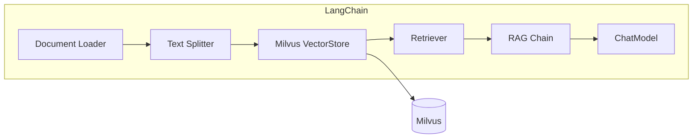

# 28 LangChain 集成

## 学习目标

学完本章后，你应该能够：

- 使用 `langchain-milvus` 包连接 Milvus。
- 通过 LangChain VectorStore 接口实现文档入库和检索。
- 构建 LangChain RAG Chain（检索 + 生成）。
- 实现带对话记忆的 RAG。
- 对比 LangChain 封装和直接使用 pymilvus 的取舍。

---

## LangChain + Milvus 架构



LangChain 提供了统一的 VectorStore 抽象，`langchain-milvus` 是官方维护的 Milvus 集成包。

---

## 安装

```bash
pip install langchain-milvus langchain-openai langchain-community langchain-text-splitters
```

核心依赖：

```text
langchain-milvus==0.1.7
langchain-openai==0.3.17
langchain-text-splitters==0.3.8
langchain-community==0.3.24
pymilvus==2.6.12
```

---

## 基本用法：VectorStore

### 创建 VectorStore 并写入文档

```python
from langchain_milvus import Milvus
from langchain_community.embeddings import HuggingFaceEmbeddings
from langchain_core.documents import Document

# Embedding 模型
embeddings = HuggingFaceEmbeddings(
    model_name="BAAI/bge-small-zh-v1.5",
    model_kwargs={"device": "cpu"},
    encode_kwargs={"normalize_embeddings": True},
)

# 创建 Milvus VectorStore
vector_store = Milvus(
    embedding_function=embeddings,
    collection_name="langchain_docs",
    connection_args={"uri": "http://localhost:19530"},
    auto_id=True,
    drop_old=True,  # 开发时重建 Collection
)

# 写入文档
docs = [
    Document(page_content="Milvus 支持 HNSW、IVF 等多种索引类型。", metadata={"source": "docs", "page": 1}),
    Document(page_content="RAG 系统通过检索增强大模型的回答质量。", metadata={"source": "docs", "page": 2}),
    Document(page_content="CLIP 模型可以将图片和文本映射到同一向量空间。", metadata={"source": "docs", "page": 3}),
]

vector_store.add_documents(docs)
print(f"写入 {len(docs)} 个文档")
```

### 搜索

```python
# 相似度搜索
results = vector_store.similarity_search("向量索引有哪些类型？", k=3)
for doc in results:
    print(f"[{doc.metadata['source']}] {doc.page_content}")

# 带分数的搜索
results_with_scores = vector_store.similarity_search_with_score("向量索引", k=3)
for doc, score in results_with_scores:
    print(f"score={score:.4f} | {doc.page_content[:50]}")

# 带过滤的搜索
results = vector_store.similarity_search(
    "索引类型",
    k=3,
    expr='source == "docs"',  # Milvus 过滤表达式
)
```

---

## 从文件加载文档

```python
from langchain_community.document_loaders import PyMuPDFLoader, TextLoader
from langchain_text_splitters import RecursiveCharacterTextSplitter

# 加载 PDF
loader = PyMuPDFLoader("knowledge_base.pdf")
pages = loader.load()

# 切块
splitter = RecursiveCharacterTextSplitter(
    chunk_size=600,
    chunk_overlap=100,
    separators=["\n\n", "\n", "。", "！", "？", "；", " ", ""],
)
chunks = splitter.split_documents(pages)
print(f"PDF 切成 {len(chunks)} 个 Chunk")

# 写入 Milvus
vector_store.add_documents(chunks)
```

---

## 构建 RAG Chain

### 基础 RAG Chain

```python
from langchain_openai import ChatOpenAI
from langchain_core.prompts import ChatPromptTemplate
from langchain_core.runnables import RunnablePassthrough
from langchain_core.output_parsers import StrOutputParser

# LLM
llm = ChatOpenAI(model="gpt-4.1-mini", temperature=0.2)

# Retriever
retriever = vector_store.as_retriever(
    search_type="similarity",
    search_kwargs={"k": 5},
)

# Prompt
prompt = ChatPromptTemplate.from_template("""基于以下资料回答问题。如果资料不足，请说"无法判断"。

资料：
{context}

问题：{question}

答案：""")

# 格式化检索结果
def format_docs(docs):
    return "\n\n".join(
        f"[来源: {doc.metadata.get('source', '未知')}]\n{doc.page_content}"
        for doc in docs
    )

# 构建 Chain
rag_chain = (
    {"context": retriever | format_docs, "question": RunnablePassthrough()}
    | prompt
    | llm
    | StrOutputParser()
)

# 使用
answer = rag_chain.invoke("Milvus 支持哪些索引？")
print(answer)
```

### 带引用来源的 RAG

```python
from langchain_core.runnables import RunnableParallel

# 同时返回答案和来源文档
rag_chain_with_sources = RunnableParallel(
    {"context": retriever, "question": RunnablePassthrough()}
).assign(
    answer=lambda x: (
        prompt.invoke({"context": format_docs(x["context"]), "question": x["question"]})
        | llm
        | StrOutputParser()
    ).invoke(x)
)

# 或者更简洁的方式
def ask_with_sources(question: str) -> dict:
    docs = retriever.invoke(question)
    context = format_docs(docs)
    answer = rag_chain.invoke(question)
    return {
        "answer": answer,
        "sources": [{"source": d.metadata.get("source"), "page": d.metadata.get("page")} for d in docs],
    }
```

---

## 带对话记忆的 RAG

```python
from langchain_core.prompts import ChatPromptTemplate, MessagesPlaceholder
from langchain_core.messages import HumanMessage, AIMessage
from langchain.chains.history_aware_retriever import create_history_aware_retriever
from langchain.chains.retrieval import create_retrieval_chain
from langchain.chains.combine_documents import create_stuff_documents_chain

# 历史感知检索器：根据对话历史改写查询
contextualize_prompt = ChatPromptTemplate.from_messages([
    ("system", "根据对话历史，将用户最新问题改写为独立的搜索查询。"),
    MessagesPlaceholder("chat_history"),
    ("human", "{input}"),
])

history_aware_retriever = create_history_aware_retriever(llm, retriever, contextualize_prompt)

# 问答 Chain
qa_prompt = ChatPromptTemplate.from_messages([
    ("system", "你是知识库助手。基于以下资料回答，无法判断时说明。\n\n{context}"),
    MessagesPlaceholder("chat_history"),
    ("human", "{input}"),
])

question_answer_chain = create_stuff_documents_chain(llm, qa_prompt)
rag_chain = create_retrieval_chain(history_aware_retriever, question_answer_chain)

# 多轮对话
chat_history = []

response1 = rag_chain.invoke({"input": "Milvus 支持哪些索引？", "chat_history": chat_history})
print(response1["answer"])
chat_history.extend([
    HumanMessage(content="Milvus 支持哪些索引？"),
    AIMessage(content=response1["answer"]),
])

response2 = rag_chain.invoke({"input": "它们的内存开销分别是多少？", "chat_history": chat_history})
print(response2["answer"])  # "它们"会被改写为具体的索引类型
```

---

## 高级配置

### 自定义搜索参数

```python
retriever = vector_store.as_retriever(
    search_type="similarity",
    search_kwargs={
        "k": 10,
        "param": {"ef": 128},  # HNSW 搜索参数
        "expr": 'source == "manual.pdf"',  # 过滤
    },
)
```

### MMR 搜索（最大边际相关性）

MMR 在相关性和多样性之间平衡，避免返回重复内容：

```python
retriever = vector_store.as_retriever(
    search_type="mmr",
    search_kwargs={
        "k": 5,
        "fetch_k": 20,  # 先召回 20 个，再用 MMR 选 5 个
        "lambda_mult": 0.7,  # 0=最大多样性，1=最大相关性
    },
)
```

---

## LangChain vs 直接 pymilvus

| 维度 | LangChain | 直接 pymilvus |
|---|---|---|
| 开发速度 | 快（高层抽象） | 中（需要自己封装） |
| 灵活性 | 中（受框架约束） | 高（完全控制） |
| Schema 控制 | 有限（自动生成） | 完全控制 |
| 索引参数 | 部分支持 | 完全支持 |
| 调试难度 | 高（链路长） | 低（直接调用） |
| 生态集成 | 丰富（Loader、Splitter、Chain） | 需要自己集成 |
| 适用场景 | 快速原型、标准 RAG | 生产定制、复杂需求 |

**建议**：
- 快速验证想法 → LangChain
- 生产系统需要精细控制 → pymilvus + 自定义封装
- 两者可以混用：用 LangChain 的 Loader/Splitter，用 pymilvus 做存储

---

## 常见错误

| 现象 | 原因 | 修复 |
|---|---|---|
| `Collection not found` | collection_name 拼错或未创建 | 检查名称，设置 `drop_old=True` 重建 |
| Embedding 维度不匹配 | 换了模型但没重建 Collection | 删除旧 Collection 重新创建 |
| 搜索结果为空 | 文档未写入或未 load | 确认 `add_documents` 成功 |
| Chain 报错 | LangChain 版本不兼容 | 统一版本，参考官方文档 |
| 对话记忆不生效 | chat_history 未正确传递 | 检查 Messages 格式 |

---

## 面试题

1. **LangChain 的 VectorStore 抽象有什么价值？**
   统一接口让你可以在 Milvus、Pinecone、Chroma 等之间切换而不改业务代码。但抽象也意味着无法使用某些数据库的特有功能。

2. **as_retriever() 和直接 similarity_search() 的区别？**
   Retriever 是 LangChain 的标准接口，可以直接接入 Chain。similarity_search 是底层方法。Retriever 支持更多搜索策略（MMR、threshold 等）。

3. **为什么生产系统可能不用 LangChain？**
   LangChain 抽象层多、调试困难、版本更新频繁（API 经常变）、对 Milvus 特有功能支持有限（如 Partition Key、hybrid_search）。生产系统通常需要更精细的控制。

4. **MMR 搜索适合什么场景？**
   当召回结果可能高度重复时（如同一文档的相邻 Chunk）。MMR 在保证相关性的同时增加多样性，让 LLM 看到更多不同角度的信息。

5. **LangChain 的 history_aware_retriever 做了什么？**
   它先用 LLM 将当前问题结合对话历史改写为独立查询，再用改写后的查询做检索。解决了"它"、"上面说的"等代词指代不明的问题。

---

## 练习题

1. **基础集成**：用 LangChain + Milvus 实现一个 PDF 问答系统，从加载到问答完整跑通。

2. **MMR 对比**：同一个问题分别用 similarity 和 MMR 搜索，对比返回结果的多样性。

3. **多轮对话**：实现带对话记忆的 RAG，测试代词解析是否正确（"它支持什么？"→ 应该知道"它"指什么）。

4. **性能对比**：同一批数据和查询，对比 LangChain 封装和直接 pymilvus 的搜索延迟差异。

---

## 小结

LangChain 提供了快速构建 RAG 系统的高层抽象，`langchain-milvus` 让 Milvus 无缝接入 LangChain 生态。适合快速原型和标准 RAG 场景。生产系统如果需要精细控制（自定义 Schema、Partition Key、hybrid_search），建议直接使用 pymilvus 或混合使用。
