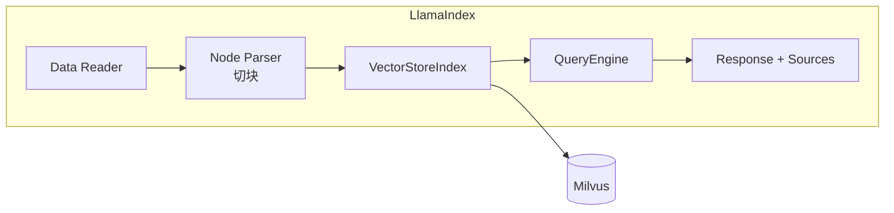

# 29 LlamaIndex 集成

## 学习目标

学完本章后，你应该能够：

- 使用 LlamaIndex 的 MilvusVectorStore 连接 Milvus。
- 通过 LlamaIndex 实现文档索引和查询。
- 构建 LlamaIndex 的 QueryEngine 和 ChatEngine。
- 对比 LlamaIndex 和 LangChain 在 RAG 场景中的差异。
- 判断何时选择 LlamaIndex。

---

## LlamaIndex 简介

LlamaIndex（原 GPT Index）专注于 LLM 数据连接，核心理念是"让 LLM 能够访问你的私有数据"。



### LlamaIndex vs LangChain

| 维度 | LlamaIndex | LangChain |
|---|---|---|
| 定位 | 数据索引和检索框架 | 通用 LLM 应用框架 |
| 核心抽象 | Index、Node、QueryEngine | Chain、Agent、Tool |
| RAG 支持 | 深度优化（内置多种策略） | 通用支持 |
| 学习曲线 | 中等 | 较陡 |
| 灵活性 | RAG 场景很灵活 | 更通用 |
| 适用场景 | 知识库问答、文档检索 | Agent、多工具、复杂流程 |

---

## 安装

```bash
pip install llama-index llama-index-vector-stores-milvus llama-index-embeddings-huggingface llama-index-llms-openai
```

核心依赖：

```text
llama-index==0.11.23
llama-index-vector-stores-milvus==0.4.3
llama-index-embeddings-huggingface==0.4.0
llama-index-llms-openai==0.3.10
pymilvus==2.6.12
```

---

## 基本用法

### 连接 Milvus 并创建索引

```python
from llama_index.core import VectorStoreIndex, Document, Settings
from llama_index.vector_stores.milvus import MilvusVectorStore
from llama_index.embeddings.huggingface import HuggingFaceEmbedding
from llama_index.llms.openai import OpenAI
from llama_index.core import StorageContext

# 配置全局 Embedding 和 LLM
Settings.embed_model = HuggingFaceEmbedding(
    model_name="BAAI/bge-small-zh-v1.5",
    embed_batch_size=64,
)
Settings.llm = OpenAI(model="gpt-4.1-mini", temperature=0.2)

# 创建 Milvus VectorStore
vector_store = MilvusVectorStore(
    uri="http://localhost:19530",
    collection_name="llamaindex_docs",
    dim=512,  # bge-small-zh 输出 512 维
    overwrite=True,  # 开发时重建
)

storage_context = StorageContext.from_defaults(vector_store=vector_store)

# 准备文档
documents = [
    Document(text="Milvus 是面向 AI 应用的高性能向量数据库，支持多种索引类型。", metadata={"source": "intro"}),
    Document(text="HNSW 索引通过多层图结构实现快速近似最近邻搜索。", metadata={"source": "index"}),
    Document(text="RAG 系统结合向量检索和大语言模型，提供基于知识的问答。", metadata={"source": "rag"}),
]

# 创建索引（自动 Embedding + 写入 Milvus）
index = VectorStoreIndex.from_documents(
    documents,
    storage_context=storage_context,
)
print("索引创建完成")
```

### 查询

```python
# 创建 QueryEngine
query_engine = index.as_query_engine(
    similarity_top_k=3,
)

# 提问
response = query_engine.query("Milvus 支持什么索引？")
print(f"答案: {response.response}")
print(f"来源: {[node.metadata for node in response.source_nodes]}")
```

---

## 从文件加载

### PDF 加载

```python
from llama_index.core import SimpleDirectoryReader

# 从目录加载所有支持的文件（PDF、TXT、DOCX 等）
reader = SimpleDirectoryReader(input_dir="./documents/")
documents = reader.load_data()
print(f"加载 {len(documents)} 个文档")

# 创建索引
index = VectorStoreIndex.from_documents(
    documents,
    storage_context=storage_context,
)
```

### 自定义 Node Parser（切块）

```python
from llama_index.core.node_parser import SentenceSplitter

# 自定义切块参数
node_parser = SentenceSplitter(
    chunk_size=600,
    chunk_overlap=100,
    separator="。",
)

Settings.node_parser = node_parser

# 或在创建索引时指定
index = VectorStoreIndex.from_documents(
    documents,
    storage_context=storage_context,
    transformations=[node_parser],
)
```

---

## QueryEngine 高级配置

### 带过滤的查询

```python
from llama_index.core.vector_stores import MetadataFilters, MetadataFilter

# 只搜索特定来源的文档
filters = MetadataFilters(
    filters=[
        MetadataFilter(key="source", value="manual"),
    ]
)

query_engine = index.as_query_engine(
    similarity_top_k=5,
    filters=filters,
)
```

### 自定义 Prompt

```python
from llama_index.core.prompts import PromptTemplate

custom_qa_prompt = PromptTemplate(
    "基于以下资料回答问题。如果资料不足，请说'无法判断'。\n\n"
    "资料：\n{context_str}\n\n"
    "问题：{query_str}\n\n"
    "答案："
)

query_engine = index.as_query_engine(
    similarity_top_k=5,
    text_qa_template=custom_qa_prompt,
)
```

### Response Mode

LlamaIndex 支持多种响应生成模式：

```python
# compact：将所有检索内容压缩到一个 Prompt 中（默认）
query_engine = index.as_query_engine(response_mode="compact")

# refine：逐个 Node 迭代优化答案
query_engine = index.as_query_engine(response_mode="refine")

# tree_summarize：树状汇总
query_engine = index.as_query_engine(response_mode="tree_summarize")

# no_text：只返回检索结果，不调用 LLM
query_engine = index.as_query_engine(response_mode="no_text")
```

| Mode | 适用场景 | LLM 调用次数 |
|---|---|---|
| `compact` | 通用问答 | 1 次 |
| `refine` | 需要综合多个来源 | N 次（每个 Node 一次） |
| `tree_summarize` | 长文档摘要 | log(N) 次 |
| `no_text` | 只需要检索结果 | 0 次 |

---

## ChatEngine（多轮对话）

```python
# 创建 ChatEngine（内置对话记忆）
chat_engine = index.as_chat_engine(
    chat_mode="condense_plus_context",  # 改写查询 + 检索
    similarity_top_k=5,
)

# 多轮对话
response1 = chat_engine.chat("Milvus 支持哪些索引？")
print(response1.response)

response2 = chat_engine.chat("它们的内存开销分别是多少？")
print(response2.response)  # 自动理解"它们"指索引

# 重置对话
chat_engine.reset()
```

### Chat Mode 选择

| Mode | 行为 | 适用场景 |
|---|---|---|
| `condense_plus_context` | 改写查询 + 检索 + 生成 | **推荐默认** |
| `context` | 直接检索 + 生成（不改写） | 查询已经很明确 |
| `condense_question` | 只改写查询，不检索 | 特殊场景 |
| `simple` | 不检索，纯对话 | 闲聊 |

---

## 连接已有 Collection

如果 Milvus 中已有数据（如通过 pymilvus 写入），可以直接连接：

```python
# 连接已有 Collection（不重建）
vector_store = MilvusVectorStore(
    uri="http://localhost:19530",
    collection_name="existing_collection",
    dim=768,
    overwrite=False,  # 不重建
)

# 从已有 VectorStore 创建索引
index = VectorStoreIndex.from_vector_store(vector_store)

# 直接查询
query_engine = index.as_query_engine(similarity_top_k=5)
response = query_engine.query("你的问题")
```

---

## 高级功能：SubQuestion Query

对复杂问题自动拆分为子问题：

```python
from llama_index.core.query_engine import SubQuestionQueryEngine
from llama_index.core.tools import QueryEngineTool, ToolMetadata

# 定义多个查询工具
tools = [
    QueryEngineTool(
        query_engine=index.as_query_engine(),
        metadata=ToolMetadata(
            name="milvus_docs",
            description="Milvus 技术文档，包含索引、部署、配置等信息",
        ),
    ),
]

# 创建子问题查询引擎
sub_question_engine = SubQuestionQueryEngine.from_defaults(
    query_engine_tools=tools,
)

# 复杂问题会被拆分
response = sub_question_engine.query(
    "对比 HNSW 和 IVF 索引的内存开销和搜索延迟"
)
# 内部会拆分为：
# 1. HNSW 的内存开销是多少？
# 2. IVF 的内存开销是多少？
# 3. HNSW 的搜索延迟是多少？
# 4. IVF 的搜索延迟是多少？
```

---

## 完整示例：PDF 知识库

```python
from llama_index.core import VectorStoreIndex, SimpleDirectoryReader, Settings, StorageContext
from llama_index.vector_stores.milvus import MilvusVectorStore
from llama_index.embeddings.huggingface import HuggingFaceEmbedding
from llama_index.llms.openai import OpenAI
from llama_index.core.node_parser import SentenceSplitter

# 配置
Settings.embed_model = HuggingFaceEmbedding(model_name="BAAI/bge-small-zh-v1.5")
Settings.llm = OpenAI(model="gpt-4.1-mini", temperature=0.2)
Settings.node_parser = SentenceSplitter(chunk_size=600, chunk_overlap=100)

# Milvus 连接
vector_store = MilvusVectorStore(
    uri="http://localhost:19530",
    collection_name="pdf_knowledge",
    dim=512,
    overwrite=True,
)
storage_context = StorageContext.from_defaults(vector_store=vector_store)

# 加载文档
documents = SimpleDirectoryReader("./pdfs/").load_data()
print(f"加载 {len(documents)} 页文档")

# 创建索引
index = VectorStoreIndex.from_documents(documents, storage_context=storage_context)

# 问答
chat_engine = index.as_chat_engine(chat_mode="condense_plus_context", similarity_top_k=5)

while True:
    question = input("\n问题（输入 q 退出）: ")
    if question.lower() == "q":
        break
    response = chat_engine.chat(question)
    print(f"\n答案: {response.response}")
    print(f"来源: {[n.node.metadata.get('file_name', '') for n in response.source_nodes]}")
```

---

## 常见错误

| 现象 | 原因 | 修复 |
|---|---|---|
| `dim mismatch` | Embedding 维度与 Collection 不一致 | 确认模型维度，重建 Collection |
| 查询返回空 | overwrite=True 清空了数据 | 生产环境设 overwrite=False |
| LLM 报错 | API Key 未配置 | 设置 `OPENAI_API_KEY` 环境变量 |
| 中文切块效果差 | 默认 SentenceSplitter 不识别中文句号 | 设置 `separator="。"` |
| 版本冲突 | llama-index 子包版本不兼容 | 统一使用同一大版本 |

---

## 面试题

1. **LlamaIndex 和 LangChain 的核心区别？**
   LlamaIndex 专注于数据索引和检索，内置多种 RAG 策略（SubQuestion、TreeSummarize 等）。LangChain 是通用框架，支持 Agent、Tool、Chain 等更广泛的模式。RAG 场景下 LlamaIndex 更开箱即用。

2. **VectorStoreIndex 和 from_vector_store 的区别？**
   `from_documents` 会解析文档、切块、Embedding、写入。`from_vector_store` 直接连接已有数据，不做任何写入。前者用于初始化，后者用于查询已有数据。

3. **response_mode="refine" 适合什么场景？**
   当答案需要综合多个 Node 的信息时。refine 会逐个 Node 迭代优化答案，适合需要全面总结的问题。缺点是 LLM 调用次数多，延迟高。

4. **SubQuestionQueryEngine 的价值是什么？**
   自动将复杂问题拆分为简单子问题，分别检索后综合回答。适合对比类问题（"A 和 B 的区别"）和多方面问题（"X 的优缺点和适用场景"）。

5. **为什么 LlamaIndex 的 ChatEngine 比手动实现多轮对话更方便？**
   ChatEngine 内置了对话历史管理和查询改写（condense），不需要手动维护 history 和实现 Query Rewrite。

---

## 练习题

1. **基础集成**：用 LlamaIndex + Milvus 加载一份 PDF，实现问答。

2. **Response Mode 对比**：同一个问题分别用 compact 和 refine 模式，对比答案质量和延迟。

3. **多轮对话**：用 ChatEngine 进行 5 轮对话，验证代词解析是否正确。

4. **与 LangChain 对比**：同一份数据和问题，分别用 LlamaIndex 和 LangChain 实现 RAG，对比代码量和答案质量。

---

## 小结

LlamaIndex 是 RAG 场景的专业框架，与 Milvus 集成简洁。核心优势：内置多种 RAG 策略（SubQuestion、Refine、TreeSummarize）、ChatEngine 开箱即用、Node 抽象清晰。适合快速构建知识库问答系统。如果需要 Agent、多工具协作等复杂场景，LangChain 更合适。
