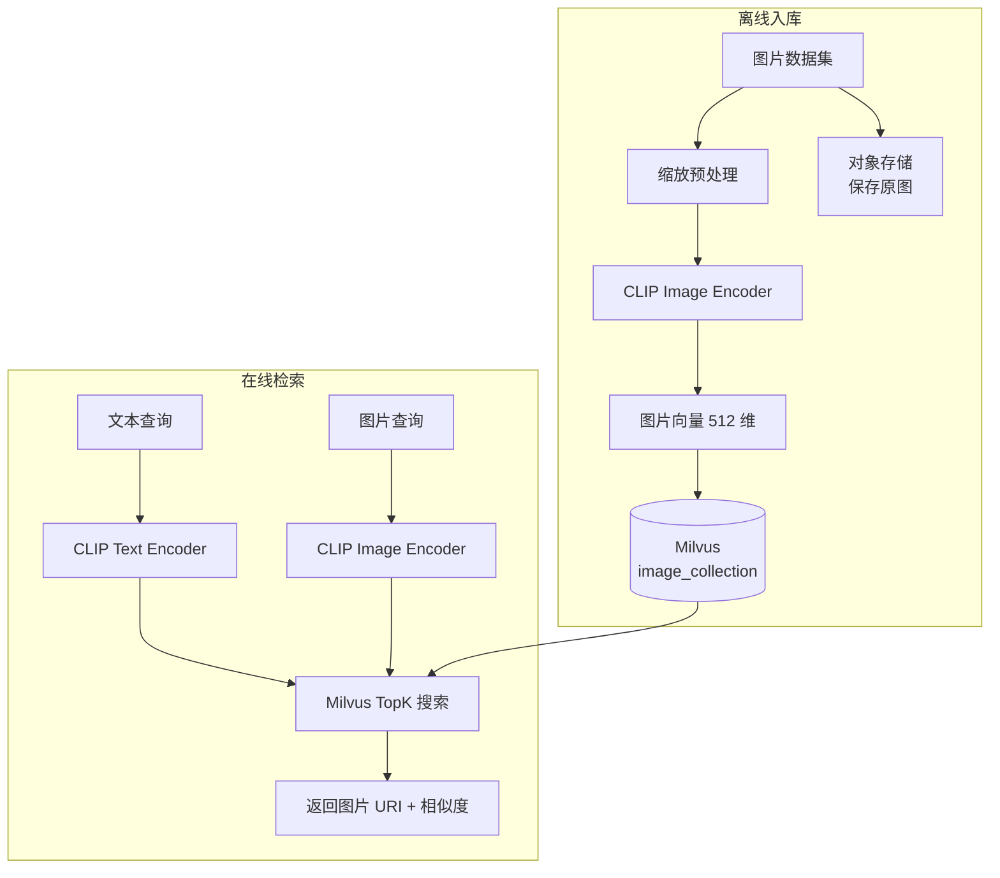
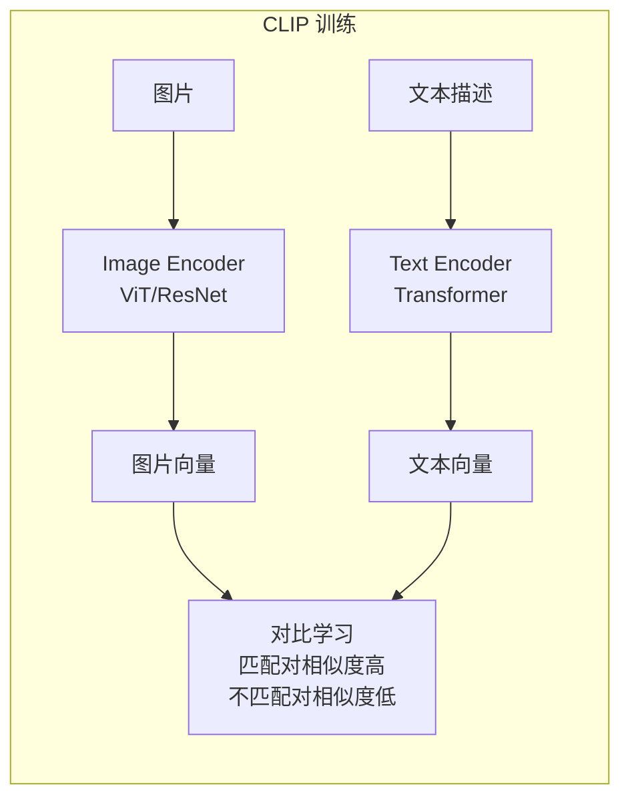

# 30 图片检索系统

## 学习目标

学完本章后，你应该能够：

- 使用 CLIP 模型生成图片和文本的 Embedding。
- 在 Milvus 中存储图片向量并构建索引。
- 实现图搜图（以图搜图）和文搜图（以文搜图）。
- 设计批量图片导入流程。
- 使用 FastAPI 构建图片检索 API 和 Web Demo。

---

## 系统架构



核心原理：CLIP 将图片和文本映射到**同一个向量空间**，使得文本向量可以直接与图片向量比较相似度。

---

## CLIP 模型

### 什么是 CLIP

CLIP（Contrastive Language-Image Pre-training）由 OpenAI 提出，通过对比学习让图片和文本共享同一个语义空间。



### 模型选择

| 模型 | 维度 | 图片大小 | 速度 | 质量 |
|---|---|---|---|---|
| `openai/clip-vit-base-patch32` | 512 | 224×224 | 快 | 中 |
| `openai/clip-vit-base-patch16` | 512 | 224×224 | 中 | 好 |
| `openai/clip-vit-large-patch14` | 768 | 224×224 | 慢 | 很好 |
| `BAAI/bge-visualized` | 768 | 224×224 | 中 | 好（中文优化） |

本章使用 `clip-vit-base-patch32`（512 维，速度快，适合入门）。

---

## 环境准备

```bash
pip install transformers torch torchvision Pillow pymilvus fastapi uvicorn python-multipart
```

---

## CLIP Embedding 封装

```python
import torch
from PIL import Image
from transformers import CLIPModel, CLIPProcessor

class CLIPEmbedding:
    def __init__(self, model_name: str = "openai/clip-vit-base-patch32", device: str = "cpu"):
        self._device = device
        self._model = CLIPModel.from_pretrained(model_name).to(device)
        self._processor = CLIPProcessor.from_pretrained(model_name)
        self._dim = self._model.config.projection_dim  # 512

    @property
    def dim(self) -> int:
        return self._dim

    def encode_images(self, images: list[Image.Image]) -> list[list[float]]:
        """编码图片列表"""
        inputs = self._processor(images=images, return_tensors="pt", padding=True).to(self._device)
        with torch.no_grad():
            embeddings = self._model.get_image_features(**inputs)
            embeddings = embeddings / embeddings.norm(dim=-1, keepdim=True)
        return embeddings.cpu().numpy().tolist()

    def encode_texts(self, texts: list[str]) -> list[list[float]]:
        """编码文本列表"""
        inputs = self._processor(text=texts, return_tensors="pt", padding=True, truncation=True).to(self._device)
        with torch.no_grad():
            embeddings = self._model.get_text_features(**inputs)
            embeddings = embeddings / embeddings.norm(dim=-1, keepdim=True)
        return embeddings.cpu().numpy().tolist()

    def encode_image_file(self, path: str) -> list[float]:
        """编码单张图片文件"""
        image = Image.open(path).convert("RGB")
        return self.encode_images([image])[0]
```

---

## Milvus Collection 设计

```python
from pymilvus import DataType, MilvusClient

def create_image_collection(client: MilvusClient, name: str, dim: int):
    if client.has_collection(name):
        client.drop_collection(name)

    schema = MilvusClient.create_schema(auto_id=False)
    schema.add_field(field_name="image_id", datatype=DataType.VARCHAR, is_primary=True, max_length=64)
    schema.add_field(field_name="image_uri", datatype=DataType.VARCHAR, max_length=512)
    schema.add_field(field_name="filename", datatype=DataType.VARCHAR, max_length=256)
    schema.add_field(field_name="category", datatype=DataType.VARCHAR, max_length=64)
    schema.add_field(field_name="width", datatype=DataType.INT32)
    schema.add_field(field_name="height", datatype=DataType.INT32)
    schema.add_field(field_name="embedding", datatype=DataType.FLOAT_VECTOR, dim=dim)

    index_params = MilvusClient.prepare_index_params()
    index_params.add_index(
        field_name="embedding",
        index_type="HNSW",
        metric_type="COSINE",
        params={"M": 16, "efConstruction": 200},
    )
    index_params.add_index(field_name="category", index_type="INVERTED")

    client.create_collection(collection_name=name, schema=schema, index_params=index_params)
    client.load_collection(name)
```

---

## 批量图片导入

```python
import hashlib
from pathlib import Path
from PIL import Image

def ingest_images(
    image_dir: str,
    client: MilvusClient,
    collection_name: str,
    clip: CLIPEmbedding,
    batch_size: int = 32,
    category: str = "default",
) -> int:
    """批量导入图片到 Milvus"""
    image_paths = list(Path(image_dir).glob("*.jpg")) + list(Path(image_dir).glob("*.png"))
    total = 0

    for i in range(0, len(image_paths), batch_size):
        batch_paths = image_paths[i : i + batch_size]
        images = []
        rows = []

        for path in batch_paths:
            try:
                img = Image.open(path).convert("RGB")
                images.append(img)
                rows.append({
                    "image_id": hashlib.md5(path.name.encode()).hexdigest()[:16],
                    "image_uri": str(path.absolute()),
                    "filename": path.name,
                    "category": category,
                    "width": img.width,
                    "height": img.height,
                })
            except Exception as e:
                print(f"跳过 {path.name}: {e}")

        if not images:
            continue

        # 批量编码
        vectors = clip.encode_images(images)
        for row, vec in zip(rows, vectors):
            row["embedding"] = vec

        client.upsert(collection_name=collection_name, data=rows)
        total += len(rows)
        print(f"已导入: {total} / {len(image_paths)}")

    return total
```

---

## 图搜图

```python
def search_by_image(
    image_path: str,
    client: MilvusClient,
    collection_name: str,
    clip: CLIPEmbedding,
    top_k: int = 5,
) -> list[dict]:
    """以图搜图"""
    query_vector = clip.encode_image_file(image_path)

    results = client.search(
        collection_name=collection_name,
        data=[query_vector],
        anns_field="embedding",
        search_params={"metric_type": "COSINE", "params": {"ef": 64}},
        limit=top_k,
        output_fields=["image_uri", "filename", "category"],
    )

    return [
        {
            "filename": hit["entity"]["filename"],
            "image_uri": hit["entity"]["image_uri"],
            "category": hit["entity"]["category"],
            "score": hit["distance"],
        }
        for hit in results[0]
    ]
```

---

## 文搜图

```python
def search_by_text(
    query_text: str,
    client: MilvusClient,
    collection_name: str,
    clip: CLIPEmbedding,
    top_k: int = 5,
    category_filter: str = "",
) -> list[dict]:
    """以文搜图"""
    query_vector = clip.encode_texts([query_text])[0]

    filter_expr = f'category == "{category_filter}"' if category_filter else ""

    results = client.search(
        collection_name=collection_name,
        data=[query_vector],
        anns_field="embedding",
        search_params={"metric_type": "COSINE", "params": {"ef": 64}},
        limit=top_k,
        filter=filter_expr or None,
        output_fields=["image_uri", "filename", "category"],
    )

    return [
        {
            "filename": hit["entity"]["filename"],
            "image_uri": hit["entity"]["image_uri"],
            "category": hit["entity"]["category"],
            "score": hit["distance"],
        }
        for hit in results[0]
    ]
```

---

## FastAPI 检索服务

```python
from fastapi import FastAPI, UploadFile, File
from fastapi.responses import JSONResponse
import tempfile
import shutil

app = FastAPI(title="Image Search API")

# 全局初始化
clip = CLIPEmbedding("openai/clip-vit-base-patch32")
client = MilvusClient(uri="http://localhost:19530")
COLLECTION = "image_gallery"


@app.get("/search/text")
def text_search(q: str, top_k: int = 5, category: str = ""):
    """文搜图"""
    results = search_by_text(q, client, COLLECTION, clip, top_k, category)
    return {"query": q, "results": results}


@app.post("/search/image")
async def image_search(file: UploadFile = File(...), top_k: int = 5):
    """图搜图"""
    with tempfile.NamedTemporaryFile(suffix=".jpg", delete=False) as tmp:
        shutil.copyfileobj(file.file, tmp)
        tmp_path = tmp.name

    results = search_by_image(tmp_path, client, COLLECTION, clip, top_k)
    Path(tmp_path).unlink()  # 清理临时文件
    return {"filename": file.filename, "results": results}


@app.get("/health")
def health():
    return {"status": "ok"}
```

### API 测试

```bash
# 启动服务
uvicorn app:app --reload --port 8002

# 文搜图
curl 'http://localhost:8002/search/text?q=red+car&top_k=5'

# 图搜图
curl -X POST http://localhost:8002/search/image \
  -F 'file=@./test_image.jpg' \
  -F 'top_k=5'

# 带类别过滤的文搜图
curl 'http://localhost:8002/search/text?q=sunset&top_k=5&category=nature'
```

---

## 生产注意事项

### 图片预处理

```python
def preprocess_image(image: Image.Image, max_size: int = 800) -> Image.Image:
    """生产环境图片预处理"""
    # 限制尺寸（减少内存和编码时间）
    if max(image.size) > max_size:
        image.thumbnail((max_size, max_size), Image.LANCZOS)

    # 转为 RGB（去除 alpha 通道）
    if image.mode != "RGB":
        image = image.convert("RGB")

    return image
```

### 存储架构


**原则**：Milvus 只存向量和元数据（URI），原图存对象存储。

### 模型升级

图片模型升级（如从 CLIP-base 换到 CLIP-large）意味着向量空间变化，需要：
1. 新建 Collection
2. 全量图片重新编码
3. 灰度切换

---

## 常见错误

| 现象 | 原因 | 修复 |
|---|---|---|
| 文搜图效果差 | 查询语言与 CLIP 训练语料不匹配 | 用英文查询，或换中文 CLIP |
| 图搜图返回自身 | 查询图片在库中 | 过滤掉自身 ID |
| 编码很慢 | CPU 推理大模型 | 用 GPU 或换小模型 |
| 内存爆掉 | 图片未缩放、batch 太大 | 预处理限制尺寸，减小 batch |
| 相似度分数都很低 | 图片内容与文本描述差异大 | CLIP 的跨模态匹配有上限 |

---

## 面试题

1. **CLIP 为什么能同时支持文搜图和图搜图？**
   CLIP 通过对比学习将图片和文本映射到同一个向量空间。匹配的图文对在空间中距离近。搜索时无论查询是图片还是文本，都能与图片向量比较。

2. **图片检索为什么不存原图到 Milvus？**
   Milvus 是向量数据库，不是文件存储。原图存入会导致单行过大、内存浪费、网络传输慢。正确做法：原图存 OSS/CDN，Milvus 只存向量和 URI。

3. **CLIP 的中文效果为什么不如英文？**
   原版 CLIP 主要用英文数据训练，中文 token 覆盖不足。解决方案：用中文 CLIP（如 Chinese-CLIP）或用英文描述查询。

4. **批量导入 100 万张图片需要多长时间？**
   瓶颈在 CLIP 编码。GPU T4 上 CLIP-base 约 200 张/秒，100 万张约 83 分钟。可以多 GPU 并行加速。Milvus 写入本身很快。

5. **如何处理图片模型升级？**
   新旧模型的向量空间不兼容。必须新建 Collection，全量重新编码，灰度切换。不能在同一个 Collection 中混合不同模型的向量。

---

## 练习题

1. **基础图搜图**：准备 20 张图片，导入 Milvus，用其中一张搜索，验证返回最相似的图片。

2. **文搜图测试**：用 5 个英文描述（如 "a cat sitting on a sofa"）搜索图片库，评估结果相关性。

3. **类别过滤**：给图片添加 category 字段，验证过滤搜索只返回指定类别的图片。

4. **性能测试**：测量 CLIP 编码 100 张图片的耗时（CPU vs GPU），以及 Milvus 搜索延迟。

---

## 小结

图片检索的核心是 CLIP 模型将视觉特征转化为可搜索的向量。Milvus 负责高性能向量检索，对象存储负责图片分发。系统设计要点：图片预处理控制大小、批量编码提高吞吐、URI 引用而非存原图、模型升级需要全量重建。
