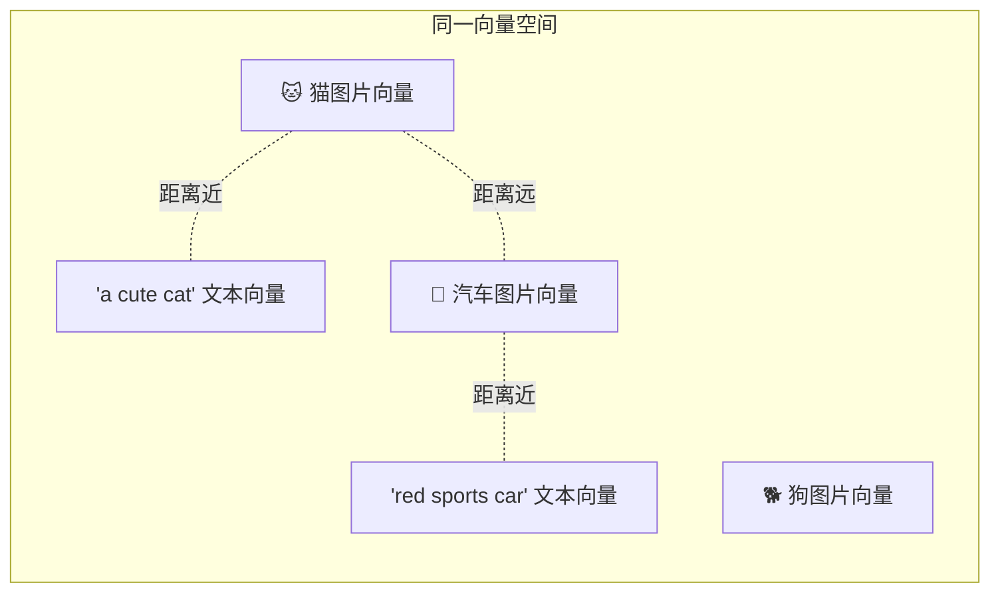

# 31 CLIP 多模态检索

## 学习目标

学完本章后，你应该能够：

- 理解多模态检索的核心原理（共享向量空间）。
- 在同一个 Collection 中混合存储图片和文本向量。
- 实现跨模态搜索（文搜图、图搜文、图搜图）。
- 设计多模态数据的 Schema 和入库流程。
- 评估多模态检索的质量和局限性。

---

## 多模态检索原理

多模态检索的前提：**不同模态的数据被映射到同一个向量空间**。



CLIP 模型通过对比学习实现这一点：训练时让匹配的图文对向量接近，不匹配的远离。

---

## 与单模态检索的区别

| 维度 | 单模态（纯文本/纯图片） | 多模态 |
|---|---|---|
| 向量空间 | 只有一种模态 | 多种模态共享空间 |
| 查询方式 | 文搜文 或 图搜图 | 文搜图、图搜文、图搜图 |
| 模型要求 | 单模态 Embedding 模型 | 多模态模型（CLIP 等） |
| Collection 设计 | 单一数据类型 | 需要模态标记字段 |

---

## Schema 设计

```python
from pymilvus import DataType, MilvusClient

def create_multimodal_collection(client: MilvusClient, name: str, dim: int):
    schema = MilvusClient.create_schema(auto_id=False)

    # 主键
    schema.add_field(field_name="id", datatype=DataType.VARCHAR, is_primary=True, max_length=64)

    # 共享向量字段（图片和文本都写入这里）
    schema.add_field(field_name="embedding", datatype=DataType.FLOAT_VECTOR, dim=dim)

    # 模态标记
    schema.add_field(field_name="modality", datatype=DataType.VARCHAR, max_length=16)  # "image" / "text"

    # 内容引用
    schema.add_field(field_name="content_uri", datatype=DataType.VARCHAR, max_length=512)
    schema.add_field(field_name="content_text", datatype=DataType.VARCHAR, max_length=2048)
    schema.add_field(field_name="title", datatype=DataType.VARCHAR, max_length=256)

    # 元数据
    schema.add_field(field_name="source", datatype=DataType.VARCHAR, max_length=128)
    schema.add_field(field_name="category", datatype=DataType.VARCHAR, max_length=64)

    # 索引
    index_params = MilvusClient.prepare_index_params()
    index_params.add_index(field_name="embedding", index_type="HNSW", metric_type="COSINE",
                           params={"M": 16, "efConstruction": 200})
    index_params.add_index(field_name="modality", index_type="INVERTED")
    index_params.add_index(field_name="category", index_type="INVERTED")

    client.create_collection(collection_name=name, schema=schema, index_params=index_params)
    client.load_collection(name)
```

---

## 多模态数据入库

```python
from PIL import Image
import hashlib

class MultimodalIngester:
    def __init__(self, clip: CLIPEmbedding, client: MilvusClient, collection: str):
        self._clip = clip
        self._client = client
        self._collection = collection

    def ingest_images(self, image_paths: list[str], category: str = "") -> int:
        """批量导入图片"""
        images = []
        rows = []
        for path in image_paths:
            try:
                img = Image.open(path).convert("RGB")
                images.append(img)
                rows.append({
                    "id": hashlib.md5(path.encode()).hexdigest()[:16],
                    "modality": "image",
                    "content_uri": path,
                    "content_text": "",
                    "title": Path(path).stem,
                    "source": "image_upload",
                    "category": category,
                })
            except Exception:
                continue

        vectors = self._clip.encode_images(images)
        for row, vec in zip(rows, vectors):
            row["embedding"] = vec

        self._client.upsert(collection_name=self._collection, data=rows)
        return len(rows)

    def ingest_texts(self, texts: list[dict], category: str = "") -> int:
        """批量导入文本（也映射到 CLIP 空间）"""
        contents = [t["text"] for t in texts]
        vectors = self._clip.encode_texts(contents)

        rows = []
        for t, vec in zip(texts, vectors):
            rows.append({
                "id": hashlib.md5(t["text"][:50].encode()).hexdigest()[:16],
                "modality": "text",
                "content_uri": "",
                "content_text": t["text"],
                "title": t.get("title", ""),
                "source": t.get("source", "text_upload"),
                "category": category,
                "embedding": vec,
            })

        self._client.upsert(collection_name=self._collection, data=rows)
        return len(rows)
```

---

## 跨模态搜索

### 文搜图

```python
def text_to_image_search(query: str, client, collection, clip, top_k=5):
    """用文本搜索图片"""
    query_vector = clip.encode_texts([query])[0]
    results = client.search(
        collection_name=collection,
        data=[query_vector],
        anns_field="embedding",
        search_params={"metric_type": "COSINE", "params": {"ef": 64}},
        limit=top_k,
        filter='modality == "image"',  # 只搜索图片
        output_fields=["content_uri", "title", "category"],
    )
    return results[0]
```

### 图搜文

```python
def image_to_text_search(image_path: str, client, collection, clip, top_k=5):
    """用图片搜索相关文本"""
    query_vector = clip.encode_image_file(image_path)
    results = client.search(
        collection_name=collection,
        data=[query_vector],
        anns_field="embedding",
        search_params={"metric_type": "COSINE", "params": {"ef": 64}},
        limit=top_k,
        filter='modality == "text"',  # 只搜索文本
        output_fields=["content_text", "title", "category"],
    )
    return results[0]
```

### 全模态搜索

```python
def universal_search(query_vector: list[float], client, collection, top_k=5):
    """不限模态，搜索所有内容"""
    results = client.search(
        collection_name=collection,
        data=[query_vector],
        anns_field="embedding",
        search_params={"metric_type": "COSINE", "params": {"ef": 64}},
        limit=top_k,
        output_fields=["modality", "content_uri", "content_text", "title"],
    )
    return results[0]
```

---

## 应用场景

### 场景一：电商商品搜索

用户可以上传图片找相似商品，也可以用文字描述搜索：

```python
# 文搜图："红色连衣裙"
results = text_to_image_search("red dress", client, "products", clip)

# 图搜图：上传一张裙子图片找相似款
results = search_by_image("user_upload.jpg", client, "products", clip)
```

### 场景二：多媒体知识库

图片和文本混合存储，统一搜索：

```python
# 用户问"网络架构图"，可能返回：
# - 相关的架构图片
# - 描述网络架构的文本段落
results = universal_search(query_vector, client, "knowledge_base")
```

### 场景三：内容审核

上传图片，搜索是否有相似的违规内容：

```python
results = search_by_image("uploaded_image.jpg", client, "violation_db", clip, top_k=1)
if results and results[0]["distance"] > 0.95:
    flag_as_violation(results[0])
```

---

## 多模态检索的局限性

### CLIP 的能力边界

| 能力 | 表现 |
|---|---|
| 通用物体识别 | 好 |
| 场景理解 | 中等 |
| 细粒度区分（品牌、型号） | 差 |
| 文字识别（OCR） | 不支持 |
| 中文理解 | 原版差，需要中文 CLIP |
| 抽象概念 | 有限 |

### 提升多模态检索质量

1. **使用更大的 CLIP 模型**（large > base）
2. **使用中文 CLIP**（Chinese-CLIP、BGE-Visualized）
3. **结合文本描述**：为图片生成 caption，同时存储图片向量和 caption 向量
4. **多向量方案**：图片向量 + 文本描述向量，搜索时融合

```python
# 增强方案：图片 + 自动生成的描述
schema.add_field(field_name="image_embedding", datatype=DataType.FLOAT_VECTOR, dim=512)
schema.add_field(field_name="caption_embedding", datatype=DataType.FLOAT_VECTOR, dim=768)

# 搜索时用 hybrid_search 融合两个向量字段的结果
```

---

## 常见错误

| 现象 | 原因 | 修复 |
|---|---|---|
| 文搜图效果差 | 用中文查询但 CLIP 是英文模型 | 用英文查询或换中文 CLIP |
| 跨模态相似度普遍低 | CLIP 跨模态匹配天然弱于同模态 | 降低阈值，0.2-0.3 可能就是好结果 |
| 图搜文返回不相关 | 文本太短，CLIP 文本编码信息不足 | 文本至少 10 个词以上 |
| 混合搜索结果混乱 | 未按 modality 过滤 | 根据场景添加 modality filter |

---

## 面试题

1. **多模态检索的前提条件是什么？**
   不同模态的数据必须被映射到同一个向量空间。这要求使用多模态模型（如 CLIP）同时训练图片和文本编码器，使匹配对在空间中接近。

2. **为什么跨模态相似度通常低于同模态？**
   同模态数据（图片-图片）共享更多底层特征，向量更容易接近。跨模态（文本-图片）需要跨越表示鸿沟，即使语义匹配，向量距离也通常更大。

3. **如何提升中文文搜图的效果？**
   方案一：用中文 CLIP 模型。方案二：先将中文翻译为英文再搜索。方案三：为图片生成中文 caption，用文本检索 caption。

4. **多模态 Collection 中为什么需要 modality 字段？**
   用于控制搜索范围。文搜图时只搜索 modality="image"，图搜文时只搜索 modality="text"。全模态搜索时不加过滤。

5. **CLIP 向量和 BGE 文本向量能混合存储吗？**
   不能。它们是不同的向量空间，相似度不可比较。如果需要同时支持文本语义搜索和多模态搜索，需要两个向量字段或两个 Collection。

---

## 练习题

1. **跨模态搜索**：导入 20 张图片和 20 段文本描述，测试文搜图和图搜文的效果。

2. **模态过滤**：对比有无 modality 过滤时的搜索结果差异。

3. **中英文对比**：同一张图片分别用中文和英文描述搜索，对比 score 差异。

4. **多模态融合**：为每张图片同时存储 CLIP 向量和自动生成的 caption 向量，对比单向量和双向量融合的搜索质量。

---

## 小结

多模态检索的核心是共享向量空间——CLIP 让图片和文本"说同一种语言"。在 Milvus 中通过 modality 字段控制搜索范围，实现文搜图、图搜文、全模态搜索。局限性在于 CLIP 的跨模态匹配精度有上限，生产中常结合文本描述增强效果。
