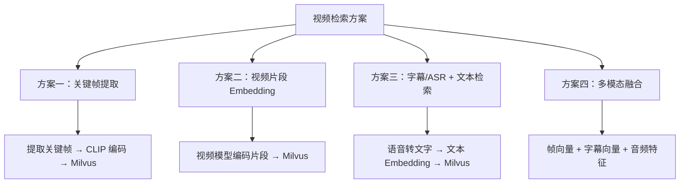
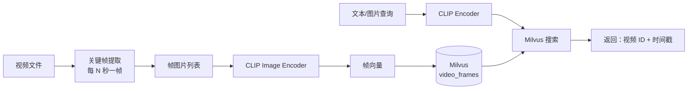
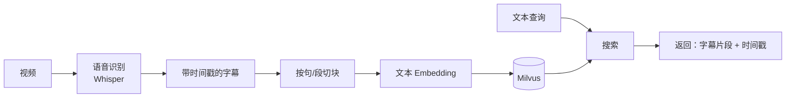

# 32 视频检索思路

## 学习目标

学完本章后，你应该能够：

- 理解视频检索的核心挑战和常见方案。
- 设计关键帧提取 + 向量化的视频入库流程。
- 实现基于帧的视频片段检索。
- 了解视频级 Embedding 模型的发展方向。
- 评估不同视频检索方案的取舍。

---

## 视频检索的挑战

视频与图片/文本的关键区别：

| 维度 | 文本/图片 | 视频 |
|---|---|---|
| 数据量 | 单个文件 KB-MB | 单个文件 MB-GB |
| 信息密度 | 高（每个都有意义） | 低（大量冗余帧） |
| 时间维度 | 无 | 有（内容随时间变化） |
| 检索粒度 | 整个文档/图片 | 需要定位到具体片段 |
| 编码成本 | 低-中 | 高（帧数多） |

---

## 方案概览



---

## 方案一：关键帧提取（推荐入门）

最实用的方案：从视频中提取关键帧，用 CLIP 编码后存入 Milvus。

### 架构



### 关键帧提取

```python
import cv2
from pathlib import Path

def extract_keyframes(
    video_path: str,
    interval_seconds: float = 2.0,
    max_frames: int = 500,
) -> list[dict]:
    """按固定间隔提取关键帧"""
    cap = cv2.VideoCapture(video_path)
    fps = cap.get(cv2.CAP_PROP_FPS)
    total_frames = int(cap.get(cv2.CAP_PROP_FRAME_COUNT))
    duration = total_frames / fps

    frame_interval = int(fps * interval_seconds)
    frames = []

    frame_idx = 0
    while cap.isOpened() and len(frames) < max_frames:
        ret, frame = cap.read()
        if not ret:
            break

        if frame_idx % frame_interval == 0:
            # BGR → RGB
            rgb_frame = cv2.cvtColor(frame, cv2.COLOR_BGR2RGB)
            timestamp = frame_idx / fps
            frames.append({
                "frame": rgb_frame,
                "timestamp": timestamp,
                "frame_idx": frame_idx,
            })

        frame_idx += 1

    cap.release()
    return frames
```

### 场景变化检测（更智能的提取）

```python
def extract_scene_changes(video_path: str, threshold: float = 30.0) -> list[dict]:
    """基于场景变化提取关键帧"""
    cap = cv2.VideoCapture(video_path)
    fps = cap.get(cv2.CAP_PROP_FPS)
    frames = []
    prev_frame = None

    frame_idx = 0
    while cap.isOpened():
        ret, frame = cap.read()
        if not ret:
            break

        gray = cv2.cvtColor(frame, cv2.COLOR_BGR2GRAY)

        if prev_frame is not None:
            diff = cv2.absdiff(prev_frame, gray)
            mean_diff = diff.mean()

            if mean_diff > threshold:
                rgb_frame = cv2.cvtColor(frame, cv2.COLOR_BGR2RGB)
                frames.append({
                    "frame": rgb_frame,
                    "timestamp": frame_idx / fps,
                    "frame_idx": frame_idx,
                    "scene_change_score": float(mean_diff),
                })

        prev_frame = gray
        frame_idx += 1

    cap.release()
    return frames
```

### Collection 设计

```python
schema = MilvusClient.create_schema(auto_id=False)
schema.add_field(field_name="frame_id", datatype=DataType.VARCHAR, is_primary=True, max_length=64)
schema.add_field(field_name="video_id", datatype=DataType.VARCHAR, max_length=64)
schema.add_field(field_name="video_path", datatype=DataType.VARCHAR, max_length=512)
schema.add_field(field_name="timestamp", datatype=DataType.FLOAT)  # 秒
schema.add_field(field_name="frame_idx", datatype=DataType.INT32)
schema.add_field(field_name="embedding", datatype=DataType.FLOAT_VECTOR, dim=512)
```

### 入库流程

```python
from PIL import Image
import numpy as np

def ingest_video(video_path: str, client, collection, clip, interval: float = 2.0):
    """视频入库：提取帧 → 编码 → 写入"""
    video_id = hashlib.md5(video_path.encode()).hexdigest()[:12]
    frames = extract_keyframes(video_path, interval_seconds=interval)

    # 批量编码
    pil_images = [Image.fromarray(f["frame"]) for f in frames]
    vectors = clip.encode_images(pil_images)

    # 写入
    rows = []
    for frame_info, vector in zip(frames, vectors):
        rows.append({
            "frame_id": f"{video_id}_{frame_info['frame_idx']}",
            "video_id": video_id,
            "video_path": video_path,
            "timestamp": frame_info["timestamp"],
            "frame_idx": frame_info["frame_idx"],
            "embedding": vector,
        })

    client.upsert(collection_name=collection, data=rows)
    return len(rows)
```

### 搜索并定位视频片段

```python
def search_video_moment(query: str, client, collection, clip, top_k=5):
    """搜索视频中的相关片段"""
    query_vector = clip.encode_texts([query])[0]

    results = client.search(
        collection_name=collection,
        data=[query_vector],
        anns_field="embedding",
        search_params={"metric_type": "COSINE", "params": {"ef": 64}},
        limit=top_k,
        output_fields=["video_id", "video_path", "timestamp"],
    )

    moments = []
    for hit in results[0]:
        moments.append({
            "video_path": hit["entity"]["video_path"],
            "timestamp": hit["entity"]["timestamp"],
            "score": hit["distance"],
            "time_str": f"{int(hit['entity']['timestamp']//60)}:{int(hit['entity']['timestamp']%60):02d}",
        })
    return moments
```

---

## 方案二：字幕/ASR + 文本检索

适合有语音内容的视频（讲座、会议、教程）：



```python
import whisper

def transcribe_video(video_path: str) -> list[dict]:
    """使用 Whisper 转录视频"""
    model = whisper.load_model("base")
    result = model.transcribe(video_path, language="zh")

    segments = []
    for seg in result["segments"]:
        segments.append({
            "text": seg["text"].strip(),
            "start": seg["start"],
            "end": seg["end"],
        })
    return segments
```

---

## 方案三：多模态融合

结合视觉帧和语音字幕，提供更全面的检索：

```python
# 每个视频片段同时存储：
# 1. 关键帧的 CLIP 向量（视觉信息）
# 2. 对应时间段字幕的文本向量（语音信息）

schema.add_field(field_name="frame_embedding", datatype=DataType.FLOAT_VECTOR, dim=512)
schema.add_field(field_name="text_embedding", datatype=DataType.FLOAT_VECTOR, dim=768)

# 搜索时用 hybrid_search 融合两路
```

---

## 方案对比

| 方案 | 优点 | 缺点 | 适用场景 |
|---|---|---|---|
| 关键帧 + CLIP | 简单、通用 | 丢失时间连续性 | 通用视频搜索 |
| ASR + 文本 | 语义精确 | 无语音视频无效 | 讲座、会议、教程 |
| 多模态融合 | 覆盖全面 | 复杂、成本高 | 高价值视频库 |
| 视频级模型 | 理解动作和时序 | 模型大、慢 | 动作识别、体育 |

---

## 存储和成本估算

以 1000 个视频（平均 10 分钟）为例：

| 方案 | 向量数量 | 存储估算 | 编码时间 |
|---|---|---|---|
| 每 2 秒一帧 | 300,000 帧 | ~600 MB | ~25 分钟 (GPU) |
| 每 5 秒一帧 | 120,000 帧 | ~240 MB | ~10 分钟 (GPU) |
| 场景变化检测 | ~50,000 帧 | ~100 MB | ~5 分钟 (GPU) |
| ASR 字幕 | ~30,000 段 | ~90 MB | ~50 分钟 (Whisper) |

---

## 常见错误

| 现象 | 原因 | 修复 |
|---|---|---|
| 搜索结果都是相似帧 | 视频静态画面多，相邻帧重复 | 增大提取间隔或用场景变化检测 |
| 文搜视频效果差 | CLIP 对动态内容理解有限 | 结合 ASR 字幕增强 |
| 入库太慢 | 帧太多、编码慢 | 增大间隔、用 GPU、批量编码 |
| 时间戳不准 | 帧率计算错误 | 确认 fps 正确，用 `frame_idx / fps` |

---

## 面试题

1. **视频检索为什么不能直接把整个视频编码为一个向量？**
   视频内容随时间变化，一个向量无法表示所有片段的语义。用户通常想找视频中的某个片段，需要帧级或片段级的向量才能定位。

2. **关键帧提取间隔设多少合适？**
   取决于视频类型。快节奏视频（MV、体育）用 1-2 秒，慢节奏（讲座、监控）用 5-10 秒。场景变化检测可以自适应。

3. **如何去除相似帧的重复结果？**
   搜索后按 video_id 分组，每个视频只保留 score 最高的帧。或者在入库时用场景变化检测减少冗余帧。

4. **ASR 方案和关键帧方案各适合什么视频？**
   ASR 适合有语音的内容（讲座、播客、会议）。关键帧适合视觉为主的内容（风景、产品展示、无声视频）。最佳实践是两者结合。

5. **视频检索的规模瓶颈在哪里？**
   主要在编码阶段（帧数 × CLIP 推理时间）。1000 个 10 分钟视频 = 30 万帧，GPU 编码约 25 分钟。Milvus 搜索本身很快。

---

## 练习题

1. **基础视频检索**：选一个 5 分钟视频，每 2 秒提取一帧，用 CLIP 编码后存入 Milvus。用文本搜索定位视频片段。

2. **提取策略对比**：同一个视频分别用固定间隔（2s）和场景变化检测提取帧，对比帧数量和搜索效果。

3. **ASR 增强**：对有语音的视频，同时用关键帧和 Whisper 字幕入库，对比单路和融合的搜索效果。

4. **去重实验**：搜索结果中如果同一视频出现多次（不同帧），实现按视频去重并返回最佳时间戳。

---

## 小结

视频检索的核心思路是将视频拆解为可向量化的单元（帧或字幕片段），再用 Milvus 做高效检索。关键帧 + CLIP 是最实用的入门方案，ASR 字幕适合语音内容，两者融合效果最佳。视频检索的主要成本在编码阶段，搜索本身与图片检索无异。
