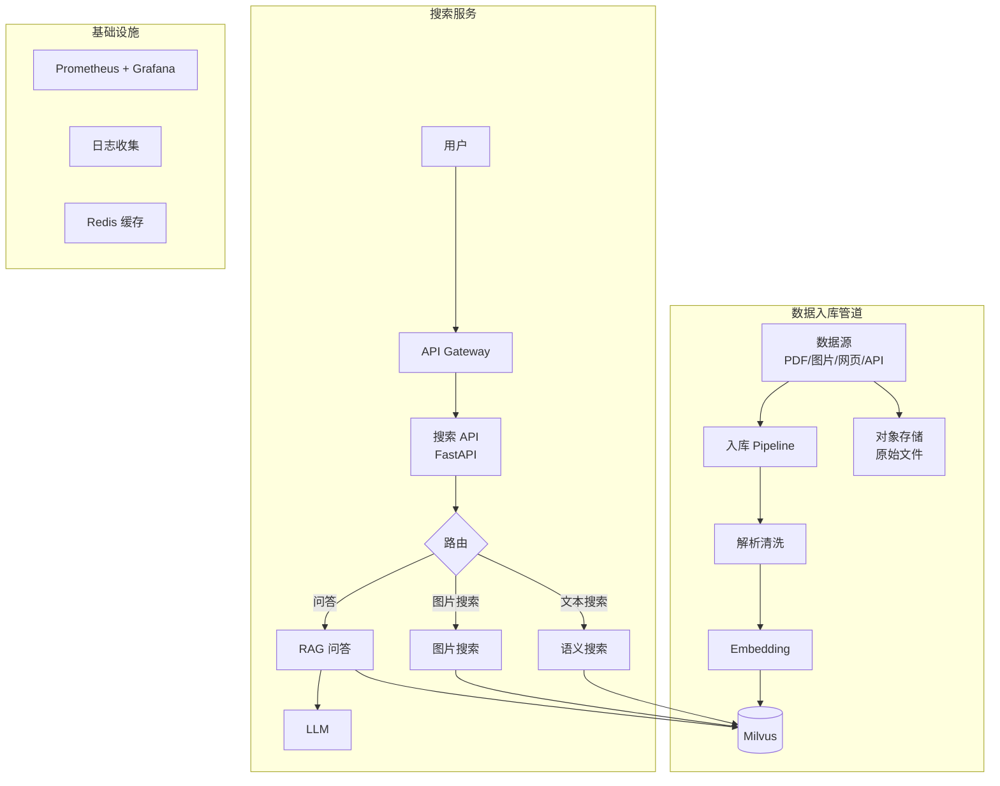

# 34 构建完整 AI 搜索系统

## 学习目标

学完本章后，你应该能够：

- 设计端到端的 AI 搜索系统架构。
- 整合文本检索、图片检索和 RAG 问答为统一服务。
- 实现搜索结果的排序、去重和展示逻辑。
- 设计数据入库管道（Pipeline）。
- 部署完整的搜索系统并进行端到端测试。

---

## 系统架构



---

## 统一搜索 API 设计

```python
from enum import Enum
from pydantic import BaseModel, Field

class SearchMode(str, Enum):
    semantic = "semantic"      # 语义文本搜索
    image = "image"            # 图片搜索
    hybrid = "hybrid"          # 混合搜索
    qa = "qa"                  # RAG 问答

class UnifiedSearchRequest(BaseModel):
    query: str = Field(default="", description="文本查询")
    image_url: str = Field(default="", description="图片 URL（图搜图时）")
    mode: SearchMode = SearchMode.semantic
    top_k: int = Field(default=10, ge=1, le=50)
    filters: dict = Field(default_factory=dict, description="过滤条件")
    rerank: bool = Field(default=True, description="是否启用 Rerank")

class SearchResult(BaseModel):
    id: str
    score: float
    title: str
    snippet: str
    source: str
    modality: str  # text / image
    url: str = ""
    metadata: dict = Field(default_factory=dict)

class UnifiedSearchResponse(BaseModel):
    results: list[SearchResult]
    answer: str = ""  # QA 模式时的生成答案
    total: int
    latency_ms: float
    mode: str
```

---

## 搜索路由实现

```python
@app.post("/api/search", response_model=UnifiedSearchResponse)
def unified_search(req: UnifiedSearchRequest):
    start = time.perf_counter()

    if req.mode == SearchMode.semantic:
        results = semantic_search(req.query, req.top_k, req.filters)
    elif req.mode == SearchMode.image:
        results = image_search(req.image_url or req.query, req.top_k)
    elif req.mode == SearchMode.hybrid:
        results = hybrid_search(req.query, req.top_k, req.filters)
    elif req.mode == SearchMode.qa:
        results, answer = qa_search(req.query, req.top_k)
        return UnifiedSearchResponse(
            results=results, answer=answer,
            total=len(results), latency_ms=(time.perf_counter()-start)*1000, mode=req.mode,
        )

    if req.rerank and results:
        results = rerank_results(req.query, results)

    return UnifiedSearchResponse(
        results=results, total=len(results),
        latency_ms=(time.perf_counter()-start)*1000, mode=req.mode,
    )
```

---

## 数据入库管道

```python
from dataclasses import dataclass
from typing import Protocol

class DataProcessor(Protocol):
    def process(self, source: str) -> list[dict]: ...

class PDFProcessor:
    def process(self, source: str) -> list[dict]:
        # PDF 解析 → 切块 → 返回 Chunk 列表
        ...

class ImageProcessor:
    def process(self, source: str) -> list[dict]:
        # 图片预处理 → 返回图片元数据列表
        ...

class IngestionPipeline:
    def __init__(self, processors: dict[str, DataProcessor], embedding_service, milvus_service):
        self._processors = processors
        self._embedding = embedding_service
        self._milvus = milvus_service

    def ingest(self, source: str, source_type: str) -> int:
        processor = self._processors[source_type]
        items = processor.process(source)

        texts = [item["text"] for item in items if item.get("text")]
        vectors = self._embedding.encode(texts)

        for item, vec in zip(items, vectors):
            item["embedding"] = vec

        return self._milvus.upsert(items)
```

---

## 结果去重与排序

```python
def deduplicate_results(results: list[SearchResult], similarity_threshold: float = 0.95) -> list[SearchResult]:
    """基于内容相似度去重"""
    unique = []
    seen_snippets = []
    for r in results:
        is_dup = False
        for seen in seen_snippets:
            if text_similarity(r.snippet, seen) > similarity_threshold:
                is_dup = True
                break
        if not is_dup:
            unique.append(r)
            seen_snippets.append(r.snippet)
    return unique

def text_similarity(a: str, b: str) -> float:
    """简易文本相似度（Jaccard）"""
    set_a = set(a)
    set_b = set(b)
    return len(set_a & set_b) / max(len(set_a | set_b), 1)
```

---

## 缓存策略

```python
import hashlib
import json
from functools import lru_cache

# 热门查询缓存（内存）
@lru_cache(maxsize=1000)
def cached_search(query_hash: str, top_k: int, mode: str):
    # 实际搜索逻辑
    ...

# Redis 缓存（生产环境）
import redis
cache = redis.Redis(host="localhost", port=6379, db=0)

def search_with_cache(query: str, top_k: int, ttl: int = 300):
    cache_key = f"search:{hashlib.md5(query.encode()).hexdigest()}:{top_k}"
    cached = cache.get(cache_key)
    if cached:
        return json.loads(cached)

    results = do_search(query, top_k)
    cache.setex(cache_key, ttl, json.dumps(results))
    return results
```

---

## 端到端测试

```python
import requests

BASE_URL = "http://localhost:8000/api"

def test_semantic_search():
    resp = requests.post(f"{BASE_URL}/search", json={
        "query": "向量数据库的索引类型",
        "mode": "semantic",
        "top_k": 5,
    })
    assert resp.status_code == 200
    data = resp.json()
    assert data["total"] > 0
    assert data["latency_ms"] < 500

def test_qa_mode():
    resp = requests.post(f"{BASE_URL}/search", json={
        "query": "Milvus 支持哪些索引？",
        "mode": "qa",
        "top_k": 5,
    })
    assert resp.status_code == 200
    data = resp.json()
    assert data["answer"] != ""
    assert "HNSW" in data["answer"] or "IVF" in data["answer"]
```

---

## 常见错误

| 现象 | 原因 | 修复 |
|---|---|---|
| 不同模式返回格式不一致 | 未统一 Response 模型 | 使用 UnifiedSearchResponse |
| 搜索延迟不稳定 | 缓存未命中 + Embedding 计算 | 热门查询预缓存 |
| 入库管道失败无感知 | 缺少错误处理和重试 | 添加死信队列和告警 |
| 结果重复 | 同一文档多个 Chunk 命中 | 按文档去重，保留最高分 |

---

## 面试题

1. **为什么要统一搜索 API 而不是每种模式独立接口？**
   统一接口降低前端复杂度，方便 A/B 测试和模式切换。后端通过路由分发，各模式独立实现互不影响。

2. **搜索系统的缓存应该缓存什么？**
   缓存 Embedding 结果（相同查询不重复编码）和搜索结果（热门查询直接返回）。不缓存 RAG 答案（可能需要最新数据）。

3. **如何处理入库管道的失败？**
   使用消息队列（如 Redis Queue）做异步入库，失败的任务进入死信队列，支持重试和人工干预。关键是幂等性——重复入库不产生重复数据。

---

## 练习题

1. 实现统一搜索 API，支持 semantic 和 qa 两种模式。
2. 添加 Redis 缓存，对比有无缓存时的 P95 延迟。
3. 实现入库管道，支持 PDF 和纯文本两种数据源。
4. 编写端到端测试，覆盖所有搜索模式。

---

## 小结

完整 AI 搜索系统 = 数据入库管道 + 统一搜索 API + 多模式路由 + 缓存 + 监控。核心设计原则：统一接口、分层架构、幂等入库、结果去重。这是前面所有章节知识的综合应用。
