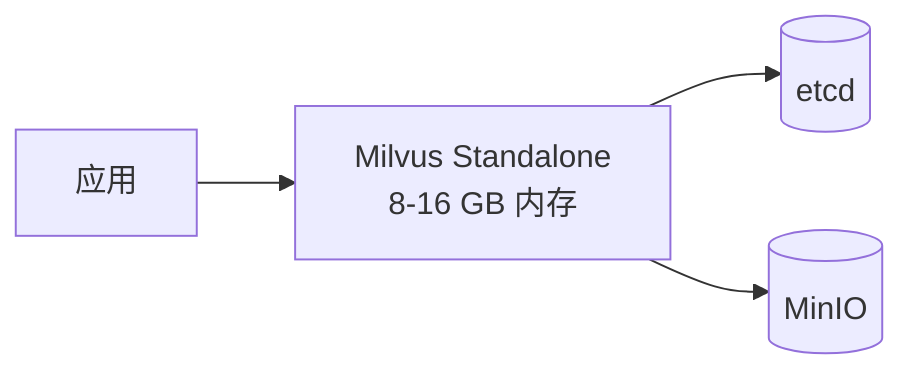
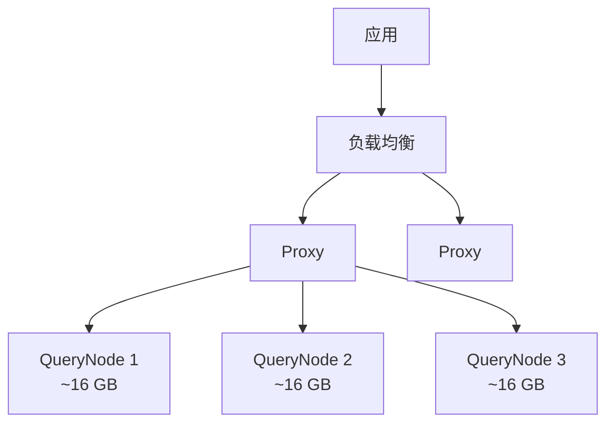
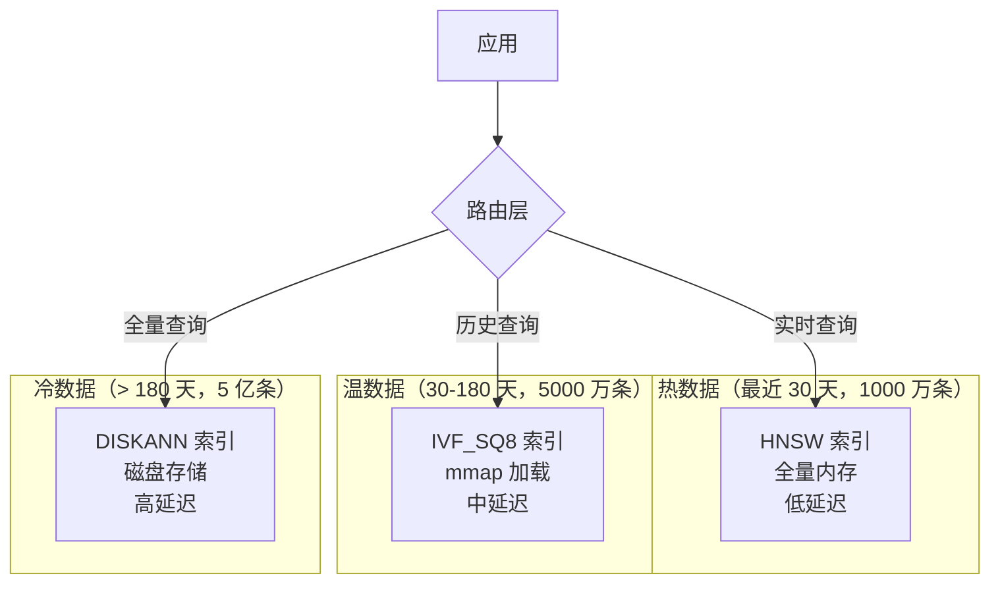

# 35 海量数据架构设计

## 学习目标

学完本章后，你应该能够：

- 针对百万、千万、亿级向量设计不同的架构方案。
- 合理规划分片、分区和索引策略。
- 设计冷热数据分层降低成本。
- 评估内存、存储和计算资源需求。
- 制定数据增长的扩容方案。

---

## 规模分级

| 规模 | 向量数 | 典型内存需求（768 维 HNSW） | 架构建议 |
|---|---|---|---|
| 小型 | < 100 万 | < 4 GB | Standalone |
| 中型 | 100-1000 万 | 4-32 GB | Standalone 或小集群 |
| 大型 | 1000 万-1 亿 | 32-300 GB | 集群 + 多 QueryNode |
| 超大型 | > 1 亿 | > 300 GB | 集群 + 量化 + DISKANN + 分层 |

---

## 百万级方案



- **索引**：HNSW（M=16, efConstruction=200）
- **内存**：~4 GB（100 万 × 768 维）
- **部署**：单机 Standalone 足够
- **注意**：预留 50% 内存余量给系统和索引构建

---

## 千万级方案



- **索引**：HNSW 或 IVF_SQ8（内存紧张时）
- **内存**：~32 GB（1000 万 × 768 维 HNSW）
- **部署**：集群模式，3+ QueryNode
- **分区**：按业务维度使用 Partition Key
- **关键决策**：

| 选择 | HNSW | IVF_SQ8 |
|---|---|---|
| 内存 | ~32 GB | ~8 GB |
| 延迟 | 2-5ms | 5-15ms |
| 召回率 | 97%+ | 93%+ |
| 适用 | 内存充足 | 内存受限 |

---

## 亿级方案



- **索引**：分层使用不同索引
- **量化**：冷数据必须量化（PQ/SQ8）
- **存储**：热数据内存，温数据 mmap，冷数据 DISKANN
- **分片**：多 Collection 按时间或业务分片

### 资源估算

```python
def estimate_resources_billion(
    num_vectors: int,
    dim: int = 768,
    hot_ratio: float = 0.02,   # 2% 热数据
    warm_ratio: float = 0.1,   # 10% 温数据
) -> dict:
    hot_count = int(num_vectors * hot_ratio)
    warm_count = int(num_vectors * warm_ratio)
    cold_count = num_vectors - hot_count - warm_count

    # 热数据：HNSW 全内存
    hot_memory = hot_count * dim * 4 * 1.5 / (1024**3)  # 1.5× 索引开销

    # 温数据：SQ8 + mmap
    warm_memory = warm_count * dim * 1 / (1024**3)  # SQ8 压缩

    # 冷数据：DISKANN，内存只需 PQ 编码
    cold_memory = cold_count * 96 / (1024**3)  # PQ m=96

    # 磁盘
    total_disk = num_vectors * dim * 4 * 1.5 / (1024**3)

    return {
        "hot_memory_gb": hot_memory,
        "warm_memory_gb": warm_memory,
        "cold_memory_gb": cold_memory,
        "total_memory_gb": hot_memory + warm_memory + cold_memory,
        "disk_gb": total_disk,
        "querynode_count": max(3, int((hot_memory + warm_memory) / 16) + 1),
    }

# 1 亿条 768 维
plan = estimate_resources_billion(100_000_000)
# hot_memory: ~4.3 GB, warm_memory: ~7.2 GB, cold_memory: ~8.9 GB
# total_memory: ~20.4 GB, disk: ~429 GB
```

---

## 分片策略

### 按时间分片

```python
# 每月一个 Collection
collections = {
    "docs_2024_01": "2024-01 数据",
    "docs_2024_02": "2024-02 数据",
    "docs_2024_03": "2024-03 数据（当前热数据）",
}

# 搜索时路由
def search_with_time_range(query_vector, start_date, end_date):
    target_collections = get_collections_in_range(start_date, end_date)
    results = []
    for coll in target_collections:
        results.extend(client.search(collection_name=coll, ...))
    return merge_and_sort(results)
```

### 按业务分片

```python
# 不同业务独立 Collection
collections = {
    "product_search": "商品搜索（5000 万）",
    "content_search": "内容搜索（2000 万）",
    "user_profile": "用户画像（1000 万）",
}
```

---

## 性能优化策略

| 策略 | 适用规模 | 效果 | 代价 |
|---|---|---|---|
| 增大 QueryNode | 千万+ | 线性提升 QPS | 内存成本 |
| 开启 mmap | 千万+ | 降低内存 50%+ | 延迟增加 2-5× |
| 使用 IVF_SQ8 | 千万+ | 降低内存 75% | 召回率略降 |
| 使用 DISKANN | 亿级 | 极低内存 | 延迟增加，需 SSD |
| 冷热分层 | 亿级 | 热数据低延迟 | 架构复杂 |
| Partition Key | 任意 | 减少搜索范围 | 需要固定过滤维度 |

---

## 常见错误

| 现象 | 原因 | 修复 |
|---|---|---|
| 内存不足 OOM | 数据量超过单机内存 | 扩容 QueryNode 或开启 mmap |
| 索引构建超时 | 数据量大 + 参数高 | 增加 IndexNode 或降低 efConstruction |
| 搜索延迟随数据增长 | Segment 碎片化 | 定期 Compaction |
| 扩容后性能未提升 | 瓶颈不在 QueryNode | 定位真正瓶颈（网络/Proxy/索引参数） |

---

## 面试题

1. **1 亿条 768 维向量用 HNSW 需要多少内存？**
   约 300 GB（向量 286 GB + 图结构 24 GB）。单机不可能，必须集群 + 多 QueryNode，或使用量化/DISKANN 降低内存。

2. **冷热分层的判断依据是什么？**
   按访问频率或时间。最近 N 天的数据为热数据（高性能索引），历史数据为冷数据（低成本索引）。核心是用延迟换成本。

3. **为什么亿级数据不能只用 HNSW？**
   HNSW 内存开销大（向量 + 图结构），亿级数据需要数百 GB 内存，成本极高。必须用量化（PQ/SQ8）或磁盘索引（DISKANN）降低内存。

4. **多 Collection 分片和单 Collection 分区的区别？**
   多 Collection：完全独立，可以用不同索引和参数，可以独立删除。单 Collection 分区：共享 Schema 和索引配置，管理更简单。

5. **如何预估未来 6 个月的资源需求？**
   统计当前数据增长速率，乘以时间，用资源估算公式计算。预留 50% 余量，提前 1-2 个月准备扩容。

---

## 练习题

1. 用资源估算公式计算你的业务场景（预估数据量 + 维度）需要多少内存和 QueryNode。
2. 对比同一批数据用 HNSW 和 IVF_SQ8 的内存占用差异。
3. 设计一个按月分片的 Collection 管理方案，包含创建、搜索路由和过期删除。
4. 模拟冷热分层：热数据用 HNSW，冷数据用 IVF_PQ，对比搜索延迟。

---

## 小结

海量数据架构的核心是分层和取舍：热数据追求低延迟（HNSW + 内存），冷数据追求低成本（量化 + 磁盘）。规模越大，架构越需要分片、分层和量化。提前做容量规划，避免紧急扩容。
