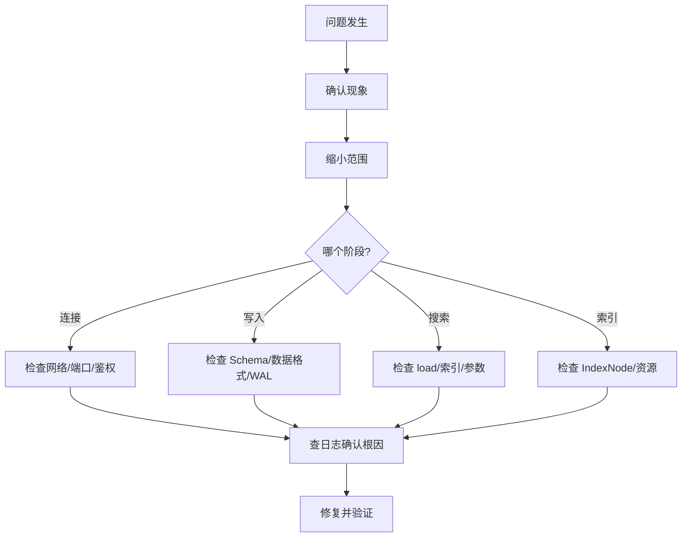

# 37 问题排查与 Debug

## 学习目标

学完本章后，你应该能够：

- 建立 Milvus 问题排查的系统方法论。
- 通过日志、指标和 API 定位常见问题。
- 处理连接、写入、搜索和索引构建的故障。
- 使用诊断工具收集信息。
- 形成问题排查 Checklist。

---

## 排查方法论



---

## 诊断命令速查

```bash
# 1. 服务健康
curl http://localhost:9091/healthz

# 2. 查看指标
curl http://localhost:9091/metrics | grep milvus_proxy

# 3. 容器状态
docker compose ps
docker stats

# 4. 查看日志
docker compose logs --tail 200 standalone
docker compose logs standalone | grep -i "error\|warn\|panic"

# 5. etcd 健康
docker exec milvus-etcd etcdctl endpoint health

# 6. pymilvus 诊断
python -c "
from pymilvus import MilvusClient
c = MilvusClient(uri='http://localhost:19530')
print('Collections:', c.list_collections())
for col in c.list_collections():
    stats = c.get_collection_stats(col)
    print(f'  {col}: {stats[\"row_count\"]} rows')
"
```

---

## 常见问题分类

### 连接问题

| 现象 | 可能原因 | 排查步骤 |
|---|---|---|
| `Connection refused` | Milvus 未启动 | `docker compose ps`，检查容器状态 |
| `Timeout` | 网络不通或端口错误 | `telnet host 19530`，检查防火墙 |
| `Authentication failed` | Token 错误 | 确认 token 格式 `user:password` |
| 连接后立即断开 | Milvus 正在重启 | 查看日志是否有 panic |

### 写入问题

| 现象 | 可能原因 | 排查步骤 |
|---|---|---|
| `dimension mismatch` | 向量维度与 Schema 不一致 | 检查模型输出维度和 Collection dim |
| `max_length exceeded` | VARCHAR 内容超长 | 截断文本或增大 max_length |
| 写入超时 | batch 太大或 Milvus 负载高 | 减小 batch_size，检查资源 |
| upsert 后数据量不增加 | 主键重复被覆盖 | 确认主键生成逻辑 |

### 搜索问题

| 现象 | 可能原因 | 排查步骤 |
|---|---|---|
| `collection not loaded` | 未调用 load | `client.load_collection(name)` |
| 结果为空 | Collection 为空或 filter 过严 | 先 query 不带 filter 确认有数据 |
| 结果不相关 | 模型不匹配或 metric 错误 | 确认入库和查询用同一模型 |
| 延迟突然升高 | Segment 碎片或资源不足 | 检查 Segment 数量和 CPU 使用 |

### 索引问题

| 现象 | 可能原因 | 排查步骤 |
|---|---|---|
| 索引构建超时 | 数据量大 + 参数高 | 降低 efConstruction 或增加资源 |
| 索引构建失败 | IndexNode OOM | 增加内存或降低 buildParallel |
| 搜索用暴力扫描 | 索引未构建完成 | 等待或检查 IndexNode 日志 |

---

## 日志分析

### 关键日志模式

```bash
# 错误和异常
grep -i "error\|panic\|fatal" milvus.log

# 慢查询
grep "slow query" milvus.log

# Segment 相关
grep -i "segment\|seal\|flush\|compaction" milvus.log

# 内存相关
grep -i "memory\|oom\|mmap" milvus.log

# 连接相关
grep -i "connect\|disconnect\|timeout" milvus.log
```

### 常见错误日志解读

| 日志关键词 | 含义 | 处理 |
|---|---|---|
| `segment not found` | Segment 被删除或迁移中 | 等待 QueryCoord 重新分配 |
| `rate limit` | 请求被限流 | 降低并发或调整限流配置 |
| `disk quota exceeded` | etcd 磁盘满 | 执行 compaction + defrag |
| `no available node` | 所有 QueryNode 不可用 | 检查 QueryNode 状态 |

---

## 性能问题排查

### 搜索延迟排查流程

```python
import time
from pymilvus import MilvusClient

def diagnose_search_latency(client: MilvusClient, collection: str, dim: int):
    """诊断搜索延迟"""
    import numpy as np
    query = np.random.randn(dim).astype("float32")
    query = (query / np.linalg.norm(query)).tolist()

    # 测试不同配置
    configs = [
        {"ef": 16, "output_fields": ["id"]},
        {"ef": 64, "output_fields": ["id"]},
        {"ef": 64, "output_fields": ["id", "text", "source"]},
        {"ef": 128, "output_fields": ["id"]},
    ]

    for cfg in configs:
        start = time.perf_counter()
        client.search(
            collection_name=collection,
            data=[query],
            anns_field="embedding",
            search_params={"metric_type": "COSINE", "params": {"ef": cfg["ef"]}},
            limit=10,
            output_fields=cfg["output_fields"],
        )
        elapsed = (time.perf_counter() - start) * 1000
        print(f"ef={cfg['ef']:3d} fields={cfg['output_fields']}  → {elapsed:.1f}ms")
```

---

## 排查 Checklist

### 服务不可用

- [ ] `docker compose ps` 所有容器 healthy？
- [ ] `curl localhost:9091/healthz` 返回 OK？
- [ ] etcd 健康？磁盘空间充足？
- [ ] MinIO 健康？
- [ ] 端口 19530 可访问？

### 搜索异常

- [ ] Collection 存在？（`list_collections`）
- [ ] Collection 已 load？（`describe_collection`）
- [ ] 有数据？（`get_collection_stats`）
- [ ] 索引已构建？
- [ ] metric_type 与索引一致？
- [ ] 向量维度正确？

### 性能退化

- [ ] Segment 数量是否异常增多？
- [ ] CPU 使用率是否饱和？
- [ ] 内存是否接近上限？
- [ ] 是否有 Compaction 正在执行？
- [ ] 最近是否有大量写入？

---

## 常见错误

| 现象 | 原因 | 修复 |
|---|---|---|
| 重启后数据丢失 | 使用了 `docker compose down -v` | 不加 `-v` 保留数据卷 |
| 升级后无法启动 | 版本不兼容 | 查看 release notes，可能需要数据迁移 |
| 内存持续增长 | 数据不断写入但未 release | 检查是否有不需要的 Collection 仍在 load |

---

## 面试题

1. **Milvus 搜索返回空结果，如何排查？** 按顺序检查：Collection 是否存在 → 是否 load → 是否有数据 → filter 是否过严 → metric_type 是否匹配 → 向量维度是否正确。

2. **如何判断搜索慢是索引问题还是网络问题？** 在 Milvus 所在机器本地测试延迟，如果本地快远程慢则是网络。也可以看 `/metrics` 中的内部搜索耗时。

3. **etcd 磁盘满了怎么办？** 执行 `etcdctl compaction` + `etcdctl defrag`，增大 `ETCD_QUOTA_BACKEND_BYTES`，检查是否有大量 DDL 操作产生过多历史。

---

## 练习题

1. 故意制造一个"Collection 未 load"的错误，练习排查流程。
2. 写一个诊断脚本，自动检查 Milvus 健康、Collection 状态和 Segment 数量。
3. 模拟高延迟场景（增大 ef 到 512），用诊断方法定位原因。

---

## 小结

问题排查的核心是系统化：确认现象 → 缩小范围 → 查日志/指标 → 定位根因 → 修复验证。90% 的问题可以通过 healthz + 日志 + describe_collection 三步定位。建立 Checklist 避免遗漏，积累常见问题的处理经验。
