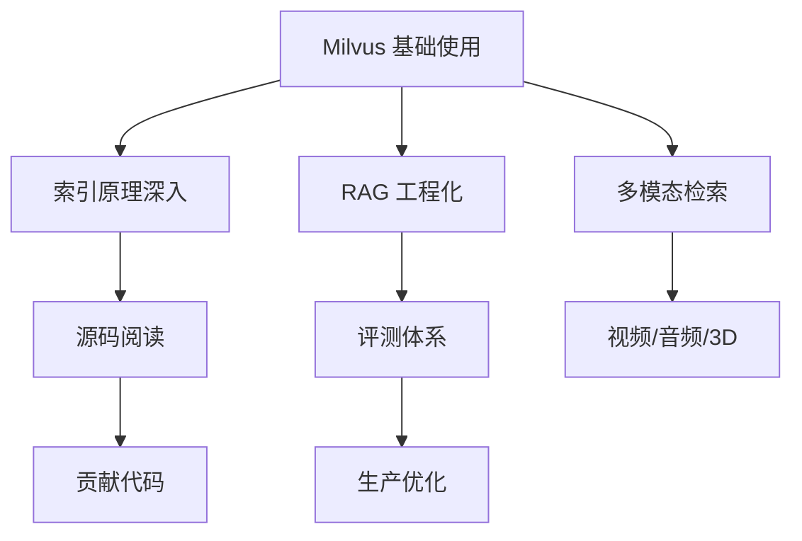

# 40 未来趋势与生态

## 学习目标

学完本章后，你应该能够：

- 了解向量数据库领域的发展方向。
- 理解 Milvus 的技术演进路线。
- 评估新兴技术对向量检索的影响。
- 了解 Milvus 生态中的工具和集成。
- 为持续学习制定方向。

---

## 向量数据库发展趋势

### 趋势一：与传统数据库融合

越来越多的传统数据库开始支持向量搜索：

| 数据库 | 向量支持 | 定位 |
|---|---|---|
| PostgreSQL + pgvector | 扩展 | 已有 PG 用户的轻量选择 |
| Elasticsearch 8.x | 内置 | 已有 ES 用户的补充 |
| Redis Stack | 模块 | 缓存 + 向量的组合 |
| MongoDB Atlas | 内置 | 文档数据库 + 向量 |
| **Milvus** | 专用 | 大规模、高性能、生产级 |

**Milvus 的差异化**：专为向量设计的存储引擎、索引和查询优化器，在大规模场景下性能远超通用数据库的向量扩展。

### 趋势二：多模态原生支持


- 稀疏 + 稠密向量混合检索已成标配
- 多向量字段支持不同模态
- 未来可能原生支持视频帧索引和音频特征

### 趋势三：AI 原生基础设施

向量数据库正在成为 AI 应用的标准基础设施层：


### 趋势四：Serverless 和托管服务

- Zilliz Cloud（Milvus 托管版）
- 按需付费，无需运维
- 自动扩缩容
- 适合中小团队和快速验证

### 趋势五：更智能的索引

| 方向 | 说明 |
|---|---|
| 学习型索引 | 根据查询分布自适应优化 |
| GPU 索引 | 利用 GPU 并行加速搜索 |
| 量化进化 | 更低精度损失的压缩方案 |
| 流式索引 | 写入即可搜索，无需等待构建 |

---

## Milvus 技术路线

### 已发布的关键特性（2.4-2.6）

| 版本 | 关键特性 |
|---|---|
| 2.4 | MilvusClient API、多向量字段、稀疏向量、Partition Key |
| 2.5 | 全文检索、内置 BM25、混合搜索增强 |
| 2.6 | 性能优化、DISKANN 增强、mmap 改进 |

### 未来方向

- **更强的混合搜索**：语义 + 全文 + 结构化的深度融合
- **更低的延迟**：流式索引、增量索引
- **更低的成本**：更好的量化、冷热自动分层
- **更好的易用性**：Schema 演进、在线索引切换
- **AI 集成**：内置 Embedding、内置 Rerank

---

## Milvus 生态

### SDK 和客户端

| 语言 | 包名 | 说明 |
|---|---|---|
| Python | pymilvus | 官方主力 SDK |
| Go | milvus-sdk-go | 官方 Go SDK |
| Java | milvus-sdk-java | 官方 Java SDK |
| Node.js | @zilliz/milvus2-sdk-node | 官方 Node SDK |
| REST | 内置 | HTTP API |

### 框架集成

| 框架 | 集成包 | 用途 |
|---|---|---|
| LangChain | langchain-milvus | RAG、Agent |
| LlamaIndex | llama-index-vector-stores-milvus | 知识索引 |
| Haystack | milvus-haystack | NLP Pipeline |
| Semantic Kernel | Milvus Connector | .NET AI |
| Spring AI | Milvus VectorStore | Java AI |

### 工具

| 工具 | 用途 |
|---|---|
| Attu | Milvus Web 管理界面 |
| Milvus Backup | 备份恢复工具 |
| Milvus CDC | 数据变更捕获 |
| Birdwatcher | 诊断和调试工具 |

### Attu（Web 管理界面）

```bash
# Docker 启动 Attu
docker run -d --name attu \
  -p 3000:3000 \
  -e MILVUS_URL=http://host.docker.internal:19530 \
  zilliz/attu:latest
```

功能：
- 可视化 Collection 管理
- 数据浏览和搜索测试
- 索引和 Segment 状态查看
- 系统拓扑和健康监控

---

## 竞品对比

| 产品 | 类型 | 优势 | 劣势 |
|---|---|---|---|
| **Milvus** | 开源专用 | 大规模、高性能、功能全 | 部署复杂度中等 |
| Pinecone | 托管 SaaS | 零运维 | 闭源、成本高、不可控 |
| Weaviate | 开源 | 内置向量化、GraphQL | 大规模性能不如 Milvus |
| Qdrant | 开源 | Rust 实现、轻量 | 生态和规模支持不如 Milvus |
| Chroma | 开源 | 极简、嵌入式 | 不适合生产大规模 |
| pgvector | PG 扩展 | 已有 PG 直接用 | 性能和功能有限 |

### 选择建议

- **需要大规模生产部署** → Milvus
- **不想运维** → Zilliz Cloud 或 Pinecone
- **已有 PostgreSQL** → pgvector（小规模）
- **快速原型** → Chroma
- **Rust 生态** → Qdrant

---

## 持续学习路径

### 技术深入方向



### 推荐资源

| 资源 | 类型 | 链接 |
|---|---|---|
| Milvus 官方文档 | 文档 | milvus.io/docs |
| Milvus GitHub | 源码 | github.com/milvus-io/milvus |
| Zilliz Blog | 博客 | zilliz.com/blog |
| Milvus Bootcamp | 教程 | github.com/milvus-io/bootcamp |
| ann-benchmarks | 评测 | ann-benchmarks.com |

### 关注的技术方向

1. **Embedding 模型演进**：更好的中文模型、多模态模型、长文本模型
2. **RAG 技术栈**：GraphRAG、Agentic RAG、多跳推理
3. **向量数据库内核**：流式索引、学习型索引、GPU 加速
4. **AI 基础设施**：模型服务化、向量缓存、端到端优化

---

## 常见错误认知

| 错误认知 | 正确理解 |
|---|---|
| "向量数据库只是存向量" | 向量数据库 = 向量存储 + ANN 索引 + 标量过滤 + 分布式调度 |
| "用 pgvector 就够了" | 是否够用取决于规模、过滤、扩展和运维约束，不能只用 100 万条作为统一分界线 |
| "Embedding 模型越大越好" | 要权衡质量、速度和成本 |
| "RAG 就是向量搜索 + LLM" | RAG 是一条完整的工程链路，每个环节都需要优化 |
| "向量数据库会被 LLM 取代" | LLM 的长上下文不能替代检索——成本、延迟和准确性都不同 |

---

## 面试题

1. **向量数据库的未来会怎样？会被 LLM 长上下文取代吗？**
   很难被完全取代。标准 Transformer 的注意力成本通常随上下文长度近似二次增长，但不同模型可能使用稀疏注意力、缓存等优化；ANN 检索的实际成本也取决于索引和数据分布，不能统一写成 O(log N)。对于百万级知识库，把全部内容塞入上下文通常仍会受到成本、延迟和相关性噪声限制，因此向量检索更可能与长上下文协同，而不是被简单替代。

2. **Milvus 相比 pgvector 的优势在哪里？**
   专用索引引擎（HNSW/IVF/DISKANN 深度优化）、分布式架构（水平扩展）、丰富的索引类型、混合搜索、Partition Key 等。pgvector 适合小规模和已有 PG 的场景。

3. **如何跟踪向量数据库领域的发展？**
   关注 Milvus release notes、ann-benchmarks 排行榜、顶会论文（SIGMOD、VLDB、NeurIPS 中的 ANN 相关）、以及 Embedding 模型的 MTEB 排行榜。

---

## 小结

向量数据库正在从"新兴技术"变为"AI 基础设施标配"。Milvus 作为开源领域的领先者，在大规模、高性能和功能完整性上持续演进。学习向量数据库不只是学 API，更要理解背后的索引原理、系统架构和工程实践。这些知识在 AI 应用开发中会越来越重要。

---

## 全书总结

恭喜你完成了《Milvus 从入门到精通》全部 40 章的学习。回顾整个学习路径：

1. **基础篇（01-08）**：向量数据库原理、Milvus 架构、pymilvus 开发
2. **索引篇（09-12）**：FLAT、IVF、HNSW、PQ 四大索引家族
3. **进阶篇（13-17）**：混合检索、过滤、分区、批量写入、性能调优
4. **运维篇（18-21）**：集群部署、高可用、监控、生产实践
5. **RAG 篇（22-29）**：RAG 架构、召回优化、Rerank、Agent、框架集成
6. **多模态篇（30-32）**：图片检索、CLIP 多模态、视频检索
7. **工程篇（33-40）**：FastAPI、完整系统、海量数据、压测、排查、源码、面试

核心能力：**理解原理 → 掌握工具 → 工程实践 → 持续优化**。祝你在向量数据库和 AI 应用开发的道路上越走越远。
